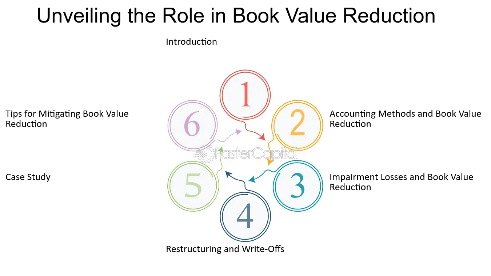

## Table of Contents

## What is book value?

Book value is a way to figure out how much a company is worth by looking at its financial records. It's calculated by taking the total value of a company's assets and then subtracting all of its liabilities. Assets are things the company owns, like buildings or money in the bank, and liabilities are what the company owes, like loans or bills. The number you get after this subtraction is called the book value, and it represents the net worth of the company according to its books.

This value is important for investors because it gives them an idea of what the company would be worth if it were to be sold off or liquidated. If the book value is high, it might mean the company has a lot of valuable assets. However, book value doesn't always tell the whole story. It doesn't include things like the company's reputation or its future earning potential, which can also be very valuable. So, while book value is a useful tool, it's just one piece of the puzzle when trying to understand a company's true value.

## What does book value reduction mean?

Book value reduction means that the net worth of a company, as shown on its financial records, has gone down. This happens when the value of the company's assets decreases, or when its liabilities increase. For example, if a company has to write off some of its assets because they are no longer worth as much, or if it takes on more debt, the book value will go down.

This reduction can be a sign that the company is not doing as well financially. It might mean that the company is selling off assets at a loss or that it is struggling to pay its debts. Investors often watch book value closely because a drop can affect the value of their investment. However, it's important to look at other factors too, as a lower book value doesn't always mean the company is in trouble. Sometimes, a company might reduce its book value on purpose, like when it sells off old assets to invest in new opportunities.

## Why is book value important for a company?

Book value is important for a company because it shows how much the company is worth based on its financial records. It is calculated by taking the total value of everything the company owns, like buildings and money in the bank, and then subtracting everything the company owes, like loans and bills. This gives a clear picture of the company's net worth, which is useful for investors and the company itself to understand its financial health.

Investors use book value to decide if a company is a good investment. If the book value is high, it might mean the company has a lot of valuable assets, which could be sold if needed. But, book value is just one piece of information. It doesn't tell you about the company's future potential or its reputation, which can also be very important. So, while book value is a helpful tool, it's important to look at other factors too when making decisions about a company.

## What are the common reasons for a reduction in book value?

A reduction in book value can happen for several reasons. One common reason is when a company has to write down the value of its assets. This can happen if the assets, like buildings or machinery, become less valuable over time or if they are damaged. Another reason is when a company takes on more debt. If a company borrows more money or its bills go up, the amount it owes increases, which can lower the book value.

Another reason for a reduction in book value is when a company sells off some of its assets. If the company sells these assets for less than what they were worth on the books, the book value goes down. This can happen if the company needs quick cash or wants to get rid of assets that are not being used. Finally, losses from operations can also cause a drop in book value. If a company is not making enough money to cover its costs, it can end up with a lower book value because its net worth decreases.

## How is book value calculated?

Book value is calculated by taking the total value of a company's assets and then subtracting its liabilities. Assets are things the company owns, like buildings, equipment, and money in the bank. Liabilities are what the company owes, like loans, bills, and other debts. When you subtract the liabilities from the assets, you get the book value, which shows the net worth of the company according to its financial records.

This calculation gives a snapshot of the company's financial health at a certain point in time. For example, if a company has assets worth $1 million and liabilities of $600,000, the book value would be $400,000. This number is important for investors because it helps them understand what the company would be worth if all its assets were sold and all its debts were paid off.

## Can book value reduction affect a company's stock price?

Yes, a reduction in book value can affect a company's stock price. When investors see that a company's book value is going down, they might think the company is not doing well financially. This can make them worry about their investment, and they might decide to sell their shares. When a lot of people start selling the stock, the price can go down because there are more sellers than buyers.

But, it's not always that simple. Sometimes, a drop in book value might not be a big problem. For example, if a company sells off old assets to invest in new opportunities, the book value might go down, but the company could still be in a good position for the future. Investors who understand this might not be too worried, and the stock price might not drop as much. So, while book value reduction can influence stock prices, it's important to look at the whole picture before deciding what it means for the company.

## What is the difference between book value and market value?

Book value and market value are two different ways to figure out how much a company is worth. Book value is calculated by looking at the company's financial records. It takes the total value of everything the company owns, like buildings and money in the bank, and subtracts everything the company owes, like loans and bills. This gives you the net worth of the company based on its books. Book value is useful for understanding what the company would be worth if it sold all its assets and paid off all its debts.

Market value, on the other hand, is what people are willing to pay for the company's stock at a certain time. It's influenced by things like how well the company is doing, what people think about its future, and even the overall economy. Market value can go up and down a lot because it depends on what investors think and feel. So, while book value gives you a snapshot of the company's financial health based on its records, market value shows what the market thinks the company is worth right now.

## How do impairments lead to book value reduction?

Impairments happen when a company realizes that some of its assets are not worth as much as they used to be. This can happen if the asset gets damaged, if it's not being used anymore, or if the market for that kind of asset has gone down. When a company finds out an asset is impaired, it has to lower the value of that asset on its books. This process is called writing down the asset, and it directly reduces the total value of the company's assets.

When the total value of the assets goes down because of impairments, the book value of the company also goes down. Book value is calculated by taking the total value of the company's assets and subtracting its liabilities. So, if the assets are worth less, and the liabilities stay the same, the book value will be lower. This reduction in book value can be a sign that the company's financial health is not as strong as it used to be, which is important information for investors and the company itself.

## What role do depreciation and amortization play in reducing book value?

Depreciation and amortization are ways to account for the fact that some assets lose value over time. Depreciation is used for physical assets like buildings and machinery. It spreads out the cost of these assets over the time they are expected to be used. Amortization is similar but is used for intangible assets like patents or software. Both depreciation and amortization reduce the value of the assets on the company's books each year, which means the total value of the assets goes down.

When the total value of the assets goes down because of depreciation and amortization, the book value of the company also goes down. Book value is calculated by taking the total value of the company's assets and subtracting its liabilities. So, if the assets are worth less due to depreciation and amortization, and the liabilities stay the same, the book value will be lower. This reduction in book value shows that the company's net worth is decreasing over time due to the wearing out or using up of its assets.

## How can a company report book value reduction in its financial statements?

A company reports a reduction in book value in its financial statements by showing changes in the value of its assets and liabilities. If the company has to write down the value of some of its assets because they are worth less now, it will show this in the balance sheet under assets. The balance sheet lists everything the company owns and owes, so a lower asset value will directly lead to a lower book value. The company might also explain why the asset value went down in the notes to the financial statements, which give more details about the numbers in the balance sheet.

If the company's liabilities go up, this will also be shown in the balance sheet. More debt or higher bills mean the company owes more, which reduces the book value. The income statement might also show expenses related to the reduction in book value, like depreciation or impairment charges. These expenses show how the company's assets are losing value over time or suddenly. By looking at both the balance sheet and the income statement, investors can understand why the book value went down and what it means for the company's financial health.

## What are some strategies companies use to manage or prevent book value reduction?

Companies can use different strategies to manage or prevent book value reduction. One common way is to keep a close eye on their assets and make sure they are being used well. If a company sees that an asset is not being used or is losing value, it might decide to sell it before it becomes a problem. This way, the company can use the money from the sale to buy new assets or pay down debts, which can help keep the book value stable or even increase it. Another strategy is to invest in maintenance and upgrades for their assets. By keeping their buildings and equipment in good shape, companies can slow down depreciation and keep the value of their assets higher for longer.

Another approach is to manage their debts carefully. Companies can try to pay off loans faster or avoid taking on too much new debt. This helps keep liabilities low, which is good for the book value. Sometimes, companies might also look for ways to increase their income, like finding new customers or improving their products. More income means more money to invest in assets or pay down debts, which can help prevent the book value from going down. By using these strategies, companies can work to keep their book value strong and show investors that they are managing their finances well.

## How do different accounting standards impact the treatment of book value reduction?

Different accounting standards, like GAAP (Generally Accepted Accounting Principles) used in the United States and IFRS (International Financial Reporting Standards) used in many other countries, can affect how a company reports a reduction in book value. These standards set rules on how companies should record and report their financial information, including how they handle things like depreciation, impairments, and asset write-downs. For example, under GAAP, companies might use different methods to calculate depreciation, which can change how quickly the value of an asset goes down on the books. On the other hand, IFRS might have different rules for when and how a company should recognize an impairment, which could lead to a different impact on the book value.

These differences in accounting standards can make it harder for investors to compare the book value of companies from different countries. If one company follows GAAP and another follows IFRS, the way they report reductions in book value might not be the same, even if their actual financial health is similar. This is why it's important for investors to understand the accounting standards a company uses and how they might affect the reported book value. By knowing these details, investors can make better decisions about the true financial health of the companies they are interested in.

## What is Understanding Financial Accounting Asset Valuation?

Asset valuation is a fundamental component of financial accounting, central to determining the recorded worth of an asset on an organization's balance sheet. The valuation process influences financial reporting, offering stakeholders insights into a company's financial health and resources.

### Book Value

Book value is one of the simplest measures of an asset's value and provides a baseline for asset valuation. It is determined by taking the original cost of an asset and subtracting accumulated depreciation, amortization, or impairment costs. Mathematically, it can be represented as:

$$
\text{Book Value} = \text{Cost of Asset} - (\text{Accumulated Depreciation} + \text{Impairment})
$$

This measure assists in assessing the net value of a company’s total assets minus its liabilities and is a common metric used by investors to gauge a company’s intrinsic worth. Regular assessment ensures that asset values on the balance sheet reflect economic reality, providing a more accurate portrayal of a company's holdings.

### Regular Assessment and Recording

Continuous assessment and recording of asset values are crucial. This involves examining the useful life, residual value, and depreciation method for tangible assets, as well as amortization schedules for intangible assets. Changes in these factors necessitate adjustments to book values to mirror actual market conditions and business use. Such practices enable businesses to maintain transparency and accuracy in financial reporting.

### Accounting Principles Guiding Book Value Estimation

The estimation of book value in financial accounting is governed by several key principles, including:

1. **Cost Principle**: Assets are initially recorded at their acquisition cost. Book value recognizes this cost, adjusted over time through depreciation or amortization.

2. **Matching Principle**: This principle requires that expenses related to an asset be recorded in the same period as the revenues they help generate, supporting proper depreciation calculations.

3. **Conservatism Principle**: This involves recognizing potential losses and impairments as soon as they are foreseeable, which can necessitate reductions in book value before such value increases.

### Implications for Financial Reporting

Asset valuation significantly affects financial reporting. Accurate book valuations directly influence balance sheets, affecting insights into company solvency and managerial effectiveness. They also impact key financial ratios such as return on assets (ROA) and debt-to-equity ratios, which investors and analysts use in decision-making.

Consistent and accurate reporting builds trust with stakeholders and complies with accounting standards such as IFRS and GAAP. These standards ensure comparability and reliability of financial statements across different firms and time periods.

In conclusion, understanding the nuances of asset valuation in financial accounting through the lens of book value is essential for precise financial analysis and reporting. This foundational knowledge informs better decision-making and strategic planning within business and investment domains.

## References & Further Reading

[1]: ["Financial Accounting: Tools for Business Decision Making"](https://www.wiley.com/en-us/Financial+Accounting%3A+Tools+for+Business+Decision+Making%2C+10th+Edition-p-9781394184910) by Paul D. Kimmel, Jerry J. Weygandt, and Donald E. Kieso

[2]: ["Algorithmic Trading and DMA: An introduction to direct access trading strategies"](https://www.amazon.com/Algorithmic-Trading-DMA-introduction-strategies/dp/0956399207) by Barry Johnson

[3]: ["The Essentials of Machine Learning in Finance and Accounting"](https://www.taylorfrancis.com/books/edit/10.4324/9781003037903/essentials-machine-learning-finance-accounting-mohammad-zoynul-abedin-kabir-hassan-petr-hajek-mohammed-mohi-uddin) by Isaac Gottlieb

[4]: ["Financial Analysis with Microsoft Excel"](https://faculty.cengage.com/titles/9780357442050) by Timothy R. Mayes and Todd M. Shank

[5]: ["Python for Finance: Mastering Data-Driven Finance"](https://www.amazon.com/Python-Finance-Mastering-Data-Driven/dp/1492024333) by Yves Hilpisch