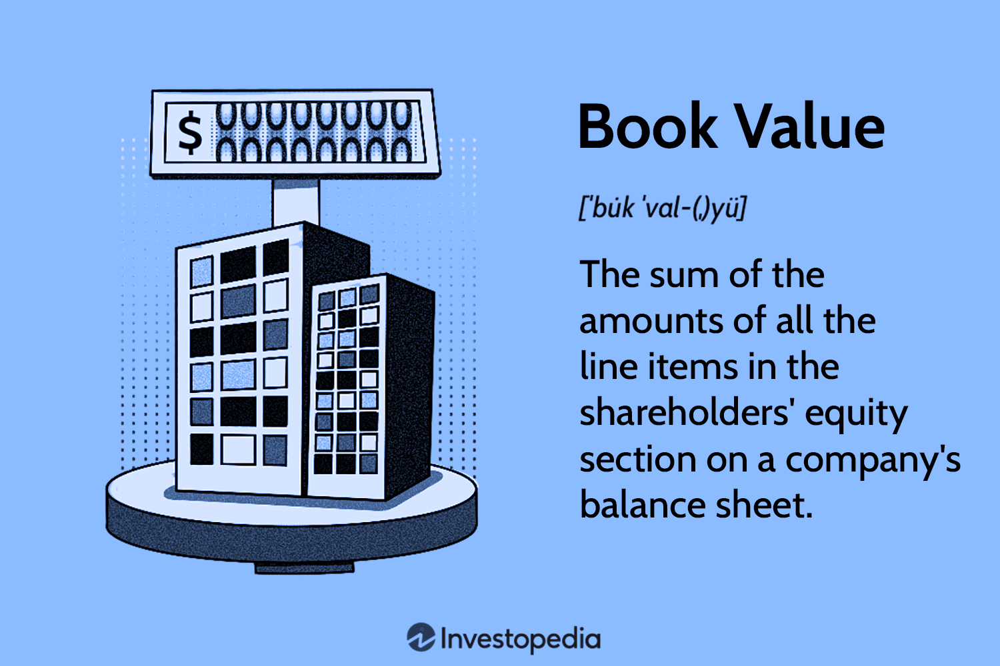

## Table of Contents

## What is the basic definition of book value?

Book value is a term used in accounting and finance to describe the value of an asset as it appears on a company's balance sheet. It is calculated by subtracting the total liabilities from the total assets of a company. This number gives investors an idea of what the company would be worth if it were to liquidate all its assets and pay off all its debts.

In simpler terms, book value can be thought of as the net worth of a company according to its financial statements. It's important for investors because it helps them understand the underlying value of a company, beyond just its market price. For example, if a company's market value is less than its book value, it might be seen as undervalued, which could be an attractive investment opportunity.

## How is book value calculated for a company?

Book value for a company is calculated by taking the total value of all its assets and then subtracting the total value of all its liabilities. Assets are things the company owns, like buildings, equipment, and cash. Liabilities are what the company owes, like loans and bills. The result of this calculation is the book value, which shows the net worth of the company based on its financial statements.

This calculation can be done using numbers from the company's balance sheet. The balance sheet lists all the assets on one side and all the liabilities on the other side. By subtracting the total liabilities from the total assets, you get the book value. This number is important because it gives investors an idea of what the company would be worth if it sold all its assets and paid off all its debts.

## What is the difference between book value and market value?

Book value and market value are two different ways to measure the worth of a company. Book value is calculated using numbers from the company's financial statements. It's the total value of all the company's assets minus the total value of all its debts. This number shows what the company would be worth if it sold everything it owns and paid off everything it owes. Book value is important because it gives a clear picture of the company's net worth based on its accounting records.

Market value, on the other hand, is the price at which the company's stock is trading in the stock market. This value is set by what investors are willing to pay for the company's shares. Market value can go up and down every day because it depends on what people think the company is worth, not just its financial statements. Sometimes, the market value can be much higher or lower than the book value, depending on how investors feel about the company's future.

The difference between book value and market value can tell investors a lot. If the market value is higher than the book value, it might mean investors think the company will do well in the future. If the market value is lower than the book value, it might mean the company is seen as a bargain, or it might be facing some challenges. Understanding both values helps investors make smarter choices about buying or selling the company's stock.

## Why is book value important for investors?

Book value is important for investors because it shows them the net worth of a company according to its financial statements. It's like looking at the price tag of a company if it sold everything it owns and paid off all its debts. This number helps investors understand if a company is worth more or less than what the stock market says. If the book value is higher than the market value, it might mean the stock is a good deal because the company's assets are worth more than its stock price.

Investors also use book value to see if a company is using its money wisely. If the book value keeps going up over time, it can show that the company is growing its assets and managing its debts well. This can make investors feel more confident about putting their money into the company. On the other hand, if the book value is going down, it might be a warning sign that the company is not doing as well as it should be. By looking at book value, investors can make smarter choices about where to invest their money.

## Can book value be negative, and what does that indicate?

Yes, book value can be negative. This happens when a company's total liabilities are more than its total assets. It means that if the company sold everything it owns, it still wouldn't have enough money to pay off all its debts.

A negative book value is a big warning sign for investors. It shows that the company is in financial trouble and might be at risk of going out of business. Investors usually try to avoid companies with negative book values because it's a sign that the company's financial health is not good.

## How does depreciation affect the book value of assets?

Depreciation is how businesses account for the wear and tear on their assets over time. When a company buys something like a machine or a building, it doesn't stay new forever. It gets old and less valuable. So, every year, the company lowers the value of these assets on their [books](/wiki/algo-trading-books). This lowering of value is called depreciation. When you depreciate an asset, you subtract the amount of depreciation from the asset's original cost. This makes the total value of the company's assets go down.

Because book value is calculated by taking the total value of all assets and subtracting the total value of all liabilities, depreciation directly affects the book value. As the value of the assets goes down due to depreciation, the book value of the company also goes down. This means that over time, if a company is depreciating its assets, the book value will be lower than it would have been without depreciation. This is important for investors to know because it can affect how they see the worth of the company.

## What role does book value play in financial analysis?

Book value is an important number in financial analysis because it helps people understand how much a company is worth based on its own records. It's like looking at a price tag that shows what the company would be worth if it sold everything it owns and paid off all its debts. Financial analysts use book value to see if a company's stock price is a good deal. If the book value is higher than the stock price, it might mean the stock is undervalued and could be a good buy. On the other hand, if the stock price is much higher than the book value, it might mean the stock is overvalued.

Book value also helps analysts check if a company is managing its money well. If the book value is growing over time, it shows that the company is increasing its assets or lowering its debts, which is a good sign. But if the book value is going down, it might mean the company is not doing so well. Analysts look at book value along with other numbers to get a full picture of a company's health and to make better investment choices.

## How do companies report book value in their financial statements?

Companies report book value in their financial statements, mainly in the balance sheet. The balance sheet shows what the company owns (assets) and what it owes (liabilities). To find the book value, you take the total assets and subtract the total liabilities. This number tells you the net worth of the company according to its own records. The balance sheet is a key part of the financial statements that companies share with investors and others who want to know about the company's financial health.

When companies make their financial statements, they follow rules set by accounting standards. These rules help make sure that the book value is calculated the same way by all companies. This makes it easier for people to compare different companies and understand their financial situations. The book value is an important number because it gives a clear picture of what the company would be worth if it sold everything and paid off all its debts. This helps investors decide if a company is a good investment or not.

## What are the limitations of using book value as a valuation metric?

Book value is a useful number, but it has some limits when you use it to figure out how much a company is worth. One big problem is that book value only looks at what's on the company's books. It doesn't think about things like the company's brand name, how happy its customers are, or how good its team is at their jobs. These things can make a company worth a lot more than just its buildings and machines, but they don't show up in the book value.

Another issue is that book value can be out of date. Companies have to guess how much their stuff will be worth over time, and they might get it wrong. For example, if a company says its machines will last for 10 years, but they break after 5 years, the book value won't show that right away. Also, the prices of things can change. If the price of land goes up a lot, the book value won't show that increase until the company sells the land. So, while book value is helpful, it's not the whole story when you're trying to figure out what a company is really worth.

## How does book value per share differ from book value?

Book value per share is a way to figure out how much of a company's net worth belongs to each share of its stock. You find it by taking the total book value of the company and dividing it by the number of shares that are out there. So, if a company's book value is $1 million and it has 100,000 shares, the book value per share would be $10. This number helps investors see if a stock is a good deal by comparing it to the price they would pay for the stock.

The main difference between book value and book value per share is that book value is the total net worth of the company, while book value per share breaks that down to show what each share is worth. Book value gives you a big picture of the company's worth, but book value per share makes it easier to compare the company's value to the price of its stock. This can help investors decide if the stock is priced right or if it's a bargain.

## In what industries is book value a more relevant metric?

Book value is especially useful in industries where companies own a lot of physical stuff, like buildings, machines, or land. For example, in the real estate business, book value can be really important. Real estate companies own properties, and the value of these properties is a big part of what the company is worth. So, looking at the book value can help investors understand if the company's properties are worth more or less than what the stock market says.

Another industry where book value matters a lot is banking. Banks have a lot of money coming in and going out, but they also own things like buildings and loans they've given out. The book value can show if a bank has enough assets to cover what it owes. This is important for investors because it helps them see if the bank is safe and sound. In these kinds of businesses, book value gives a good, clear picture of how much the company is really worth.

## How can book value be used in conjunction with other financial ratios for deeper analysis?

Book value can be used with other financial ratios to get a better understanding of a company's health and value. One way to do this is by looking at the price-to-book (P/B) ratio. This ratio compares the market price of a company's stock to its book value per share. If the P/B ratio is low, it might mean the stock is undervalued, which could be a good sign for investors. But it's important to use this ratio along with other numbers, like the return on equity (ROE), which shows how well the company is using its money to make profits. By looking at both the P/B ratio and ROE, investors can see if a company is not just cheap but also good at making money.

Another useful ratio to use with book value is the debt-to-equity (D/E) ratio. This ratio shows how much the company is borrowing compared to what it owns. A high D/E ratio might mean the company is taking on too much debt, which could be risky. By comparing the D/E ratio with the book value, investors can see if the company's net worth is strong enough to handle its debts. This can help them decide if the company is a safe investment. Using book value with these other ratios gives investors a fuller picture of the company's financial situation and helps them make smarter choices.

## What is the understanding of Book Value?

Book value is a fundamental accounting metric representing a company's net worth as recorded in its financial statements. It serves as a crucial indicator of a company's financial health, calculated by subtracting total liabilities from the total value of tangible assets. The formula for determining book value is as follows:

$$
\text{Book Value} = \text{Total Tangible Assets} - \text{Total Liabilities}
$$

Understanding the book value is essential for investors aiming to evaluate whether a stock is undervalued or overvalued compared to its market price. This assessment is particularly relevant as it helps identify discrepancies between a company's intrinsic value and its perceived market value. By focusing on book value, traders can gain insights into potential investment opportunities, especially in cases where the market may not accurately reflect a company's actual worth.

Book value per share (BVPS) is another important metric, which provides insight into how much each share would be worth if the company were liquidated at its book value. The formula for calculating BVPS is:

$$
\text{BVPS} = \frac{\text{Total Equity} - \text{Preferred Equity}}{\text{Total Outstanding Shares}}
$$

The implications of book value in financial analysis are significant. It provides a baseline for evaluating a company’s financial condition over time. A company with a rising book value is often seen as financially healthy, with effective management and continued growth through asset accumulation and debt reduction. Conversely, a declining book value may indicate financial distress or operational inefficiencies.

Investors often compare a company's book value with its market value through the price-to-book (P/B) ratio to identify potential investment opportunities. The P/B ratio is calculated as:

$$
\text{P/B Ratio} = \frac{\text{Market Price per Share}}{\text{Book Value per Share}}
$$

A P/B ratio less than one might indicate an undervalued stock, suggesting that the market price is below the company’s book value. However, investors must also consider qualitative factors and industry-specific metrics, as book value alone does not account for intangible assets such as brand reputation, intellectual property, and human capital, which may significantly impact a company’s market valuation.

In conclusion, book value serves as a valuable tool in financial analysis, providing a tangible measure of a company’s worth. This metric, while not exhaustive, offers investors and traders a foundation for evaluating potential investments, aiding in the identification of opportunities where a company’s market valuation does not align with its accounting-based net worth.

## What are the strategies for integrating book value in algorithmic trading?

Integrating book value into [algorithmic trading](/wiki/algorithmic-trading) strategies involves leveraging this fundamental financial metric to enhance investment decision-making processes. Traders can exploit book value by constructing algorithmic rules designed to systematically identify undervalued assets. The integration of book value into trading algorithms allows investors to focus on intrinsic asset worth while employing automated systems for precise trade execution.

To incorporate book value into algorithmic trading, traders should establish rules that use book value as a criterion to screen potential investments. For instance, a trading algorithm could be programmed to select stocks with a market price lower than their book value, indicating potential undervaluation. This can be expressed mathematically as:

$$
\text{PB Ratio} = \frac{\text{Market Price per Share}}{\text{Book Value per Share}}
$$

In scenarios where the Price-to-Book (PB) ratio is less than 1, the algorithm could flag these stocks for potential acquisition, presuming they may be undervalued.

Analyzing past case studies reveals that book value has played a critical role in successful trading outcomes. In these instances, investors who incorporated book value indicators into their strategies were able to achieve notable returns. These case studies underscore the importance of using book value in conjunction with other financial metrics to enhance decision-making frameworks.

Technological advancements in trading platforms have simplified the calculation and application of book value in trading strategies. Modern platforms offer tools that automatically compute book value and compare it against other valuation metrics. This streamlining allows traders to focus on high-level strategy optimization rather than manual number crunching.

For a comprehensive strategy, it's vital to align book value analysis with both technical and fundamental approaches. Traders should consider integrating book value with technical indicators such as moving averages, Relative Strength Index (RSI), and [momentum](/wiki/momentum) oscillators. This multi-faceted approach enables a more nuanced understanding of market dynamics, improving the accuracy and effectiveness of the trading strategy.

Implementing these strategies also involves adhering to best practices, such as regularly updating financial data to reflect current market conditions and refining algorithmic parameters to adapt to market shifts. Utilizing robust [backtesting](/wiki/backtesting) frameworks to validate the efficacy of trading algorithms before live deployment is crucial. This ensures that the integration of book value into trading systems remains both relevant and reliable, ultimately enhancing portfolio performance.

## References & Further Reading

[1]: ["Advances in Financial Machine Learning"](https://www.amazon.com/Advances-Financial-Machine-Learning-Marcos/dp/1119482089) by Marcos Lopez de Prado

[2]: ["Evidence-Based Technical Analysis: Applying the Scientific Method and Statistical Inference to Trading Signals"](https://www.amazon.com/Evidence-Based-Technical-Analysis-Scientific-Statistical/dp/0470008741) by David Aronson

[3]: ["Machine Learning for Algorithmic Trading"](https://github.com/PacktPublishing/Machine-Learning-for-Algorithmic-Trading-Second-Edition) by Stefan Jansen

[4]: ["Quantitative Trading: How to Build Your Own Algorithmic Trading Business"](https://books.google.com/books/about/Quantitative_Trading.html?id=j70yEAAAQBAJ) by Ernest P. Chan

[5]: Palepu, K. G., Healy, P. M., & Bernard, V. L. (2004). ["Business Analysis Valuation: Using Financial Statements, Text and Cases"](https://researchers.mq.edu.au/en/publications/business-analysis-and-valuation-using-financial-statements). South-Western College Pub.

[6]: Graham, B., & Dodd, D. (1934). ["Security Analysis"](https://books.google.com/books/about/Security_Analysis_The_Classic_1934_Editi.html?id=wXlrnZ1uqK0C). McGraw-Hill Education.