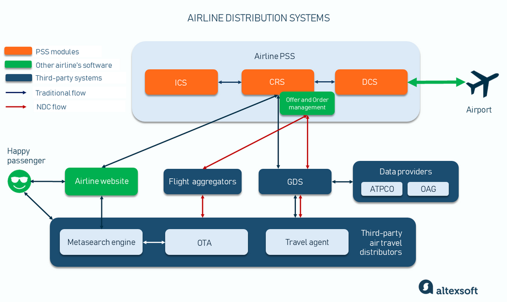

## Table of Contents

## What is the basic definition of 'Booking the Basis'?

Booking the Basis is a strategy used by farmers and grain buyers to manage price risk in the agricultural market. It involves locking in the difference between the local cash price of a commodity and the futures price listed on an exchange. By doing this, a farmer can protect themselves against price changes in the futures market while still taking advantage of potential increases in the local cash price.

For example, if a farmer expects the local cash price of corn to rise but is worried about the futures price dropping, they can book the basis. This means they agree to sell their corn at the current basis (the difference between the local cash price and the futures price) and then wait to see if the local cash price goes up. If it does, they can sell their corn at the higher price and still benefit from the locked-in basis, reducing their overall risk.

## Why is 'Booking the Basis' important in commodity trading?

Booking the Basis is important in commodity trading because it helps farmers and buyers manage the risk of price changes. In the world of farming, prices can go up and down a lot. By booking the basis, a farmer can lock in the difference between what they can get for their crop locally and the price listed on a big market. This means they don't have to worry as much about the big market prices going down, because they've already set their basis.

This strategy also gives farmers a chance to make more money if local prices go up. After booking the basis, if the price at their local market goes higher, they can sell their crops at that higher price. They still benefit from the locked-in basis, which makes their overall earnings more predictable and safer. So, booking the basis is a smart way to balance risk and reward in the unpredictable world of commodity trading.

## How does 'Booking the Basis' differ from other hedging strategies?

Booking the Basis is different from other hedging strategies because it focuses on the difference between the local cash price and the futures price, rather than just the futures price itself. In other hedging strategies, like futures contracts, a farmer might agree to sell their crop at a set futures price to protect against price drops. With Booking the Basis, the farmer locks in the basis, which is the difference between what they can get locally and the futures price. This gives them the flexibility to wait and see if local prices go up before they sell.

Another key difference is that Booking the Basis allows farmers to take advantage of potential increases in local prices. Other hedging strategies, such as options or forward contracts, often lock in a specific price, which can limit the farmer's ability to benefit from rising local prices. By booking the basis, a farmer can still sell at a higher local price if it goes up, while having protection against drops in the futures market. This makes it a more flexible strategy that can help balance risk and reward in the unpredictable world of commodity trading.

## Can you explain the mechanism of 'Booking the Basis' with a simple example?

Imagine a farmer named John who grows corn. John wants to sell his corn at the best price possible, but he's worried about the price of corn dropping on the big market. The local price for corn is $4 per bushel, and the futures price on the big market is $4.50 per bushel. The difference between these two prices is called the basis, which in this case is -$0.50 per bushel (local price minus futures price). John decides to book the basis at -$0.50 per bushel. This means he locks in that difference and can sell his corn at whatever the local price is later, but he'll always get that -$0.50 per bushel added to his price.

A few months later, the local price of corn goes up to $4.20 per bushel. The futures price has dropped to $4.40 per bushel, so the new basis is now -$0.20 per bushel. Because John booked the basis at -$0.50 per bushel, he can now sell his corn at the local price of $4.20 per bushel and add the locked-in basis of -$0.50 per bushel to it. This means he effectively gets $3.70 per bushel ($4.20 + (-$0.50)). Even though the futures price dropped, John protected himself from losing more money by booking the basis. Plus, he got to sell his corn at the higher local price, which wouldn't have been possible with other hedging strategies that lock in a specific price.

## What are the key components involved in 'Booking the Basis'?

The key components involved in Booking the Basis are the local cash price, the futures price, and the basis itself. The local cash price is what a farmer can get for their crop right in their area. The futures price is what's listed on a big market for future delivery of the crop. The basis is the difference between these two prices. When a farmer [books](/wiki/algo-trading-books) the basis, they lock in this difference, which helps them plan better for the future.

By understanding these components, a farmer can make smarter decisions about when to sell their crops. Booking the basis means the farmer doesn't have to worry as much about the futures price going down because they've already locked in the difference. This strategy gives them a chance to sell at a higher local price if it goes up, making their income more predictable and safer.

## How does the timing of 'Booking the Basis' affect its effectiveness?

The timing of Booking the Basis is really important because it can change how much a farmer makes. If a farmer books the basis too early, they might miss out on better local prices later. But if they wait too long, the basis might get worse, which means they could end up selling their crops for less than they hoped. So, it's a balancing act. Farmers need to watch the market closely and book the basis when they think the local price is going to go up, but before the basis gets worse.

When farmers get the timing right, Booking the Basis can be a great way to make more money and feel safer about their income. If a farmer books the basis just before the local price goes up, they can sell their crops at that higher price and still benefit from the locked-in basis. This means they protect themselves from the big market prices going down and also get to take advantage of the local market going up. So, timing is key in making Booking the Basis work well.

## What are the potential risks associated with 'Booking the Basis'?

One risk of Booking the Basis is that the local price might not go up like the farmer hopes. If the local price stays the same or goes down, the farmer won't make as much money as they could have. They locked in the basis, which means they can't take advantage of a better basis later. So, if the basis gets better after they book it, they miss out on that extra money.

Another risk is that the futures price might go up a lot. If this happens, the farmer's locked-in basis won't help them as much because they can't benefit from the higher futures price. They might have been better off not booking the basis at all and just selling at the higher futures price. So, it's a tricky decision, and farmers need to think carefully about when to book the basis to avoid these risks.

## How can a trader determine the optimal time to book the basis?

To figure out the best time to book the basis, a trader needs to watch the local cash price and the futures price very closely. They should look at how these prices have changed over time and try to guess what might happen next. If they think the local price will go up soon, it might be a good time to book the basis. They also need to keep an eye on the basis itself, which is the difference between the local cash price and the futures price. If the basis is getting better, it might be worth waiting a bit longer before booking it.

Timing is key, and traders often use historical data and market trends to help them decide. They might talk to other traders or use special tools to predict price changes. If a trader thinks the local price will go up but the basis might get worse, they need to choose the right moment to lock in the basis. It's like trying to catch the perfect wave – you need to jump in at just the right time to get the best ride.

## What role do market conditions play in the decision to book the basis?

Market conditions are really important when a farmer or trader decides to book the basis. They need to look at what's happening with both the local cash price and the futures price. If they think the local price is going to go up soon, that might be a good time to book the basis. They also need to watch how the basis itself is changing. If the basis is getting better, it might be worth waiting a bit longer before locking it in. But if they think the basis might get worse, they should book it sooner to protect their income.

The overall health of the market can also affect this decision. If there's a lot of uncertainty or big changes happening, like bad weather or changes in demand, a farmer might want to book the basis to be safe. But if the market seems stable and they think they can get a better price later, they might wait. It's all about trying to guess what will happen next and making the best choice with the information they have.

## How does 'Booking the Basis' impact the financial statements of a company?

When a company books the basis, it can affect their financial statements by changing how much money they expect to make from selling their crops. If they book the basis at a good time and the local price goes up, they can sell their crops at a higher price. This means more money coming in, which can show up as higher revenue on their income statement. But if the local price doesn't go up like they hoped, they might not make as much money, and this could show up as lower revenue.

Booking the basis also impacts the balance sheet. When a company locks in the basis, they're making a promise about future sales, which can be shown as a financial commitment or a hedge on their balance sheet. This can make their financial position look more stable because they're protecting themselves against big price drops in the futures market. But if the futures price goes up a lot after they book the basis, they might miss out on extra money, which could affect their financial planning and how they report their assets and liabilities.

## What advanced strategies can be employed to enhance the benefits of 'Booking the Basis'?

To get even more out of booking the basis, farmers and traders can use something called a "rolling hedge." This means they keep an eye on the market and might change their futures contracts as prices move. If the futures price goes up, they could close their old contract and start a new one at the higher price. This way, they can still take advantage of the higher futures price while keeping the locked-in basis from before. It's like having the best of both worlds – the safety of a locked-in basis and the chance to make more money if prices go up.

Another smart move is to use market analysis tools to make better guesses about when to book the basis. By looking at past prices and current market trends, farmers can try to predict what will happen next. They might use special software or talk to experts to get a better idea of the right time to lock in the basis. This can help them make more money if they time it right, but it also means they need to stay on top of market news and be ready to act quickly when things change.

## How do regulatory environments influence the practice of 'Booking the Basis'?

The rules and laws about trading can change how farmers and traders use booking the basis. Different places might have different rules about what you can and can't do with futures contracts and local prices. For example, some countries might have strict rules about how you report your hedging strategies on your financial statements. This means farmers need to be careful and make sure they follow all the rules when they book the basis. If they don't, they could get in trouble or have to pay fines, which would be bad for their business.

Also, the government might change the rules sometimes, which can make it harder or easier to use booking the basis. If the rules get stricter, farmers might have to do more paperwork or follow more steps before they can lock in the basis. But if the rules get easier, it might be simpler for them to use this strategy to protect their income. So, farmers and traders need to keep up with any changes in the rules and adjust their plans to make sure they're always doing things the right way.

## What is Understanding Booking the Basis?

Booking the basis is a fundamental concept in commodities and futures trading, referring to the process of securing the difference between the futures price and the spot price of an asset. This difference is known as the basis. The primary advantage of booking the basis lies in its ability to allow traders to manage the risk associated with price fluctuations while still enabling them to participate in forward sales agreements.

In essence, the basis is an indicator of the market's anticipation of future price movements. It is computed as:

$$
\text{Basis} = \text{Spot Price} - \text{Futures Price}
$$

A positive basis suggests that the spot price is higher than the futures price, indicating potential supply constraints or strong immediate demand for the asset. Conversely, a negative basis implies that the futures price exceeds the spot price, which may suggest that future supply is expected to increase or demand to decrease.

Booking the basis is a critical technique employed by traders to hedge against the risk of adverse price movements. By locking in the basis, they can mitigate the uncertainty associated with future fluctuations in the spot and futures markets. This hedging strategy protects their positions, ensuring that they are not adversely affected by price [volatility](/wiki/volatility-trading-strategies).

Moreover, the basis reflects the broader market sentiment and provides insights into future market expectations. For instance, a widening basis may indicate increasing demand or decreasing supply, while a narrowing basis could suggest the opposite.

In practical applications, basis trading is often utilized by producers and consumers of commodities who have exposure to price fluctuations. By fixing the basis, these entities can ensure a more predictable revenue stream or cost structure, aiding in financial planning and risk management. Overall, understanding booking the basis is essential for traders aiming to optimize their hedging strategies and align them with market expectations.

## References & Further Reading

[1]: Meng, Q., & Chen, H. (2016). ["Optimization of Algorithmic Trading Strategies Using Machine Learning."](https://github.com/stefan-jansen/machine-learning-for-trading) IEEE Journal.

[2]: Hull, J. C. (2011). ["Options, Futures, and Other Derivatives"](https://elibrary.pearson.de/book/99.150005/9781292410623) (9th ed.). Pearson Education.

[3]: Aldridge, I. (2013). ["High-Frequency Trading: A Practical Guide to Algorithmic Strategies and Trading Systems"](https://onlinelibrary.wiley.com/doi/pdf/10.1002/9781119203803.fmatter) (2nd ed.). Wiley.

[4]: Engle, R., & Rangel, J. (2008). ["The Spline-GARCH Model for Low-Frequency Volatility and its Global Macroeconomic Causes."](https://pages.stern.nyu.edu/~rengle/spline-garch.pdf) Journal of Financial Economics.

[5]: Harris, L. (2003). ["Trading and Exchanges: Market Microstructure for Practitioners"](https://www.amazon.com/Trading-Exchanges-Market-Microstructure-Practitioners/dp/0195144708) Oxford University Press.