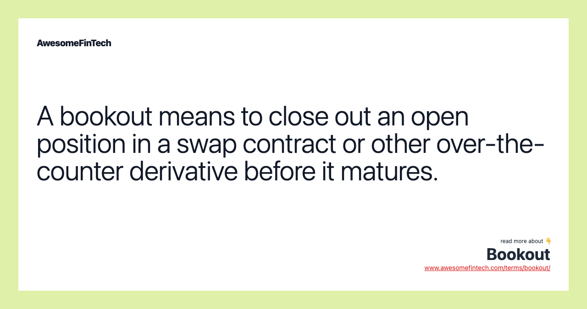

## Table of Contents

## What is Bookout?

Bookout is a process used in the oil and gas industry to manage the inventory of oil or gas that is stored in tanks or pipelines. When a company wants to sell or transfer the oil or gas to another party, they use the bookout process to record the transaction without physically moving the product. This helps keep track of ownership and makes trading easier.

The bookout process is important because it allows companies to trade oil and gas quickly without the need for physical delivery. This can save time and money, as moving large amounts of oil or gas can be expensive and complicated. By using bookouts, companies can focus on trading and managing their inventory more efficiently.

## How does Bookout function in financial markets?

In financial markets, a bookout works a bit like it does in the oil and gas industry. Imagine you own some stocks or bonds, but instead of selling them to someone else right away, you agree with another person to just swap the ownership on paper. This means you don't need to actually move the stocks or bonds; you just change the records to show that the other person now owns them. This can be useful because it makes trading quicker and easier without the hassle of physically transferring the assets.

Using bookouts in financial markets helps traders and investors manage their portfolios more efficiently. For example, if two traders want to swap their positions in certain stocks without actually moving the stocks, they can use a bookout to do this quickly. This saves time and reduces the costs that come with moving assets around. By using bookouts, people in the financial markets can focus more on making smart trading decisions rather than worrying about the logistics of moving their investments.

## What are the primary uses of Bookout?

Bookout is mainly used in the oil and gas industry and financial markets to make trading easier and faster. In the oil and gas industry, companies use bookouts to trade oil or gas without moving it from one place to another. This means they can quickly change who owns the oil or gas just by changing some records. This saves time and money because moving oil or gas can be expensive and hard to do.

In financial markets, bookout works in a similar way. If two people want to swap their stocks or bonds, they can use a bookout to do this without actually moving the stocks or bonds. They just change the records to show the new owner. This makes trading quicker and helps people manage their investments more easily. By using bookouts, traders and investors can focus on making good trading decisions instead of worrying about moving their assets around.

## Can you explain the process of executing a Bookout?

When someone wants to execute a bookout, they first need to find another person or company who wants to trade the same thing, like oil, gas, stocks, or bonds. They agree on the terms of the trade, like how much they are trading and what they are getting in return. Once both sides agree, they don't actually move the oil, gas, stocks, or bonds. Instead, they just change the records to show that the ownership has changed. This is done by updating the [books](/wiki/algo-trading-books) or records that keep track of who owns what.

After the records are updated, the bookout is complete. Both parties now have new ownership without having to move anything physically. This makes the trade quick and easy. In the oil and gas industry, this means the oil or gas stays in the same tank or pipeline, but the records show a new owner. In financial markets, the stocks or bonds stay where they are, but the records show that they now belong to someone else. This process saves time and money because it avoids the costs and hassle of moving things around.

## What are the benefits of using Bookout for traders?

Using bookout is good for traders because it makes trading quick and easy. Instead of moving oil, gas, stocks, or bonds from one place to another, traders just change the records to show who owns what. This saves a lot of time and money because moving these things can be hard and expensive. When traders use bookout, they can focus on making smart trading decisions without worrying about the hassle of moving their assets.

Another benefit of bookout is that it helps traders manage their portfolios better. Since they can trade without physically moving anything, they can make changes to their investments faster. This means they can react quickly to changes in the market and make trades that help them make more money or avoid losing money. By using bookout, traders can keep their investments up to date and make sure they are always working towards their financial goals.

## Are there any risks associated with Bookout transactions?

Yes, there are some risks with bookout transactions. One big risk is that since the trade is just done on paper, there can be mistakes or disagreements about who owns what. If the records are not kept correctly, it might be hard to know who really owns the oil, gas, stocks, or bonds. This can lead to problems and even legal issues if both sides do not agree on the records.

Another risk is that bookouts depend a lot on trust. Since nothing is actually moved, both traders need to trust each other to follow through on the trade. If one person does not update the records right or tries to change the deal later, it can cause big problems. It's important for traders to be careful and make sure they are working with people they can trust.

## How does Bookout differ from other types of financial transactions?

Bookout is different from other types of financial transactions because it doesn't involve moving the actual asset. In a regular trade, you might buy stocks and have them transferred to your account, or you might sell oil and have it physically moved to another location. But with a bookout, you just change the records to show who owns what without moving anything. This makes bookout quicker and easier because it avoids the costs and time it takes to move things around.

Another way bookout is different is that it relies a lot on trust and accurate record-keeping. In other financial transactions, there are often more checks and balances to make sure everything is done correctly. But with a bookout, if the records are wrong or if one person doesn't follow through, it can cause big problems. So, while bookout can be a great way to trade quickly and save money, it needs careful handling and trust between the people involved.

## What regulatory considerations should be noted when using Bookout?

When using bookout, it's important to think about the rules that control these kinds of trades. In the oil and gas industry, there might be rules about how to keep track of who owns the oil or gas. These rules help make sure that everyone knows who owns what and that the trades are fair. In financial markets, there are also rules about how to record trades and make sure they are done correctly. These rules are there to stop mistakes and make sure that the trading system works well.

Another thing to think about is that different places might have different rules about bookouts. If you are doing a bookout with someone in another country, you need to know the rules in both places. This can be hard because the rules might be different and you need to follow all of them. It's a good idea to talk to someone who knows the rules well before you do a bookout, so you can make sure you are doing everything right and not breaking any laws.

## Can Bookout be used in both physical and financial commodity markets?

Yes, bookout can be used in both physical and financial commodity markets. In the physical commodity markets, like oil and gas, bookout allows companies to trade these commodities without moving them from one place to another. Instead of physically transferring oil or gas, the companies just change the records to show who owns what. This makes trading faster and easier because it saves the time and money that would be needed to move the oil or gas around.

In financial commodity markets, bookout works in a similar way. If two traders want to swap their positions in stocks or bonds, they can use bookout to do this without actually moving the assets. They just change the records to show the new owner. This helps traders manage their portfolios more efficiently and react quickly to market changes. By using bookout, traders can focus on making smart trading decisions instead of worrying about the logistics of moving their investments.

## What technological tools support Bookout operations?

Bookout operations are supported by different technological tools that help keep track of trades and make sure they are done right. One important tool is a trading platform. This is like a computer program where traders can see all their trades and change the records to show who owns what. These platforms are made to be easy to use and help traders do bookouts quickly and without mistakes.

Another tool that helps with bookouts is a record-keeping system. This system keeps all the information about who owns what and makes sure the records are correct. It's important because bookouts depend on having good records. If the records are wrong, it can cause big problems. So, having a good record-keeping system helps make sure that bookouts are done right and everyone knows who owns what.

## How has the use of Bookout evolved over time in the financial industry?

Bookout has changed a lot over time in the financial industry. In the past, bookouts were done by hand, with people writing down who owned what in big books. This was slow and could lead to mistakes. But as computers got better, bookouts started to be done on trading platforms. These platforms made it easier and faster to change records and keep track of trades. Now, bookouts can be done in seconds, which helps traders make quick decisions and manage their investments better.

Today, bookouts are even more important because the financial markets are bigger and move faster than ever. Traders use advanced technology to do bookouts, which helps them keep up with the fast pace of the markets. Also, new rules and regulations have been made to make sure bookouts are done right and to stop mistakes. This means that while bookouts are easier and quicker now, traders still need to be careful and follow the rules to make sure everything is done correctly.

## What are some advanced strategies involving Bookout that experienced traders might use?

Experienced traders might use bookout to make quick trades and change their investments without moving anything. They can use bookout to swap their positions in stocks or bonds with other traders. This helps them react fast to changes in the market. For example, if a trader thinks a stock is going to go down, they can use bookout to trade it for another stock they think will go up. This way, they can make money or avoid losing money without waiting for the stocks to be moved.

Another advanced strategy is using bookout to manage risk. Traders can use bookout to balance their portfolios and make sure they are not too focused on one thing. If they have too much of one stock, they can use bookout to trade some of it for other stocks or bonds. This helps spread out their risk and protect their money. By using bookout smartly, experienced traders can keep their investments safe and make smart trading decisions.

## References & Further Reading

[1]: Marcos, J. L. de P. (2018). ["Advances in Financial Machine Learning"](https://books.google.com/books/about/Advances_in_Financial_Machine_Learning.html?id=oU9KDwAAQBAJ). Wiley.

[2]: Aronson, D. R. (2007). ["Evidence-Based Technical Analysis: Applying the Scientific Method and Statistical Inference to Trading Signals"](https://www.amazon.com/Evidence-Based-Technical-Analysis-Scientific-Statistical/dp/0470008741). Wiley.

[3]: Jansen, S. (2020). ["Machine Learning for Algorithmic Trading"](https://github.com/stefan-jansen/machine-learning-for-trading). Packt Publishing.

[4]: Chan, E. P. (2008). ["Quantitative Trading: How to Build Your Own Algorithmic Trading Business"](https://github.com/egorpe/EPChan-QuantitativeTrading/blob/master/example7_6.m). Wiley.

[5]: Bergstra, J., Bardenet, R., Bengio, Y., & Kégl, B. (2011). ["Algorithms for Hyper-Parameter Optimization"](https://dl.acm.org/doi/10.5555/2986459.2986743). Advances in Neural Information Processing Systems, 24.