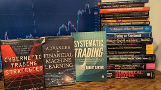

## Table of Contents

## What is algorithmic trading and why is it important?

Algorithmic trading is when computers use math formulas to buy and sell things like stocks automatically. Instead of people making the decisions, the computer follows the rules set in the formulas to trade. This can happen very quickly, often in fractions of a second, which is much faster than humans can trade.

It's important because it can make trading more efficient and less emotional. Since computers follow the rules without getting scared or excited, they can stick to a plan better than humans might. This can lead to more consistent results and can also help handle large amounts of trades without making mistakes. Plus, it can be used to find small price differences in the market that humans might miss.

## What are the basic concepts a beginner should know before starting with algorithmic trading?

Before you start with algorithmic trading, it's important to understand a few basic ideas. First, you need to know what a trading algorithm is. It's like a set of instructions that tells a computer when to buy or sell something. These instructions can be based on things like price movements, time, or other market signals. You also need to understand what a trading platform is. It's the software that lets you connect to the market and use your algorithm to trade. Lastly, it's good to know about backtesting. This is when you test your trading algorithm using old market data to see how it would have worked in the past.

Another key concept is risk management. This means setting rules to protect your money, like deciding how much you're willing to lose on a trade. It's also important to learn about market orders and limit orders. A market order is when you buy or sell at the current market price, while a limit order lets you set a specific price at which you want to trade. Understanding these can help you control your trades better. Finally, you should know about liquidity, which is how easy it is to buy or sell something in the market without affecting its price too much. High liquidity means it's easier to trade without big price changes.

## Can you recommend some beginner-friendly books on algorithmic trading?

If you're new to algorithmic trading and looking for books that are easy to understand, "Algorithmic Trading: Winning Strategies and Their Rationale" by Ernie Chan is a great start. This book explains the basics of how to create and test trading algorithms. It uses simple language and gives clear examples to help you learn. You'll find out about different trading strategies and how to use them, which is perfect for beginners.

Another good book is "Quantitative Trading: How to Build Your Own Algorithmic Trading Business" by Dr. Ernest P. Chan. This one also focuses on the basics but goes a bit deeper into how to set up your own trading business. It talks about the technology you need and how to manage risks, all explained in a way that's easy to follow. Both books are great for anyone starting out in algorithmic trading because they break down complex ideas into simple terms.

## What programming languages are commonly used in algorithmic trading?

In algorithmic trading, a few programming languages are very popular because they work well for this kind of work. Python is one of the most used languages. It's easy to learn and has lots of tools that help with trading, like libraries for working with data and making charts. Many traders like Python because it's simple to use and can handle big amounts of data quickly.

Another common language is R, which is great for doing math and working with numbers. R is often used for analyzing data and testing trading ideas before using them in the market. It's a bit more complex than Python but very powerful for people who need to do detailed data work. Some traders also use C++ because it's very fast and can handle a lot of trades at once, but it's harder to learn and use than Python or R.

## How do the strategies discussed in books on algorithmic trading vary by complexity?

The strategies discussed in books on algorithmic trading can range from very simple to very complex. Simple strategies often focus on basic concepts like moving averages or trend following. These strategies are easier to understand and implement, making them great for beginners. For example, a simple strategy might involve buying a stock when its price goes above its 50-day moving average and selling when it drops below. These strategies are easy to backtest and don't need a lot of complicated math.

As you move to more complex strategies, things get a bit harder. These strategies might use advanced math like machine learning or statistical models to predict market movements. They can involve looking at many different pieces of data at once, like price, volume, and even news events. These strategies often require more powerful computers and a deeper understanding of math and programming. They can be more effective but also harder to set up and maintain. Books on algorithmic trading will often explain these complex strategies step-by-step, but they might be better suited for people who already have some experience in trading or programming.

In summary, the complexity of strategies in algorithmic trading books varies a lot. Simple strategies are great for beginners because they're easy to understand and implement. More complex strategies, on the other hand, use advanced techniques and require more skill and resources. Whether you're just starting out or looking to dive deeper, there are books that can help you learn about both types of strategies.

## What are some intermediate-level books that cover more advanced trading algorithms?

If you're ready to learn more about algorithmic trading and want to dive into more advanced algorithms, "Advances in Financial Machine Learning" by Marcos López de Prado is a great choice. This book goes beyond the basics and explains how to use machine learning to create trading strategies. It talks about things like feature importance, backtesting, and how to avoid common mistakes in algorithmic trading. Even though it's more advanced, the book breaks down complex ideas into smaller parts, so you can understand them better.

Another good book for intermediate learners is "Python for Algorithmic Trading: From Idea to Cloud Deployment" by Yves Hilpisch. This book focuses on using Python to build and test trading algorithms. It covers more complex topics like cloud computing and how to set up a trading system that can handle a lot of data. The book is written in a way that's easy to follow, even if you're moving from basic to more advanced topics. It's perfect for someone who wants to take their algorithmic trading skills to the next level.

## How can one evaluate the effectiveness of trading strategies learned from books?

To evaluate the effectiveness of trading strategies you learn from books, you need to test them with real market data. This process is called backtesting. You take the strategy and apply it to past market data to see how it would have performed. This helps you understand if the strategy could make money or if it loses money. You can use software tools that let you input the strategy and run it against historical data. It's important to use a lot of data from different times to make sure the strategy works well in different market conditions.

After backtesting, you should also think about other things like how much risk the strategy takes and how often it makes trades. A good strategy should not only make money but also manage risk well. You can measure this by looking at things like the maximum amount of money you could lose at any time, called "drawdown," and how much the strategy wins compared to how much it loses, called the "win/loss ratio." Once you feel good about the backtesting results, you might want to try the strategy with a small amount of real money in a live market. This is called "forward testing" or "paper trading," and it helps you see if the strategy works in real-time without risking too much money.

## What are the key mathematical and statistical concepts necessary for understanding advanced algorithmic trading books?

To understand advanced algorithmic trading books, you need to know some important math and stats ideas. One big one is probability, which helps you figure out how likely something is to happen in the market. You'll also need to know about statistics, like how to find the average (mean), the middle number (median), and how spread out numbers are (standard deviation). These help you understand and predict what might happen with prices. Another key idea is correlation, which shows how different things in the market move together. Understanding regression can also help you make models that predict future prices based on past data.

Another important concept is time series analysis, which looks at how data changes over time. This is really useful in trading because prices change over time, and you want to know how they might change in the future. You'll also need to understand things like volatility, which measures how much prices move up and down, and how to use it in your trading models. Finally, knowing about machine learning can help you make more advanced trading strategies. Machine learning uses data to learn and make predictions, which can be very powerful in trading if you understand how it works.

## Are there any books that focus specifically on high-frequency trading algorithms?

If you want to learn about high-frequency trading, "High-Frequency Trading: A Practical Guide to Algorithmic Strategies and Trading Systems" by Irene Aldridge is a good book. It explains what high-frequency trading is and how it works. The book talks about the special strategies that are used in high-frequency trading, like how to make quick trades and use a lot of data to make decisions. It also covers the technology you need and how to manage the risks that come with trading so fast.

Another helpful book is "Flash Boys: A Wall Street Revolt" by Michael Lewis. This book tells a story about high-frequency trading and how it affects the stock market. It's not a how-to guide, but it helps you understand the world of high-frequency trading and why it's important. The book is easy to read and gives you a good picture of what high-frequency trading looks like in real life.

## What are some expert-level books that discuss cutting-edge techniques in algorithmic trading?

For those looking to dive into the cutting-edge techniques of algorithmic trading, "Machine Learning for Algorithmic Trading" by Stefan Jansen is a top choice. This book goes deep into how you can use machine learning to make better trading strategies. It explains how to use things like deep learning and reinforcement learning to predict what the market will do next. The book also talks about how to handle big amounts of data and how to test your strategies to make sure they work well. It's a bit hard to understand, but it's great for people who want to learn the newest ways to trade using computers.

Another expert-level book is "Algorithmic Trading and Quantitative Strategies" by Raja Velu and David Starer. This book focuses on advanced math and stats that can help you make better trading decisions. It talks about things like how to use complex models to predict prices and how to manage risk in a smart way. The book also covers how to use different kinds of data, like news and social media, to improve your trading strategies. It's a bit technical, but it's perfect for traders who want to use the latest and most advanced techniques in algorithmic trading.

## How do regulatory considerations feature in books on algorithmic trading?

Books on algorithmic trading often talk about the rules and laws that traders need to follow. These rules are made by groups like the SEC in the U.S. or the FCA in the U.K. They are there to make sure trading is fair and safe for everyone. Books explain things like the need for transparency, which means traders have to show what they are doing. They also talk about rules to stop market manipulation, where someone tries to cheat the market. Understanding these rules is important because breaking them can lead to big fines or even jail time.

Some books also focus on how these rules can affect the strategies traders use. For example, there might be rules about how fast you can trade or how much data you can use. These rules can change how you set up your trading algorithms. Books might give examples of how to make sure your strategies follow the rules while still trying to make money. They might also talk about how new rules can create new chances for traders who understand them well.

## What future trends in algorithmic trading are discussed in recent publications?

Recent books on algorithmic trading talk about how artificial intelligence (AI) and machine learning are becoming more important. These technologies can help traders make better predictions about the market by learning from lots of data. For example, AI can look at news, social media, and other information to guess what prices might do next. Books say that as computers get better at learning, traders will use these tools more to make smart trading decisions. This could make trading faster and more accurate, but it also means traders need to learn how to use these new technologies.

Another trend that books mention is the use of big data. Traders are using more and more data to make their strategies better. This includes not just numbers about prices and volumes, but also things like weather data, economic reports, and even satellite images. Books explain that handling all this data needs powerful computers and new ways to store and process information. They also talk about how using big data can help find new trading opportunities that were hard to see before. As technology keeps improving, traders will keep finding new ways to use all this data to their advantage.

## What are some books on quantitative strategies?

Quantitative strategies are essential to algorithmic trading, leveraging mathematical and statistical models to make trading decisions. These strategies rely heavily on data analytics and [backtesting](/wiki/backtesting) to ensure their effectiveness in market conditions. One of the seminal books in this domain is "The Man Who Solved the Market" by Gregory Zuckerman, which details the extraordinary life and career of Jim Simons, founder of Renaissance Technologies. Simons is renowned for his application of quantitative techniques and has become a legend in the field.

Understanding quantitative strategies requires a robust knowledge of data analytics, which involves collecting, processing, and analyzing financial data to build predictive models. For example, regression analysis is a common tool used in this process. It involves understanding relationships between different financial variables, represented through equations such as:

$$
Y = \beta_0 + \beta_1X_1 + \beta_2X_2 + \ldots + \beta_nX_n + \epsilon
$$

where $Y$ represents the dependent variable (e.g., asset price), $X$ represents independent variables (e.g., economic indicators), $\beta$ represents the coefficients, and $\epsilon$ is the error term.

Backtesting is another crucial component, which tests the viability of the trading strategy using historical data. This process helps traders understand the potential risks and returns before deploying the strategy in live trading. Through backtesting, one can optimize strategy parameters to enhance performance. Python, a popular programming language in this area, offers libraries such as pandas and NumPy to facilitate data manipulation and analysis. Additionally, the [backtrader](/wiki/backtrader) library can assist in backtesting trading strategies efficiently.

Several other books in this category focus on real-world applications, showcasing strategies that have been validated in actual markets. They explore various quantitative methods, including [factor](/wiki/factor-investing) investing, [statistical arbitrage](/wiki/statistical-arbitrage), and high-frequency trading. Factor investing, for instance, involves selecting stocks based on attributes such as value, [momentum](/wiki/momentum), and quality, which have historically delivered excess returns.

These resources highlight the pragmatic application of quantitative strategies and demonstrate how traders can develop algorithms tailored to specific trading objectives. By exploring proven strategies, traders can gain insights into successful practices and adapt them to their unique requirements, ensuring they remain competitive in rapidly evolving financial markets.

## References & Further Reading

[1]: ["Algorithmic Trading: Winning Strategies and Their Rationale"](https://www.wiley.com/en-us/Algorithmic+Trading%3A+Winning+Strategies+and+Their+Rationale-p-9781118460146) by Ernest P. Chan

[2]: ["Quantitative Trading: How to Build Your Own Algorithmic Trading Business"](https://books.google.com/books/about/Quantitative_Trading.html?id=j70yEAAAQBAJ) by Ernest P. Chan

[3]: ["Advances in Financial Machine Learning"](https://www.amazon.com/Advances-Financial-Machine-Learning-Marcos/dp/1119482089) by Marcos Lopez de Prado

[4]: ["The Man Who Solved the Market: How Jim Simons Launched the Quant Revolution"](https://www.amazon.com/Man-Who-Solved-Market-Revolution/dp/073521798X) by Gregory Zuckerman

[5]: ["Trading Evolved: Anyone Can Build Killer Trading Strategies in Python"](https://www.finnotes.org/publications/trading-evolved) by Andreas F. Clenow

[6]: ["Machine Learning for Algorithmic Trading"](https://github.com/stefan-jansen/machine-learning-for-trading) by Stefan Jansen