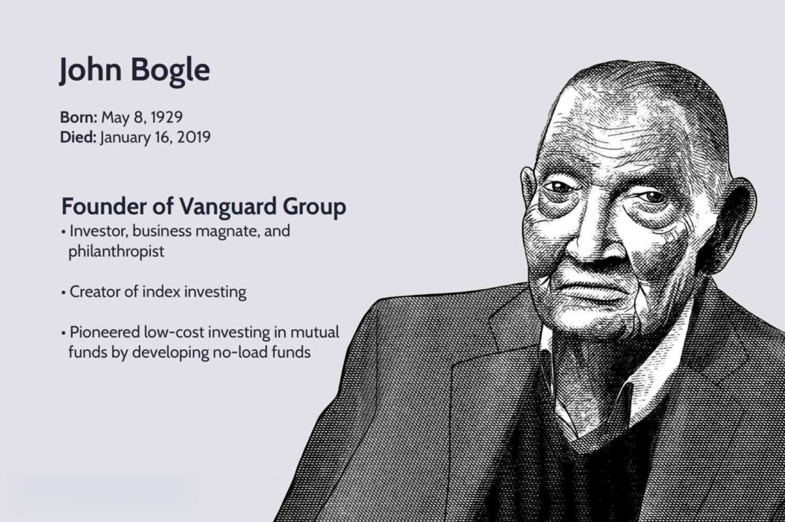

## Table of Contents

## Who is John Bogle and why is he important in the world of finance?

John Bogle was a famous person in the world of money and investing. He started a company called Vanguard in 1974. Bogle is most famous for creating the first index fund for regular people to invest in. An index fund is a type of investment that tries to match the performance of a big group of stocks, instead of trying to pick individual stocks that will do well. This made it easier and cheaper for people to invest their money.

Bogle's idea of index funds changed how people invest. Before his index funds, many people paid high fees to investment managers who tried to pick the best stocks. Bogle believed that most of these managers couldn't beat the market, so it was better and cheaper for people to just invest in the whole market. His idea helped people save money on fees and made investing more fair for everyone. Because of Bogle, many more people started investing in index funds, and it's now a very popular way to invest.

## What is an index fund and how did John Bogle contribute to its development?

An index fund is a type of investment that tries to copy the performance of a big group of stocks, like all the stocks in the S&P 500. Instead of picking individual stocks, an index fund buys a little bit of all the stocks in the group. This makes it easier for people to invest because they don't have to guess which stocks will do well. Index funds usually have lower fees too, because they don't need expensive managers to pick stocks.

John Bogle was really important in making index funds popular. He started Vanguard in 1974 and created the first index fund that regular people could invest in. Before Bogle, most people paid high fees to investment managers who tried to pick the best stocks. Bogle thought this was a waste of money because most managers couldn't beat the market. He believed it was better for people to just invest in the whole market with an index fund. Thanks to Bogle, more people started using index funds, and now they are a very common way to invest.

## Can you list some of the key books written by John Bogle?

John Bogle wrote several important books about investing. One of his famous books is called "Common Sense on Mutual Funds". In this book, he explains why index funds are a good choice for people who want to invest their money. He talks about how most mutual funds don't do better than the market, and how index funds can help people save money on fees.

Another key book by Bogle is "The Little Book of Common Sense Investing". This book is a shorter and simpler version of his ideas about index funds. It's written in a way that is easy for anyone to understand. Bogle explains why investing in the whole market is better than trying to pick individual stocks. He also talks about the importance of keeping fees low to get better returns on your investment.

Bogle also wrote "Enough: True Measures of Money, Business, and Life". In this book, he shares his thoughts on not just investing, but also on living a good life. He talks about the dangers of always wanting more money and how to find satisfaction in what you have. This book is different from his other books because it focuses more on life lessons than on investing strategies.

## What are the main themes discussed in John Bogle's books?

John Bogle's books often focus on the benefits of index funds and how they can help people invest more wisely. He explains that most mutual funds can't beat the market, so it's better for people to invest in the whole market with an index fund. Bogle emphasizes that index funds have lower fees, which means people can keep more of their money instead of paying it to investment managers. He also talks about how index funds make investing simpler because people don't have to guess which stocks will do well.

In addition to investing strategies, Bogle's books also explore broader life lessons. In "Enough: True Measures of Money, Business, and Life," he discusses the dangers of always wanting more money and how to find satisfaction in what you have. Bogle shares his thoughts on living a good life and finding balance between money and happiness. He encourages readers to think about what is truly important in life, beyond just financial success.

## How do John Bogle's books help beginners understand investing?

John Bogle's books are great for beginners because they explain investing in a simple and clear way. In books like "The Little Book of Common Sense Investing," Bogle breaks down complicated ideas into easy-to-understand language. He talks about how index funds work and why they are a good choice for people who are just starting to invest. Bogle explains that instead of trying to pick the best stocks, which can be hard and risky, it's better to invest in the whole market with an index fund. This way, beginners don't have to worry about making the wrong choices and can still see their money grow over time.

Bogle also focuses on the importance of keeping fees low. He explains that many investment managers charge high fees, which can eat into the money people earn from their investments. By choosing index funds, which have lower fees, beginners can keep more of their money. Bogle's books give beginners the confidence to start investing by showing them a simple and cost-effective way to do it. His straightforward approach helps new investors understand the basics and feel more comfortable making their first investments.

## What are some of the advanced investment strategies discussed in John Bogle's books?

In John Bogle's books, he talks about advanced strategies like asset allocation, which means deciding how to spread your money across different types of investments. He explains that a good mix of stocks, bonds, and other investments can help balance risk and reward. Bogle suggests that as people get closer to retirement, they should shift more of their money into safer investments like bonds. This helps protect their savings from big drops in the stock market. He also talks about rebalancing, which means adjusting your investments back to your original plan when the values change over time.

Another advanced strategy Bogle discusses is tax-efficient investing. He explains that different investments are taxed differently, and smart choices can help people keep more of their money. For example, he suggests putting investments that generate a lot of income, like bonds, into tax-deferred accounts like IRAs. This can help lower the taxes people have to pay. Bogle also talks about the importance of understanding the impact of taxes on investment returns and how to use strategies like tax-loss harvesting to improve after-tax returns.

## How has John Bogle's philosophy influenced modern investment practices?

John Bogle's philosophy has had a big impact on how people invest today. He believed that most people should invest in the whole market with index funds instead of trying to pick individual stocks. This idea has become very popular. Now, many people use index funds because they are simple and have low fees. Bogle's focus on keeping costs low has changed the investment world. Many companies now offer low-cost index funds because they know that's what a lot of people want. This has made investing easier and cheaper for everyone.

Bogle also taught people to think about the long term when they invest. He said that trying to beat the market by buying and selling stocks a lot usually doesn't work. Instead, he encouraged people to stay invested in the market for a long time. This way, they can benefit from the market's growth over many years. His ideas about long-term investing and keeping fees low have become key parts of modern investment advice. Many financial advisors now tell their clients to use index funds and focus on the long term, just like Bogle suggested.

## What criticisms or controversies surround John Bogle's ideas as presented in his books?

Some people don't agree with John Bogle's ideas about index funds. They say that index funds might make the stock market less fair. When more people invest in index funds, they buy stocks without looking at the company's value. This can make stock prices go up even if the company isn't doing well. Critics worry that this could lead to a bubble, where prices are too high and could crash later. Also, some people think that index funds take away the chance to make more money by picking the right stocks. They believe that if you're smart and do your research, you can find stocks that will do better than the market.

Another criticism is about Bogle's focus on keeping fees low. Some people say that while low fees are good, they shouldn't be the only thing people think about when they invest. They argue that paying a little more for a good investment manager might be worth it if that manager can help you make more money. Critics also say that Bogle's ideas might make people too passive about their investments. Instead of trying to find the best opportunities, people might just put their money in index funds and forget about it. While this can be good for some, others think it's better to be more active and involved in your investments.

## How have John Bogle's books evolved over time in terms of content and focus?

John Bogle's books have changed over time to cover different topics and ideas. In his early books, like "Common Sense on Mutual Funds," he focused a lot on explaining what index funds are and why they are better than other types of investments. He talked about how most mutual funds can't beat the market and how high fees can hurt people's savings. Bogle wanted to make investing easier and cheaper for everyone, so he spent a lot of time teaching people about the benefits of index funds and how to use them.

As Bogle got older, his books started to include more than just investing tips. In books like "Enough: True Measures of Money, Business, and Life," he began to talk about bigger life lessons. Bogle shared his thoughts on not always wanting more money and how to find happiness in what you have. He still talked about investing, but he also wanted to help people think about what is really important in life. Over time, Bogle's books evolved from being just about index funds to also being about living a good life and finding balance.

## Can you compare and contrast John Bogle's books with other influential investment books?

John Bogle's books, like "The Little Book of Common Sense Investing" and "Common Sense on Mutual Funds," focus a lot on the benefits of index funds. Bogle explains that most people should invest in the whole market instead of trying to pick individual stocks. He talks about how index funds are simple and have low fees, which can help people keep more of their money. Bogle's writing is easy to understand, making it great for beginners. He also encourages people to think about the long term and not to worry too much about short-term changes in the market. His books are all about making investing easier and more fair for everyone.

Other influential investment books, like "The Intelligent Investor" by Benjamin Graham, take a different approach. Graham's book is more about value investing, which means looking for stocks that are priced lower than they should be. He teaches people how to analyze companies and find good investments. Graham's writing can be harder to understand because it goes into more detail about how to pick stocks. Another popular book, "A Random Walk Down Wall Street" by Burton Malkiel, also talks about index funds, but it covers a wider range of investing ideas. Malkiel explains that the stock market can be hard to predict, so index funds can be a good choice. His book mixes ideas about different types of investing and is a bit more complex than Bogle's books.

While Bogle's books focus mainly on index funds and keeping fees low, other books like Graham's and Malkiel's cover a broader range of strategies. Bogle's writing is simpler and more focused on making investing easy for everyone, while Graham's and Malkiel's books go into more detail and cover different ways to invest. All these books want to help people make smart choices with their money, but they do it in different ways.

## What impact have John Bogle's books had on the financial industry and individual investors?

John Bogle's books have changed the way the financial world works. His big idea was that most people should use index funds to invest. This made investing simpler and cheaper for everyone. Before Bogle, many people paid high fees to managers who tried to pick the best stocks. Bogle said this was a waste of money because most managers couldn't do better than the market. His books helped more people understand this, and now lots of people use index funds. This pushed other companies to offer low-cost index funds too, making the whole industry better for regular people.

Bogle's books also helped individual investors a lot. They explained investing in a way that was easy to understand. This was especially good for beginners who felt scared about investing. Bogle's books showed them that they didn't need to be experts to invest their money. By focusing on index funds and keeping fees low, Bogle helped people save money and feel more confident about their investments. His ideas encouraged people to think about the long term and not worry too much about short-term changes in the market. This made investing less stressful and more rewarding for many people.

## Where can readers find more resources or further reading related to John Bogle's works?

Readers who want to learn more about John Bogle's ideas can start by visiting the Vanguard website. Vanguard is the company Bogle started, and it has a lot of information about index funds and investing. They have articles, videos, and tools that can help people understand Bogle's ideas better. Another good place to look is the Bogleheads website. This is a community of people who follow Bogle's investment advice. They share tips, discuss Bogle's books, and help each other learn more about investing.

There are also other books and authors that talk about similar ideas to Bogle's. For example, "A Random Walk Down Wall Street" by Burton Malkiel explains how index funds can be a good way to invest. Another book, "The Intelligent Asset Allocator" by William Bernstein, talks about how to spread your money across different investments, which is something Bogle also discussed. Libraries and bookstores have these books, and they can help people learn more about index funds and smart investing. Reading these books can give people a deeper understanding of what Bogle taught and how to use his ideas in their own investing.

## What are some of John Bogle's investment books?

John Bogle was a prolific author whose books significantly impacted the investment world by promoting pragmatic financial strategies centered on simplicity and sustainability. Among his influential works, "Common Sense on Mutual Funds" and "The Little Book of Common Sense Investing" stand out as quintessential guides for both novice and experienced investors.

"Common Sense on Mutual Funds," published in 1999, provides a comprehensive overview of Bogle's principle of low-cost and long-term investing. Emphasizing an evidence-based approach, Bogle critiques the mutual fund industry for often prioritizing profits over client interests, resulting in unnecessary costs and fees. He advocates for minimizing these costs to enhance net returns, a concept encapsulated in the formula:

$$
\text{Net Return} = \text{Gross Return} - \text{Costs}
$$

This equation underscores the fundamental importance of cost reduction as a means of benefiting investors over the long haul.

In "The Little Book of Common Sense Investing," Bogle simplifies the investment process by urging investors to focus on the time-tested strategy of indexing. This book, often regarded as a manifesto for passive investors, sheds light on the pitfalls of active trading, which can incur substantial fees and introduce [volatility](/wiki/volatility-trading-strategies) without guaranteeing better returns. Bogle stresses the virtues of patience and staying the [course](/wiki/best-algorithmic-trading-courses), allowing compounding to work in one's favor over time.

Risk management is another key theme in Bogle's literature. He cautions against the hazards of frequent trading, which can lead to emotional decisions and short-term focus, distracting from primary financial goals such as retirement savings or wealth preservation. Bogle's work promotes a disciplined approach, advising investors to create a diversified portfolio aligned with their risk tolerance and long-term objectives.

The enduring value of Bogle's books lies in their accessibility and clarity. Written with straightforward language, these resources demystify complex investment concepts, enabling a wider audience to grasp essential market principles. Bogle's insights are not only grounded in empirical data but are also enriched by his decades-long experience in the financial industry.

Ultimately, John Bogle's books continue to serve as foundational texts in understanding the benefits of passive investing and the necessity of low costs. These works remain timeless resources, offering invaluable guidance for crafting investment strategies that prioritize sustainable growth and financial security.

## What is the relevance of Bogle's philosophy today?

John Bogle’s investment philosophy continues to hold significant relevance in today’s market environment, providing a clear contrast to the complexities often associated with high-risk financial strategies. Bogle's ideas primarily emphasize passive investing through index funds, which has grown substantially, reflecting his enduring influence on investment strategies worldwide. As market instability and uncertainty persist, Bogle’s commitment to minimizing costs and focusing on long-term gains offers a prudent approach to wealth management.

The surge in passive investing is a direct testament to Bogle’s lasting impact. Index funds, as Bogle advocated, enable investors to achieve diversified exposure to the market with reduced costs. This approach challenges the traditional active management paradigm, which often involves higher fees and more frequent trading, neither of which consistently result in better performance. By minimizing expenses, investors can maximize their net returns over time, a principle that aligns well with the economic reality of compounded growth. If we consider an annual return $r$ with a fee rate $f$, the net return simplifies to:

$$
R_{\text{net}} = (1 + r - f)^n
$$

where $n$ is the number of years the investment is held. Lowering $f$, as Bogle suggests, the net return $R_{\text{net}}$ increases significantly over time, demonstrating the power of cost efficiency.

In the context of modern financial innovations like algorithmic trading, Bogle’s teachings present a valuable counter-narrative. Algorithmic trading often requires sophisticated technology and a deep understanding of market dynamics, along with significant capital, which is not feasible for the average investor. Moreover, it involves higher levels of risk due to its speculative nature. Bogle’s strategy, in contrast, advocates for simplicity and avoids speculative practices, aligning more closely with the needs and capabilities of individual investors.

For investors looking to build a resilient portfolio, integrating Bogle's principles with contemporary investment strategies offers a balanced pathway. Combining passive index fund investing with select active strategies can optimize portfolio diversification and potential returns while still adhering to low-cost, long-term investing principles. Such a hybrid approach balances stability with opportunities for growth, allowing investors to navigate today’s complex financial landscape while staying true to the foundational principles that Bogle championed. Therefore, the wisdom encapsulated in Bogle's philosophy remains a cornerstone in guiding investors toward sustainable and successful financial practices in today's market.

## References & Further Reading

[1]: Bogle, J. C. (2007). ["The Little Book of Common Sense Investing: The Only Way to Guarantee Your Fair Share of Stock Market Returns."](https://www.amazon.com/Little-Book-Common-Sense-Investing/dp/1119404509) John Wiley & Sons.

[2]: Bogle, J. C. (1999). ["Common Sense on Mutual Funds: New Imperatives for the Intelligent Investor."](https://www.amazon.com/Common-Sense-Mutual-Funds-Imperatives/dp/0471392286) John Wiley & Sons.

[3]: Malkiel, B. G. (1996). ["A Random Walk Down Wall Street: The Time-Tested Strategy for Successful Investing."](https://www.amazon.com/Random-Walk-Down-Wall-Street/dp/1324002182) W. W. Norton & Company.

[4]: Ellis, C. D. (2016). ["Winning the Loser's Game: Timeless Strategies for Successful Investing."](https://www.amazon.com/Winning-Losers-Game-Strategies-Successful/dp/1264258461) McGraw-Hill Education.

[5]: French, K. R. (2008). ["Presidential Address: The Cost of Active Investing."](https://onlinelibrary.wiley.com/doi/abs/10.1111/j.1540-6261.2008.01368.x) The Journal of Finance, 63(4), 1537–1573.