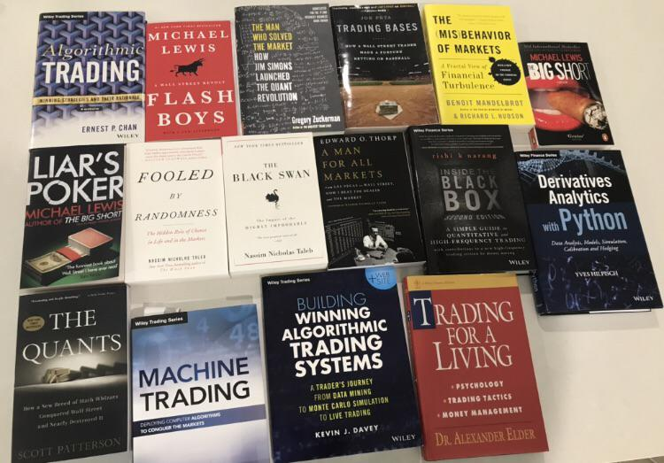

Quantitative finance merges mathematical finance theory with practical financial markets applications, harnessing mathematical models to drive investment strategies, manage risk, and predict market movements. For quants, who operate at the intersection of finance, mathematics, and programming, continuous learning isn't just beneficial; it's a necessity. The financial landscape is perpetually evolving, with new models, regulatory landscapes, and computational tools emerging constantly. Hence, a commitment to reading and learning is paramount for those looking to excel in this field.



The goal of this article is to curate a definitive collection of literature that will serve as the bedrock for both aspiring and seasoned quants. This selection will cover fundamental concepts, deep dive into advanced quantitative theories, and offer insights into the practical application of financial engineering. For those looking to establish or deepen their expertise in quantitative finance, this reading list aims to be an essential companion, guiding readers through the complex yet fascinating world of quantitative analysis.

## Foundational Knowledge

In the realm of quantitative finance, foundational knowledge is the bedrock upon which all complex strategies and models are built. Mastery of mathematical concepts, statistical theories, and financial principles is essential.

### "Options, Futures, and Other Derivatives" by John Hull

For beginners, "Options, Futures, and Other Derivatives" by John Hull lays a comprehensive groundwork in derivatives and risk management. Hull's work is an excellent starting point for understanding the complexities of financial instruments and their applications[1].

### "The Concepts and Practice of Mathematical Finance" by Mark Joshi

Intermediate readers can progress to "The Concepts and Practice of Mathematical Finance" by Mark Joshi, which delves deeper into mathematical finance theory while remaining accessible to those who have grasped the basics. Joshi's practical approach helps bridge the gap between theoretical mathematics and real-world financial strategy design[2].

### "Paul Wilmott on Quantitative Finance" by Paul Wilmott

Advanced quants should immerse themselves in "Paul Wilmott on Quantitative Finance," a seminal work by Paul Wilmott that offers extensive coverage of quantitative finance across three volumes. Wilmott's books address the most sophisticated aspects of the field, including model construction and risk management, serving as an invaluable reference for seasoned professionals[3].

The relevance of each book is underscored by its application to real-world scenarios. For example, Hull's text is vital for understanding the pricing and hedging of derivatives, a daily concern for traders and risk managers. Joshi's work enhances the design of more efficient and accurate financial models, while Wilmott's comprehensive guide aids in the strategic decision-making process at the highest levels of financial engineering.

- Illustration
    
    To illustrate the application of these concepts, consider the Black-Scholes model for option pricing, which is a fundamental model in finance. The formula is given by:
    
    $C(S, t) = S_t N(d_1) - K e^{-r(T-t)} N(d_2)$
    
    where:
    
    - $C$ is the price of the call option,
    - $S$ is the current price of the underlying asset,
    - $K$ is the strike price of the option,
    - $T$ is the time to expiration,
    - $r$ is the risk-free interest rate,
    - $N$ is the cumulative distribution function of the standard normal distribution,
    - $d_1 = \frac{\ln(S/K) + (r + \sigma_v^2 / 2)(T-t)}{\sigma_s \sqrt{T-t}}$,
    - $d_2 = d_1 - \sigma_s \sqrt{T-t}$,
    - $\sigma_s$ is the volatility of the underlying asset's price.
    
    For hands-on learning, readers can explore Python libraries such as `numpy` and `scipy` to implement financial models:
    
    ```python
    import numpy as np
    from scipy.stats import norm
    
    def black_scholes(S, K, T, r, sigma):
        d1 = (np.log(S / K) + (r + sigma ** 2 / 2) * T) / (sigma * np.sqrt(T))
        d2 = d1 - sigma * np.sqrt(T)
        call = (S * norm.cdf(d1) - K * np.exp(-r * T) * norm.cdf(d2))
        return call
    
    # Example parameters for an option
    call_price = black_scholes(S=100, K=100, T=1, r=0.05, sigma=0.2)
    print(f"The Black-Scholes call option price is: {call_price}")
    ```
    

Incorporating these texts into a quant's reading list provides the theoretical underpinnings necessary for practical application and advancement in the field of quantitative finance. The works of Hull, Joshi, and Wilmott are not only academic staples but also serve as continual references for professionals navigating the quantitative finance landscape.

## Advanced Quantitative Finance

Advanced quantitative finance is a field that delves into the most complex and sophisticated theories and models used in financial markets. To truly excel as a quant, it is critical to understand and apply concepts from stochastic calculus, time series analysis, and machine learning. These areas form the backbone of modern quantitative finance and are essential for creating robust financial models and algorithms.

### "Stochastic Calculus for Finance II: Continuous-Time Models" by Steven Shreve

For those seeking to deepen their knowledge in stochastic calculus, "Stochastic Calculus for Finance II: Continuous-Time Models" by Steven Shreve is an invaluable resource. This book provides a comprehensive treatment of the subject, equipping readers with the tools to model financial markets and value complex derivatives. Shreve's work is particularly relevant for understanding Black-Scholes-Merton's option pricing models and interest rate models, both of which are pivotal in the field[4].

### "Time Series Analysis" by James Hamilton

In the domain of time series analysis, "Time Series Analysis" by James Hamilton offers a thorough exploration of the subject. Hamilton's text is crucial for quants looking to analyze historical data to make predictions about future market behavior. The techniques discussed are widely used for risk management, trading strategy development, and econometric forecasting[5].

### "Advances in Financial Machine Learning" by Marcos Lopez de Prado

The rapidly evolving area of machine learning in finance is expertly covered in "Advances in Financial Machine Learning" by Marcos Lopez de Prado. This book is a must-read for quants who aim to harness cutting-edge algorithms to uncover patterns and insights from data that traditional methods might miss. Lopez de Prado's book is a guide to impl ementing machine learning frameworks in the context of finance, which can lead to more innovative and effective trading strategies[6].

- Illustration
    
    In the mathematical realm, a quant might regularly employ formulas like the Itô's Lemma, a fundamental tool in stochastic calculus, for modeling the dynamics of financial instruments:
    
    $df(X_t) = f'(X_t)dX_t + \frac{1}{2}f''(X_t)(dX_t)^2$
    
    where $f$ is a smooth function and $X_t$ is an Itô process.
    

These books not only provide the theoretical foundation for such models but also offer insights into their practical application in finance. By combining the advanced knowledge from these texts with programming skills, quants can significantly enhance their analytical capabilities and contribution to their respective fields. The quoted books and authors are renowned in the quant community for their contributions and are often cited in academic and professional circles for their clarity and depth.

## Specialty Areas in Quantitative Finance

### "Quantitative Risk Management: Concepts, Techniques and Tools" by Alexander J. McNeil, Rüdiger Frey, and Paul Embrechts

Risk management is another pillar of quantitative finance, and "Quantitative Risk Management: Concepts, Techniques and Tools" by Alexander J. McNeil, Rüdiger Frey, and Paul Embrechts is essential reading. This book offers a comprehensive overview of modern risk management tools and practices, including both market and credit risk, and the quantitative methods used to measure and mitigate them[7].

### "Algorithmic Trading and DMA: An Introduction to Direct Access Trading Strategies" by Barry Johnson

When it comes to algorithmic trading, "Algorithmic Trading and DMA: An Introduction to Direct Access Trading Strategies" by Barry Johnson is highly recommended. Johnson's book examines the algorithms behind trade order execution strategies, discussing both the technical aspects and the market conditions that impact automated trading systems[8].

Each of these books plays a significant role in the quant finance industry by providing specialized knowledge that quants can apply directly to their work. For instance, understanding derivatives is crucial for structuring complex financial products, while risk management is essential for developing strategies to protect investment portfolios. Algorithmic trading expertise is indispensable for creating systems that can execute trades quickly and efficiently, capitalizing on market opportunities.

## Programming and Tools for Quants

### "Python for Data Analysis" by Wes McKinney

Programming prowess is fundamental to a quant's toolkit, enabling the creation, testing, and implementation of complex financial models. It is the scaffold upon which theoretical concepts are translated into practical applications. For those starting in the programming world, "Python for Data Analysis" by Wes McKinney is an excellent resource. McKinney, the creator of the pandas library, provides a practical introduction to data analysis using Python, an essential skill for quants dealing with large datasets[9].

### "C++ Design Patterns and Derivatives Pricing" by Mark Joshi

As quants progress, they often turn to "C++ Design Patterns and Derivatives Pricing" by Mark Joshi, which bridges the gap between mathematical finance and the software engineering needed to implement it. Joshi's work is particularly beneficial for understanding how to structure C++ programs in a way that is both efficient and mathematically sound[10].

### "R for Data Science" by Hadley Wickham and Garrett Grolemund

For statistical computing and graphics, "R for Data Science" by Hadley Wickham and Garrett Grolemund guides readers through the R language, a tool that is integral for statistical modeling and data visualization in finance. Wickham, an R developer, provides insight into using R for data science, which is invaluable for quants focused on research and analytics.

- Illustration
    
    In the context of real-world application, Python remains a quintessential tool for implementing and testing financial models. For instance, a quant might use Python to simulate the portfolio optimization problem:
    
    ```python
    import numpy as np
    import pandas as pd
    from scipy.optimize import minimize
    
    # Generate or load returns data
    returns = pd.read_csv('returns.csv')
    
    # Define the optimization function
    def portfolio_volatility(weights, mean_returns, cov_matrix):
        return np.sqrt(np.dot(weights.T, np.dot(cov_matrix, weights)))
    
    # Constraints for the weights to sum to 1
    constraints = ({'type': 'eq', 'fun': lambda x: np.sum(x) - 1})
    
    # The optimization function call
    optimized = minimize(portfolio_volatility, num_assets*[1./num_assets,], args=(returns.mean(), returns.cov()), method='SLSQP', constraints=constraints)
    
    print(optimized)
    ```
    

These programming languages and their associated tools are essential for quants to effectively analyze financial markets and develop strategies. The books mentioned above are highly recommended for not only learning these languages but also for understanding how to apply them to solve complex quantitative finance problems. They are quoted and recommended by both academia and industry professionals for their depth of content and practical utility[11].

## Real-World Applications

### "Dynamic Hedging: Managing Vanilla and Exotic Options" by Nassim Nicholas Taleb

In the echelons of quantitative finance, the translation of theory into practice is both an art and a science. Books that offer a window into real-world applications are not just educational; they are a conduit for theory to meet the tangible world of finance. "Dynamic Hedging: Managing Vanilla and Exotic Options" by Nassim Nicholas Taleb stands out as a prime example. Taleb, with his extensive trading experience, dissects the complexities of options trading and risk management, making it a pivotal read for those wanting to see how quantitative methods are applied in actual trading scenarios[12].

### "The Man Who Solved the Market: How Jim Simons Launched the Quant Revolution" by Gregory Zuckerman

Equally indispensable is "The Man Who Solved the Market: How Jim Simons Launched the Quant Revolution" by Gregory Zuckerman. This biography of Jim Simons and the famed Medallion Fund offers an unprecedented look at how mathematical models can lead to extraordinary returns, highlighting the practical successes—and challenges—of quantitative trading[13].

### "The Quants: How a New Breed of Math Whizzes Conquered Wall Street and Nearly Destroyed It" by Scott Patterson

For a more focused dive into the nitty-gritty of the quant world, "The Quants: How a New Breed of Math Whizzes Conquered Wall Street and Nearly Destroyed It" by Scott Patterson recounts the stories of quantitative finance pioneers and the impact of their mathematical approaches during the financial crisis. It is a tale of innovation, ambition, and the double-edged sword of algorithmic trading[14].

### "When Genius Failed: The Rise and Fall of Long-Term Capital Management" by Roger Lowenstein

Case studies are another critical resource, offering detailed analyses of specific financial events or trends. For instance, the collapse of Long-Term Capital Management is a case in point where risk management failures and leverage can lead to a spectacular downfall, as documented in "When Genius Failed: The Rise and Fall of Long-Term Capital Management" by Roger Lowenstein[15].

The real-world insights from these books, paired with the ability to execute quantitative analysis through programming, provide a powerful combination for any quant. The quoted materials, rich with the wisdom of hindsight and the clarity of experience, are essential for any practitioner eager to apply quantitative finance principles effectively and innovatively in today's financial markets.

## Market Theory and Asset Pricing

### "Asset Pricing" by John Cochrane

Market theory and asset pricing are pillars of quantitative finance, providing the framework for how markets operate and assets are valued. To grasp these concepts, "Asset Pricing" by John Cochrane offers a deep dive into the relationship between risk and return, covering both classical and modern approaches. Cochrane's systematic explanation of asset pricing theories makes it an invaluable text for understanding market behavior[16].

### "Irrational Exuberance" by Robert J. Shiller

For a perspective that challenges traditional theories, "Irrational Exuberance" by Robert J. Shiller examines asset pricing through the lens of behavioral finance. Shiller’s analysis of bubbles and market volatility offers a critical view of the efficient market hypothesis, arguing that markets are more psychologically driven than previously thought[17].

### "The Econometrics of Financial Markets" by John Y. Campbell, Andrew W. Lo, and A. Craig MacKinlay

"The Econometrics of Financial Markets" by John Y. Campbell, Andrew W. Lo, and A. Craig MacKinlay integrates statistical methods into the study of financial markets, providing empirical evidence that is crucial for quantitatively driven asset pricing models. This work is particularly relevant for quants looking to validate their models against historical data[18].

- Illustration
    
    These readings encourage a nuanced understanding of market dynamics and asset valuation, beyond the traditional models. For example, the Capital Asset Pricing Model (CAPM), a cornerstone of modern financial theory, is given by:
    
    $E(R_i) = R_f + \beta_i (E(R_m) - R_f)$
    
    where:
    
    - $E(R_i)$ is the expected return on the capital asset,
    - $R_f$ is the risk-free rate,
    - $\beta_i$ is the beta of the asset,
    - $E(R_m)$ is the expected return of the market.
    
    In practice, quants may use Python to calculate beta for a stock, incorporating both market theory and empirical analysis:
    
    ```python
    import numpy as np
    import pandas as pd
    import pandas_datareader.data as web
    import datetime
    
    # Define the time frame for historical data
    start = datetime.datetime(2010, 1, 1)
    end = datetime.datetime(2020, 1, 1)
    
    # Retrieve stock and market data
    stock_data = web.DataReader('AAPL', 'yahoo', start, end)
    market_data = web.DataReader('^GSPC', 'yahoo', start, end)
    
    # Calculate returns
    stock_returns = stock_data['Adj Close'].pct_change()
    market_returns = market_data['Adj Close'].pct_change()
    
    # Drop the NaN values
    stock_returns = stock_returns.dropna()
    market_returns = market_returns.dropna()
    
    # Calculate beta
    covariance = np.cov(stock_returns, market_returns)[0][1]
    variance = np.var(market_returns)
    beta = covariance / variance
    
    print(f"Beta for the stock: {beta:.2f}")
    ```
    

The literature recommended here provides a comprehensive view of market theory and asset pricing, giving quants the tools to decipher complex market signals and value assets appropriately. These books are frequently cited in academic literature and industry reports, reflecting their significant contribution to the field of quantitative finance.

## Risk Management and Regulation

### "Risk Management and Financial Institutions" by John Hull

Risk management and regulation are critical components of quantitative finance, ensuring the stability and integrity of financial systems. Modern risk management techniques hinge on quantifying and mitigating potential losses, while regulatory frameworks safeguard against systemic risks. "Risk Management and Financial Institutions" by John Hull provides an expansive overview of this landscape, elucidating complex risk management tools and the regulatory policies affecting financial institutions. Hull’s insights into the Basel Accords and the Dodd-Frank Act make this work a definitive guide for quants navigating the regulatory environment[19].

### "Quantitative Risk Management: Concepts, Techniques, and Tools" by Alexander J. McNeil, Rüdiger Frey, and Paul Embrechts

Another pivotal work is "Quantitative Risk Management: Concepts, Techniques, and Tools" by Alexander J. McNeil, Rüdiger Frey, and Paul Embrechts. This book delves into the quantitative methods used to measure and manage risk, with a strong emphasis on the practical application of these techniques. The authors provide a rigorous treatment of the subject, from VaR models to extreme value theory, essential for quants tasked with risk assessment[20].

### "Value at Risk: The New Benchmark for Managing Financial Risk" by Philippe Jorion

Philippe Jorion’s "Value at Risk: The New Benchmark for Managing Financial Risk" is a seminal text on VaR, the industry-standard measure used to estimate the potential loss on an investment. Jorion's comprehensive approach to explaining how VaR is calculated and used makes it an indispensable resource for risk managers[21].

- Illustration
    
    These books are essential for understanding how to construct and apply quantitative risk models in a regulatory context. For example, a quant might use Python to implement a basic Value at Risk (VaR) calculation:
    
    ```python
    import numpy as np
    import pandas as pd
    
    # Assuming daily returns of a portfolio are normally distributed
    portfolio_returns = pd.Series(np.random.normal(0, 0.01, 250))
    
    # Calculate the 95% VaR
    var_95 = np.percentile(portfolio_returns, 5)
    print(f"95% VaR is: {-var_95:.2%}")
    
    # Assuming a portfolio value of $1 million
    portfolio_value = 1e6
    VaR_95 = portfolio_value * var_95
    print(f"95% VaR in dollars is: ${-VaR_95:.2f}")
    ```
    
    The mathematical formulation of VaR for a normal distribution can also be expressed as:
    
    $VaR_{\alpha} = \mu - Z_{\alpha} \cdot \sigma$
    
    where:
    
    - $\mu$ is the mean of portfolio returns,
    - $\sigma$ is the standard deviation of portfolio returns,
    - $Z_{\alpha}$ is the Z-score corresponding to the confidence level $\alpha$,
    - $VaR_{\alpha}$ is the Value at Risk for the given confidence level.

The literature cited above is recommended by industry professionals and academic courses for its authoritative treatment of risk management and its adaptation to the regulatory frameworks within which financial markets operate. These texts not only provide theoretical knowledge but also equip quants with practical tools to manage financial risk effectively in their daily work.

## Professional Development for Quants

### "My Life as a Quant: Reflections on Physics and Finance" by Emanuel Derman

Professional development for quants is not only about mastering the technical skills but also about understanding the career landscape and preparing for the challenges of the financial industry. A quintessential read in this domain is "My Life as a Quant: Reflections on Physics and Finance" by Emanuel Derman. This autobiography offers a firsthand account of the transition from academia to finance, providing invaluable insights into the life and work of a quant[22].

### "Quant Job Interview Questions and Answers" by Mark Joshi, Nick Denson, and Andrew Downes

For those preparing for the highly competitive quant job market, "Quant Job Interview Questions and Answers" by Mark Joshi, Nick Denson, and Andrew Downes is an indispensable resource. This book equips candidates with the knowledge and problem-solving skills needed to excel in tough interviews, covering a wide range of topics from brain teasers to financial mathematics[23].

### "The Complete Guide to Capital Markets for Quantitative Professionals" by Alex Kuznetsov

"The Complete Guide to Capital Markets for Quantitative Professionals" by Alex Kuznetsov is another crucial guide that provides a broad overview of the roles quants play within the capital markets. It offers a comprehensive view of the industry, including the structures, products, and business aspects that quants should be familiar with[24].

- Illustration
    
    These books are instrumental for quants who not only want to excel technically but also seek to understand the broader context of their roles. For example, in preparing for interviews or understanding financial products, a quant might need to demonstrate proficiency in programming by writing a Python script to calculate the Greeks in options pricing:
    
    ```python
    import numpy as np
    from scipy.stats import norm
    
    def black_scholes_greeks(S, K, T, r, sigma):
        # Calculate d1 and d2
        d1 = (np.log(S / K) + (r + 0.5 * sigma ** 2) * T) / (sigma * np.sqrt(T))
        d2 = d1 - sigma * np.sqrt(T)
        # Calculate Greeks
        delta = norm.cdf(d1)
        gamma = norm.pdf(d1) / (S * sigma * np.sqrt(T))
        theta = - (S * norm.pdf(d1) * sigma) / (2 * np.sqrt(T)) - r * K * np.exp(-r * T) * norm.cdf(d2)
        vega = S * norm.pdf(d1) * np.sqrt(T)
        rho = K * T * np.exp(-r * T) * norm.cdf(d2)
        return delta, gamma, theta, vega, rho
    
    # Example usage
    greeks = black_scholes_greeks(100, 100, 1, 0.05, 0.2)
    print(f"Delta: {greeks[0]:.2f}, Gamma: {greeks[1]:.2f}, Theta: {greeks[2]:.2f}, Vega: {greeks[3]:.2f}, Rho: {greeks[4]:.2f}")
    ```
    
    In terms of financial mathematics, understanding the Black-Scholes model is often expected:
    
    $C(S,t) = S_tN(d_1) - Ke^{-rt}N(d_2)$
    
    $P(S,t) = Ke^{-rt}N(-d_2) - S_tN(-d_1)$
    
    where $C$ is the call option price, $P$ is the put option price, $S$ is the current stock price, $K$ is the strike price, $r$ is the risk-free interest rate, $t$ is the time to expiration, and $N$ is the cumulative distribution function of the standard normal distribution.
    

These materials, recommended by leading industry experts, provide a thorough grounding in the professional aspects of being a quant, from the technical to the personal. They help bridge the gap between academic study and the realities of a career in finance, giving quants a holistic view of their profession.

## Cultivating a Quantitative Mindset

### "The Black Swan: The Impact of the Highly Improbable" by Nassim Nicholas Taleb

Cultivating a quantitative mindset extends beyond technical acumen; it’s about fostering an analytical framework for problem-solving and innovation. "The Black Swan: The Impact of the Highly Improbable" by Nassim Nicholas Taleb is pivotal in this regard. Taleb's exploration of extreme and unpredictable events challenges conventional wisdom and encourages quants to think beyond the confines of normal distributions and standard deviations[25].

### "Fooled by Randomness: The Hidden Role of Chance in Life and in the Markets" by Nassim Nicholas Taleb

"Fooled by Randomness: The Hidden Role of Chance in Life and in the Markets," also by Nassim Nicholas Taleb, furthers this perspective by examining the underappreciation of randomness in financial markets and decision-making. Taleb’s incisive commentary compels quants to critically assess the probabilistic nature of market events and the psychological biases that can impair judgment[26].

### "How to Solve It: A New Aspect of Mathematical Method" by George Pólya

Another influential book is "How to Solve It: A New Aspect of Mathematical Method" by George Pólya. Although not finance-specific, Pólya's heuristic approach to problem-solving is universally applicable, including within quantitative finance. His strategies for tackling complex problems are as relevant to constructing financial models as they are to addressing broader mathematical questions[27].

- Illustration
    
    In the spirit of these works, quants can apply problem-solving techniques using Python for practical challenges. For instance, Monte Carlo simulations are a staple in risk analysis and derivative pricing:
    
    ```python
    import numpy as np
    
    # Define parameters for the Monte Carlo simulation
    np.random.seed(0)
    n_simulations = 10000
    S0 = 100        # initial stock price
    T = 1           # time period
    r = 0.05        # risk-free rate
    sigma = 0.25    # volatility
    
    # Simulate end-of-period stock price using geometric Brownian motion
    stock_prices = S0 * np.exp((r - 0.5 * sigma**2) * T + sigma * np.sqrt(T) * np.random.randn(n_simulations))
    
    # Example application: Calculate the expected payoff of a European call option
    K = 100  # strike price
    payoffs = np.maximum(stock_prices - K, 0)
    expected_payoff = np.mean(payoffs)
    discounted_payoff = np.exp(-r * T) * expected_payoff
    
    print(f"Discounted expected payoff of the European call option: {discounted_payoff:.2f}")
    ```
    
    The math behind a Monte Carlo simulation for a stock's future price, modeled using geometric Brownian motion, is given by:
    
    $S_T = S_0 e^{(r - \frac{1}{2}\sigma^2)T + \sigma\sqrt{T}Z}$
    
    where $S_T$ is the stock price at time $T$, $S_0$ is the current stock price, $r$ is the risk-free interest rate, $\sigma$ is the volatility, and $Z$ is a standard normal random variable.
    

By engaging with the recommended books, quants are encouraged to adopt a mindset that is both critical and inventive, essential for tackling the multifaceted problems encountered in the financial industry. These texts, widely recognized for their contribution to critical thinking in quantitative disciplines, are often cited in educational programs and professional development seminars, highlighting their significance in the field.

## Resources and Tools for Selecting Books

Selecting the right books to advance in the field of quantitative finance depends on one’s career stage, goals, and areas of interest. For beginners, "An Introduction to Quantitative Finance" by Stephen Blyth provides a clear pathway into the basics of the field, suitable for those just starting their journey. As one advances, the focus should shift towards more specialized texts. For instance, "The Mathematics of Financial Derivatives" by Paul Wilmott, Sam Howison, and Jeff Dewynne is recommended for those ready to tackle the mathematical rigor of derivative pricing.

For practitioners looking to deep dive into the practicalities of the finance industry, online forums such as QuantNet and Wilmott serve as valuable resources for book recommendations and discussions. Websites like SSRN and arXiv offer a wealth of research papers, which often precede book publications, allowing quants to stay at the forefront of emerging theories and applications.

Book reviews on platforms like Amazon and Goodreads can also guide one's selection, offering insights from a community of readers. However, one should be cautious and discerning, considering the credibility of reviewers and the applicability of the book to their specific needs.

For those who prefer a structured approach to book selection, the CFA Institute provides a comprehensive reading list that aligns with professional standards and is regularly updated to reflect the evolving landscape of financial analysis.

The choice of literature is a personal journey, shaped by individual career goals and intellectual curiosity. Engaging with a community of like-minded individuals through online forums and review sites can provide diverse perspectives and help quants build a well-rounded library tailored to their professional development.

## Staying Current: Journals and Continued Education

Staying current with the latest research is a crucial aspect of being a successful quant. Top journals such as "The Journal of Financial Economics," "Quantitative Finance," and "The Journal of Portfolio Management" regularly publish groundbreaking work in the field of quantitative analysis, offering insights into the newest theories and applications.

Online courses from platforms like Coursera, edX, and Udemy provide quants with access to cutting-edge courses from leading institutions and industry experts. Subjects range from algorithmic trading and machine learning to advanced mathematical finance. For instance, the "Machine Learning for Trading" course by Georgia Tech on Coursera is highly regarded among quants for its practical application of machine learning in the financial markets.

Certifications such as the Chartered Financial Analyst (CFA), Financial Risk Manager (FRM), and Certificate in Quantitative Finance (CQF) offer structured learning paths and are recognized globally for their rigor in the quantitative finance profession. These certifications require a strong commitment to study and a deep understanding of many of the concepts covered in the essential books listed in this article.

Engaging with the latest research and continuous education ensures that quants can refine their strategies and methodologies, stay competitive in the job market, and contribute to the field's advancement. The resources listed here are frequently recommended in academic circles and professional networks as essential tools for a quant's ongoing development.

## Conclusion

A well-rounded quant library is an invaluable asset, providing the theoretical underpinning and practical knowledge necessary for success in financial engineering and quantitative analysis. It bridges the gap between academic study and the realities of the financial markets, equipping quants with the tools needed to innovate and excel in their field. The books and resources discussed span foundational knowledge, advanced quantitative finance, specialty areas, programming, real-world applications, and professional development.

A culture of sharing and discussion enriches this learning process. Book reviews and reading groups on Goodreads or LinkedIn offer diverse perspectives and recommendations. Moreover, the commitment to continuous education, through journals like "The Journal of Quantitative Finance" and certifications such as CFA and CQF, ensures that quants remain at the cutting edge of research and best practices.

💡 **Read more:**

- Trading strategies papers with code on [Equities](https://wiki.paperswithbacktest.com/trading-strategies/equities), [Cryptocurrencies](https://wiki.paperswithbacktest.com/trading-strategies/cryptocurrencies), [Commodities](https://wiki.paperswithbacktest.com/trading-strategies/commodities), [Currencies](https://wiki.paperswithbacktest.com/trading-strategies/currencies), [Bonds](https://wiki.paperswithbacktest.com/trading-strategies/bonds), [Options](https://wiki.paperswithbacktest.com/trading-strategies/options)
- [A curated list](https://github.com/paperswithbacktest/awesome-systematic-trading) of awesome libraries, packages, strategies, books, blogs, and tutorials for systematic trading
- [A bunch of datasets](https://huggingface.co/paperswithbacktest) for quantitative trading
- [A website to help you](https://paperswithbacktest.com/) become a quant trader and achieve financial independence

## References & Further Reading

[1]: ["Options, Futures, and Other Derivatives"](https://www.amazon.com/Options-Futures-Other-Derivatives-9th/dp/0133456315) by John Hull

[2]: ["The Concepts and Practice of Mathematical Finance"](https://www.amazon.com/Concepts-Practice-Mathematical-Finance-Mathematics/dp/0521514088) by Mark Joshi

[3]: ["Paul Wilmott on Quantitative Finance"](https://www.amazon.com/Paul-Wilmott-Quantitative-Finance-Set/dp/0470018704) by Paul Wilmott

[4]: ["Stochastic Calculus for Finance II: Continuous-Time Models"](https://www.amazon.com/Stochastic-Calculus-Finance-II-Continuous-Time/dp/144192311X) by Steven Shreve

[5]: ["Time Series Analysis"](https://www.amazon.com/Time-Analysis-James-Douglas-Hamilton/dp/0691042896) by James Hamilton

[6]: ["Advances in Financial Machine Learning"](https://www.amazon.com/Advances-Financial-Machine-Learning-Marcos/dp/1119482089) by Marcos Lopez de Prado

[7]: ["Quantitative Risk Management: Concepts, Techniques and Tools"](https://www.amazon.com/Quantitative-Risk-Management-Techniques-Princeton/dp/0691122555) by Alexander J. McNeil, Rüdiger Frey, and Paul Embrechts

[8]: ["Algorithmic Trading and DMA: An Introduction to Direct Access Trading Strategies"](https://www.amazon.com/Algorithmic-Trading-DMA-introduction-strategies/dp/B01JO25IQ0) by Barry Johnson

[9]: ["Python for Data Analysis"](https://wesmckinney.com/book/) by Wes McKinney

[10]: ["C++ Design Patterns and Derivatives Pricing"](https://www.amazon.com/Patterns-Derivatives-Pricing-Mathematics-Finance/dp/0521832357) by Mark Joshi

[11]: ["R for Data Science"](https://r4ds.had.co.nz/) by Hadley Wickham and Garrett Grolemund

[12]: ["Dynamic Hedging: Managing Vanilla and Exotic Options"](https://www.amazon.com/Dynamic-Hedging-Managing-Vanilla-Options/dp/0471152803) by Nassim Nicholas Taleb

[13]: ["The Man Who Solved the Market: How Jim Simons Launched the Quant Revolution"](https://www.amazon.com/Man-Who-Solved-Market-Revolution/dp/073521798X) by Gregory Zuckerman

[14]: ["The Quants: How a New Breed of Math Whizzes Conquered Wall Street and Nearly Destroyed It"](https://www.amazon.com/Quants-Whizzes-Conquered-Street-Destroyed/dp/0307453383) by Scott Patterson

[15]: ["When Genius Failed: The Rise and Fall of Long-Term Capital Management"](https://www.amazon.com/When-Genius-Failed-Long-Term-Management/dp/0375758259) by Roger Lowenstein

[16]: ["Asset Pricing"](https://www.amazon.com/Asset-Pricing-John-H-Cochrane/dp/0691121370) by John Cochrane

[17]: ["Irrational Exuberance"](https://www.amazon.com/Irrational-Exuberance-Revised-Expanded-Third/dp/0691173125) by Robert J. Shiller

[18]: ["The Econometrics of Financial Markets"](https://www.amazon.com/Econometrics-Financial-Markets-John-Campbell/dp/0691043019) by John Y. Campbell, Andrew W. Lo, and A. Craig MacKinlay

[19]: ["Risk Management and Financial Institutions"](https://www.amazon.com/Management-Financial-Institutions-Wiley-Finance/dp/1119448115) by John Hull

[20]: ["Quantitative Risk Management: Concepts, Techniques, and Tools"](https://press.princeton.edu/books/hardcover/9780691166278/quantitative-risk-management) by Alexander J. McNeil, Rüdiger Frey, and Paul Embrechts

[21]: ["Value at Risk: The New Benchmark for Managing Financial Risk"](https://www.amazon.com/Value-Risk-Benchmark-Managing-Financial/dp/0071355022) by Philippe Jorion

[22]: ["My Life as a Quant: Reflections on Physics and Finance"](https://www.amazon.com/My-Life-Quant-Reflections-Physics/dp/0470192739) by Emanuel Derman

[23]: ["Quant Job Interview Questions and Answers"](https://www.amazon.com/Quant-Job-Interview-Questions-Answers/dp/143821703X) by Mark Joshi, Nick Denson, and Andrew Downes

[24]: ["The Complete Guide to Capital Markets for Quantitative Professionals"](https://www.amazon.com/Complete-Quantitative-Professionals-McGraw-Hill-Investment/dp/0071468293) by Alex Kuznetsov

[25]: ["The Black Swan: The Impact of the Highly Improbable"](https://www.goodreads.com/book/show/242472.The_Black_Swan) by Nassim Nicholas Taleb

[26]: ["Fooled by Randomness: The Hidden Role of Chance in Life and in the Markets"](https://www.amazon.com/Fooled-Randomness-Hidden-Markets-Incerto/dp/0812975219) by Nassim Nicholas Taleb

[27]: ["How to Solve It: A New Aspect of Mathematical Method"](https://www.amazon.com/How-Solve-Mathematical-Penguin-Science/dp/0140124993) by George Pólya