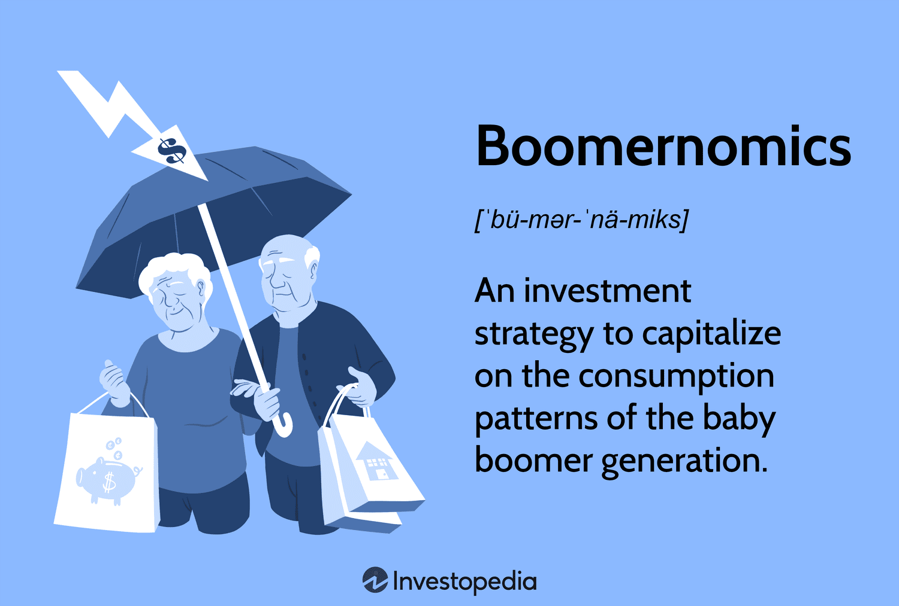

Boomernomics, a term coined to describe the economic influence exerted by the Baby Boomer generation, represents a critical intersection between generational economics and market dynamics. Born between 1946 and 1964, Baby Boomers have left an indelible mark on global economies, given their substantial population size and the subsequent accumulation of wealth. Their consumption patterns, investment behaviors, and pension withdrawals significantly reshape economic and trading landscapes, underscoring the necessity for businesses and investors to consider generational preferences in formulating strategies.

Understanding generational preferences is particularly significant in the context of algorithmic trading. Algorithmic trading employs complex algorithms to execute trading orders at speeds and frequencies unachievable by human traders. By integrating demographic data, such as the financial behavior of Baby Boomers, algorithmic strategies can be tailored to predict and respond to market movements more accurately. For example, as Baby Boomers retire, they tend to shift their portfolios towards less volatile, income-generating assets such as bonds and dividend-paying stocks. Recognizing these transitions allows algorithms to adjust trading strategies that anticipate changes in asset demand and adjust portfolios accordingly.



The economic influence of Baby Boomers extends beyond individual investment decisions, affecting entire sectors and driving economic concepts that focus on consumption-driven growth. Their preferences have long shaped industries such as healthcare, real estate, and leisure, leading to increased investment and innovation in these areas. Businesses that proficiently target the needs and desires of this demographic not only drive their own growth but also stimulate broader economic development.

The influence of Boomernomics extends into long-term investment strategies, where understanding the macroeconomic impact of this generation becomes crucial. As Baby Boomers enter retirement, their consumption patterns change, thereby affecting market demand and supply relationships. This transition necessitates strategic adjustments in investment approaches, focusing on sectors poised for growth due to shifting demographics. As a result, a nuanced comprehension of Boomernomics aids in the formulation of investment strategies that leverage these demographic trends for optimal portfolio performance.

In conclusion, Boomernomics serves as a pivotal concept bridging generational economics and market mechanisms. Recognizing the preferences and economic behaviors of Baby Boomers not only illuminates their profound impact on the economy but also enriches algorithmic trading strategies and investment approaches. As the demographic landscape continues to evolve with upcoming generations, ongoing analysis of generational influences will remain essential in navigating future economic currents.

## Table of Contents

## Understanding Boomernomics

**Understanding Boomernomics**

Boomernomics describes an economic environment heavily shaped by the Baby Boomer generation, those born roughly between 1946 and 1964. This demographic holds a substantial portion of global wealth and their unique consumption habits significantly shape market tendencies. The Baby Boomer generation, having accrued wealth through decades of work and investments, wields considerable economic power. According to a 2020 report by CNBC, Baby Boomers control over half of the U.S. household wealth, making them a formidable economic force.

Consumption patterns of Baby Boomers reflect their priorities and stage in life. Their spending is often focused on healthcare, real estate, leisure, and lifestyle improvements. This focus directly influences market trends. For instance, Baby Boomers are significant consumers in the healthcare sector due to the natural increase in medical needs with aging, driving growth in pharmaceuticals and medical devices. Moreover, their preference for owning property has historically bolstered the real estate market, leading to policies and businesses that cater to homeowners.

Businesses adeptly target the Baby Boomer cohort to maximize economic growth. Companies tailor products and marketing strategies to appeal to this demographic's preferences and lifestyle. For example, the travel industry offers specialized tours and services that cater to Boomers' inclination for comfort and cultural exploration. Similarly, consumer electronics companies design products with user-friendly interfaces, acknowledging this generation's varying degrees of digital fluency.

Moreover, the retail market has evolved to accommodate the Baby Boomers' shift from physical stores to online shopping, accelerated by convenience and the necessity brought on by circumstances like the COVID-19 pandemic. E-commerce platforms have responded with simplified interfaces and targeted advertising, enhancing accessibility and attracting this lucrative age group.

Recognizing the influence wielded by Boomernomics, policymakers and enterprises focus on anticipating emerging needs and trends within this group. Understanding these dynamics ensures that economic strategies remain aligned with the prevailing and robust demand patterns driven by Baby Boomers, thereby sustaining growth and capitalizing on their extensive purchasing power. As such, Boomernomics not only shapes current economic landscapes but also sets the stage for future market evolutions as the preferences of Baby Boomers continue to adapt and influence various sectors.

## Generational Economics and Economic Concepts

Generational economic analysis is pivotal for understanding how different age cohorts shape economic landscapes. The Baby Boomers, Gen X, and Millennials each play distinct roles in influencing economic conditions through their unique consumption patterns, wealth distribution, and investment behaviors.

### Consumption Patterns

Baby Boomers, born between 1946 and 1964, hold a significant portion of global wealth and exhibit distinct consumption habits. Their spending is often directed toward healthcare, travel, and leisure industries, reflecting their stage in the life cycle. Their preference for quality and brand loyalty drives businesses to tailor products and services to meet these demands.

Generation X, born between 1965 and 1980, is typically characterized by financial cautiousness. Having experienced economic downturns in their formative years, this cohort tends to prioritize savings and investments. Unlike Boomers, Gen X often focuses spending on professional services, education for their children, and technological products, showing a balance between risk and reward in their consumption choices.

Millennials, born between 1981 and 1996, are known for their digital savviness and preference for experiences over material goods. Their consumption is heavily influenced by sustainability, technology, and the shared economy. This generation often prioritizes services and products that offer convenience and environmental responsibility, driving industries to innovate on these fronts.

### Wealth Distribution

Wealth distribution varies significantly among these groups. Baby Boomers control a considerable portion of global wealth, often retaining significant assets such as real estate and investments. This concentration of wealth affects market dynamics, particularly in real estate and financial markets.

Generation X holds a substantial, albeit smaller, share of wealth compared to Baby Boomers. This generation is in its peak [earning](/wiki/earning-announcement) years, contributing to retirement accounts and investment portfolios, thus playing a crucial role in financial markets.

Millennials, having faced economic challenges such as student debt and housing affordability, possess less wealth compared to the older generations. Nonetheless, as their earning potential increases, their influence on wealth distribution is expected to grow, particularly as they inherit wealth from Baby Boomers.

### Investment Trends

Investment strategies differ across generations, impacting financial markets and economic trends. Baby Boomers typically favor conservative investment approaches, with a preference for stable assets such as bonds and dividend-yielding stocks, which align with their retirement strategies.

Generation X exhibits a more balanced investment portfolio, diversifying across stocks, bonds, and emerging market opportunities. They focus on long-term growth while preparing for retirement, reflecting their risk-tolerant yet strategic outlook.

Millennials have shown interest in alternative investments such as cryptocurrencies and peer-to-peer lending platforms, driven by technology and innovation. They are more likely to prioritize socially responsible investing, influenced by their values and long-term aspirations.

### Long-term Economic Planning and Policy Making

The generational behavior outlined above plays a critical role in shaping economic policy and planning. Policymakers must consider the aging Baby Boomer population's impact on healthcare systems, pension schemes, and social security. As Boomers retire, their reduced economic activity and increased healthcare needs will require adaptive economic and social policies.

Generation X's dual role as both workforce participants and caretakers for their children and aging parents presents challenges and opportunities for policy interventions in housing, education, and healthcare sectors.

As Millennials continue to enter the workforce in significant numbers, policies aimed at addressing their economic challenges—such as student loan debt relief, affordable housing, and sustainable development—will become increasingly relevant. Their growing participation in the labor market and subsequent investment activities will forge new trends in generational economics.

Understanding these diverse generational impacts is essential for developing responsive economic strategies and ensuring balanced growth and stability across the economic spectrum.

## The Impact of Boomernomics on Investment Strategies

The financial behavior of Baby Boomers plays a significant role in shaping investment markets. Born between 1946 and 1964, this generational cohort holds a considerable portion of the world's wealth and exhibits distinct consumption patterns that majorly influence certain investment sectors.

**Consumption Behavior and Investment Markets**

Baby Boomers are known for their substantial purchasing power and preferences that have evolved over the decades. As they age, their consumption behavior pivots noticeably towards healthcare, travel, and real estate. Healthcare, in particular, becomes a priority due to increased medical needs associated with aging. This shift results in a heightened demand in sectors like pharmaceuticals, biotechnology, and healthcare services, presenting lucrative opportunities for investors.

Similarly, Baby Boomers have a penchant for travel, valuing experiences and leisure especially post-retirement. Consequently, travel and leisure stocks often experience robust performance, with businesses like cruise lines, luxury hotels, and travel tech companies benefiting from this demographic’s spending patterns.

The real estate sector also experiences significant impacts from Boomernomics. Baby Boomers tend to invest in property both as primary residences and as real estate investments, driving demand for housing, particularly in warmer climates and areas considered desirable for retirement communities. Real estate investment trusts (REITs) targeting these regions can be attractive investment vehicles.

**Investment Strategies Based on Boomernomics**

Investors seeking to capitalize on Boomernomics should consider diversification across healthcare, travel, and real estate sectors. In healthcare, investments in companies offering medical devices, diagnostics, and elder care services align with Baby Boomers’ increasing medical expenses. Furthermore, equities in travel-related companies can provide growth prospects given Boomers’ continued spending in this sector.

Real estate offers opportunities in multifaceted investments. Properties in regions with robust healthcare infrastructure and leisure amenities, or those within proximity to popular retirement locales, can be promising. Moreover, REITs focused on senior housing and medical facilities can yield steady returns given the demographic shifts.

**Risks and Rewards**

Investing based on generational trends also carries inherent risks. A significant risk is the potential for unexpected shifts in consumer behavior or regulatory changes impacting healthcare or real estate sectors, which could affect returns. Additionally, macroeconomic factors like inflation or [interest rate](/wiki/interest-rate-trading-strategies) changes might influence Baby Boomers’ spending capacity, thereby affecting associated investment sectors.

Nevertheless, the rewards from investing with an understanding of Boomernomics can be substantial. As Baby Boomers continue to control a significant share of wealth, aligning investment strategies with their preferences allows for capitalizing on stable growth sectors. Additionally, the demographic's predictable spending patterns provide a certain level of reliability compared to younger, less financially stable generations.

In conclusion, Boomernomics significantly affects investment strategies by highlighting sectors poised for growth due to demographic shifts. Investors who understand and anticipate the financial behavior of Baby Boomers can identify and leverage opportunities across key sectors, while also remaining mindful of potential risks inherent in generational investment trends.

## Algorithmic Trading in the Context of Generational Economics

Algorithmic trading has evolved significantly in recent years, utilizing advanced computational techniques to identify and exploit patterns within financial markets. One particularly influential pattern is Boomernomics, which identifies the economic habits and preferences of the Baby Boomer generation. By leveraging the economic behaviors of this demographic, [algorithmic trading](/wiki/algorithmic-trading) strategies can be optimized to predict market movements and tailor investments accordingly.

Boomernomics provides valuable demographic insights that can be integrated into algorithmic trading models. The distinctive consumption patterns and market participation of Baby Boomers create predictable trends that algorithms can exploit. For example, as this generation approaches retirement, their economic behaviors shift towards less risky assets, such as bonds and dividend-paying stocks, and increased expenditure in healthcare and leisure sectors. These predictable shifts can be effectively modeled using algorithmic strategies that [factor](/wiki/factor-investing) in demographic data such as age distribution, disposable income, and consumption habits.

Incorporating demographic data into algorithms involves advanced data science techniques. Algorithms can be trained on historical economic data to identify correlations between demographic changes and market movements. Machine learning models, such as regression analysis and decision trees, are frequently used to analyze how Baby Boomers' financial decisions influence asset prices. Algorithms can be designed to initiate trades when specific conditions, such as a rise in healthcare stock demand corresponding with increased Baby Boomer healthcare spending, are met. 

The technology behind algorithmic trading involves a combination of statistical analysis, [artificial intelligence](/wiki/ai-artificial-intelligence), and high-speed computation. Programs are built to scan large datasets in real time, identifying patterns and making instantaneous decisions with minimal human intervention. Python, commonly used in financial analytics, plays a significant role in this technology stack. For instance, using Python’s Pandas library, historical market data can be processed, while [machine learning](/wiki/machine-learning) frameworks like TensorFlow or scikit-learn can develop models predicting future trends based on demographic data.

```python
import pandas as pd
from sklearn.ensemble import RandomForestRegressor

# Example: Predicting stock price changes based on demographic consumption data
data = pd.read_csv('historical_market_data.csv')
X = data[['baby_boomer_population', 'consumer_spending', 'interest_rates']]
y = data['stock_index']

model = RandomForestRegressor()
model.fit(X, y)

# Predicting future stock index movement
future_data = pd.DataFrame({'baby_boomer_population': [80], 'consumer_spending': [200], 'interest_rates': [2.5]})
predicted_stock_index = model.predict(future_data)
```

Algorithmic trading systems that incorporate generational economic concepts such as Boomernomics can effectively anticipate and respond to shifts in market dynamics caused by demographic changes. Therefore, understanding these significant trends allows market participants to optimize their strategies and achieve profitable outcomes by aligning with the predictable economic trends driven by generations like the Baby Boomers.

## Case Studies and Examples

One notable example of Boomernomics influencing trading strategies can be observed in the healthcare industry. As Baby Boomers age, their demand for healthcare services and products increases, affecting how companies within this sector operate and strategize. Pfizer, a major pharmaceutical company, has successfully targeted this demographic by expanding its product line to include more treatments catering to age-related health conditions such as arthritis, cardiovascular diseases, and diabetes.

Pfizer's approach includes significant investment in research and development to innovate products that meet the growing health needs of the Baby Boomer generation. This strategy not only fosters loyalty among older consumers but also attracts investors interested in capitalizing on the aging population's healthcare demands. Moreover, the company’s decision to market directly to this demographic through targeted advertising and educational programs reflects a nuanced understanding of Boomernomics. 

Investor outcomes based on these strategies have been largely positive. Pfizer’s stock has shown resilience, with consistent growth in revenue derived from drugs targeting prevalent conditions among Baby Boomers. Investors have benefitted from stable returns and the potential for capital appreciation as the demand for such healthcare solutions is anticipated to rise further.

Another example is found in the financial services industry, where organizations like Fidelity Investments have leveraged Boomernomics by focusing on retirement planning and wealth management solutions tailored for Baby Boomers. Fidelity has developed specific financial products aimed at providing long-term security and income, responding to the generation's focus on retirement. By offering personalized retirement accounts and investment advice, Fidelity attracts Baby Boomers seeking to maximize their retirement savings and manage wealth effectively.

This targeted approach by Fidelity has resulted in a significant increase in assets under management, driven by Baby Boomers’ substantial contributions and withdrawals aligned with their retirement timelines. The firm's ability to cater to the specific financial behaviors and needs of this generation ensures a steady revenue stream, enhancing investor confidence and reinforcing brand loyalty.

Beyond individual companies, broader economic trends reflect the impact of Boomernomics. Real estate investment trusts (REITs) specializing in senior housing and retirement communities have thrived, driven by the increasing demand from Baby Boomers seeking age-appropriate living arrangements. Investors in these REITs have seen favorable returns, benefiting from both rental income and property appreciation.

Overall, Boomernomics has been instrumental in shaping trading and investment strategies across various sectors. By understanding and anticipating the preferences and needs of the Baby Boomer generation, companies can effectively position themselves in the market, while investors can achieve substantial gains by aligning with these demographic trends.

## Future Perspectives

As Baby Boomers progressively transition into retirement, the influence of Boomernomics may evolve significantly, impacting both market dynamics and economic policies. The generational shift, with younger cohorts such as Millennials and Generation Z taking a more prominent role, is anticipated to reshape economic priorities and investment landscapes.

Firstly, the market dynamics are likely to shift as Boomers, who currently hold a substantial portion of global wealth, begin to disinvest their assets for retirement funding. This divestment could result in significant volumes of equities being sold, impacting stock market values and [volatility](/wiki/volatility-trading-strategies). The transition of wealth to Gen X and Millennials can also alter consumption patterns, given these groups' different preferences for technology, sustainability, and experiences over material goods. As such, sectors like healthcare, heavily influenced by Boomernomics, may yield some attention to areas catering to the demands of younger generations.

Economic policies may also adapt in response to these demographic changes. For instance, as the focus shifts from issues pertinent to an aging population—such as pensions and healthcare—there may be increased emphasis on education, technology, and sustainable development policies. Governments could be compelled to balance the needs of retirees with those just starting their professional and economic journeys. Fiscal policies might be adjusted to accommodate changing income sources and savings priorities across generations.

The ongoing integration of technology in investment strategies will likely facilitate adaptation to these generational changes. Algorithmic trading systems, currently harnessing demographic data to forecast market movements, will need continuous refinement. These systems can be programmed to adjust portfolios dynamically as new generational patterns emerge, leveraging machine learning techniques for enhanced predictive accuracy. For instance, Python's machine learning libraries such as Scikit-learn or TensorFlow can be utilized to construct models that weigh factors like age demographics, consumption tendencies, and saving behaviors to optimize investment strategies in real time.

```python
from sklearn.linear_model import LinearRegression
import numpy as np

# Assume we have dataset X for features and y for market trends influenced by generational shifts
X = np.array([[2023, 58, 40], [2024, 57, 41], [2025, 56, 42]]).reshape(-1, 3)  # Year, Average Boomer Age, Millennial Age
y = np.array([1.05, 1.03, 1.02])

model = LinearRegression()
model.fit(X, y)

# Predict future market trends influenced by Boomernomics and generational shifts
future_year = np.array([[2026, 55, 43]])
predicted_trend = model.predict(future_year)
print(f"Predicted Market Trend for {future_year[0][0]}: {predicted_trend[0]} growth")
```

The projected demographic transitions necessitate a robust, technology-driven approach for investors to stay competitive, especially in a market environment that is rapidly transforming due to generational change. By understanding these shifts and embracing technological advancements, stakeholders can better anticipate and react to the evolving economic landscape. This foresight will be crucial not only in understanding Boomernomics' impact but also in leveraging new opportunities presented by an emerging generation of market participants.

## Conclusion

Boomernomics, a term that encapsulates the significant economic influence of the Baby Boomer generation, underscores the importance of understanding generational dynamics within the economic landscape. As Baby Boomers have traditionally held a substantial share of wealth and exhibited dominant consumption patterns, they have notably shaped markets, influencing investment strategies that cater specifically to their needs. Recognizing these patterns enables investors to make informed decisions, targeting sectors such as healthcare, real estate, and travel, which align with Boomers' consumption behaviors.

The impact of Boomernomics extends into the realm of algorithmic trading, where demographic data is increasingly integrated into predictive models to better anticipate market shifts. This integration not only aids in exploiting immediate trading opportunities but also facilitates long-term strategic planning aligning with generational trends. The technological sophistication behind these algorithms underscores a critical development in financial markets, enabling precise responses to the evolving preferences of generational cohorts.

As society transitions, understanding the impending shift from Baby Boomers to newer generations like Millennials and Gen Z becomes crucial. This shift will inevitably alter economic policies, consumption patterns, and market dynamics. Therefore, continual observation and analysis of generational trends remain pivotal. Investors and policymakers alike must remain vigilant, adapting strategies to the evolving landscape to remain profitable and relevant.

In conclusion, Boomernomics provides valuable insights into the intersection of generational behavior and economic phenomena. A profound understanding of these dynamics is essential for developing effective investment strategies and ensuring sustainable economic growth. This ongoing analysis of generational trends is not merely beneficial but necessary for navigating the complexities of contemporary economic systems and preparing for future shifts in market influence.

## References & Further Reading

[1]: Bucher-Koenen, T., & Lusardi, A. (2011). ["Financial Literacy and Retirement Planning in Germany."](https://www.nber.org/papers/w17110) National Bureau of Economic Research Working Paper No. 17110.

[2]: Lusardi, A., & Mitchell, O. S. (2014). ["The Economic Importance of Financial Literacy: Theory and Evidence."](https://www.nber.org/papers/w18952) Journal of Economic Literature, 52(1), 5-44.

[3]: Kearney, M. S., & Levine, P. B. (2015). ["Baby Boomers and Their Influence on Financial Markets."](https://www.nber.org/papers/w19795) National Bureau of Economic Research Working Paper No. 22034.

[4]: Cagetti, M., & De Nardi, M. (2008). ["Wealth Inequality: Data and Models."](https://users.nber.org/~denardim/research/Cagetti_De_Nardi_MD_2008.pdf) Macroeconomic Dynamics, 12(Supplement S2), 285-313.

[5]: de Prado, M. L. (2018). ["Advances in Financial Machine Learning"](https://www.amazon.com/Advances-Financial-Machine-Learning-Marcos/dp/1119482089) John Wiley & Sons.

[6]: Aronson, D. R. (2006). ["Evidence-Based Technical Analysis: Applying the Scientific Method and Statistical Inference to Trading Signals"](https://www.amazon.com/Evidence-Based-Technical-Analysis-Scientific-Statistical/dp/0470008741) John Wiley & Sons.

[7]: Jansen, S. (2020). ["Machine Learning for Algorithmic Trading: Predictive models to extract signals from market and alternative data for systematic trading strategies with Python"](https://www.amazon.com/Machine-Learning-Algorithmic-Trading-alternative/dp/1839217715) Packt Publishing.