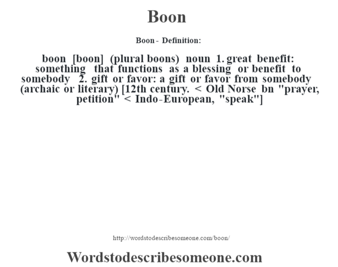

## Table of Contents

## What is the basic definition of a 'boon'?

A boon is something that is very helpful or beneficial. It is like a gift or a blessing that makes life easier or better. People often think of a boon as something they receive that they did not expect, and it brings them joy or relief.

For example, if someone is struggling financially and they suddenly receive a large sum of money, that money would be considered a boon. It helps them solve their problems and improves their situation. Boons can come in many forms, such as good weather for a farmer, a new job opportunity, or even a kind word from a friend when you need it most.

## How does the concept of a boon differ from a gift or a favor?

A boon is different from a gift or a favor because it often feels like it comes from nowhere, like a surprise that helps you a lot. A gift is something someone gives you on purpose, usually because they care about you or want to celebrate something. A favor is when someone does something nice for you because you asked them to, or because they want to help you out. But a boon is more like a lucky break that just happens to you, and it's usually something big that changes things for the better.

For example, if you're walking in the rain and someone gives you an umbrella, that's a gift. If you're moving and a friend helps you carry boxes, that's a favor. But if you're struggling to pay your bills and you win the lottery, that's a boon. It's unexpected and it solves a big problem for you. So, while gifts and favors are nice and helpful, a boon is more like a special kind of luck that makes a big difference in your life.

## Can you provide historical examples of boons in literature or mythology?

In Greek mythology, there's a famous story about a boon given to King Midas. He was granted a wish by the god Dionysus, and he wished that everything he touched would turn to gold. At first, this seemed like a great boon because he could make anything valuable. But soon, it became a problem because he couldn't eat or touch his loved ones without turning them into gold. This story shows how a boon can sometimes bring unexpected troubles.

Another example comes from the Hindu epic, the Mahabharata. The character Bhishma was granted a boon by his father that allowed him to choose the time of his own death. This boon gave him great power and control over his destiny, making him a very important and respected figure in the story. It helped him protect his family and fight in many battles, showing how a boon can be a powerful blessing that changes the course of someone's life for the better.

## What are some common functionalities or uses of boons in modern society?

In modern society, boons often come in the form of unexpected help or good luck that makes life easier. For example, someone might get a surprise bonus at work that helps them pay off debts or buy something they need. This kind of financial help can feel like a boon because it solves a big problem and comes when it's least expected. Another common type of boon is when someone gets a chance to do something they love, like a dream job or a scholarship to study abroad. These opportunities can change someone's life and make them very happy.

Boons can also be things like good weather that helps farmers grow their crops, or a new technology that makes daily life easier. For instance, the invention of the smartphone was a boon for many people because it combined many useful tools into one device. These kinds of boons help society as a whole by making things more efficient and improving the quality of life. Overall, boons in modern times are often about unexpected help or good fortune that brings joy and relief.

## How are boons typically granted or bestowed?

Boons are usually given in ways that feel like good luck or a surprise. They can come from other people, like when someone helps you out without you asking, or they can come from things like winning a contest or getting a surprise at work. Sometimes, boons can even feel like they come from nowhere, like when the weather turns out perfect for a big event you planned. These kinds of boons make you feel grateful and happy because they help you when you need it most.

In stories and myths, boons are often given by gods or magical beings. For example, a god might grant a wish to someone who helped them or did something good. In these stories, the person usually has to do something special or go on a quest to earn the boon. But in real life, boons don't need quests or magic. They just happen, and they make life better in a big way. Whether it's a surprise bonus, a lucky break, or a kind act from a stranger, boons are always a welcome and helpful surprise.

## What are the ethical considerations surrounding the giving and receiving of boons?

When giving boons, it's important to think about why you're doing it. If you're giving a boon just to make yourself look good or to get something in return, that's not really a boon. A true boon comes from a place of wanting to help someone without expecting anything back. It's about being kind and generous. But if you're giving a boon and then telling everyone about it or expecting the person to owe you a favor, that can make the boon less meaningful and even make the person feel uncomfortable.

Receiving a boon also comes with some things to think about. When you get a boon, it's good to be thankful and appreciate the help. But sometimes, people might feel like they owe something in return, even if the person giving the boon didn't mean it that way. It's important to accept boons gracefully and not feel too much pressure to give back right away. At the same time, if a boon feels like it comes with strings attached, it's okay to talk about it and make sure both people are clear about what's expected. Boons should be about helping and making life better, not about creating more problems or expectations.

## Can boons have negative consequences, and if so, what are some examples?

Yes, boons can have negative consequences. Sometimes, what seems like a great gift at first can turn into a problem later. For example, if someone wins a lot of money in the lottery, it might seem like a huge boon. But if they don't know how to manage money, they might spend it all quickly and end up in more debt than before. Or, they might find that friends and family start asking for money, which can cause stress and hurt relationships.

Another example is when someone gets a big promotion at work. It might feel like a boon because it comes with more money and respect. But if the new job is too hard or takes up too much time, it can lead to stress and burnout. The person might end up feeling unhappy and wishing they had never gotten the promotion. So, even though boons are meant to be good things, they can sometimes bring unexpected challenges.

## How do different cultures interpret and value the concept of a boon?

Different cultures have their own ways of thinking about boons. In many Western cultures, a boon is often seen as a lucky break or a surprise that helps someone a lot. People might talk about getting a boon as winning the lottery or getting a surprise bonus at work. These cultures value boons because they can make life easier and bring happiness. But they also know that boons can sometimes come with problems, like if someone wins a lot of money but doesn't know how to handle it.

In Eastern cultures, like in Hinduism and Buddhism, boons are often connected to spiritual ideas. For example, in Hindu stories, gods might give boons to people who do good things or go on special quests. These boons can be things like special powers or the ability to choose when to die. People in these cultures see boons as rewards for living a good life or doing good deeds. They believe that boons can help someone reach their goals or become a better person, but they also know that boons should be used wisely and with respect.

## What role do boons play in economic systems or business transactions?

In economic systems and business transactions, boons can be seen as unexpected benefits that help businesses grow or solve problems. For example, a company might get a big order they didn't expect, which helps them make more money and hire more people. Or, they might find a new way to make their product cheaper, which is a boon because it helps them compete better in the market. These kinds of boons can make a big difference in how well a business does, and they often come at just the right time to help the business keep going or get bigger.

But boons in business can also have downsides. If a company gets a big order but can't handle it, they might end up losing money instead of making more. Or, if they find a cheaper way to make their product but it turns out to be lower quality, they might lose customers. So, while boons in business can be very helpful, it's important for companies to think carefully about how to use them. They need to make sure that what seems like a good thing at first doesn't end up causing more problems later.

## How can the concept of a boon be applied in personal development or self-improvement?

In personal development, a boon can be seen as a lucky break or a helpful surprise that helps someone grow and improve. For example, meeting a mentor who gives great advice can be a boon because it helps you learn and become better at what you do. Or, finding a book that changes the way you think about life can be a boon because it opens up new ideas and helps you see things differently. These kinds of boons can make a big difference in someone's journey of self-improvement by giving them the tools and support they need to reach their goals.

But it's important to use boons wisely in personal development. Just because you get a helpful surprise doesn't mean you should stop working hard or trying to improve on your own. A boon should be seen as a helpful boost, not a reason to stop trying. For example, if you get a great piece of advice from a mentor, you should use it to keep learning and growing, not just rely on it and stop there. By seeing boons as helpful tools that support your efforts, you can make the most of them and keep moving forward in your personal development journey.

## What are some advanced or specialized types of boons in specific fields like technology or law?

In the field of technology, a boon might be a breakthrough in research or a new invention that solves a big problem. For example, if a team of scientists finds a way to make batteries last longer, that's a boon because it helps make things like phones and electric cars work better. These kinds of boons can change the way people live and work by making technology more useful and easier to use. But they can also bring challenges, like if the new technology is hard to make or causes other problems that need to be fixed.

In the field of law, a boon could be a new law or a court decision that helps people in a big way. For example, if a court decides that everyone should have the right to a fair trial, that's a boon because it helps make sure justice is fair for everyone. These kinds of boons can make a big difference in how laws work and how people are treated. But they can also lead to new problems, like if the new law is hard to follow or causes disagreements about what it means.

## How might the concept of boons evolve in the future with societal changes?

As society changes, the way people think about boons might change too. In the future, boons might be more about things like new technology or big ideas that help solve problems for a lot of people. For example, if someone invents a new way to clean the air or make food last longer, that could be seen as a boon because it helps everyone live better. These kinds of boons might come from big groups working together, like scientists or companies, instead of just one person getting lucky. People might start to see boons as something that can help the whole world, not just one person.

But even with these changes, boons might still have some of the same problems they do now. If a new technology or idea is a boon, it might also bring new challenges. For example, if a new way to clean the air is hard to use or costs a lot of money, it might not help everyone right away. People will need to think carefully about how to use these new boons and make sure they help more than they hurt. As society keeps changing, the way people understand and use boons will keep evolving too, always trying to make the most of the good things that come their way.

## What are some examples of Boon functionalities in algorithmic trading?

Algorithmic trading leverages various boon functionalities to optimize trading strategies and outcomes. A prime example is the deployment of algorithmic strategies in high-frequency trading ([HFT](/wiki/high-frequency-trading-strategies)), which capitalizes on market inefficiencies. HFT algorithms automate the trading process, enabling the execution of trades at a speed unmatched by human traders. This high-speed execution is instrumental in gaining advantages in markets where timing is critical.

Boon functionalities further include sophisticated parameters like Volume Weighted Average Price (VWAP) and Time Weighted Average Price (TWAP). These parameters are essential tools for minimizing market impact during large order executions. VWAP, for instance, calculates the average price a security has traded at throughout the day, based on both [volume](/wiki/volume-trading-strategy) and price. By aiming to buy below and sell above this benchmark, traders can achieve cost-efficient executions. The formula for VWAP is:

$$
\text{VWAP} = \frac{\sum (\text{price}_i \times \text{volume}_i)}{\sum \text{volume}_i}
$$

TWAP, on the other hand, focuses on the average price over a specified timeframe, aiding traders in executing orders evenly throughout the day.

Machine learning algorithms enhance algorithmic trading by adapting to market conditions. These algorithms analyze historical data to make predictive analyses and refine trading strategies. For example, a [machine learning](/wiki/machine-learning) model might predict future price movements by identifying patterns in historical price data. Python implementations using libraries such as scikit-learn or TensorFlow facilitate the training of these models:

```python
from sklearn.model_selection import train_test_split
from sklearn.ensemble import RandomForestRegressor
import pandas as pd

# Sample code to illustrate model training
data = pd.read_csv('historical_price_data.csv')
X = data[['feature1', 'feature2', 'feature3']]
y = data['price']

X_train, X_test, y_train, y_test = train_test_split(X, y, test_size=0.2, random_state=42)

model = RandomForestRegressor()
model.fit(X_train, y_train)

# Predicting future prices
predicted_prices = model.predict(X_test)
```

Natural Language Processing (NLP) tools are invaluable in analyzing news and market sentiment, enriching the decision-making process with real-time external indicators. For instance, NLP algorithms can parse text data from news articles to gauge market sentiment, thus providing traders with insights that enhance their trading strategies. Libraries such as NLTK or spaCy can be employed in Python for these purposes. For example:

```python
import spacy
from textblob import TextBlob

nlp = spacy.load("en_core_web_sm")
text = "The market is experiencing unprecedented volatility due to unexpected economic data."

# NLP processing
doc = nlp(text)
sentiment = TextBlob(text).sentiment

print(f"Sentiment: {sentiment.polarity}, Subjectivity: {sentiment.subjectivity}")
```

These examples underscore the significance of integrating boon functionalities in algorithmic trading. By utilizing advanced automation and data-driven approaches, traders can refine their strategies and decision-making processes, ultimately leading to increased efficiencies and profitability.

## References & Further Reading

[1]: Bergstra, J., Bardenet, R., Bengio, Y., & Kégl, B. (2011). ["Algorithms for Hyper-Parameter Optimization."](https://dl.acm.org/doi/10.5555/2986459.2986743) Advances in Neural Information Processing Systems 24.

[2]: ["Advances in Financial Machine Learning"](https://www.amazon.com/Advances-Financial-Machine-Learning-Marcos/dp/1119482089) by Marcos Lopez de Prado

[3]: ["Evidence-Based Technical Analysis: Applying the Scientific Method and Statistical Inference to Trading Signals"](https://www.amazon.com/Evidence-Based-Technical-Analysis-Scientific-Statistical/dp/0470008741) by David Aronson

[4]: ["Machine Learning for Algorithmic Trading"](https://github.com/stefan-jansen/machine-learning-for-trading) by Stefan Jansen

[5]: ["Quantitative Trading: How to Build Your Own Algorithmic Trading Business"](https://www.amazon.com/Quantitative-Trading-Build-Algorithmic-Business/dp/1119800064) by Ernest P. Chan