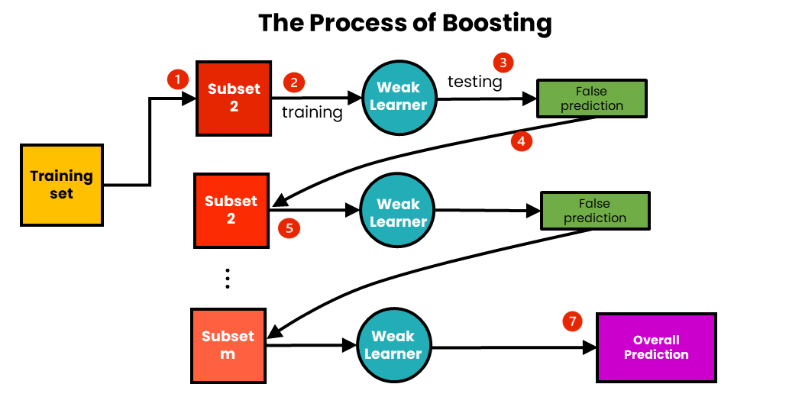

## Table of Contents

## What is boosting in machine learning?

Boosting in machine learning is a method that combines multiple weak learners, which are simple models that perform slightly better than random guessing, to create a strong learner that can make accurate predictions. The idea behind boosting is to focus on the examples that the model gets wrong and try to improve the model's performance on those specific examples. By doing this repeatedly, the model gradually improves its overall accuracy.

The process of boosting typically involves training a series of models sequentially. Each new model in the sequence focuses on the errors made by the previous models. For example, if the first model misclassifies certain data points, the second model will be trained to pay more attention to those misclassified points. This continues until the combined model achieves a high level of accuracy. Popular boosting algorithms include AdaBoost, Gradient Boosting, and XGBoost, which are widely used in various applications such as classification and regression tasks.

## How does boosting differ from bagging?

Boosting and bagging are both ways to make machine learning models better, but they do it differently. Boosting works by training many simple models one after the other. Each new model tries to fix the mistakes of the earlier ones. It's like if you're learning to throw a ball and you keep practicing the throws you miss. Over time, you get better at throwing because you focus on your weak spots.

Bagging, on the other hand, is like asking a bunch of friends to help you with a task. You train many models at the same time, but each one gets a different set of the data to learn from. This is done by taking random samples with replacement from your data, which is called bootstrapping. Then, when you need to make a prediction, you ask all your models and take a vote or an average of their answers. This helps because the errors of one model might be canceled out by the others.

So, boosting focuses on improving the model step by step by correcting errors, while bagging uses the power of many models working together, each trained on different parts of the data. Both methods help make predictions more accurate, but they go about it in different ways.

## What are the basic principles behind boosting algorithms?

Boosting algorithms work by combining many weak models to make one strong model. A weak model is one that's just a little better than guessing. The idea is to train these weak models one after another, with each new model trying to fix the mistakes of the last one. So, if the first model gets some examples wrong, the next model will focus more on those examples. This process keeps going, and each model adds a bit more to the final result, making the overall prediction better and better.

The key to boosting is that it pays attention to the errors. Instead of treating all examples the same, boosting gives more importance to the examples that the model keeps getting wrong. By doing this, the algorithm slowly but surely improves its performance. Popular boosting methods like AdaBoost, Gradient Boosting, and XGBoost all follow this principle but use different ways to adjust the focus on errors and combine the weak models into a strong one.

## Can you explain the concept of weak learners in the context of boosting?

In boosting, weak learners are simple models that aren't very good on their own. They're called weak because they only do a little better than guessing randomly. But, in boosting, we use lots of these weak learners together to make a strong model. It's like having a team of players who aren't the best individually, but when they work together, they can win the game.

The way boosting works is by training these weak learners one at a time. Each new weak learner tries to fix the mistakes made by the previous ones. So, if the first weak learner gets some examples wrong, the next one will focus more on those examples. By doing this over and over, the weak learners team up to make better and better predictions. It's like building a strong tower out of many small, weak bricks.

## What is the most common boosting algorithm and how does it work?

The most common boosting algorithm is AdaBoost, short for Adaptive Boosting. AdaBoost works by training a bunch of simple models, called weak learners, one after the other. Each weak learner is a bit better than guessing, but not very good on its own. The trick is that each new weak learner focuses on the examples that the previous ones got wrong. So, if the first model makes mistakes on certain examples, the next model will pay more attention to those examples. This way, the algorithm keeps getting better at figuring out the hard cases.

Here's how it goes: AdaBoost starts by giving equal importance to all examples. After the first weak learner is trained, the algorithm looks at which examples were misclassified and increases their importance. The next weak learner then focuses more on these harder examples. This process repeats, with each new weak learner trying to correct the mistakes of the previous ones. In the end, all the weak learners are combined, with more accurate ones having a bigger say in the final prediction. This teamwork makes AdaBoost a strong model that can handle complex problems well.

## How does AdaBoost implement the boosting technique?

AdaBoost, or Adaptive Boosting, uses a bunch of simple models called weak learners to make a strong model. Each weak learner is not very good on its own, but they work together to get better results. The way AdaBoost does this is by training these weak learners one after another. When the first weak learner is trained, it tries to guess the right answers. But it will make some mistakes. AdaBoost then looks at these mistakes and tells the next weak learner to focus more on the examples that were guessed wrong.

As AdaBoost keeps training more weak learners, each one tries harder to get the hard examples right. The algorithm does this by giving more importance to the examples that were misclassified before. So, if an example keeps being guessed wrong, it gets more attention from the next weak learners. In the end, all the weak learners are combined into one strong model. The ones that did a better job at guessing get a bigger say in the final decision. This teamwork makes AdaBoost good at figuring out tough problems.

## What are the steps involved in the Gradient Boosting algorithm?

Gradient Boosting works by building a model step by step, using a series of weak learners. Each weak learner is a simple model that's not very good on its own but helps to improve the overall model. The process starts with an initial guess, which is usually just the average of the target values. Then, the first weak learner is trained to correct the errors of this initial guess. After that, the algorithm looks at the mistakes made by the first weak learner and trains the next weak learner to focus on those mistakes. This continues, with each new weak learner trying to fix the errors of the combined model so far.

As the algorithm keeps adding weak learners, it uses a technique called gradient descent to figure out how each new weak learner should adjust the model. Gradient descent helps the algorithm to find the best way to reduce the errors. Each weak learner is added to the model in a way that minimizes the remaining errors. The final model is a combination of all these weak learners, where each one contributes a bit to making the predictions more accurate. By doing this step by step, Gradient Boosting can create a strong model that's good at making predictions.

## How can boosting algorithms be used to reduce bias and variance in models?

Boosting algorithms help reduce bias and variance in models by combining many simple models into one strong model. When a model has high bias, it means it's too simple and can't capture the patterns in the data well. Boosting fixes this by training many simple models one after another, with each new model focusing on the mistakes of the previous ones. By doing this, the overall model gets better at capturing the patterns in the data, reducing bias. It's like if you're learning to throw a ball and keep practicing the throws you miss; over time, you get better because you focus on your weak spots.

Boosting also helps reduce variance, which happens when a model is too sensitive to small changes in the data. By combining many models, boosting averages out their predictions, making the final model more stable. Each simple model might be a bit off, but when you combine them, their errors tend to cancel each other out. It's like asking a bunch of friends to help you guess something; even if some guesses are wrong, the average of all guesses is likely to be more accurate. This way, boosting makes the model less sensitive to random changes in the data, reducing variance and making predictions more reliable.

## What are some practical applications of boosting in different industries?

Boosting is used a lot in healthcare to help doctors make better decisions. For example, it can help predict if a patient might get a certain disease or how they might respond to a treatment. By using lots of simple models together, boosting can look at many different pieces of information about a patient, like their age, weight, and test results, to make a more accurate prediction. This can help doctors give better care and maybe even save lives.

In the world of finance, boosting is used to spot fraud and manage risk. Banks and credit card companies use it to look at lots of data, like how people spend money or their credit history, to find out if something looks fishy. Boosting helps them make better guesses about who might be trying to cheat the system or who might not be able to pay back a loan. This makes things safer for everyone and helps companies make smarter decisions about money.

Boosting is also popular in online shopping and advertising. Companies use it to guess what people might want to buy or which ads they might click on. By looking at what people have bought before or what they've looked at online, boosting helps make better suggestions and show more interesting ads. This makes shopping easier for customers and helps businesses sell more stuff.

## How do you handle overfitting when using boosting methods?

Overfitting happens when a model learns the training data too well and can't handle new data. In boosting, this can be a problem because the algorithm keeps trying to fix mistakes by adding more and more models. To stop overfitting, you can use a few tricks. One way is to use a technique called early stopping. This means you keep an eye on how well the model is doing on some data it hasn't seen before, called validation data. If the model starts doing worse on this validation data, you stop adding new models. This helps because it keeps the model from getting too complicated and overfitting.

Another way to handle overfitting in boosting is to control how much each new model can change the overall model. This is called learning rate or shrinkage. By making the learning rate smaller, each new model has less impact, which helps keep the overall model from overfitting. You can also limit the size of each weak learner, like by making decision trees smaller. Smaller trees are simpler and less likely to overfit. By using these methods, you can make sure your boosting model works well on new data, not just the data it was trained on.

## What are the key hyperparameters to tune in boosting algorithms?

When you're using boosting algorithms, there are a few important settings you can change to make your model work better. These settings are called hyperparameters. One important hyperparameter is the number of weak learners, or the number of models you're using. If you use too few, your model might not be good enough, but if you use too many, it might start to overfit and do worse on new data. Another key setting is the learning rate, which controls how much each new weak learner can change the overall model. A smaller learning rate makes the model learn more slowly and can help prevent overfitting, but it might take longer to train.

You can also tweak the size of each weak learner. For example, if you're using decision trees as weak learners, you can change how deep they can go or how many leaves they can have. Smaller trees are simpler and less likely to overfit, but they might not capture all the patterns in the data. On the other hand, bigger trees can capture more patterns but might start to overfit. Another setting to think about is the type of weak learner you're using. Different types, like decision trees or linear models, can affect how well your boosting model works. By playing around with these hyperparameters, you can find the best settings for your boosting model to make it work well on your data.

## How can one implement a custom boosting algorithm from scratch?

To make your own boosting algorithm from scratch, you start with simple models called weak learners. These weak learners are not very good on their own, but they can help if you use a lot of them together. You begin by training the first weak learner on your data. After that, you look at which examples it got wrong and make those examples more important. Then, you train the next weak learner, but this time it pays more attention to the examples that were hard for the first one. You keep doing this, training more weak learners and making them focus on the mistakes of the ones before. Each new weak learner tries to fix the errors of the whole model so far. In the end, you combine all the weak learners into one big model. The ones that did a better job get a bigger say in the final prediction.

One way to make this work is by using a method called AdaBoost. In AdaBoost, you start by giving all examples the same importance. After the first weak learner is trained, you increase the importance of the examples it got wrong. The next weak learner then focuses more on these harder examples. You keep doing this, adjusting the importance of examples and adding new weak learners. Each weak learner's guess is added to the final model, and the ones that did better get more weight. By the end, you have a strong model that's good at handling the tricky examples. This is how you can build your own boosting algorithm from scratch, making it better step by step by focusing on the mistakes.

## What is Boosting in Algo Trading and How Does it Work?

Boosting is an ensemble learning algorithm that enhances the predictive power of [machine learning](/wiki/machine-learning) models. This technique is particularly beneficial in [algorithmic trading](/wiki/algorithmic-trading) as it helps refine predictions, thereby generating more precise trading signals. At its core, boosting involves the combination of multiple weak models, each contributing to the final decision-making process, resulting in a robust model capable of navigating complex financial markets.

In boosting, each weak model attempts to correct the errors of its predecessors. The process begins with the creation of a simple model, or 'weak learner,' which might not perform well individually. Subsequent models are then added to focus on incorrectly predicted samples by the preceding models. By iteratively adjusting for errors, boosting enhances the overall accuracy of the model ensemble. Mathematically, boosting can be expressed as:

$$
F(x) = \sum_{m=1}^{M} \alpha_m h_m(x)
$$

where $F(x)$ represents the boosted model, $\alpha_m$ is the weight associated with the $m$-th weak learner, and $h_m(x)$ represents the prediction of the $m$-th weak learner. The weights $\alpha_m$ are adjusted based on the performance of the associated weak learner during training.

In the context of trading, boosting contributes to improved decision-making by accurately modeling complex patterns within historical price data, trading [volume](/wiki/volume-trading-strategy), and market sentiment. These inputs are critical in developing trading strategies that can adapt to the dynamic nature of financial markets. By effectively integrating and analyzing diverse data sources, boosting models help traders identify and seize lucrative trading opportunities while minimizing the risks associated with false predictions. This capability is essential for sustaining profitability and managing risks in a competitive trading environment.

## References & Further Reading

[1]: Bergstra, J., Bardenet, R., Bengio, Y., & Kégl, B. (2011). ["Algorithms for Hyper-Parameter Optimization."](https://dl.acm.org/doi/10.5555/2986459.2986743) Advances in Neural Information Processing Systems 24.

[2]: ["Advances in Financial Machine Learning"](https://www.amazon.com/Advances-Financial-Machine-Learning-Marcos/dp/1119482089) by Marcos Lopez de Prado

[3]: ["Evidence-Based Technical Analysis: Applying the Scientific Method and Statistical Inference to Trading Signals"](https://www.amazon.com/Evidence-Based-Technical-Analysis-Scientific-Statistical/dp/0470008741) by David Aronson

[4]: ["Machine Learning for Algorithmic Trading"](https://github.com/stefan-jansen/machine-learning-for-trading) by Stefan Jansen

[5]: ["Quantitative Trading: How to Build Your Own Algorithmic Trading Business"](https://books.google.com/books/about/Quantitative_Trading.html?id=j70yEAAAQBAJ) by Ernest P. Chan