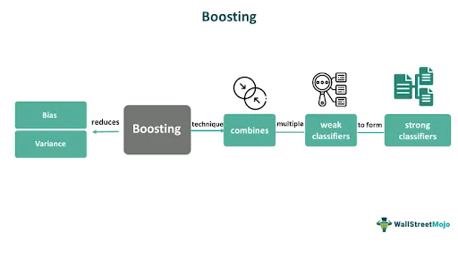

Algorithmic trading, or algo trading, refers to the use of computer programs to automatically execute buy and sell orders in financial markets based on pre-defined strategies. This approach leverages algorithms to make trading decisions at speeds and frequencies that human traders cannot achieve, thereby optimizing the trading process and potentially improving the returns on investment. A critical component of effective algorithmic trading strategies is the utilization of sophisticated data analysis and prediction techniques. Among these, boosting—a powerful ensemble learning technique in machine learning—plays a pivotal role in enhancing the prediction accuracy and overall performance of algorithmic trading systems.

Boosting improves the predictive performance of machine learning models by combining multiple poor-performing models, termed 'weak learners,' into a single, stronger one. The method focuses on creating a series of these weak models, where each subsequent model attempts to correct the errors of the previous ones. This iterative refinement process results in improved accuracy and robustness in the model's predictions, which is crucial for generating reliable trading signals.



In the context of algorithmic trading, boosting can significantly enhance a model's ability to accurately predict market trends and movements, allowing for better timing in trade execution. The precision obtained through boosting methodologies not only aids in maximizing profits but also in minimizing risks through improved decision-making capabilities.

This article explores how boosting integrates into algorithmic trading strategies, its numerous advantages, and key methodologies applied. By understanding the role of boosting, traders and investors can harness its potential to gain a competitive edge in fast-paced and ever-evolving financial markets.

## Table of Contents

## Understanding Boosting in Algo Trading

Boosting is an ensemble learning algorithm that enhances the predictive power of [machine learning](/wiki/machine-learning) models. This technique is particularly beneficial in [algorithmic trading](/wiki/algorithmic-trading) as it helps refine predictions, thereby generating more precise trading signals. At its core, boosting involves the combination of multiple weak models, each contributing to the final decision-making process, resulting in a robust model capable of navigating complex financial markets.

In boosting, each weak model attempts to correct the errors of its predecessors. The process begins with the creation of a simple model, or 'weak learner,' which might not perform well individually. Subsequent models are then added to focus on incorrectly predicted samples by the preceding models. By iteratively adjusting for errors, boosting enhances the overall accuracy of the model ensemble. Mathematically, boosting can be expressed as:

$$
F(x) = \sum_{m=1}^{M} \alpha_m h_m(x)
$$

where $F(x)$ represents the boosted model, $\alpha_m$ is the weight associated with the $m$-th weak learner, and $h_m(x)$ represents the prediction of the $m$-th weak learner. The weights $\alpha_m$ are adjusted based on the performance of the associated weak learner during training.

In the context of trading, boosting contributes to improved decision-making by accurately modeling complex patterns within historical price data, trading [volume](/wiki/volume-trading-strategy), and market sentiment. These inputs are critical in developing trading strategies that can adapt to the dynamic nature of financial markets. By effectively integrating and analyzing diverse data sources, boosting models help traders identify and seize lucrative trading opportunities while minimizing the risks associated with false predictions. This capability is essential for sustaining profitability and managing risks in a competitive trading environment.

## Key Boosting Algorithms in Trading

Algorithmic trading has significantly evolved with the integration of machine learning techniques, particularly boosting algorithms. These algorithms enhance the predictive power and robustness of trading models by combining multiple weak learners to form a superior predictive model. Among the most prominent boosting algorithms employed in trading are AdaBoost, Gradient Boosting, XGBoost, CatBoost, and LightGBM. Each of these algorithms possesses distinct features that make them suitable for various data types and trading environments.

AdaBoost, short for Adaptive Boosting, was one of the first successful boosting algorithms developed to improve the accuracy of binary classification models. It operates by iteratively adjusting the weights of incorrectly classified instances, allowing the next model to focus more on difficult cases. Although not the most efficient for large datasets, it sets a foundational understanding of boosting methods.

Gradient Boosting extends the concept of AdaBoost by optimizing an arbitrary differentiable loss function, allowing for greater flexibility and accuracy. Its iterative method constructs learners in a stage-wise fashion, minimizing the loss function by identifying the gradient that hill-climbs efficiently. This methodology is particularly advantageous in scenarios where prediction accuracy is paramount, such as in predicting financial time-series data. However, it can be computationally expensive, making it less suitable for real-time trading applications.

XGBoost, or Extreme Gradient Boosting, has gained widespread recognition for its performance and speed. It builds upon gradient boosting by incorporating regularization terms to reduce model overfitting, a common problem in complex datasets. XGBoost implements a more efficient handling of sparse data and supports parallel and distributed computing, making it exceptionally suited for large-scale trading environments. The algorithm’s innovation lies in its use of second-order derivative information, which enhances its accuracy and robustness.

LightGBM, developed by Microsoft, optimizes training speed and memory usage, distinguishing itself in processing large volumes of data with high dimensions. Unlike traditional gradient boosting that uses pre-sorted data, LightGBM employs a histogram-based method, reducing computational complexity and time. This efficiency, coupled with its capacity to handle categorical features directly, makes it a preferred choice in high-frequency trading scenarios where rapid data processing is crucial.

CatBoost, an algorithm tailored for categorical features handling, addresses overfitting and complexity in datasets with numerous categorical variables. Developed by Yandex, it automates the handling of categorical data by using an ordered boosting process and minimal variance sampling. CatBoost maintains prediction accuracy while requiring minimal data preprocessing, providing an edge in trading environments with mixed data types.

In summary, the selection of a boosting algorithm in algorithmic trading hinges on the specific requirements of the trading system, such as speed, data complexity, and the need for real-time analysis. XGBoost, LightGBM, and CatBoost have attracted considerable attention for their scalability and efficiency in handling extensive datasets typical in trading scenarios. Their adaptability to various data types and robustness against overfitting make them invaluable tools for traders aiming to optimize their strategies and gain a competitive advantage in dynamic financial markets.

## Implementing Boosting Models for Trading Strategies

Implementing boosting models as part of trading strategies necessitates meticulous data preparation to ensure optimal model performance. Accurate signal generation hinges on the integration of diverse and robust datasets, which may include features such as historical prices, volume data, and sentiment analysis. Each of these components provides crucial insights:

1. **Historical Prices**: These form the backbone of most quantitative trading strategies. By utilizing past price changes, boosting models can identify patterns and trends, which assist in forecasting future price movements. Historical data allows for the development of features such as moving averages, momentum indicators, and price oscillators, aiding in model training.

2. **Volume Data**: This information offers valuable insights into market activity. High trading volumes can indicate significant price movements or confirm trends suggested by historical prices. By integrating volume data, boosting models can better gauge the strength of a given price trend or understand potential market manipulations.

3. **Sentiment Analysis**: This involves evaluating textual data from news articles, social media, or financial reports to gauge investor sentiment. By converting qualitative sentiment into quantitative data, boosting models can capture the market’s psychological aspects, thereby refining predictions of market movements. Natural language processing (NLP) techniques might be employed to extract sentiment scores from textual data, adding another layer of information to the model.

Once these features are extracted and integrated, [backtesting](/wiki/backtesting) becomes a crucial step in validating and refining any trading strategies powered by boosting algorithms. Backtesting involves simulating a trading strategy using historical data to evaluate its performance. It allows traders to:

- Assess the effectiveness and accuracy of the boosting model in various market conditions.
- Identify potential overfitting, ensuring that the model generalizes well to unseen data.
- Adjust parameters and features to optimize strategy performance.

A simple Python implementation for backtesting might employ libraries such as `[backtrader](/wiki/backtrader)` or `pandas` to structure test environments. The code snippet below outlines a basic setup for evaluating a trading strategy:

```python
import backtrader as bt

class BoostingStrategy(bt.Strategy):
    def __init__(self):
        self.model = trained_boosting_model  # Assume this model is pre-trained

    def next(self):
        # Extract current data for model prediction
        data = extract_current_data()

        # Generate a signal based on the model's prediction
        signal = self.model.predict(data)

        if signal == 'buy':
            self.buy()
        elif signal == 'sell':
            self.sell()

cerebro = bt.Cerebro()
cerebro.addstrategy(BoostingStrategy)
cerebro.run()
cerebro.plot()
```

This basic framework can be expanded with more complex logic and additional predictors for precise signal generation. Additionally, regular updates to data sets and model retraining are recommended to ensure the trading strategy remains relevant to current market conditions.

## Advantages of Boosting in Algorithmic Trading

Boosting algorithms significantly enhance prediction accuracy, which is paramount for making informed trading decisions. By systematically improving the predictions of a series of weak models—such as simple decision trees—boosting algorithms amalgamate their outputs into a single robust model. This process results in a composite model with better accuracy than any single model alone. The mathematical foundation is the iterative correction of prediction errors by placing more weight on previously misclassified data points. Therefore, models like AdaBoost and Gradient Boosting fit these corrected errors iteratively, attaining high precision in prediction tasks.

One of the substantial advantages of boosting is its capacity to adapt to new data, enabling continuous learning and adaptability. Financial markets are inherently dynamic, characterized by rapidly changing conditions and intricate nonlinear relationships. Unlike some traditional models which may struggle to capture these complexities, boosting algorithms excel in recognizing and exploiting such nonlinear patterns, thereby providing flexibility and robustness in diverse market environments. This characteristic enables traders to react appropriately to sudden market shifts, optimizing entry and [exit](/wiki/exit-strategy) points based on real-time data interpretations.

Additionally, boosting algorithms are instrumental in reducing false signals, which are prevalent issues in trading. False signals can lead to suboptimal decisions, resulting in financial losses. By enhancing the accuracy and reliability of predictive models, boosting minimizes these errors, promoting more precise trading signals. This improvement in signal quality contributes significantly to effective risk management by enabling traders to distinguish between genuine trading opportunities and noise.

Furthermore, boosting contributes to optimizing trading performance by improving decision-making processes involved in strategy formulation and execution. The nature of these algorithms to combine and enhance multiple weak models translates into more nuanced insights, offering a competitive edge. Consequently, traders leveraging boosting techniques can fine-tune their strategies to maximize returns while minimizing risks.

In summary, boosting algorithms are formidable tools in algorithmic trading, attributed to their superior accuracy, adaptability to new data, and proficiency in reducing false signals. These strengths not only refine risk management processes but also enhance overall trading performance, situating boosting as a crucial component in modern financial strategies.

## Challenges and Considerations

When implementing complex boosting models within algorithmic trading, certain challenges and considerations must be addressed to ensure their effectiveness and reliability. One significant challenge is the risk of overfitting. Overfitting occurs when a model learns the training data too well, capturing noise instead of discerning the underlying pattern. This results in poor generalization to unseen data, which can be detrimental in trading environments where market conditions vary. To mitigate this, practitioners need to engage in careful tuning of model parameters and employ robust validation techniques. Techniques like cross-validation and regularization can be particularly effective in identifying and reducing overfitting.

Furthermore, boosting models, especially those operating with large datasets, require substantial computational resources. The iterative nature of boosting, which involves training multiple base learners, can lead to increased computational load. Optimizing these processes by selecting efficient algorithms, such as XGBoost or LightGBM, alongside hardware acceleration options like GPU processing, can alleviate these demands and enhance performance.

Another critical consideration is staying abreast of technological advancements and regulatory changes. The rapid evolution of machine learning and AI technologies means that boosting techniques frequently improve, offering new capabilities and efficiencies. Keeping informed about these developments enables traders to maintain their competitive edge. Additionally, the regulatory landscape governing trading continuously evolves, with new compliance norms impacting how algorithms can be deployed. Understanding and adhering to these regulations is essential to avoid potential legal issues and ensure sustainable trading operations. 

In summary, navigating the challenges associated with boosting in trading involves balancing model complexity to prevent overfitting, efficiently managing computational resources, and remaining informed of technological and regulatory evolutions. These considerations are pivotal in harnessing the full potential of boosting algorithms within the dynamic environment of financial markets.

## Future Trends in Boosting and Algo Trading

The future of boosting in algorithmic trading is poised for transformative changes driven by the integration of cutting-edge technologies. One of the primary advancements is the deepening incorporation of [artificial intelligence](/wiki/ai-artificial-intelligence) (AI) and machine learning (ML) techniques, where boosting is anticipated to play an increasingly significant role. AI and ML are set to revolutionize trading by enabling systems to process vast amounts of data efficiently, refine predictive models, and generate more accurate trading signals. Boosting algorithms, known for their ensemble approach to enhancing model accuracy, naturally complement these advancements by improving decision-making processes in dynamic and complex financial environments.

A notable trend on the horizon is the potential influence of quantum computing. Although still in nascent stages, quantum computing promises to exponentially increase computational power, which can significantly impact how boosting algorithms are executed. Quantum computers can handle vast datasets and complex computations at speeds unattainable by classical computers, which could lead to more sophisticated and efficient boosting models. This advancement could reshape how traders and investors approach quantitative analysis and model optimization, allowing them to explore larger data spaces and generate insights that were previously impractical.

Furthermore, as market conditions continuously evolve, so too will the innovation in boosting techniques. The financial markets are characterized by their [volatility](/wiki/volatility-trading-strategies) and diversity, necessitating models that can adapt swiftly to changing conditions. The dynamic nature of these markets will likely inspire new methodologies in boosting, incorporating elements of online learning where models are updated in real-time as new data becomes available. This adaptability will be crucial in maintaining and gaining competitive advantages in increasingly fast-paced markets.

In summary, the convergence of AI, quantum computing, and evolving market dynamics heralds a future in which boosting will play a central role in algorithmic trading. These developments will drive the creation of more intelligent, responsive, and efficient trading systems, contributing to the ongoing transformation of the financial landscape.

## Conclusion

Boosting represents a significant advancement in algorithmic trading by enhancing precision and adaptability in model predictions. This increased accuracy translates into more reliable and insightful trading strategies, thus offering a substantial edge to traders and investors. By integrating boosting into their algorithmic models, market participants can achieve a deeper understanding of market dynamics and improve their decision-making processes. Boosting's capability to handle complex, nonlinear patterns in data is particularly beneficial in the unpredictable financial markets, allowing for superior signal generation and risk management.

The potential for boosting in algorithmic trading continues to expand as ongoing research and development unlock new methodologies and applications. Emerging technologies, such as quantum computing, promise to further augment the efficiency and capability of boosting methods, potentially transforming their role in financial markets. As these technologies mature, traders equipped with advanced boosting strategies will likely capture new opportunities and mitigate unforeseen risks more effectively. Consequently, boosting remains a crucial tool for those seeking to maintain a competitive advantage in the ever-evolving landscape of financial trading.

## References & Further Reading

[1]: Bergstra, J., Bardenet, R., Bengio, Y., & Kégl, B. (2011). ["Algorithms for Hyper-Parameter Optimization."](https://dl.acm.org/doi/10.5555/2986459.2986743) Advances in Neural Information Processing Systems 24.

[2]: ["Advances in Financial Machine Learning"](https://www.amazon.com/Advances-Financial-Machine-Learning-Marcos/dp/1119482089) by Marcos Lopez de Prado

[3]: ["Evidence-Based Technical Analysis: Applying the Scientific Method and Statistical Inference to Trading Signals"](https://www.amazon.com/Evidence-Based-Technical-Analysis-Scientific-Statistical/dp/0470008741) by David Aronson

[4]: ["Machine Learning for Algorithmic Trading"](https://github.com/stefan-jansen/machine-learning-for-trading) by Stefan Jansen

[5]: ["Quantitative Trading: How to Build Your Own Algorithmic Trading Business"](https://books.google.com/books/about/Quantitative_Trading.html?id=j70yEAAAQBAJ) by Ernest P. Chan