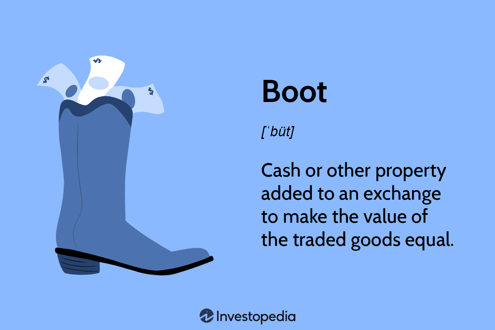

In the world of finance and accounting, understanding complex concepts and terminology is vital to navigating investments and taxation. The term "boot" presents itself uniquely in different contexts, such as accounting, taxation, and trading. As professionals in the financial sector, it is crucial to grasp the various implications of this term across diversified aspects of investment and trading strategies. 

In accounting, "boot" refers to the cash or other property added to an exchange to equate the value of assets being traded. This concept is significant in nonmonetary exchanges, where entities swap goods or services of unequal value. Boot serves to balance these transactions by supplementing the primary asset swap with additional monetary consideration or property. Such exchanges are often subject to generally accepted accounting principles (GAAP), which guide the fair presentation and recognition of these transactions.



In taxation, "boot" has important implications when examining compliance with tax regulations, especially during like-kind exchanges under the Internal Revenue Service (IRS) Section 1031. Here, the presence of boot triggers recognized gains, making them taxable. Consequently, investors need to strategize effectively to minimize boot, allowing deferment of capital gains taxes, which can be advantageous when optimizing tax liabilities within complex financial dealings.

Moreover, understanding boot is essential in the arena of algorithmic trading. These automated systems rely on precise calculations to generate returns, and incorporating proper boot valuation ensures trading portfolios maintain their intended value. Aligning these elements accurately strengthens decision-making efficacy when trading is executed via algorithms, ultimately contributing to a robust financial strategy.

This article explores the various meanings and applications of "boot", with a focus on its implications in accounting and its role in algorithmic trading, equipping financial professionals with the knowledge needed for informed and strategic financial decision-making.

## Table of Contents

## Understanding Boot in Accounting

Boot, in accounting, signifies the incorporation of additional cash or other assets in a trade to equalize the value of the exchanged goods. This concept becomes crucial in nonmonetary transactions, which involve the exchange of goods or services instead of cash. According to Generally Accepted Accounting Principles (GAAP), boot must not exceed 25% of the total fair value of the transaction to qualify as a nonmonetary exchange. This specification ensures that the essence of the transaction remains primarily nonmonetary and not transformed into a sale or purchase.

The role of boot becomes evident when considering tax implications. In a 1031 exchange, a common real estate transaction scenario, the inclusion of boot can influence tax liabilities. Section 1031 of the IRS Code allows property owners to defer capital gains taxes by exchanging property of like kind, often used in real estate investments. However, when boot is involved, it can constitute a portion of the trade that is taxable. By strategically structuring a transaction to minimize boot, parties can potentially defer significant tax obligations. The tax deferral benefits hinge on maintaining boot's minimal impact, ensuring the transaction predominantly qualifies for non-taxable exchange treatment under Section 1031.

To illustrate boot utilization in accounting, consider the exchange of two pieces of real estate. If the fair value of Property A is $500,000 and Property B, owned by another party, is valued at $450,000, a boot of $50,000 might be included by the owner of Property B to equalize the exchange. Here, this additional $50,000 represents boot, ensuring both parties perceive an equal trade value. Despite the inclusion of boot, as long as it remains under 25% of the total fair value, the exchange can be classified as nonmonetary per GAAP guidelines. Additionally, this scenario allows the parties to potentially defer capital gains taxes by leveraging the features of a 1031 exchange. Thus, boot can become a valuable tool in managing both the accounting and tax dimension of exchange transactions.

## The Taxation Aspect of Boot

Boot in taxation is a critical concept, especially concerning recognized gains, as it is deemed taxable under the United States Internal Revenue Code. In the context of like-kind exchanges, recognized gains from boot may arise when additional property or money is introduced alongside exchanged properties. These exchanges, as specified under Section 1031 of the IRS code, involve trading an asset for a similar type of asset, with an emphasis on deferring capital gains taxes.

Section 1031 allows investors to defer paying capital gains taxes on an exchange of like-kind properties, primarily real estate, though the replacement property must be of equal or greater value. However, when boot enters the transaction, a portion of the deferred gain becomes immediately taxable. Boot typically encompasses any non-like-kind property or cash the taxpayer receives as part of the exchange. The IRS then recognizes this portion of the transaction as a gain, subject to tax liabilities.

Minimizing boot is a strategic move for many investors aiming to defer as much of their capital gains taxes as possible. This can often be achieved by carefully structuring the exchange to avoid receiving significant amounts of cash or non-qualifying property. For instance, if an investor finds a replacement property of higher value, they might opt to use additional financing rather than accepting cash or other non-like-kind assets to avoid triggering taxable gains.

Investors can engage in multiple strategies to limit or eliminate boot in their transactions. One approach involves matching debt levels between the exchanged properties. By ensuring that liabilities are either equivalent or the debt assumed on the replacement property exceeds that of the relinquished asset, investors can potentially sidestep receiving boot. Additionally, precise valuation and selection of properties play crucial roles in mitigating unexpected gains from boot.

In summary, understanding and effectively managing boot in tax-related scenarios is vital for investors seeking to optimize tax deferment strategies during like-kind exchanges. By aligning property exchanges with the specifications of Section 1031 and minimizing boot, investors can defer capital gains taxes, enhancing their investment portfolio's financial efficiency.

## Accounting Concepts and Terminology Related to Boot

Common accounting terms related to boot include nonmonetary exchanges and fair value. Understanding these terms is crucial for grasping how boot influences accounting practices. 

Nonmonetary exchanges occur when entities swap non-cash assets or services, such as trading equipment or property, without involving cash. These types of exchanges are significant as they often require the use of boot to equalize differences in asset values between the parties involved. If the values of exchanged assets aren't equal, one party may provide additional cash or property as boot to compensate for the shortfall, allowing the transaction to proceed. According to the Generally Accepted Accounting Principles (GAAP), the inclusion of boot in a nonmonetary exchange is limited to ensure the exchange maintains its nonmonetary nature. Specifically, boot should not exceed 25% of the total fair value of the exchange transaction. This limitation helps ensure that nonmonetary exchanges with boot retain their essential character.

Fair value is another pertinent accounting concept when discussing boot. It represents the estimated market value of an asset or liability, reflecting the price that would be received to sell an asset or paid to transfer a liability in an orderly transaction between market participants at the measurement date. In transactions involving nonmonetary exchanges and boot, fair value is used to appraise the exchanged assets and any additional boot provided, ensuring that the recorded values accurately reflect market conditions. This valuation is vital for determining whether a gain or loss should be recognized from the transaction.

Insight into GAAP principles is fundamental for clarity on boot's accounting implications. GAAP provides the framework for understanding how nonmonetary exchanges with boot should be recorded in financial statements. The principles require that all exchanges be reflected in the accounts at fair value, with any gain or loss arising from the difference between the book value and fair value of the exchanged assets recorded in the entity's financial statements, unless an exception applies. When boot is involved, any gain recognized on the transaction may be limited to the amount of boot received, under certain conditions outlined by GAAP.

In summary, nonmonetary exchanges and fair value are pivotal in understanding boot's role in accounting. Adhering to GAAP principles ensures that financial statements accurately reflect these transactions, providing transparency and comparability for investors and other stakeholders.

## The Role of Boot in Algorithmic Trading

Algorithmic trading leverages sophisticated algorithms to automate investment strategies, requiring precision in aligning asset values during trading operations. Within this complex environment, the concept of "boot" may serve as a critical adjustment mechanism. It helps calibrate the portfolio by ensuring that the cash equivalents involved in trades are meticulously balanced with the constraints set by automated trading systems.

When trading multiple asset classes or engaging in derivative trading, boot calculations become essential to maintain portfolio equilibrium. By assessing the difference in value between traded items and employing boot, algorithmic traders can ensure cash equivalency is retained, which is paramount for the algorithm's proper functionality. This recalibration aids in reconciling discrepancies that may arise from fluctuations in the fair market value of the traded securities.

For instance, consider a scenario where an algorithm engages in a trade involving asset exchanges. The primary set of assets may not be equivalent in value, necessitating the inclusion of a boot—additional cash or property— to achieve parity. This adjustment is instrumental in fulfilling the algorithm's pre-programmed conditions without disrupting its strategy. In Python, a simplified representation of this adjustment process might look like:

```python
def adjust_trade_value(asset_a_value, asset_b_value):
    # Calculate the boot required to balance the trade
    boot_needed = asset_b_value - asset_a_value
    return boot_needed if boot_needed > 0 else 0

# Example usage
asset_a_value = 1000  # Value of Asset A
asset_b_value = 1100  # Value of Asset B
boot = adjust_trade_value(asset_a_value, asset_b_value)
print(f"Boot required to equalize trade: ${boot}")
```

In this example, the function calculates the boot necessary to balance a trade, ensuring the trade satisfies the automated constraints. The use of boot within algorithmic settings is not only a tool for rectifying imbalances but also a strategic component in optimizing the algorithm's performance. By carefully estimating the required boot, professionals enhance their decision-making efficacy, making trades more efficient and aligned with the overarching financial strategy.

Algorithmic traders meticulously account for boot to keep trading operations fluid and consistent with economic expectations. This alignment can potentially lead to better market opportunities as the algorithm adapts more effectively to market shifts. Thus, the correct implementation of boot within [algorithmic trading](/wiki/algorithmic-trading) frameworks offers a refined approach to managing and executing automated trading strategies.

## Conclusion

Understanding 'boot' in financial domains can significantly enhance decision-making strategies for both business and trading. By grasping its implications in accounting, taxation, and algorithmic trading, financial professionals can optimize their tactical approaches to various financial scenarios. Whether it's adjusting portfolios for accurate valuations or managing taxable gains in property exchanges, the concept of boot plays a critical role in financial operations.

Financial experts must have an adept knowledge of boot's effects on different sectors. In accounting, boot helps address nonmonetary exchanges, ensuring that transactions meet the fair value conditions prescribed by GAAP. For taxation, properly managing boot can lead to substantial tax deferrals and savvy investors leverage this to defer capital gains taxes effectively. Furthermore, in algorithmic trading, boot calculations contribute to maintaining portfolio balance, ensuring that trades remain within defined constraints and enhancing decision-making efficacy.

Continuous learning in financial strategies and regulations is paramount as the economic landscape is constantly evolving. Staying informed about the latest developments ensures financial professionals remain equipped to handle complex scenarios effectively. For those seeking to deepen their understanding of boot and its implications, further reading and research into current financial regulations and advanced trading strategies are recommended.

## References & Further Reading

[1]: ["Guide to Like-Kind Exchanges (Under IRC Section 1031)."](https://www.irs.gov/pub/irs-news/fs-08-18.pdf?a=181feb63-c150-43f1-a47e-5f67a7f642b5) Internal Revenue Service (IRS).

[2]: ["Intermediate Accounting"] by Donald E. Kieso, Jerry J. Weygandt, and Terry D. Warfield - focuses on generally accepted accounting principles (GAAP) and includes content on nonmonetary exchanges and fair value measurements.

[3]: ["Trading and Exchanges: Market Microstructure for Practitioners"](https://www.amazon.com/Trading-Exchanges-Market-Microstructure-Practitioners/dp/0195144708) by Larry Harris - explores trading strategies, including aspects relevant to algorithmic trading.

[4]: ["Algorithmic Trading: Winning Strategies and Their Rationale"](https://www.wiley.com/en-us/Algorithmic+Trading%3A+Winning+Strategies+and+Their+Rationale-p-9781118746912) by Ernest P. Chan - discusses various strategies and implementations in algorithmic trading.

[5]: ["Tax-Free Exchanges Under Section 1031"](https://www.irs.gov/pub/irs-news/fs-08-18.pdf) by Richard M. Lipton and Erica M. Berg - provides insights into the legalities and strategies surrounding like-kind exchanges in taxation.