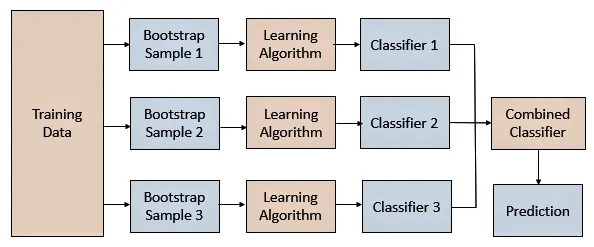

## Table of Contents

## What is Bootstrap aggregation?

Bootstrap aggregation, often called bagging, is a way to make predictions more accurate in machine learning. It works by taking many samples from a dataset, creating different versions of the data, and then using these versions to train multiple models. Each model makes its own prediction, and then all the predictions are combined to make a final prediction. This method helps reduce errors and makes the overall prediction more reliable.

The main idea behind bagging is to reduce the chance that the model will be too focused on certain parts of the data. By using different samples, the models can see the data in different ways, which helps them learn better. This is especially useful when the data is complex or when there's a lot of it. Bagging is often used with decision trees, but it can be used with other types of models too.

## How does Bootstrap aggregation differ from traditional statistical methods?

Bootstrap aggregation, or bagging, is different from traditional statistical methods because it uses a technique called resampling. In traditional statistics, you usually use the whole dataset to make predictions or draw conclusions. But with bagging, you take many smaller samples from your data, and each sample is used to train a separate model. This means that instead of relying on one big model, you have lots of smaller models that work together to make a final prediction.

This approach helps to reduce errors and make predictions more reliable. Traditional methods might be sensitive to small changes in the data, which can lead to overfitting, where the model works well on the training data but not on new data. Bagging helps to avoid this by using different samples, so the models see the data in different ways. This makes the overall prediction more stable and less likely to be thrown off by small changes in the data.

## What are the key benefits of using Bootstrap aggregation?

Bootstrap aggregation, or bagging, helps make predictions more accurate and reliable. It does this by taking many smaller samples from the data and using each sample to train a separate model. When all these models work together, they can make a better final prediction than one big model could on its own. This is because each model sees the data a little differently, so they can catch things that a single model might miss.

Another big benefit of bagging is that it helps reduce errors. Traditional methods can sometimes focus too much on certain parts of the data, which can lead to overfitting. Overfitting means the model works well on the training data but not on new data. Bagging helps avoid this by using different samples, so the models don't get too focused on any one part of the data. This makes the predictions more stable and less likely to be affected by small changes in the data.

Bagging is also very flexible. It can be used with different types of models, not just decision trees. This means you can use it with the kind of model that works best for your data. Whether you're working with complex data or a lot of data, bagging can help you get better results.

## Can you explain the basic process of implementing Bootstrap aggregation?

Implementing Bootstrap aggregation, or bagging, involves a few key steps. First, you start with your dataset and take many smaller samples from it. These samples are taken with replacement, which means that the same data point can be picked more than once in a single sample. Each sample is used to train a separate model. For example, if you're using decision trees, you'd train a different decision tree on each sample.

Once you have all your models trained, you use them to make predictions. Each model makes its own prediction based on the sample it was trained on. To get the final prediction, you combine all these individual predictions. If you're predicting a number, like a house price, you might take the average of all the predictions. If you're classifying something, like whether an email is spam or not, you might use a vote where the most common prediction wins. This way, the final prediction is more reliable because it's based on many different views of the data.

## What types of data are best suited for Bootstrap aggregation?

Bootstrap aggregation, or bagging, works well with different types of data, but it's especially good for datasets that are large and complex. When you have a lot of data, it can be hard for one model to see everything clearly. Bagging helps by taking many smaller samples from the data and using each sample to train a separate model. This way, the models can catch things that a single model might miss, making the overall prediction more accurate.

Bagging is also great for data where there's a lot of variety or where the relationships between different pieces of data are not straightforward. For example, if you're trying to predict house prices and there are many factors like location, size, and age of the house, bagging can help make sense of these complex relationships. By using different samples, the models can learn from different parts of the data, leading to better predictions.

## How does sample size affect the results of Bootstrap aggregation?

The size of the samples you use in Bootstrap aggregation, or bagging, can really change how well it works. If you use bigger samples, each model gets to see more of the data, which can make their predictions better. But bigger samples also mean that the models might start to look a lot like each other, which can make the whole thing less useful. It's like if everyone in a group thinks the same way, they might miss out on different ideas.

On the other hand, if you use smaller samples, each model sees less of the data. This can make the models more different from each other, which is good because it means they can catch different things. But if the samples are too small, the models might not have enough information to make good predictions. So, finding the right sample size is important. It's about balancing having enough data for good predictions with having enough variety among the models to make the whole thing work better.

## What are common pitfalls to avoid when using Bootstrap aggregation?

One common mistake when using Bootstrap aggregation, or bagging, is using samples that are too small. If the samples are too small, each model might not see enough of the data to make good predictions. This can lead to models that are too different from each other and might not work well together. On the other hand, using samples that are too big can make the models too similar, which defeats the purpose of bagging. It's like having a team where everyone thinks the same way; they might miss out on different ideas.

Another pitfall is not using enough models. Bagging works best when you have many models working together. If you only use a few models, you might not get the full benefit of having different views of the data. It's like trying to solve a puzzle with just a few pieces; you need more pieces to see the whole picture. Also, it's important to make sure that the models you use are the right type for your data. Using the wrong kind of model can lead to bad predictions, no matter how good your bagging technique is.

## How can Bootstrap aggregation be used to improve machine learning models?

Bootstrap aggregation, or bagging, helps make [machine learning](/wiki/machine-learning) models better by using many smaller samples from the data to train lots of different models. Each model looks at a different piece of the data, so they can catch things that a single model might miss. When you put all these models together, they can make a more accurate prediction than just one model could. This is because they see the data in different ways, which helps them learn better. Bagging is especially useful when you have a lot of data or when the data is complex, because it can handle these situations well.

Another way bagging improves machine learning models is by reducing errors. Sometimes, a single model can focus too much on certain parts of the data, which can lead to overfitting. Overfitting means the model works well on the training data but not on new data. Bagging helps avoid this by using different samples, so the models don't get too focused on any one part of the data. This makes the predictions more stable and less likely to be thrown off by small changes in the data. By using bagging, you can make your machine learning models more reliable and accurate.

## What are some advanced techniques for optimizing Bootstrap aggregation?

One way to make Bootstrap aggregation, or bagging, work even better is by using something called feature selection. This means choosing only the most important pieces of data to use in each sample. By doing this, you can make sure that each model focuses on the parts of the data that really matter. This can help make the predictions more accurate and save time, because the models don't have to look at all the data. Another way to improve bagging is by using different types of models together. For example, you could use decision trees, but also other models like random forests or even neural networks. This can help catch different patterns in the data and make the final prediction even better.

Another advanced technique is called out-of-bag (OOB) error estimation. This means using the data that wasn't picked for a sample to check how well each model is doing. By doing this, you can see how well the models would work on new data, without needing a separate test set. This can help you fine-tune the models and make them work better. Also, you can try using different sizes of samples to see what works best for your data. Sometimes, smaller samples can help the models be more different from each other, which can make the final prediction more reliable. Finding the right balance can take some experimenting, but it can really help improve the results of bagging.

## How does Bootstrap aggregation handle outliers and skewed data?

Bootstrap aggregation, or bagging, can help deal with outliers and skewed data by using many different samples from the dataset. When you take lots of samples, some of them might not include the outliers or might have less of the skewed data. This means that not all the models will be affected by these unusual data points in the same way. By having many models that see the data differently, bagging can reduce the impact of outliers and skewed data on the final prediction. It's like having a group of friends where not everyone is influenced by one odd person, so the group's overall decision is more balanced.

However, bagging alone might not completely solve the problem of outliers and skewed data. Sometimes, you might need to use other techniques along with bagging to handle these issues better. For example, you could use data preprocessing methods like removing or adjusting outliers before you start bagging. Or, you could use special kinds of models that are good at dealing with skewed data, like using different weights for different parts of the data. By combining bagging with these other methods, you can make your predictions even more accurate and reliable when you're dealing with tricky data.

## Can you compare Bootstrap aggregation with other resampling techniques like Jackknife?

Bootstrap aggregation, or bagging, and Jackknife are both resampling techniques used in [statistics](/wiki/bayesian-statistics) and machine learning, but they work in different ways. Bagging involves taking many samples from the data, with each sample being the same size as the original dataset but taken with replacement. This means that some data points can appear more than once in a sample, while others might not appear at all. Each sample is used to train a separate model, and the final prediction is made by combining the predictions from all these models. This method helps to reduce errors and improve the reliability of predictions, especially when dealing with complex or large datasets.

On the other hand, Jackknife works by leaving out one data point at a time to create a new sample. If you have a dataset with 100 points, you would create 100 different samples, each missing one point. You then use these samples to estimate how much each data point affects the overall result. Jackknife is often used to estimate the bias and variance of a statistical estimate, helping to understand how stable the estimate is. While both techniques help in understanding and improving models, bagging focuses on improving prediction accuracy by combining multiple models, whereas Jackknife focuses on understanding the impact of individual data points on the model's performance.

## What are the latest research developments in Bootstrap aggregation?

Recent research in Bootstrap aggregation, or bagging, has focused on making it work better with different types of data and models. One big area of study is how to use bagging with more advanced machine learning models like neural networks and [deep learning](/wiki/deep-learning). Researchers are trying to figure out the best way to combine these powerful models with bagging to get even better predictions. They're also looking at how to use bagging with data that changes over time, like stock prices or weather patterns. By adapting bagging to these new situations, scientists hope to make it more useful for real-world problems.

Another exciting development is the use of bagging to handle data that's not balanced, where some outcomes are much more common than others. This is a big problem in fields like medicine, where diseases might be rare but important to predict. Researchers are working on new ways to adjust the samples in bagging to give more weight to the less common outcomes, so the models can learn from them better. They're also exploring how to use bagging to understand how certain the predictions are, which can be really helpful when making decisions based on the model's output. These new ideas are making bagging a more powerful tool for all kinds of data challenges.

## References & Further Reading

[1]: Breiman, L. (1996). ["Bagging Predictors."](https://link.springer.com/article/10.1023/A:1018054314350) Machine Learning, 24(2), 123-140.

[2]: Friedman, J., Hastie, T., & Tibshirani, R. (2001). ["The Elements of Statistical Learning: Data Mining, Inference, and Prediction."](https://link.springer.com/book/10.1007/978-0-387-84858-7) Springer Series in Statistics.

[3]: ["Advances in Financial Machine Learning"](https://www.amazon.com/Advances-Financial-Machine-Learning-Marcos/dp/1119482089) by Marcos Lopez de Prado

[4]: ["Machine Learning for Algorithmic Trading, Second Edition: Predictive models to extract signals from market and alternative data for systematic trading strategies with Python"](https://www.oreilly.com/library/view/machine-learning-for/9781839217715/Text/Front_Matter.xhtml) by Stefan Jansen

[5]: ["Quantitative Trading: How to Build Your Own Algorithmic Trading Business, Second Edition"](https://www.amazon.com/Quantitative-Trading-Build-Algorithmic-Business/dp/1119800064) by Ernest P. Chan