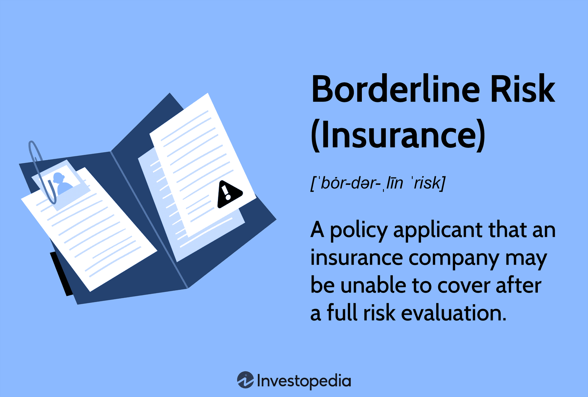

## Table of Contents

## What is borderline risk in insurance?

Borderline risk in insurance refers to a situation where an applicant's risk level is not clearly defined as either high or low. This often happens when the person applying for insurance has some factors that make them more likely to file a claim, but not enough to be considered a high risk. For example, someone might have a minor health issue that isn't severe but still affects their risk level.

Insurance companies have to carefully assess borderline risks because they need to set the right price for the insurance policy. If the price is too low, the company might lose money if the person files a claim. If the price is too high, the person might choose not to buy the insurance. To handle this, insurance companies use detailed data and sometimes special rules to decide how much to charge for borderline risk cases.

## How does borderline risk affect insurance premiums?

Borderline risk can make insurance premiums higher. When someone is a borderline risk, it means they are not clearly safe or risky. Because of this, insurance companies might charge more to cover the chance that the person might need to use their insurance. They do this to make sure they don't lose money if the person has to make a claim.

To figure out the right price, insurance companies look at a lot of information about the person. They use this information to decide if the person is more likely to need insurance. If they think the person is more likely to need it, they will charge more. This helps the insurance company stay safe financially, even if the person is a borderline risk.

## What are common factors that contribute to borderline risk?

Common factors that contribute to borderline risk in insurance include minor health issues, like high blood pressure or a history of minor accidents. These factors might not be severe enough to make someone a high risk, but they still make insurance companies think twice. For example, if someone has had a few small car accidents, they might be seen as a borderline risk for car insurance.

Another [factor](/wiki/factor-investing) is age. Young people, especially young drivers, might be seen as borderline risks because they have less experience. Older people might also be borderline risks because they could have health issues that come with age. Insurance companies look at these factors to decide if someone is a borderline risk.

Lifestyle choices can also play a role. For example, if someone smokes or has a risky hobby like rock climbing, they might be considered a borderline risk. These choices can make insurance companies unsure about how likely the person is to need to use their insurance, so they might charge more to be safe.

## Can you explain the difference between high risk and borderline risk in insurance?

High risk in insurance means someone is very likely to need to use their insurance. This could be because they have big health problems, drive a lot, or do dangerous things. Insurance companies see these people as more likely to make a claim, so they charge them a lot more money for insurance. For example, if someone has a serious illness like cancer, they would be considered high risk for health insurance.

Borderline risk is different. It means someone is not clearly safe or risky. They might have small health issues or a few minor accidents, but not enough to be called high risk. Insurance companies are not sure how likely these people are to need insurance, so they might charge them a bit more than someone who is low risk, but less than someone who is high risk. For example, if someone has high blood pressure but it's under control, they might be a borderline risk for life insurance.

## What strategies do insurance companies use to manage borderline risks?

Insurance companies use careful analysis to manage borderline risks. They look at a lot of information about the person, like their health, how they live, and their past. This helps them figure out how likely the person is to need to use their insurance. If they think the person is more likely to need it, they might charge a bit more money. This way, the insurance company can make sure they don't lose money if the person makes a claim.

Sometimes, insurance companies use special rules to decide what to do with borderline risks. They might use something called underwriting, where they look at all the details and decide if they want to offer insurance and how much to charge. They also use data and computer programs to help them make these decisions. This helps them be fair and make sure they are not charging too much or too little for the insurance.

## How can individuals with borderline risk improve their insurance rates?

Individuals with borderline risk can improve their insurance rates by making some changes to their lifestyle and health. For example, if someone has high blood pressure, they can work on managing it better by eating healthier, exercising, and taking any prescribed medication regularly. This can show insurance companies that the person is taking steps to lower their risk, which might lead to lower insurance rates.

Another way to improve rates is by being safe and responsible. If someone has had a few minor car accidents, they can take a safe driving [course](/wiki/best-algorithmic-trading-courses) to show they are trying to be a better driver. Insurance companies like to see that people are doing their best to reduce their risk. By showing they are making positive changes, individuals can convince insurance companies to offer them better rates.

## What role does data analytics play in assessing borderline risk?

Data analytics helps insurance companies figure out how risky someone is. They look at a lot of information about the person, like their health records, how they drive, and what they do for fun. By using computers and special programs, insurance companies can see patterns and understand if someone is more likely to need insurance. This is really important for people who are borderline risks because it's not always clear if they are safe or risky.

When insurance companies use data analytics, they can make better decisions about what to charge for insurance. If the data shows that someone is doing things to be safer, like eating healthy or taking a safe driving course, the insurance company might charge them less. This way, data analytics helps insurance companies be fair and make sure they are not charging too much or too little for people who are borderline risks.

## How do regulatory frameworks influence the handling of borderline risks in insurance?

Regulatory frameworks set rules that insurance companies must follow when they deal with people who are borderline risks. These rules make sure that insurance companies treat everyone fairly and don't charge too much or too little. For example, regulators might say that insurance companies need to use certain data to decide how much to charge. This helps make sure that the prices are fair for everyone, even people who are borderline risks.

Regulators also make sure that insurance companies explain their decisions clearly. If someone is a borderline risk, the insurance company has to tell them why they are charging a certain amount. This helps people understand why their insurance might cost more and what they can do to make it cheaper. By having these rules, regulators help keep the insurance industry honest and fair for everyone.

## What are the latest trends in managing borderline risk within the insurance industry?

The latest trend in managing borderline risk in the insurance industry is the use of advanced data analytics and [artificial intelligence](/wiki/ai-artificial-intelligence) (AI). Insurance companies are now using more detailed data to understand how likely someone is to need insurance. They look at things like health records, driving habits, and even social media to get a better picture of a person's risk level. This helps them make more accurate decisions about what to charge for insurance, especially for people who are borderline risks. By using AI, insurance companies can find patterns and make predictions that were hard to see before.

Another trend is personalized insurance plans. Insurance companies are starting to offer plans that can change based on how someone is doing. For example, if a person with borderline risk starts to eat healthier or drive more safely, their insurance plan might get cheaper. This is called usage-based insurance, where the price depends on what the person actually does. It helps people feel like they have control over their insurance costs and encourages them to make positive changes in their lives.

## How do actuaries calculate the impact of borderline risk on insurance portfolios?

Actuaries use math and data to figure out how borderline risks affect insurance portfolios. They look at a lot of information about the people who are borderline risks, like their health, how they drive, and what they do for fun. By using this data, actuaries can predict how likely these people are to need insurance. They then use these predictions to decide how much money the insurance company should charge for these people's insurance. This helps the insurance company make sure they have enough money to pay for any claims that might happen.

Actuaries also look at the whole group of people the insurance company insures, not just the borderline risks. They want to make sure that the insurance company's money is balanced. If there are too many borderline risks, the company might lose money if a lot of them need to use their insurance. So, actuaries use special math formulas to figure out the right mix of people to insure. This way, the insurance company can keep its money safe and still offer fair prices to everyone, including those who are borderline risks.

## Can you discuss case studies where borderline risk management significantly impacted an insurance company's performance?

One case study that shows how managing borderline risks can affect an insurance company's performance is from a health insurance company that started using advanced data analytics. They looked at a lot of information about their customers, like their health records and lifestyle choices. By doing this, they found out that some people who were borderline risks were actually doing things to be healthier, like eating better and exercising. The company decided to charge these people less for insurance. This made more people want to buy insurance from them, and it also helped the company save money because fewer people needed to use their insurance. As a result, the company's profits went up, and they were able to offer better services to their customers.

Another example comes from a car insurance company that used usage-based insurance to manage borderline risks. They gave their customers devices that tracked how they drove. If someone who was a borderline risk started driving more safely, their insurance rates would go down. This encouraged people to be better drivers. The company found that fewer people were getting into accidents, which meant they had to pay out less money for claims. This helped the company's financial performance because they were spending less on claims and more people were happy with their insurance rates. Overall, managing borderline risks in this way helped the company grow and become more successful.

## What future technologies are expected to transform the assessment and management of borderline risk in insurance?

In the future, new technologies like artificial intelligence (AI) and [machine learning](/wiki/machine-learning) are expected to change how insurance companies handle borderline risks. These technologies can look at a lot of information very quickly and find patterns that people might miss. For example, AI can use data from health records, driving habits, and even social media to understand how likely someone is to need insurance. This helps insurance companies make better decisions about what to charge people who are borderline risks. By using AI, insurance companies can be fairer and more accurate when they set prices for insurance.

Another technology that could help is the Internet of Things (IoT). This means using devices like smartwatches or car sensors to collect information about how people live and what they do. For example, a smartwatch can track how much someone exercises or if they have high blood pressure. Car sensors can tell if someone drives safely. By using this information, insurance companies can see if people who are borderline risks are doing things to be safer. This can help them offer personalized insurance plans that change based on what the person is actually doing. These future technologies could make managing borderline risks easier and help insurance companies offer better services to their customers.

## What is involved in understanding risk assessment in insurance?

Risk assessment in insurance is a fundamental process that involves evaluating the likelihood of potential risks and determining suitable premium rates for coverage. Insurance companies use systematic methodologies to categorize applicants based on their risk profiles, which are influenced by various factors ranging from health, age, and lifestyle to external environmental risks.

Actuaries and underwriters play a crucial role in this process. Actuaries use statistical and mathematical models to predict the probability of events and their potential financial impact on the insurance portfolio. They analyze vast amounts of data to assess the risk level associated with different clients and determine premium rates accordingly. Statistical models such as logistic regression or decision trees are commonly employed to classify risk levels. For example, a simple logistic regression might be used to evaluate the probability of an event $P(Y = 1)$ given several inputs $X_1, X_2, \ldots, X_n$:

$$
P(Y = 1) = \frac{1}{1 + e^{-(\beta_0 + \beta_1 X_1 + \beta_2 X_2 + \ldots + \beta_n X_n)}}
$$

where $\beta_0, \beta_1, \ldots, \beta_n$ are parameters estimated from data.

Underwriters take the actuarial analysis further by evaluating individual applications, considering factors like the applicant’s credit score, previous claims history, and specific lifestyle details. Their task is to balance the risks for the insurance company by making informed decisions on who to insure and at what price. 

The management of borderline risks, those applicants whose profiles present significant uncertainty, reveals a lot about the resilience of the insurance industry. Borderline risks require thorough evaluation because their acceptance could potentially undermine an insurer's financial equilibrium. Such applicants may present conditions that are close to thresholds of standard risk categories but still necessitate comprehensive scrutiny. Understanding these borderline risks often involves scenario analyses and stress tests, which help insurance entities prepare for worst-case scenarios without compromising their financial integrity.

Furthermore, insurance companies often employ technologies and algorithms for risk prediction and analysis. Machine learning techniques are increasingly utilized to enhance the precision of risk assessments. For instance, models like random forests or neural networks have proven beneficial in analyzing complex, non-linear relationships in large datasets.

In conclusion, risk assessment in insurance is a multi-faceted discipline that combines quantitative analysis with the nuanced judgment of skilled professionals. By carefully evaluating risk profiles and managing borderline risks, insurance companies can maintain financial stability while providing equitable coverage to policyholders.

## What is Borderline Risk, and what are its meanings and implications?

Borderline risk in insurance refers to individuals or entities whose profiles pose a significant challenge for underwriting decisions due to the heightened risk they present. Such applicants are at the cusp between standard insurable risks and those that are potentially uninsurable or require special consideration. Evaluating borderline risk involves quantitative and qualitative analyses to determine the likelihood and potential impact of events that such applicants may encounter.

The assessment of borderline risk is crucial because it directly affects an insurer's financial stability. Accepting too many high-risk applicants without appropriate adjustment in premiums or risk management measures can lead to significant losses. Conversely, overly stringent refusal policies might lead to missed opportunities and reduced market share. Therefore, establishing a balance in risk assessment is essential.

Underwriters extensively analyze the applicant's risk profile, which involves examining historical data, credit scores, claims history, health records, and other relevant factors. Advanced statistical models might be employed here, utilizing techniques like logistic regression to predict the probability of claim events. For instance, if $P$ is the probability of a high-risk event occurring, it might be modeled as:

$$
P = \frac{1}{1 + e^{-(\beta_0 + \beta_1x_1 + \beta_2x_2 + \ldots + \beta_nx_n)}}
$$

where $x_1, x_2, \ldots, x_n$ represent different risk factors, and $\beta_0, \beta_1, \ldots, \beta_n$ are the coefficients that express the relative impact of each factor.

Beyond purely quantitative measures, qualitative assessments are also key in understanding borderline risk. For instance, underwriters might consider economic conditions, industry-specific risks, or even the integrity and reputation of the applicant's management team when assessing corporate insurance risks.

Thorough evaluation of borderline risks is essential for developing robust risk management strategies. This may involve setting higher premiums, establishing co-payment structures, or including specific exclusions in policy terms to mitigate potential losses. By effectively managing borderline risks, insurers can safeguard their financial stability while still servicing a diverse clientele.

The implications of mismanaging borderline risk include increased claim ratios, reduced profitability, and potentially escalating reinsurance costs. Thus, insurers must maintain adaptive evaluation frameworks that incorporate emerging data trends and technologies to continually buffer against these challenges. Understanding these implications helps insurers refine their strategies, balancing risk acceptance and financial security adeptly.

## References & Further Reading

[1]: Bergstra, J., Bardenet, R., Bengio, Y., & Kégl, B. (2011). ["Algorithms for Hyper-Parameter Optimization."](https://dl.acm.org/doi/10.5555/2986459.2986743) Advances in Neural Information Processing Systems 24.

[2]: ["Advances in Financial Machine Learning"](https://www.amazon.com/Advances-Financial-Machine-Learning-Marcos/dp/1119482089) by Marcos Lopez de Prado

[3]: ["Evidence-Based Technical Analysis: Applying the Scientific Method and Statistical Inference to Trading Signals"](https://www.amazon.com/Evidence-Based-Technical-Analysis-Scientific-Statistical/dp/0470008741) by David Aronson

[4]: ["Machine Learning for Algorithmic Trading"](https://github.com/stefan-jansen/machine-learning-for-trading) by Stefan Jansen

[5]: ["Quantitative Trading: How to Build Your Own Algorithmic Trading Business"](https://www.amazon.com/Quantitative-Trading-Build-Algorithmic-Business/dp/1119800064) by Ernest P. Chan