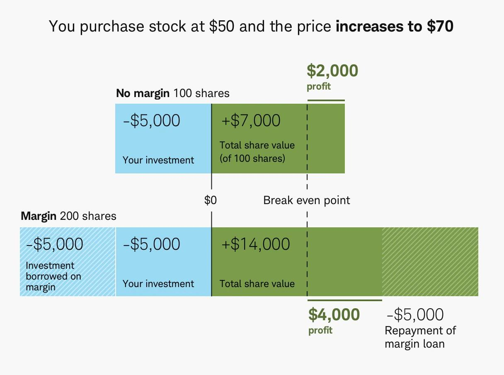

Leveraging assets in the investment sector can significantly amplify returns, but it also increases exposure to risk. One of the key avenues for leveraging is through margin accounts, which allow investors to borrow funds from their broker to purchase additional securities. By doing so, investors can potentially enhance their profits but also expose themselves to risks such as margin calls, where they might be required to provide additional funds or face liquidation of their positions if the value of the assets falls below a certain threshold.

On another front, algorithmic trading has transformed the trading landscape by employing automated systems to execute trades at high speeds based on predefined criteria. This approach has brought about a shift in how investors interact with financial markets, enabling quicker response times and the possibility of minimizing human errors.



This article aims to offer a detailed exploration of how borrowing limits, margin accounts, investment leverage, and algorithmic trading interplay in shaping contemporary investment strategies. By understanding these elements, investors can equip themselves with the knowledge necessary to navigate the complexities of modern markets efficiently and effectively.

## Table of Contents

## Understanding Margin Accounts

A margin account enables investors to borrow funds from their broker to purchase additional securities, thereby magnifying potential investment returns. This mechanism allows investors to leverage their existing portfolio by augmenting their buying power, enhancing the ability to capitalize on investment opportunities. The potential benefits of margin accounts are significant, allowing investors to exercise increased market activity without the immediate requirement of additional capital outlay.

However, the utilization of margin accounts introduces a greater level of risk. The primary risk factor is that losses can also be amplified in proportion to the borrowed amount. This dual nature of potential gains and losses necessitates a comprehensive understanding of the terms and conditions set by brokers and adherence to regulatory requirements.

Typically, margin accounts permit investors to borrow up to 50% of the purchase price of securities that are considered marginable. These limits are governed by both brokerage firm stipulations and market regulations such as those enforced by the Financial Industry Regulatory Authority (FINRA) in the United States, which mandates minimum margin requirements to protect both investors and brokers.

The mechanism of borrowing within a margin account is operationalized through margin loans. In this arrangement, an investor is obliged to repay the borrowed funds, accompanied by any associated interest charges. The interest rates on these loans vary based on the brokerage’s terms and the prevailing [interest rate](/wiki/interest-rate-trading-strategies) environment. As a result, investors must meticulously evaluate the cost of borrowing when determining the potential profitability of leveraging their investments through a margin account.

The margin loan balance is a crucial element to monitor as it directly impacts the equity or net value an investor holds within the margin account. The formula to calculate equity in a margin account is:

$$
\text{Equity} = \text{Total Market Value of Securities} - \text{Margin Loan Balance}
$$

Maintaining an adequate level of equity is essential to not only capitalize on opportunities but also to avoid scenarios such as margin calls, which can pose additional financial challenges. This underscores the importance of judicious portfolio management and constant monitoring of account status to ensure leveraged strategies align with the investor's financial objectives and risk tolerance.

## Investment Leverage: The Double-Edged Sword

Investment leverage, particularly through margin accounts, allows investors to enhance their purchasing power by using borrowed funds. This strategy offers the potential for significant profits as it enables the acquisition of more securities than would be possible using only one's own capital. However, leverage is inherently a double-edged sword that requires vigilant risk management.

The primary advantage of leverage is the magnification of investment returns. If an investor's anticipated projections hold true, the additional securities purchased with borrowed funds can provide substantial financial yields. For example, if an investor uses $10,000 of their capital to buy securities and borrows an additional $10,000 on margin, a 10% increase in the value of these securities results in a $2,000 gain, doubling the principal's effective return.

Conversely, the downside risks are equally amplified. In the event of a market downturn or incorrect speculation, the losses are not limited to the principal investment but also include the borrowed funds. Using the previous example, a 10% decline would result in a $2,000 loss, thereby consuming the entire profit potential or even the initial capital. 

In addition to inherent market risks, investors must consider the cost associated with margin loans, notably the interest rates. Margin interest can significantly impact net profitability, especially if the securities do not appreciate as expected. The formula for calculating the effective return on investment (ROI) in a leveraged account can be expressed as:

$$
\text{ROI} = \frac{(P_1 - P_0) \times (1 + L) - I}{P_0 + (P_0 \times L)}
$$

where:
- $P_0$ is the initial price of the securities,
- $P_1$ is the selling price,
- $L$ is the leverage ratio (borrowed funds/principal),
- $I$ is the total interest paid on the borrowed funds.

Investors should incorporate comprehensive risk management strategies, such as setting stop-loss orders and constantly monitoring market conditions, to mitigate the potential pitfalls of leverage. Furthermore, understanding and planning for the impacts of interest rates and maintaining a balance that fits the investor's risk tolerance are critical steps in harnessing the potential of leveraged investments effectively.

## Margin Calls: What You Need to Know

A margin call is a critical event in a margin account that occurs when the value of an investor's account falls below the broker's required maintenance margin level. This situation prompts the brokerage firm to request that the investor deposit additional funds or securities to cover the shortfall. Failing to meet a margin call can lead to severe consequences, including the forced liquidation of assets within the account. This liquidation process is executed by the brokerage firm to restore the account to the required margin level, but it can result in financial losses for the investor. 

The maintenance margin is the minimum amount of equity that an investor must maintain in their margin account after purchasing securities on margin. Typically expressed as a percentage, this requirement varies by brokerage but is often set at 25% of the total market value of the securities in the account. When the value of the securities decreases and the equity in the margin account falls below this minimum level, a margin call is triggered. For example, consider an investor with a margin account containing securities worth $10,000 and a maintenance margin requirement of 25%. The investor must maintain at least $2,500 in equity. If the value of the securities falls to $9,000, the equity would drop to $1,500, triggering a margin call.

Investors can reduce the occurrence of margin calls by regularly monitoring their margin accounts and employing effective risk management strategies. This involves keeping a close eye on the market value of their investments and being prepared to deposit additional funds if needed. Additionally, diversification and avoiding excessive leverage can help mitigate the risk of margin calls. Employing stop-loss orders is another strategy that can limit potential losses by automatically selling securities when they reach a predetermined price, thereby protecting the investor from significant declines that could trigger a margin call.

In conclusion, understanding margin calls and their implications is crucial for those engaging in margin trading. Prompt responses to margin calls, combined with prudent trading and risk management strategies, can help investors navigate the challenges associated with trading on margin while minimizing potential financial losses.

## The Role of Algorithmic Trading

Algorithmic trading uses computer algorithms to automate transaction processes based on predefined sets of criteria, allowing for rapid execution speeds that humans cannot match. These algorithms operate by scanning various market variables—such as price, timing, and [volume](/wiki/volume-trading-strategy)—to identify trading opportunities. Once a criterion is met, an order is automatically executed. This automation not only speeds up the trading process but also enhances trading efficiency and precision.

The effectiveness of [algorithmic trading](/wiki/algorithmic-trading) fundamentally depends on how well the algorithms are programmed. It requires a thorough understanding of both the markets and the programming technology used to ensure that algorithms function as intended. This involves selecting appropriate algorithms for different market conditions and continuously refining them based on performance data. An algorithm might use different strategies such as statistical [arbitrage](/wiki/arbitrage), [trend following](/wiki/trend-following), or [market making](/wiki/market-making).

One notable advantage of algorithmic trading is its ability to minimize human error and emotional biases in trading decisions. Traditional trading methods are often subject to human inefficiencies, such as delayed reaction times and emotional responses to market events. By using predefined criteria, algorithmic trading systems execute trades free from emotional influence, thereby fostering more disciplined and potentially profitable trading strategies.

Algorithmic trading has become a cornerstone in modern finance for both institutional and retail investors due to its speed and efficiency. However, the use of these systems also requires rigorous testing and validation to prevent undesired outcomes. This testing often includes back-testing the algorithms on historical data and performing simulation tests to evaluate how well the algorithm performs under different market scenarios. As trading complexity increases, the role of algorithmic trading is likely to expand, maintaining its status as a critical tool in the investor's toolkit.

## Combining Leverage and Technology for Optimal Investment Strategies

Integrating margin accounts with algorithmic trading strategies offers investors new avenues for amplifying portfolio growth. By leveraging assets through margin accounts, traders can acquire greater market positions than if they relied solely on their own equity. This capacity to amplify purchasing power can be strategically combined with algorithmic trading systems, which automate decision-making and trade execution.

Innovations in trading technology have markedly increased the efficiency and speed of transactions, enabling investors to react instantaneously to market fluctuations. Algorithmic trading systems are programmed with pre-defined criteria, allowing for the precise execution of trades based on complex algorithms. This level of automation and speed presents an opportunity to capitalize on small market inefficiencies, thus potentially enhancing returns.

However, the marriage of leverage and technology is not without risk. Leverage magnifies both gains and losses, while algorithmic trading systems, if improperly designed or executed, can lead to substantial financial risks. It is crucial for investors to engage in rigorous research and testing of their strategies. This involves back-testing algorithms against historical data, simulating market conditions to predict potential outcomes, and continuously refining strategies to ensure optimal performance.

A practical approach for testing strategies is using Python, a language well-suited for developing and back-testing trading algorithms. The following Python snippet demonstrates a simple strategy back-test using historical stock data:

```python
import pandas as pd
import numpy as np
import matplotlib.pyplot as plt
from backtesting import Backtest, Strategy
from backtesting.lib import crossover
from backtesting.test import SMA, GOOG

class SmaCross(Strategy):
    n1 = 10
    n2 = 20

    def init(self):
        self.sma1 = self.I(SMA, self.data.Close, self.n1)
        self.sma2 = self.I(SMA, self.data.Close, self.n2)

    def next(self):
        if crossover(self.sma1, self.sma2):
            self.buy()
        elif crossover(self.sma2, self.sma1):
            self.sell()

bt = Backtest(GOOG, SmaCross, cash=10000, commission=.002)
output = bt.run()
bt.plot()
```

In the example above, a simple moving average crossover strategy is implemented on Google's historical stock data, a basic illustration that can be scaled to more sophisticated models. Through such meticulous strategy testing and refinement, investors can better equip themselves to harness the dual power of leverage and algorithmic trading, aiming for robust, risk-adjusted investment strategies.

## Conclusion

Margin accounts and algorithmic trading are influential mechanisms in modern finance that enable investors to capitalize on market opportunities. By facilitating the borrowing of funds, margin accounts allow investors to amplify their purchasing power and potentially augment their returns. This financial leverage can be advantageous but also entails significant risk, necessitating a strategic approach to risk management and investment discipline.

Algorithmic trading, with its reliance on computer programs to execute trades at high speed and precision, represents a technological frontier in investment strategies. It offers the potential to optimize trading efficiency by minimizing human error and emotional biases. However, to harness its full potential, investors must possess a thorough understanding of algorithmic models and ensure their algorithms align with their investment objectives.

Despite the advantages these tools offer, they come with inherent risks. Margin accounts pose the threat of margin calls, where failure to meet required funding levels can lead to the forced liquidation of securities. Algorithmic trading, though efficient, can be flawed if inadequately programmed or if market conditions shift unexpectedly. Thus, staying informed about the evolving technology and continuously evaluating both the algorithms and the related financial strategies remains crucial.

As technology advances, the marriage of leverage and algorithmic trading continues to develop, offering investors new avenues for profit. Successful navigation requires a balanced approach, leveraging these tools' strengths while mitigating their risks through informed, disciplined strategies. Ultimately, keeping abreast of innovations and potential pitfalls will be vital for investors aiming to optimize their portfolios while safeguarding against excessive risk.

## References & Further Reading

[1]: FINRA. ["Understanding Margin Accounts,"] (https://www.finra.org/rules-guidance/key-topics/margin-accounts) Financial Industry Regulatory Authority.

[2]: Wenger, L. (2020). ["Algorithmic Trading and DMA: An Introduction to Direct Access Trading Strategies"](https://archive.org/details/algorithmictradi0000john). 4Myeloma Press.

[3]: Hull, J. C. ("Options, Futures, and Other Derivatives,") Prentice Hall.

[4]: Aldridge, I. (2013). ["High-Frequency Trading: A Practical Guide to Algorithmic Strategies and Trading Systems"](https://www.amazon.com/High-Frequency-Trading-Practical-Algorithmic-Strategies/dp/1118343506). Wiley.

[5]: Schoen, J. A. (2013). ["Security Analysis: The Classic 1934 Edition"](https://www.amazon.com/Security-Analysis-Classic-Benjamin-Graham/dp/0070244960). McGraw-Hill Education.