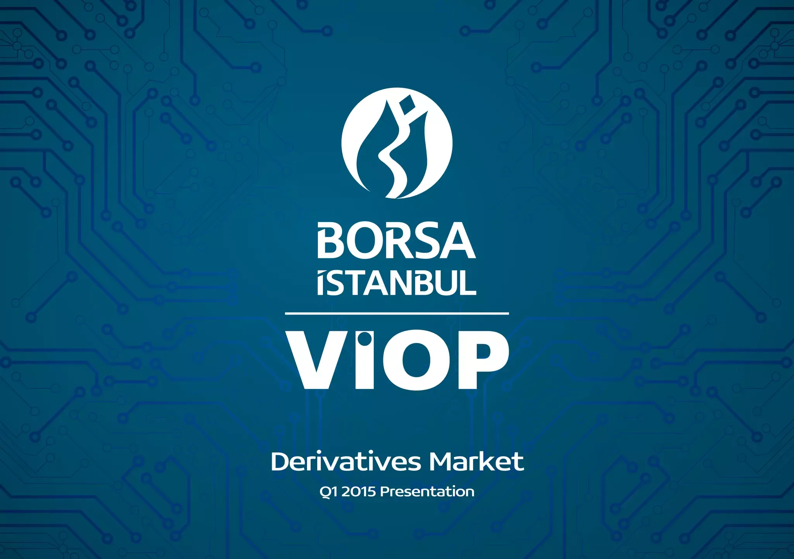

## Table of Contents

## What is the Borsa Istanbul Derivatives Market?

The Borsa Istanbul Derivatives Market is a part of the Borsa Istanbul, which is the main stock exchange in Turkey. It is a place where people can trade financial products called derivatives. Derivatives are special types of contracts that get their value from something else, like stocks, bonds, or commodities. People use these contracts to manage risk or to try and make money by guessing how the value of the underlying thing will change.

The market offers different types of derivatives, such as futures and options. Futures are agreements to buy or sell something at a future date for a price set today. Options give the buyer the right, but not the obligation, to buy or sell something at a set price before a certain date. These products help businesses and investors protect themselves from big changes in prices, and they can also be used to make investment strategies more flexible.

## What types of derivatives are traded on the Borsa Istanbul Derivatives Market?

The Borsa Istanbul Derivatives Market offers different kinds of derivatives for people to trade. The main types are futures and options. Futures are agreements where you promise to buy or sell something at a set price on a future date. For example, if you think the price of wheat will go up, you might buy a wheat futures contract now to buy wheat later at today's price. Options are different. They give you the right, but not the duty, to buy or sell something at a set price before a certain time. If you buy an option on a stock, you can choose to buy the stock at the set price if it's a good deal, or just let the option expire if it's not.

These derivatives help people manage risk and make investment plans more flexible. For example, a farmer might use futures to lock in a price for their crops, protecting against price drops. An investor might use options to bet on a stock's price going up without having to buy the stock right away. By trading these products, people can protect themselves from big price swings or try to make money from their guesses about future prices.

## How can one start trading on the Borsa Istanbul Derivatives Market?

To start trading on the Borsa Istanbul Derivatives Market, you first need to open an account with a brokerage firm that is authorized to trade on this market. These firms act as middlemen between you and the market. You'll need to provide some personal information and maybe some documents to open your account. Once your account is set up, you'll need to deposit money into it. This money will be used to buy and sell derivatives.

After setting up your account and funding it, you can start trading. You'll use the brokerage firm's trading platform, which is like a special computer program or website where you can see prices and make trades. You'll need to learn about the different types of derivatives available, like futures and options, and decide which ones you want to trade. It's a good idea to start with small amounts until you get the hang of it. Remember, trading derivatives can be risky, so it's important to understand what you're doing and maybe get some advice from experts.

## What are the trading hours of the Borsa Istanbul Derivatives Market?

The Borsa Istanbul Derivatives Market has specific times when you can trade. It is open from 9:30 AM to 12:40 PM, and then it opens again from 2:00 PM to 4:55 PM, local time in Turkey. These hours are when you can buy and sell futures and options.

During these times, you can make trades through a brokerage firm's platform. It's important to know these hours so you can plan when to trade. If you miss these times, you will have to wait until the next trading day to make your trades.

## What are the benefits of trading derivatives on the Borsa Istanbul Derivatives Market?

Trading derivatives on the Borsa Istanbul Derivatives Market can help you manage risk. If you're worried about prices going up or down, you can use futures and options to protect yourself. For example, if you're a farmer and you think the price of your crops might fall, you can sell a futures contract now to lock in today's price. This way, no matter what happens to the price later, you know what you'll get for your crops. It's like having insurance against big price changes.

Derivatives can also help you make money if you guess right about future prices. If you think a stock's price will go up, you can buy an option that gives you the right to buy that stock at a set price. If the stock's price does go up, you can buy it at the lower price you set in the option and then sell it at the higher market price, making a profit. Trading on the Borsa Istanbul Derivatives Market gives you access to a variety of these products, making it easier to find the right tool for your investment strategy.

## What are the risks associated with trading derivatives on the Borsa Istanbul Derivatives Market?

Trading derivatives on the Borsa Istanbul Derivatives Market can be risky because the value of derivatives depends on other things like stocks or commodities. If you guess wrong about how these things will change in price, you could lose money. For example, if you buy a futures contract expecting the price of wheat to go up, but it goes down instead, you'll have to sell the contract at a lower price and lose money. This kind of risk is called market risk, and it's something you need to think about carefully before trading.

Another risk is called leverage risk. When you trade derivatives, you often use borrowed money to make bigger trades. This can make your profits bigger if things go your way, but it can also make your losses bigger if they don't. If the market moves against you, you might have to put in more money to cover your losses, or you could lose more than you initially invested. It's important to understand how leverage works and to use it carefully.

Lastly, there's also the risk of not understanding the products you're trading. Derivatives can be complicated, and if you don't fully understand how they work, you might make bad decisions. It's a good idea to learn as much as you can about futures and options, and maybe even get advice from experts before you start trading. This can help you avoid mistakes that could cost you money.

## How does the Borsa Istanbul Derivatives Market ensure fair trading practices?

The Borsa Istanbul Derivatives Market works hard to make sure trading is fair for everyone. They have rules that everyone must follow, and they watch the market closely to make sure no one is cheating. They use special computer systems to check for any strange trading patterns that might be signs of unfair behavior. If they find anything wrong, they can stop trading or even punish the people breaking the rules. This helps keep the market honest and safe for everyone who trades there.

They also make sure that all the information about what's being traded is clear and easy to understand. This way, everyone can make good choices based on the same information. The market also has a system to settle trades quickly and correctly, so there's no confusion about who owes what. By doing all these things, the Borsa Istanbul Derivatives Market tries to make sure that trading is fair and that everyone has an equal chance to succeed.

## What are the margin requirements for trading on the Borsa Istanbul Derivatives Market?

When you trade on the Borsa Istanbul Derivatives Market, you need to put up some money as a margin. This is like a deposit to make sure you can cover any losses you might have. The amount of margin you need depends on what you're trading and how much risk is involved. For example, if you're trading futures, you might need to put up a certain percentage of the contract's value. The market sets these rules to make sure everyone can handle their trades responsibly.

The margin requirements can change, so it's important to keep an eye on them. If the market moves against you and your account balance drops below the required margin, you'll get a margin call. This means you need to add more money to your account right away to keep your trades open. If you don't, the market might close your positions to limit the risk. Understanding and managing your margin is key to trading successfully on the Borsa Istanbul Derivatives Market.

## How does the Borsa Istanbul Derivatives Market handle settlement and clearing?

When you trade on the Borsa Istanbul Derivatives Market, the process of settling and clearing your trades is handled carefully to make sure everything goes smoothly. After you make a trade, the market's clearing house steps in. This is a special group that makes sure both sides of the trade do what they promised. They check that the buyer gets what they bought and the seller gets paid. This helps keep the market safe and fair for everyone.

The clearing house also keeps an eye on the money in your account to make sure you have enough to cover any losses. If you don't, they might ask you to add more money, which is called a margin call. If you can't add more money, they might close your trades to stop any more losses. By doing all this, the Borsa Istanbul Derivatives Market makes sure that trades are settled quickly and correctly, so everyone can trust the system.

## What role do market makers play in the Borsa Istanbul Derivatives Market?

Market makers are important in the Borsa Istanbul Derivatives Market because they help make sure there are always buyers and sellers for the derivatives being traded. They do this by always being ready to buy or sell certain amounts of these products at set prices. This helps keep the market running smoothly because it makes it easier for other traders to buy and sell when they want to. Without market makers, it might be hard to find someone to trade with, and the market could become less active.

By providing this service, market makers also help keep the prices of derivatives stable. If the price of a derivative starts to change a lot, market makers can step in and trade to help balance things out. This makes the market more predictable and less risky for everyone involved. In short, market makers play a key role in making the Borsa Istanbul Derivatives Market a reliable place to trade.

## How has the Borsa Istanbul Derivatives Market evolved historically?

The Borsa Istanbul Derivatives Market has a history that goes back to the early 2000s. It started as the Turkish Derivatives Exchange (TurkDEX) in 2005. At first, it only offered futures contracts on the ISE National-30 Index, which is a way to measure how well the biggest companies in Turkey are doing. Over time, the market grew and added more types of derivatives, like options and futures on stocks, currencies, and commodities. This helped more people and businesses use the market to manage their risks and try to make money.

In 2013, the TurkDEX merged with the Istanbul Stock Exchange and other markets to become Borsa Istanbul. This made the derivatives market a bigger part of a larger financial system. Since then, the Borsa Istanbul Derivatives Market has kept growing and changing to meet the needs of traders. It has added new products and improved its technology to make trading easier and faster. Today, it's an important place for people in Turkey and around the world to trade derivatives and manage their financial risks.

## What advanced trading strategies can be employed on the Borsa Istanbul Derivatives Market?

One advanced trading strategy that can be used on the Borsa Istanbul Derivatives Market is called "hedging." This means using derivatives to protect against big price changes. For example, if you own a lot of a certain stock and you're worried the price might go down, you can buy a put option. This gives you the right to sell the stock at a set price, even if the market price drops. This way, you can limit your losses if the stock price falls. Hedging is useful for businesses and investors who want to manage their risks carefully.

Another strategy is "spread trading," where you buy and sell different derivatives at the same time to take advantage of price differences. For example, you might buy a futures contract that you think will go up in price and sell another one that you think will go down. The goal is to make money from the difference in how these two contracts move. This can be a good way to make profits without taking on too much risk, but it requires a good understanding of how different derivatives are related to each other.

A third strategy is "options strategies" like "straddles" and "strangles." These involve buying both a call option and a put option on the same underlying asset. With a straddle, you buy options with the same strike price, betting that the price will move a lot in either direction. With a strangle, you buy options with different strike prices, also betting on big price moves but with less cost upfront. These strategies can be profitable if you expect big price swings but aren't sure which way the market will go.

## References & Further Reading

[1]: Karan, M. B. (2013). ["Borsa Istanbul and the Development of Capital Markets in Turkey."](https://scholar.google.com/citations?user=jA6qyG0AAAAJ&hl=en) In Handbook of Islamic Banking and Finance.

[2]: Gazioglu, S. (2013). ["Transformation of Financial Markets in Turkey: An Overview."](https://www.econbiz.de/Record/capital-flow-to-an-emerging-financial-market-in-turkey-gazioglu-saziye/10009955374) Business History.

[3]: Lo, A. W., & MacKinlay, A. C. (1999). ["A Non-Random Walk Down Wall Street"](https://www.jstor.org/stable/j.ctt7tccx) Princeton University Press. 

[4]: Chaboud, A., Chiquoine, B., Hjalmarsson, E., & Vega, C. (2014). ["Rise of the Machines: Algorithmic Trading in the Foreign Exchange Market."](https://www.jstor.org/stable/43612951) The Review of Economic Studies.

[5]: Aldridge, I. (2013). ["High-Frequency Trading: A Practical Guide to Algorithmic Strategies and Trading Systems"](https://onlinelibrary.wiley.com/doi/pdf/10.1002/9781119203803.fmatter) Wiley Finance Series. 

[6]: Menkveld, A. J. (2013). ["High-Frequency Trading and the New-Market Makers."](https://www.sciencedirect.com/science/article/pii/S1386418113000281) Journal of Economic Perspectives.

[7]: Capital Markets Board of Turkey (CMB). ["Regulatory Framework for Algorithmic Trading."](https://cmb.gov.tr/) Official Website of the Capital Markets Board of Turkey.

[8]: de Prado, M. L. (2018). ["Advances in Financial Machine Learning."](https://www.amazon.com/Advances-Financial-Machine-Learning-Marcos/dp/1119482089) Wiley.

[9]: Jegadeesh, N., & Titman, S. (1993). ["Returns to Buying Winners and Selling Losers: Implications for Stock Market Efficiency."](https://www.jstor.org/stable/2328882) The Journal of Finance.