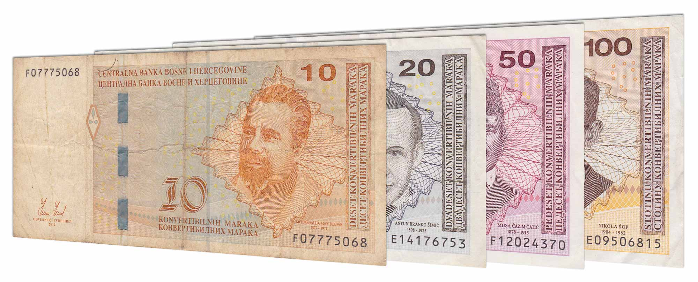

## Table of Contents

## What is the Bosnia and Herzegovina Convertible Mark?

The Bosnia and Herzegovina Convertible Mark, often called the BAM or KM, is the official money used in Bosnia and Herzegovina. It started being used on June 22, 1998. Before the Convertible Mark, the country used the Yugoslav dinar and the Bosnian dinar. The Convertible Mark was made to help the economy become more stable after the war.

The Convertible Mark is managed by the Central Bank of Bosnia and Herzegovina. It is tied to the Euro, which means its value stays steady compared to the Euro. This helps people trust the money more. You can find the Convertible Mark in coins and banknotes, with different amounts like 1, 2, 5, 10, 20, 50, 100, and 200 KM.

## When was the Bosnia and Herzegovina Convertible Mark introduced?

The Bosnia and Herzegovina Convertible Mark, also known as BAM or KM, was introduced on June 22, 1998. Before this, the country used the Yugoslav dinar and the Bosnian dinar. The Convertible Mark was brought in to help make the economy more stable after the war.

The Central Bank of Bosnia and Herzegovina manages the Convertible Mark. It is tied to the Euro, which means its value stays the same compared to the Euro. This makes people trust the money more. You can find the Convertible Mark in coins and banknotes, with different amounts like 1, 2, 5, 10, 20, 50, 100, and 200 KM.

## What is the currency code and symbol for the Convertible Mark?

The currency code for the Bosnia and Herzegovina Convertible Mark is BAM. This code is used in international transactions and by banks to identify the currency.

The symbol for the Convertible Mark is KM. This symbol is used in everyday transactions within Bosnia and Herzegovina to represent the currency.

## How is the Convertible Mark abbreviated?

The Convertible Mark is abbreviated as BAM when talking about money in international ways. This code helps banks and people know which currency they are using when they are doing business with other countries.

In Bosnia and Herzegovina, people use the symbol KM for the Convertible Mark every day. This symbol is easy to see on price tags, in stores, and when people are paying for things. It makes it simple for everyone to know they are using the local money.

## What is the exchange rate of the Convertible Mark to major currencies like the USD and EUR?

The exchange rate of the Bosnia and Herzegovina Convertible Mark (BAM) to the US Dollar (USD) changes every day. As of today, 1 BAM is about 0.56 USD. This means if you have 1 Convertible Mark, you can get around 56 cents in US dollars. The rate can go up or down, so it's a good idea to check it before you change your money.

The Convertible Mark is tied to the Euro (EUR), which makes its value stay pretty steady compared to the Euro. Right now, 1 BAM is equal to about 0.51 EUR. This means if you have 1 Convertible Mark, you can get around 51 cents in Euros. Because it's tied to the Euro, the exchange rate between BAM and EUR doesn't change as much as it does with the USD.

## Is the Convertible Mark pegged to any other currency? If so, which one?

Yes, the Convertible Mark is pegged to the Euro. This means its value stays the same compared to the Euro. The Central Bank of Bosnia and Herzegovina makes sure that 1 Convertible Mark always equals about 0.51 Euros. This helps keep the money stable and makes people trust it more.

Because the Convertible Mark is tied to the Euro, it doesn't change as much as it would if it were not pegged. This makes it easier for people in Bosnia and Herzegovina to know how much their money is worth when they are buying things from countries that use the Euro. It also helps the country's economy stay more stable.

## How does the Convertible Mark impact the economy of Bosnia and Herzegovina?

The Convertible Mark helps make the economy of Bosnia and Herzegovina more stable. Because it is tied to the Euro, people trust the money more. This means businesses and people feel safer when they are spending or saving money. When the money is stable, it's easier for the country to grow its economy. It also makes it easier for Bosnia and Herzegovina to trade with other countries that use the Euro.

Having a stable currency like the Convertible Mark also helps attract foreign money to the country. When other countries see that the money in Bosnia and Herzegovina doesn't change a lot, they might want to invest there. This can help create more jobs and make the economy stronger. Overall, the Convertible Mark plays a big role in keeping the economy steady and helping it grow.

## What are the denominations of the Convertible Mark in both coins and banknotes?

The Convertible Mark comes in different amounts for both coins and banknotes. For coins, you can find 5, 10, 20, 50 pfennig and 1, 2, 5 Convertible Marks. The pfennig is a smaller unit of the Convertible Mark, like cents in the US dollar.

For banknotes, the Convertible Mark has bigger amounts. You can get banknotes of 10, 20, 50, 100, and 200 Convertible Marks. These different amounts help people use the right amount of money for what they need to buy.

## How has the Convertible Mark's value changed over time since its introduction?

Since its introduction on June 22, 1998, the Convertible Mark has stayed pretty stable because it is tied to the Euro. When it first started, 1 Convertible Mark was worth about 0.51 Euros, and it has stayed that way. This means that the value of the Convertible Mark doesn't change much over time compared to the Euro, which helps keep the economy of Bosnia and Herzegovina steady.

However, the value of the Convertible Mark can change a bit when you compare it to other currencies like the US Dollar. For example, when the Euro goes up or down against the US Dollar, the Convertible Mark does the same thing because it follows the Euro. So, if the Euro gets stronger against the US Dollar, the Convertible Mark also gets stronger against the US Dollar, and if the Euro gets weaker, the Convertible Mark does too. This can affect how much the Convertible Mark is worth in US Dollars over time.

## What are the key features of the Convertible Mark's design?

The Convertible Mark has a special design that makes it easy to recognize and hard to fake. The banknotes show pictures of important people and places from Bosnia and Herzegovina's history and culture. For example, the 10 KM note has a picture of a bridge in Mostar, which is a famous place in the country. The notes also have different colors to help people tell them apart. There are also tiny details like special threads and watermarks that make it hard for someone to copy the money.

The coins of the Convertible Mark also have unique designs. They show different symbols and pictures that represent Bosnia and Herzegovina. For example, some coins have the country's coat of arms, while others show important buildings or natural landmarks. The coins come in different sizes and metals, which makes it easy to tell them apart by touch and sight. Both the banknotes and coins are made to be easy to use and hard to counterfeit, which helps keep the money safe and trusted by everyone.

## How is the Convertible Mark managed and regulated by the Central Bank of Bosnia and Herzegovina?

The Convertible Mark is managed and regulated by the Central Bank of Bosnia and Herzegovina. The Central Bank makes sure that the Convertible Mark stays tied to the Euro, which means its value stays the same compared to the Euro. They do this by keeping a certain amount of Euros in their reserves. This helps keep the money stable and makes people trust it more. The Central Bank also watches the amount of money in the country to make sure there is not too much or too little, which can help control inflation and keep the economy steady.

The Central Bank also sets rules about how the Convertible Mark can be used and how it is made. They decide what the banknotes and coins should look like and make sure they are hard to fake. They work with other banks and money changers to make sure everyone follows the rules. This helps keep the money safe and trusted by everyone in Bosnia and Herzegovina.

## What are the future prospects and potential reforms for the Convertible Mark?

The future of the Convertible Mark looks steady because it is tied to the Euro. This link helps keep the money stable, which is good for the economy of Bosnia and Herzegovina. People trust the money more because they know its value won't change much. The Central Bank will keep watching the money to make sure it stays stable. They might make small changes to keep up with new technology and stop people from making fake money.

There could be some reforms in the future to make the Convertible Mark even better. One idea is to use more new technology in the banknotes and coins to make them even harder to fake. Another idea is to make it easier for people to use the Convertible Mark online and with mobile phones. This could help more people use the money and make the economy grow. But any big changes would need to be thought about carefully to make sure they don't mess up the stability that the Convertible Mark already has.

## References & Further Reading

[1]: Bergstra, J., Bardenet, R., Bengio, Y., & Kégl, B. (2011). ["Algorithms for Hyper-Parameter Optimization."](https://dl.acm.org/doi/10.5555/2986459.2986743) Advances in Neural Information Processing Systems 24.

[2]: ["Advances in Financial Machine Learning"](https://www.amazon.com/Advances-Financial-Machine-Learning-Marcos/dp/1119482089) by Marcos Lopez de Prado

[3]: ["Evidence-Based Technical Analysis: Applying the Scientific Method and Statistical Inference to Trading Signals"](https://www.amazon.com/Evidence-Based-Technical-Analysis-Scientific-Statistical/dp/0470008741) by David Aronson

[4]: ["Machine Learning for Algorithmic Trading"](https://github.com/stefan-jansen/machine-learning-for-trading) by Stefan Jansen

[5]: ["Quantitative Trading: How to Build Your Own Algorithmic Trading Business"](https://www.amazon.com/Quantitative-Trading-Build-Algorithmic-Business/dp/1119800064) by Ernest P. Chan