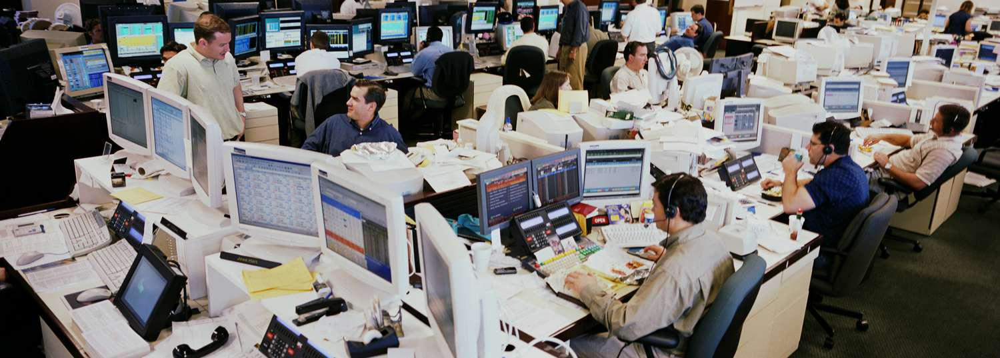

Boston, known for its rich history and academic prominence, is also a vital hub in the financial market landscape of the United States. The city hosts a diverse range of financial institutions, including banks, investment firms, and insurance companies, playing a key role in both regional and national financial ecosystems.

The Boston Stock Exchange (BSE) has been instrumental in Boston's financial infrastructure. Founded in the early 19th century, the BSE emerged as a significant platform for trading stocks and securities, facilitating the growth and stability of regional enterprises. It acted as a pivotal node for both small local businesses and larger national corporations, contributing to Boston’s reputation as a financial center.

In recent times, algorithmic trading has revolutionized financial markets globally, including those in Boston. This method of trading uses computer programs to execute trades at high speeds and volume, based on pre-set criteria. The importance of algorithmic trading lies in its ability to enhance market efficiency, reduce transaction costs, and allow for complex trading strategies that were previously impractical. The integration of technology into trading systems has transformed the way markets operate and interact.

This article aims to explore the historical and contemporary significance of the Boston Stock Exchange and the transformative impact of algorithmic trading. It will cover the development and eventual acquisition of the BSE by Nasdaq, its role in regional finance, and how algorithmic trading is shaping modern financial markets. By examining these key aspects, the article will provide a comprehensive understanding of how financial technologies are influencing market dynamics and what future trends might bring for traders and exchanges alike. The discussion will focus on the BSE’s journey and the evolution of algorithmic trading as critical components of today's financial narratives.

## Table of Contents

## History of the Boston Stock Exchange (BSE)

The Boston Stock Exchange (BSE) has played a significant role in the financial landscape of both Boston and the United States. Established in 1834, it was one of the first stock exchanges in the U.S., reinforcing Boston’s position as a crucial commercial hub in the 19th century. The BSE was founded to provide a formal venue for trading securities, primarily serving regional banks, railroads, and other New England-based companies.

Over the decades, several milestones defined the evolution of the BSE. In the late 19th century, the BSE expanded its trading activities to include a wider range of securities, contributing to its growth in volume and importance. The introduction of new technologies, such as electronic trading platforms in the late 20th century, enhanced the efficiency and accessibility of the exchange. These advancements allowed BSE to remain competitive and relevant as global financial markets rapidly evolved.

A pivotal moment in the history of the BSE came in the early 21st century when Nasdaq acquired it in 2007. This acquisition marked a strategic move by Nasdaq to expand its footprint in the U.S. equities market and integrate the BSE's operations and technology into its broader network of exchanges. This transition enabled more efficient operations through improved technology and expanded Nasdaq's presence in the northeastern U.S., directly impacting how trades were executed and settled.

Several key companies have historically been associated with the BSE, including prominent financial institutions like State Street Corporation and regional energy companies vital to New England's economy. These associations highlight BSE's role in facilitating capital formation and investment in regional industries.

The BSE's impact on both regional and national finance has been substantial. Regionally, it allowed local businesses to raise capital more efficiently, contributing to economic growth and job creation in New England. Nationally, the BSE provided a competitive platform for trading, which helped to democratize access to financial markets and paved the way for future innovations in stock exchange operations.

In summary, the BSE has been instrumental in shaping the financial ecosystem of Boston and the broader United States through its longstanding commitment to providing a reliable marketplace for securities trading, adapting to technological advancements, and influencing the structure of modern stock exchanges through its integration into Nasdaq's network.

## Understanding the Boston Stock Exchange

The Boston Stock Exchange (BSE) was a regional stock exchange based in Boston, Massachusetts, that played a pivotal role in the U.S. financial landscape prior to its acquisition by Nasdaq. Before the acquisition, the BSE functioned as a key player among regional exchanges, offering a platform for trading a variety of financial instruments, including equities and options. The exchange's operations were designed to cater to local and national businesses, providing an important marketplace for both regional and nationally recognized stocks.

Before its integration into Nasdaq, the BSE was distinct for its unique position within the U.S. stock exchange hierarchy. While it was smaller compared to major players like the New York Stock Exchange (NYSE) and Nasdaq, the BSE carved out a niche for itself by focusing on the needs of regional companies and smaller firms that required a trading venue rebuffing the complexities and congestion sometimes associated with larger national exchanges. This strategic positioning allowed the BSE to serve as a vital incubator for company listings that eventually transitioned to bigger platforms as they expanded.

The Boston Stock Exchange offered several key features and services, including a streamlined process for company listings and an accessible platform for investors. This regional exchange was also known for its robust trading technology and customer relations, fostering an environment conducive to efficient and effective market transactions. Additionally, the BSE provided educational resources and initiatives to promote market literacy and support the financial ecosystem in Boston and beyond.

The Boston Options Exchange (BOX) was a significant component of the BSE's operations. Established in 2002 as an equity options market, BOX was pivotal in enhancing the BSE's offerings by allowing for the trading of options, a crucial derivative instrument. The BOX market introduced electronic trading to the BSE, significantly increasing the speed and efficiency of options transactions and expanding the BSE's reach in the derivatives market. This innovation positioned the BSE as a forward-thinking exchange in terms of technology and market offerings.

The transition and integration of the BSE into Nasdaq marked a significant evolution in its operational history. The acquisition in 2007 was aimed at expanding Nasdaq's market share and bringing about operational efficiencies. The integration involved consolidating the BSE's trading systems with Nasdaq's superior technological infrastructure, ultimately leading to enhanced [liquidity](/wiki/liquidity-risk-premium), broader market access, and improved trading functionalities for market participants. This transition also meant the rebranding of the BSE operations, with Nasdaq capitalizing on the exchange's strengths while phasing out its independent identity.

As part of this integration, the BSE's technological systems were upgraded to match Nasdaq's advanced trading and market surveillance capabilities, enhancing overall market transparency and security. This move benefited traders through improved order execution and access to Nasdaq's broad array of financial products and services. Consequently, the BSE's legacy of supporting regional financial markets was absorbed into Nasdaq's global exchange network, marking the end of an era and the beginning of a new chapter for the Boston market.

 to Algorithmic Trading

Algorithmic trading refers to the use of computer algorithms to automate the process of trading financial securities. These algorithms follow pre-defined sets of rules and instructions for making trade decisions, executing orders, and managing portfolios. They are designed to analyze market data at high speeds and execute trades based on that data without direct human intervention. 

The emergence of [algorithmic trading](/wiki/algorithmic-trading) in financial markets can be traced back to the late 20th century, aligning with advancements in computing technology and electronic trading platforms. This type of trading quickly gained traction due to its ability to process large amounts of data and transact orders faster than a human trader could manage manually. It has evolved from simple algorithmic applications to more complex strategies involving [artificial intelligence](/wiki/ai-artificial-intelligence) and [machine learning](/wiki/machine-learning).

Key concepts associated with algorithmic trading include high-frequency trading ([HFT](/wiki/high-frequency-trading-strategies)), algorithms, and automation. High-frequency trading is a subset of algorithmic trading characterized by rapid execution and a high [volume](/wiki/volume-trading-strategy) of trades within very short time frames. It leverages high-speed connections and sophisticated programs to capitalize on small price fluctuations. Algorithms are essentially the sets of rules or instructions that the trading systems follow. Automation is the process that enables these algorithms to operate independently once they are deployed, reducing the need for human intervention.

The advantages of algorithmic trading are manifold. Speed is perhaps the most significant benefit, as algorithms can analyze and respond to market conditions faster than any human. This rapid execution can lead to better pricing opportunities. Efficiency is another benefit, as algorithmic trading can simultaneously track and manage multiple securities across different markets and time zones. Accuracy is an additional advantage, with algorithms consistently following instructions without the risk of human error, such as emotional bias or oversight.

However, algorithmic trading is not without its challenges and risks. The most prominent risk is the potential for system failures or bugs within the algorithms, which could lead to significant financial losses. Moreover, the market impact of algorithmic trading can exacerbate [volatility](/wiki/volatility-trading-strategies), especially in instances where many algorithms react to a market event simultaneously. The complexity of these algorithms also means they can be difficult to monitor and regulate, leading to challenges in ensuring compliance with market regulations.

In recent years, regulatory bodies have taken steps to address some of the challenges posed by algorithmic trading. Measures such as circuit breakers and order-to-execution ratios are examples of regulatory interventions designed to mitigate the risks associated with high-frequency trading and ensure market stability.

## Role of Algorithmic Trading in Today's Markets

Algorithmic trading has become a dominant force in modern financial markets, particularly among institutional investors who leverage sophisticated algorithms to gain competitive advantages. The technology's prevalence is driven by its ability to execute large volumes of trades with precision and swiftness that human traders cannot match. This capability has significantly impacted trading volumes and market liquidity, making markets more efficient but also more volatile.

### Prevalence and Popularity among Institutional Investors

Institutional investors, such as hedge funds, mutual funds, and proprietary trading firms, heavily rely on algorithmic trading. The primary allure lies in its capacity to process vast data sets and execute orders at speeds measured in milliseconds. This efficiency is pivotal in exploiting market inefficiencies and achieving favorable pricing, leading to increased adoption rates across the sector.

### Impact on Trading Volumes and Market Liquidity

Algorithmic trading accounts for a significant proportion of total trading volumes in major exchanges. In the U.S. equity market, for example, algorithms are responsible for over 60% of trading activities. This high level of participation enhances market liquidity by reducing bid-ask spreads and enabling quicker price adjustments to new information. However, it can also amplify price swings during periods of market stress, contributing to phenomena such as "flash crashes."

### Common Strategies Employed in Algorithmic Trading

A variety of strategies underpin algorithmic trading operations. Some of the most common include:

- **Statistical Arbitrage**: Exploiting pricing inefficiencies between related financial instruments using statistical models.
- **Market Making**: Providing liquidity by simultaneously offering to buy and sell an asset, profiting from the spread.
- **Trend Following**: Using algorithms to identify and capitalize on market trends over differing time horizons.
- **Mean Reversion**: Betting that asset prices will revert to their historical averages over time.

### How Algorithms are Reshaping Market Dynamics

Algorithms have profoundly reshaped market dynamics by altering how trades are executed and prices are determined. The rapid execution capabilities lead to an increased number of transactions, influencing overall market behavior. Algorithmic trading promotes more continuous pricing alignments, creating an environment where assets reflect market information more swiftly than in manually-driven contexts. 

Furthermore, this has led to changes in market microstructure, with trading venues adapting to cater to algorithmic traders through mechanisms like co-location services, where traders position their servers in proximity to exchange servers to reduce latency.

### The Regulatory Framework Around Algorithmic Trading

As algorithmic trading grows, so too have regulatory efforts to manage its risks. Oversight bodies like the U.S. Securities and Exchange Commission (SEC) and the European Securities and Markets Authority (ESMA) have implemented various rules to mitigate associated risks. These include:

- **Market Abuse Regulations**: Preventing manipulative trading practices by employing surveillance systems to detect suspicious activities.
- **Circuit Breakers**: Market mechanisms designed to temporarily halt trading in response to rapid price declines, preventing cascading failures.
- **Registration and Reporting Requirements**: Ensuring algorithmic trading firms are properly documented and their activities are transparent to regulators.

This evolving regulatory landscape aims to balance the benefits of algorithmic trading with the need to safeguard market integrity and protect investors from potential destabilizing effects.

In conclusion, algorithmic trading continues to shape financial markets, driven by its efficiency and capability to navigate complex trading environments. The interplay between technological innovation and regulatory oversight will determine its future trajectory and impact on global market systems.

## Intersection of BSE and Algorithmic Trading

The Boston Stock Exchange (BSE) has historically been a fertile ground for the implementation and development of algorithmic trading. Before its acquisition by Nasdaq, the BSE facilitated the integration of algorithmic trading techniques as a means to enhance market efficiency and liquidity. The strategic positioning of Boston as a financial hub, bolstered by its academic institutions such as MIT and Harvard, has contributed to a conducive environment for technological innovation in financial markets. This environment played a crucial role in the early adoption of algorithmic trading at the BSE, allowing for the automation of complex trading strategies which improved transaction speeds and reduced human errors.

The acquisition of the BSE by Nasdaq in 2007 significantly influenced the role of algorithmic trading within its operations. Nasdaq's advanced technological infrastructure and global reach provided the BSE with enhanced capabilities, driving further innovations in trading strategies. Nasdaq's systems incorporated cutting-edge data handling and processing models, resulting in increased trading volumes and improved market liquidity for the BSE. This acquisition facilitated the integration of sophisticated algorithms that could capitalize on high-frequency trading opportunities, significantly transforming the BSE trading landscape.

In terms of international finance, the BSE has historically played a pioneering role by adopting algorithmic trading to facilitate cross-border transactions. The usage of algorithms enabled the processing of large volumes of trades with precision and speed, reducing the [arbitrage](/wiki/arbitrage) opportunities arising from price differentials across different markets. The ability to efficiently manage international trades gave the BSE a competitive edge and positioned it as a significant player in global financial markets.

Post-acquisition, algorithmic trading at the BSE has evolved with Nasdaq's influence, embracing developments in artificial intelligence and machine learning to further optimize trading strategies. Algorithms have become more sophisticated, incorporating predictive analytics to anticipate market trends and adjust trading strategies in real-time. This evolution has enhanced the BSE's capability to provide a robust trading platform, supporting a diverse array of financial instruments and strategies.

The transition of the BSE post-acquisition offers key lessons for other regional exchanges. Firstly, the importance of integrating advanced technological infrastructure to support algorithmic trading cannot be overstressed. Secondly, leveraging strategic partnerships or acquisitions can provide vital technological and operational enhancements. Lastly, continual innovation and adaptation to emerging technologies, such as AI and machine learning, are crucial for maintaining a competitive edge in the fast-evolving financial landscape. The BSE's journey illustrates the transformative potential of algorithmic trading and its significant impact on market dynamics and efficiency.

## Future Trends in Algorithmic Trading

Technological advancements continue to drive the evolution of algorithmic trading, significantly altering how financial markets operate. Key among these advancements are the developments in processing power, network speeds, and data analytics capabilities, which have collectively enhanced the speed and efficiency of trading algorithms.

AI and machine learning (ML) are poised to have a significant impact on the future of algorithmic trading. These technologies enable the development of sophisticated algorithms that can analyze vast amounts of data and identify patterns more effectively than traditional methods. Machine learning algorithms can adapt to new data and learn trading signals autonomously, potentially increasing the profitability and robustness of trading strategies. AI-driven algorithms can make predictive analytics more accurate, thereby improving decision-making processes and allowing for real-time strategy adjustments.

The introduction of quantum computing stands as another potential game-changer. While still in its nascent stages, quantum computing promises exponential increases in computational power, which could revolutionize the speed at which complex financial models are resolved. This could potentially lead to unprecedented levels of optimization in trading strategies.

As these technological developments progress, the regulatory environment surrounding algorithmic trading is expected to evolve as well. Regulators are increasingly focused on ensuring fair market practices and mitigating systemic risks associated with high-frequency trading (HFT) and other automated trading strategies. Future regulatory policies may include more stringent requirements for algorithmic trading firms to ensure transparency and stability in the markets.

For both new and existing traders, these advancements offer opportunities and challenges. On the one hand, traders can leverage these technologies to enhance trading precision and develop innovative strategies. On the other hand, the increased complexity and competition require traders to continuously update their technical skills and adapt to rapidly changing market conditions.

To summarize, the future of algorithmic trading is set to be shaped by technological innovations such as AI, machine learning, and quantum computing, alongside evolving regulatory frameworks. These changes are likely to redefine market dynamics, presenting both opportunities for growth and challenges requiring careful navigation.

## Conclusion

The Boston Stock Exchange (BSE) has played a significant role in the financial landscape, integrating modern trading technologies such as algorithmic trading to enhance its operations. Throughout the article, we explored the historical evolution of the BSE, its acquisition by Nasdaq, and the critical role algorithmic trading has assumed in today’s markets. 

Algorithmic trading, marked by its reliance on sophisticated algorithms and high-speed data processing, has fundamentally altered market dynamics. It offers advantages such as increased trading volumes, enhanced market liquidity, and improved accuracy in order execution. However, the rapid evolution and widespread adoption of algorithmic strategies have also introduced complexities. It is crucial to understand the regulatory landscape shaping these trading mechanisms to ensure market stability and fairness.

As we contemplate future financial markets, the implications of algorithmic trading are vast. With advancements in artificial intelligence and machine learning, algorithms are expected to become even more sophisticated, enabling traders to harness vast amounts of data for decision-making processes. This technological progression highlights the importance of understanding financial technologies, not only for industry professionals but also for investors keen on navigating the modern market. 

To effectively participate in and capitalize on these developments, continued learning and engagement in algorithmic trading is essential. There is significant opportunity for both new and experienced traders to deepen their knowledge through courses, tutorials, and hands-on practice. Understanding the interplay between technology and finance will equip market participants to better tackle future challenges and leverage the possibilities presented by innovative trading technologies.

## References and Further Reading

### List of Key Resources and Articles for Further Reading

1. **Books and Online Courses on Algorithmic Trading:**
   - *Algorithmic Trading: Winning Strategies and Their Rationale* by Ernest P. Chan. This book provides a deep insight into practical strategies and their conceptual backgrounds.
   - Coursera's course on [Algorithmic Trading Strategies](https://www.coursera.org/learn/algorithmic-trading-strategies) offers a comprehensive online learning experience that covers the essentials of algorithmic trading.
   - *Quantitative Trading: How to Build Your Own Algorithmic Trading Business* by Ernie Chan. This book is essential for anyone looking to establish a trading business.

2. **Guides and Tutorials for Novice Algo Traders:**
   - "Python for Finance: Algorithmic Trading" tutorial on Investopedia gives step-by-step instructions for beginners to start with Python in finance.
   - The [QuantInsti blog](https://blog.quantinsti.com/) shares practical algorithmic trading guides and tips from industry practitioners.
   - *Algorithmic Trading & Quantitative Analysis Using Python & R* on Udemy provides practical insights into using these programming languages for trading.

3. **Policy Documents and White Papers on Market Regulations:**
   - The Securities and Exchange Commission (SEC) provides updated guidelines and white papers on the regulation of high-frequency and algorithmic trading, accessible on their [official website](https://www.sec.gov).
   - "The Impact of HFT: Recent Papers" is a valuable resource compiling various academic studies on high-frequency trading, available through the [CFTC](https://www.cftc.gov) website.
   - The European Securities and Markets Authority (ESMA) regularly publishes detailed reports and guidelines on algo trading and market integrity.

4. **Acknowledgments:**
   - Special thanks to the contributions from Dr. Andrew F. Haldane, who has been influential in the study of market regulations related to algorithmic trading.
   - Recognition to featuring experts such as Dr. Ernest P. Chan and his role in advancing the understanding of quantitative trading approaches.
   - Appreciation for academic contributions from MIT's Sloan School of Management, particularly in the area of finance technologies and their implications.

These resources and materials provide foundational knowledge and emerging insights into the complexities of algorithmic trading, offering valuable perspectives for both novice and professional traders.

## References & Further Reading

[1]: Chan, E. P. (2013). ["Algorithmic Trading: Winning Strategies and Their Rationale."](https://github.com/ftvision/quant_trading_echan_book) Wiley.

[2]: Chan, E. P. (2009). ["Quantitative Trading: How to Build Your Own Algorithmic Trading Business."](https://github.com/ftvision/quant_trading_echan_book) Wiley.

[3]: Jansen, S. (2020). ["Machine Learning for Algorithmic Trading."](https://github.com/stefan-jansen/machine-learning-for-trading) Packt Publishing.

[4]: Lopez de Prado, M. (2018). ["Advances in Financial Machine Learning."](https://www.amazon.com/Advances-Financial-Machine-Learning-Marcos/dp/1119482089) Wiley.

[5]: SEC. (n.d.). ["Algorithmic Trading and Market Structure: The Broker Perspective."](https://www.sec.gov/files/Algo_Trading_Report_2020.pdf) Retrieved from U.S. Securities and Exchange Commission website. 

[6]: ESMA. (n.d.). ["High-frequency trading activity in EU equity markets."](https://www.esma.europa.eu/sites/default/files/library/2015/11/esma20141_-_hft_activity_in_eu_equity_markets.pdf) European Securities and Markets Authority. 

[7]: Aronson, D. R. (2006). ["Evidence-Based Technical Analysis: Applying the Scientific Method and Statistical Inference to Trading Signals."](https://www.amazon.com/Evidence-Based-Technical-Analysis-Scientific-Statistical/dp/0470008741) Wiley.