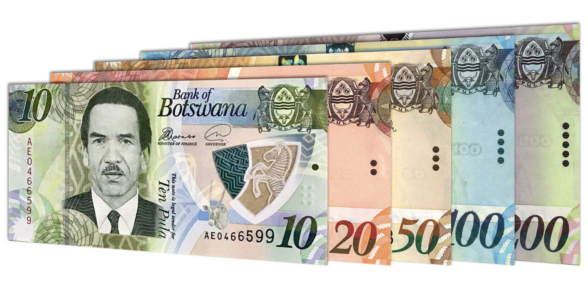

## Table of Contents

## What is the Botswana Pula and when was it introduced?

The Botswana Pula is the official currency of Botswana, a country located in southern Africa. The word "Pula" means "rain" in the Setswana language, which is significant because rain is very important in this mostly dry region. The currency is made up of units called thebe, which means "shield."

The Botswana Pula was first introduced on August 23, 1976. Before that, Botswana used the South African Rand as its currency. The introduction of the Pula was an important step for Botswana because it showed that the country was becoming more independent and was able to manage its own money.

## How did the Botswana Pula get its name?

The Botswana Pula got its name from the Setswana word "Pula," which means "rain." In Botswana, rain is very important because the country is mostly dry. People there see rain as a blessing that helps their crops grow and their animals stay healthy. So, naming the currency "Pula" shows how much rain means to the people of Botswana.

The smaller unit of the Pula is called thebe, which means "shield" in Setswana. This name was chosen to represent protection and strength. Together, the names Pula and thebe reflect the values and hopes of the people of Botswana, connecting their currency to their land and culture.

## What is the symbol and currency code for the Botswana Pula?

The symbol for the Botswana Pula is P. It looks like a capital letter P with a line through it. This symbol is used when writing down amounts of money in Botswana.

The currency code for the Botswana Pula is BWP. This code is used in places like banks and on computers when people need to talk about or work with the Pula. It helps to make sure everyone knows which currency they are using.

## What are the denominations of the Botswana Pula in circulation?

The Botswana Pula comes in different forms: coins and banknotes. The coins are worth 5 thebe, 10 thebe, 25 thebe, 50 thebe, 1 Pula, 2 Pula, and 5 Pula. The coins help people pay for smaller things, like buying snacks or a bus ticket.

The banknotes are worth more and come in 10 Pula, 20 Pula, 50 Pula, 100 Pula, and 200 Pula. These notes are used for bigger purchases, like shopping for groceries or paying bills. All these different amounts make it easy for people in Botswana to use their money every day.

## How has the value of the Botswana Pula changed since its introduction?

Since it was first introduced in 1976, the value of the Botswana Pula has changed quite a bit. When it started, the Pula was tied to the US dollar and the South African Rand. This meant its value stayed the same as these currencies for a while. But over time, Botswana decided to let the Pula's value change on its own, based on how the country's economy was doing. This made the Pula's value go up and down, but overall, it has stayed pretty strong compared to other African currencies.

In the early years, the Pula was strong because Botswana had a lot of diamonds and managed its money well. But as time went on, the value of the Pula slowly went down compared to the US dollar. For example, in the 1980s, 1 Pula was worth about 1 US dollar, but now it takes more than 10 Pula to get 1 US dollar. Even though the Pula's value has gone down against the dollar, it is still seen as a stable currency in Africa because Botswana's economy is strong and well-managed.

## What factors influence the value of the Botswana Pula in the foreign exchange market?

The value of the Botswana Pula in the foreign exchange market is influenced by several key factors. One big [factor](/wiki/factor-investing) is the country's economy. Botswana has a lot of diamonds, and when it sells more diamonds, it earns more money from other countries. This can make the Pula stronger. Also, if Botswana's economy is doing well and growing, people trust the Pula more, which can help its value.

Another important factor is the world's view of Botswana's money policies. If other countries think Botswana is good at managing its money, they will want to buy more Pula, which makes it stronger. But if they think Botswana is not doing a good job, they might not want to buy Pula, which can make it weaker. Also, what happens in the world economy can affect the Pula. If the US dollar or other big currencies change a lot, it can push the Pula's value up or down.

## How does the Bank of Botswana manage the Pula's exchange rate?

The Bank of Botswana manages the Pula's exchange rate by using a system called a crawling peg. This means they let the Pula's value change slowly over time instead of staying the same or changing suddenly. They decide how fast the Pula should change by looking at things like how much inflation there is in Botswana and how the country's economy is doing. If they think the Pula is getting too strong or too weak, they can change how fast it changes to keep it stable.

The Bank of Botswana also buys and sells foreign money to help control the Pula's value. If they think the Pula is getting too weak, they can use their foreign money to buy Pula, which makes it stronger. If they think the Pula is getting too strong, they can sell Pula and get foreign money instead, which makes the Pula weaker. This way, they can keep the Pula's value steady and help Botswana's economy stay healthy.

## What are the major trading partners of Botswana and how do they impact the Pula?

Botswana's major trading partners are countries like South Africa, Belgium, and the United States. South Africa is very important because it is close to Botswana and they trade a lot of things like food, machines, and cars. Belgium is a big buyer of Botswana's diamonds, which are a very important part of Botswana's money. The United States also buys diamonds and other things from Botswana.

These trading partners can affect the value of the Botswana Pula. When Botswana sells a lot of diamonds to Belgium and the United States, it earns more foreign money, which can make the Pula stronger. If South Africa's economy is doing well, it can buy more things from Botswana, which also helps the Pula. But if these countries buy less from Botswana or if their own money gets weaker, it can make the Pula weaker too. So, what happens in these countries can have a big impact on the Pula's value.

## How does the Pula's peg to a basket of currencies work and what currencies are included?

The Botswana Pula is not tied to just one currency. Instead, it is connected to a group of currencies, which is called a basket. This basket helps make the Pula's value more stable because it is based on several strong currencies instead of just one. The Bank of Botswana decides how much each currency in the basket affects the Pula's value. This way, if one currency in the basket gets weaker, the others can help keep the Pula steady.

The exact mix of currencies in the basket is not always shared with everyone, but it usually includes important currencies like the US dollar, the Euro, and the South African Rand. The Bank of Botswana looks at how these currencies are doing and adjusts the Pula's value slowly over time. This slow change, or crawling peg, helps keep the Pula's value from jumping up or down too suddenly, which is good for Botswana's economy.

## What are the historical highs and lows of the Botswana Pula against major world currencies?

Since it started in 1976, the Botswana Pula has had some big changes in how much it is worth compared to big world currencies. In the early years, the Pula was strong because Botswana had a lot of diamonds and did a good job with its money. For example, in the 1980s, 1 Pula was about the same as 1 US dollar, which was a high point for the Pula against the dollar. But over time, the Pula's value went down compared to the US dollar. Now, it takes more than 10 Pula to get 1 US dollar, which shows how the Pula has changed a lot since it began.

Against other major currencies like the Euro and the British Pound, the Pula has also seen ups and downs. At its highest, the Pula was worth a lot more compared to these currencies than it is now. For example, in the early 2000s, the Pula was at its strongest against the Euro, with 1 Pula being worth more than 0.2 Euros. But now, it takes about 12 Pula to get 1 Euro. The same goes for the British Pound; the Pula's value has gone down over time, with 1 Pula now being worth much less than it used to be. These changes show how the Pula has moved over the years against different world currencies.

## How do global economic events affect the Botswana Pula's performance in the forex market?

Global economic events can have a big impact on the Botswana Pula's value in the [forex](/wiki/forex-system) market. When big things happen around the world, like a financial crisis or changes in big countries' economies, it can make the Pula go up or down. For example, if the US dollar gets stronger because of good news in the US, the Pula might get weaker because it takes more Pula to buy the same amount of US dollars. Also, if there is a big drop in the price of diamonds, which Botswana sells a lot of, it can hurt the country's money coming in and make the Pula weaker.

Another way global events affect the Pula is through trade. If Botswana's big trading partners, like South Africa, Belgium, or the United States, have problems with their economies, they might buy less from Botswana. This can mean less money coming into Botswana, which can make the Pula weaker. On the other hand, if these countries are doing well and buying more from Botswana, it can help the Pula stay strong or even get stronger. So, what happens around the world can really change how the Pula does in the forex market.

## What are the future prospects and potential challenges for the Botswana Pula in the global forex market?

The future of the Botswana Pula in the global forex market looks good because Botswana has a strong and stable economy. The country has a lot of diamonds, which it sells to other countries for money. As long as the world keeps wanting diamonds, Botswana can keep [earning](/wiki/earning-announcement) money and help the Pula stay strong. Also, the Bank of Botswana is good at managing the country's money, using a system called a crawling peg to keep the Pula's value steady. If Botswana keeps doing well with its economy and managing its money, the Pula should do well in the forex market.

But there are also some challenges that could make things harder for the Pula. One big challenge is that the world's economy can change a lot. If there is a big financial crisis or if the price of diamonds goes down, it could hurt Botswana's money coming in and make the Pula weaker. Another challenge is that Botswana relies a lot on a few big trading partners like South Africa, Belgium, and the United States. If these countries have problems with their economies, they might buy less from Botswana, which could also make the Pula weaker. So, while the Pula has good prospects, it also faces some risks that could affect its value in the global forex market.

## References & Further Reading

[1]: Bergstra, J., Bardenet, R., Bengio, Y., & Kégl, B. (2011). ["Algorithms for Hyper-Parameter Optimization."](https://dl.acm.org/doi/10.5555/2986459.2986743) Advances in Neural Information Processing Systems 24.

[2]: ["Advances in Financial Machine Learning"](https://www.amazon.com/Advances-Financial-Machine-Learning-Marcos/dp/1119482089) by Marcos Lopez de Prado

[3]: ["Evidence-Based Technical Analysis: Applying the Scientific Method and Statistical Inference to Trading Signals"](https://www.amazon.com/Evidence-Based-Technical-Analysis-Scientific-Statistical/dp/0470008741) by David Aronson

[4]: ["Machine Learning for Algorithmic Trading"](https://github.com/stefan-jansen/machine-learning-for-trading) by Stefan Jansen

[5]: ["Quantitative Trading: How to Build Your Own Algorithmic Trading Business"](https://www.amazon.com/Quantitative-Trading-Build-Algorithmic-Business/dp/1119800064) by Ernest P. Chan