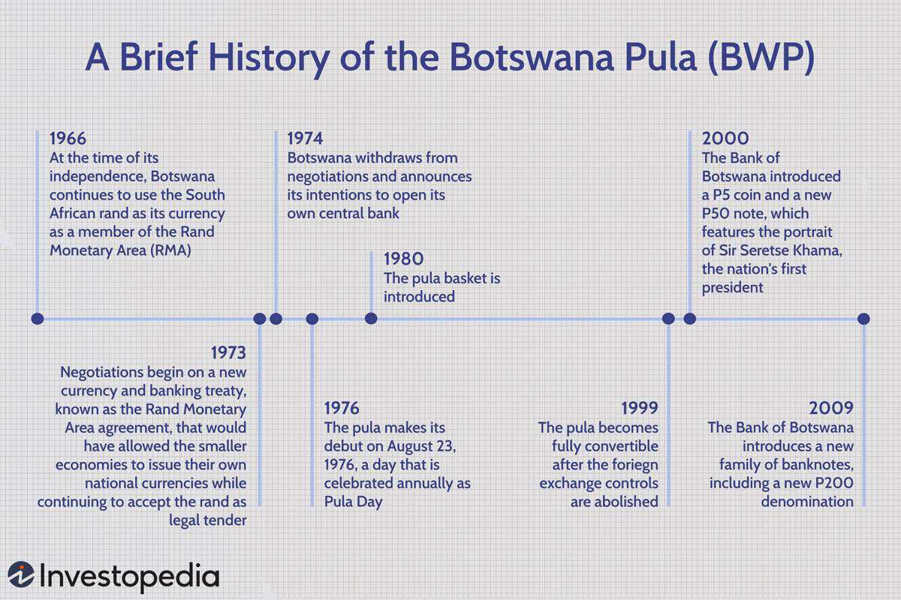

Forex trading and algorithmic trading have revolutionized the financial markets, offering traders sophisticated tools to analyze and execute trades. In this rapidly evolving environment, the Botswana Pula (BWP) emerges as a unique investment opportunity. The BWP is not only a symbol of Botswana's economic stability but also an intriguing subject for traders looking to diversify their forex portfolios.

The Botswana Pula stands out due to its robust economic underpinnings. Botswana's economy, heavily dependent on diamond mining, has maintained consistent growth over the years, coupled with a well-structured financial system. These factors contribute to the Pula's stability and attractiveness in the forex market. Issued by the Bank of Botswana, the Pula is carefully managed against a basket of currencies, which includes the South African Rand and the International Monetary Fund’s Special Drawing Rights. This pegging strategy aids in stabilizing the Pula against the volatility often seen in other African currencies.



Algorithmic trading further enhances the appeal of the BWP in the forex market. By employing pre-programmed trading strategies and leveraging artificial intelligence, traders can efficiently navigate the complexities of forex trading. Algorithms can process vast amounts of data rapidly, enabling traders to identify profitable trading opportunities and execute trades at optimal times. This technology empowers traders to maximize profits and manage risks effectively.

The Botswana Pula's significance is further accentuated by its distinctive characteristics that differentiate it from other currencies in both the African and global forex landscapes. As a stable currency in a politically stable country, the BWP offers traders a novel opportunity to engage with the African market, which is increasingly gaining prominence. For traders seeking competitive advantages, the strategic implementation of algorithmic trading solutions can unlock the potential of the BWP, providing valuable insights and driving informed trading decisions.

In conclusion, the Botswana Pula presents a fertile ground for forex trading innovations. By understanding its economic significance and utilizing advanced algorithmic strategies, traders can tap into this unique opportunity within the forex market. As the trading landscape continues to evolve, the BWP stands as an emblem of stability and growth, both in Africa and beyond.

## Table of Contents

## Understanding the Botswana Pula

The Botswana Pula (BWP) serves as the official currency of Botswana, introduced on August 23, 1976, replacing the South African Rand. The transition was a significant step for Botswana, symbolizing economic independence. The Pula, meaning "rain" in Setswana, underscores the importance of rain in the largely arid country and represents prosperity. 

Economically, Botswana has built a reputation for stability, largely due to its governance practices and prudent economic policies. At the heart of its economic stability is the Botswana Pula, managed by the Bank of Botswana. The currency's value is anchored to a basket of currencies, prominently influenced by the South African Rand (ZAR) and the International Monetary Fund's Special Drawing Rights (SDRs). This pegging system helps stabilize the Pula against [volatility](/wiki/volatility-trading-strategies), especially considering Botswana's trading relationships and economic dependencies.

Historically, Botswana's economy has been driven by diamond mining, which contributes significantly to national revenue. This economic backbone has allowed Botswana to maintain a stable currency, avoiding the hyperinflation issues that have plagued some of its regional neighbors. Diversification efforts have gradually included sectors like tourism and financial services, but diamonds remain pivotal. For [forex](/wiki/forex-system) traders, understanding Botswana's heavy reliance on commodities, especially diamonds, is crucial. Fluctuations in international diamond prices can directly affect national economic outcomes and, by extension, the valuation of the Pula.

Traders and investors need to be cognizant of various economic indicators that influence the Pula's valuation. Botswana's fiscal policy, inflation rates, and trade balance are critical factors, as is its relationship with South Africa, given the Rand's significant sway in the currency basket. Moreover, the Pula's exchange rate mechanism, which involves periodic adjustments to maintain competitiveness, offers insights into its valuation trends.

In summary, the Botswana Pula embodies a stable currency tied closely to the country's economic health, with its valuation influenced by its major trading partner's currencies and global commodity prices. For investors and traders, recognizing these dynamics is essential for successful engagement with the BWP in the forex market.

## The Role of Algorithmic Trading in the Forex Market

Algorithmic trading has revolutionized the forex market by leveraging advanced computational techniques to execute trades with speed and precision. At its core, [algorithmic trading](/wiki/algorithmic-trading) involves the use of pre-programmed strategies and [artificial intelligence](/wiki/ai-artificial-intelligence) to analyze vast amounts of data and make trading decisions autonomously. This approach not only enhances decision-making capabilities but also maximizes profits and mitigates risks by eliminating human error and emotional biases from the trading process.

A key advantage of algorithmic trading is its ability to process and react to market data much faster than human traders. Algorithms can analyze patterns, trends, and price movements in real-time, allowing traders to capitalize on short-lived opportunities that might otherwise be missed. For instance, algorithms can be designed to recognize specific price patterns or technical indicators, triggering trades automatically when certain conditions are met.

In the forex market, the incorporation of algorithmic trading strategies is especially beneficial given the market's high [liquidity](/wiki/liquidity-risk-premium) and around-the-clock trading hours. This enables algorithms to operate continuously, seizing opportunities across different time zones without the constraint of human working hours.

When it comes to trading the Botswana Pula (BWP), algorithmic trading must take into account regional trade policies and commodity prices, particularly diamonds, which are central to Botswana's economy. As one of the world's leading diamond producers, Botswana's economic health and, by extension, the value of the Pula are closely tied to the diamond industry. Algorithms that [factor](/wiki/factor-investing) in changes in diamond prices or shifts in mining policies can provide significant insights and advantages.

For example, to develop an effective algorithm for trading BWP, one might consider the following Python pseudocode:

```python
def evaluate_trade_opportunity(market_data, diamond_price):
    # Define threshold for significant diamond price change
    threshold = 0.05  # 5%

    # Evaluate if the change in diamond price is significant
    if abs(diamond_price - market_data['current_diamond_price']) / market_data['current_diamond_price'] > threshold:
        # Analyze patterns in BWP price movement
        if market_data['BWP_trend'] == 'upward' and diamond_price > market_data['current_diamond_price']:
            return "Buy"
        elif market_data['BWP_trend'] == "downward" and diamond_price < market_data['current_diamond_price']:
            return "Sell"
    return "Hold"
```

In this pseudocode, the algorithm assesses whether there is a significant change in diamond prices and correlates this with the current trend of the BWP to make trading decisions. An upward trend in the BWP coupled with rising diamond prices might trigger a 'Buy' signal, while the opposite scenario could lead to a 'Sell' recommendation.

In summary, algorithmic trading in the forex market facilitates rapid and informed trading decisions that align with prevailing economic conditions and market data. For currencies like the Botswana Pula, understanding economic drivers such as regional trade policies and diamond prices is crucial. By integrating these factors into algorithmic trading models, traders can optimize their strategies for better performance in the market.

## Common FX Pairs with Botswana Pula and Trading Strategies

The Botswana Pula (BWP) is a distinctive currency in the forex market, often traded against major currencies such as the US Dollar (USD), South African Rand (ZAR), and Euro (EUR). Each of these pairs demonstrates unique characteristics influenced by economic and geopolitical factors, which traders can exploit using various strategies.

### Popular Trading Pairs

**BWP/USD**: This pair is influenced by the economic conditions in Botswana and the United States. The USD serves as a global benchmark currency, and its strength or weakness significantly impacts this pair's volatility and trading volume. Market participants often watch for U.S. Federal Reserve policies and Botswana's economic data, such as GDP growth and inflation rates.

**BWP/ZAR**: With Botswana's close economic ties to South Africa, the BWP/ZAR pair is heavily influenced by regional trade policies and South Africa's economic conditions. Factors affecting this pair include commodity prices (especially precious metals), as both countries rely significantly on mining sectors.

**BWP/EUR**: The BWP/EUR pair is affected by Eurozone economic stability and Botswana's trade balances with European countries. This pair can exhibit changes driven by major EU economic announcements and shifts in monetary policy.

### Trading Strategies for BWP Pairs

**Trend Following**: Trend following involves identifying and capitalizing on an ongoing price movement. For BWP pairs, traders can utilize this strategy by analyzing historical price data to identify consistent upward or downward trends. Technical indicators such as the Moving Average Convergence Divergence (MACD) and Average Directional Index (ADX) can be employed to confirm these trends.

**Breakout Trading**: This strategy seeks to enter the market when the price breaks through a significant resistance or support level, swinging sharply thereafter. Breakout traders often use analytics like Bollinger Bands or the Relative Strength Index (RSI) to spot potential breakouts, specifically around critical economic announcements pertinent to Botswana or its trading partners.

**Carry Trade**: This strategy involves borrowing a currency with a low-interest rate (e.g., Japanese Yen) and investing in one with a higher interest rate (e.g., Botswana Pula). The carry trade's success depends on stable interest rate differentials, making it viable if Botswana maintains higher rates relative to other developed economies.

### Leveraging Historical Data and Market Trends

In algorithmic trading, historical data analysis is paramount for predicting future price movements and optimizing strategies. Python, with libraries such as Pandas and NumPy, can be utilized to perform complex data analyses. For instance:

```python
import pandas as pd
import numpy as np

# Load historical BWP/USD data
data = pd.read_csv('bwp_usd.csv') 
prices = data['Close']

# Calculate moving average
moving_average = prices.rolling(window=20).mean()

# Identify trends
is_trending_up = prices > moving_average
```

Such analyses help in understanding historical trends and developing automated strategies that execute trades based on predefined conditions. Incorporating market sentiment analysis and economic indicators into these models can further refine the trading process, ensuring the algorithms adapt to dynamic market environments efficiently.

By applying these strategies and techniques, traders can enhance their ability to navigate the complexities of the BWP forex market, potentially yielding higher returns while mitigating risks.

## Technical Analysis for BWP Trading

Technical analysis plays a critical role in forex trading, providing insights into price movements and trends that are crucial when dealing with Botswana Pula (BWP) pairs. By analyzing historical price data, traders can anticipate market movements and make informed trading decisions.

**Price Charts and Trend Lines**

Price charts are foundational tools in technical analysis, helping traders visualize price movements over time. Common chart types include line charts, bar charts, and candlestick charts. For BWP trading, candlestick charts are especially valuable as they display high, low, opening, and closing prices, offering comprehensive insights into market dynamics. Traders often draw trend lines on these charts to identify prevailing market directions. A trend line connects two or more price points, and its slope indicates whether the market is bullish (uptrend) or bearish (downtrend).

**Technical Indicators**

Technical indicators are quantitative tools applied to price charts to identify patterns and trends. Key indicators used in BWP trading include:

- **Moving Averages (MA):** These smooth out price data by creating a constantly updated average price. Common types include Simple Moving Average (SMA) and Exponential Moving Average (EMA). For instance, a 50-day SMA would sum the prices of BWP over the past 50 days and divide by 50. This helps in identifying long-term trends.

    ```python
    import pandas as pd

    def calculate_sma(data, window):
        return data.rolling(window=window).mean()

    bwp_prices = pd.Series([...])
    sma_50 = calculate_sma(bwp_prices, 50)
    ```

- **Relative Strength Index (RSI):** This momentum oscillator measures the speed and change of price movements on a scale of 0 to 100. An RSI above 70 typically indicates an overbought condition, while below 30 signals oversold conditions. It's particularly useful for identifying potential reversal points in BWP pairs.

    ```python
    def calculate_rsi(data, periods=14):
        delta = data.diff(1)
        gain = delta.where(delta > 0, 0)
        loss = -delta.where(delta < 0, 0)
        avg_gain = gain.rolling(window=periods).mean()
        avg_loss = loss.rolling(window=periods).mean()
        rs = avg_gain / avg_loss
        rsi = 100 - (100 / (1 + rs))
        return rsi

    rsi_bwp = calculate_rsi(bwp_prices)
    ```

**Integrating Technical Analysis with Algorithmic Trading**

Integrating these technical tools with algorithmic trading strategies enhances their effectiveness. Algorithms can be programmed to automatically execute trades when certain technical conditions are met, such as a crossover of moving averages or when RSI reaches overbought/oversold thresholds. This automation allows for swift decision-making, mitigating human error and emotional biases.

For instance, an algorithm might be set to buy BWP/USD when the 20-day EMA crosses above the 50-day EMA (a bullish signal) and sell when the opposite occurs. Moreover, continuously [backtesting](/wiki/backtesting) these strategies on historical BWP data can optimize performance and refine predictive accuracy.

In conclusion, technical analysis not only offers a quantitative foundation for understanding BWP market dynamics but, when integrated with algorithmic trading, forms a powerful approach for enhancing trading performance and achieving more consistent results in the forex market.

## Selecting a Forex Broker for BWP Trading

Choosing the right forex broker is integral to a successful trading experience, especially when dealing with Botswana Pula (BWP) pairs. A carefully selected broker can enhance your trading capabilities by offering the right tools, resources, and market access needed for effective decision-making.

### Key Considerations

1. **Regulation and Security**: The first and foremost consideration when selecting a forex broker is regulation. Trusted regulatory authorities such as the Financial Conduct Authority (FCA) in the UK, the Australian Securities and Investments Commission (ASIC), and the Cyprus Securities and Exchange Commission (CySEC) provide a level of assurance regarding the broker's adherence to industry standards. A regulated broker ensures your investments are protected and operates under stringent financial policies. 

2. **Trading Fees**: Depending on the broker, trading fees can include spreads, commissions, and overnight financing costs. Understanding the fee structure is crucial as it directly impacts your trading profitability. Lower fees may attract beginners, but it is essential to balance these costs with the quality of service and features offered.

3. **Trading Platforms**: A versatile and user-friendly trading platform is vital for executing trades efficiently. Industry-standard platforms like MetaTrader 4 (MT4) and MetaTrader 5 (MT5) are preferred for their comprehensive features, including real-time market access, advanced charting tools, and automated trading capabilities. MT5, in particular, offers enhanced functionalities such as market depth, fundamental analysis tools, and more timeframes for traders seeking to implement sophisticated algorithmic strategies.

4. **Customer Support**: Effective customer service can significantly impact your trading experience, particularly in resolving issues related to account management, technical difficulties, or trading queries. Brokers offering 24/7 support via multiple channels, such as live chat, email, and phone, can provide timely assistance, crucial for forex trading across different time zones.

### Popular Brokers for BWP Trading

1. **FXPro**: Known for its robust market access and MT4/MT5 platforms, FXPro is a reputable choice among traders. It offers competitive spreads and transparent pricing with a global presence in several financial markets.

2. **Saxo Bank**: Saxo Bank is recognized for its extensive range of trading instruments and strong regulatory background. It provides access to proprietary trading platforms alongside the popular MT4, suitable for traders focusing on algorithmic strategies.

3. **IG Group**: With a history of providing reliable trading services, IG Group offers numerous currency pairs, including BWP-related ones. The platform is renowned for its educational resources and cutting-edge trading tools, ideal for both novice and experienced traders.

### Conclusion

Selecting a forex broker for BWP trading involves a careful evaluation of regulation, trading fees, available platforms, and customer support. By considering these factors, traders can ensure a secure and efficient trading experience. Leveraging platforms like MT4 and MT5 can facilitate the execution of both manual and algorithmic trading strategies, optimizing returns in the dynamic forex market.

## The Future of BWP and Algorithmic Trading

Botswana's political stability and robust economic growth, largely fueled by the diamond industry, holds significant implications for the future of the Botswana Pula (BWP) in the forex market. The nation's consistent governance and strategic economic planning provide a conducive environment that supports the strength and competitiveness of the BWP. As the global demand for diamonds remains substantial, Botswana's economic health is expected to remain stable, ensuring that the Pula continues to be a valuable currency within the forex trading landscape.

Algorithmic trading, characterized by the use of pre-programmed strategies and artificial intelligence, is anticipated to evolve, presenting traders with more sophisticated tools for market analysis and trade execution. The advantages of algorithmic trading such as speed, efficiency, and the ability to process complex datasets remain pivotal for those dealing in BWP forex trading. Traders employing algorithmic solutions can potentially gain competitive advantages through enhanced prediction models that anticipate market movements and automate trades with precision.

As algorithmic trading tools improve, they increase the potential for understanding intricate market dynamics and regional economic indicators that impact the BWP. The integration of [machine learning](/wiki/machine-learning) and artificial intelligence allows for the analysis of vast amounts of data, including commodity prices and policies affecting trade in Southern Africa. These insights can be used to model trading strategies tailored specifically for BWP pairs.

To navigate the evolving landscape of BWP forex trading effectively, it is crucial for traders to stay informed about emerging technologies and macroeconomic factors. Technologies such as quantum computing and blockchain may redefine trading algorithms and data security, compelling traders to adopt these innovations to enhance their trading strategies. Additionally, keeping abreast of macroeconomic developments, including shifts in global diamond markets and regional economic policies, is essential for adapting trading strategies to maintain profitability.

In summary, while the stable political environment and economic reliance on the diamond sector underpin the Botswana Pula's prospects, advancements in algorithmic trading present new opportunities and challenges for forex traders. Proactive engagement with technological innovations and economic indicators will be vital for traders aiming to capitalize on the unique opportunities offered by the BWP in the forex market.

## Conclusion

The Botswana Pula (BWP) presents unique opportunities in the forex market, particularly when enhanced through algorithmic trading strategies. Traders aiming for success with the BWP must integrate both fundamental economic indicators and advanced algorithmic tools to fully exploit its potential. The Pula's strong connection with Botswana's economic stability and rich natural resources, particularly diamonds, offers a robust base for currency valuation.

Algorithmic trading facilitates efficient processing of vast amounts of data, enabling precise and rapid trading decisions. By using these algorithms, traders can effectively manage risk and improve their performance when dealing with the Pula. For the BWP, successful algorithms often incorporate region-specific data, such as commodity prices and regional trade policies, to anticipate market movements.

A crucial component for traders is the commitment to continuous learning and adaptation. The forex market is inherently dynamic, and technologies are evolving at a significant pace. As such, traders need to stay updated on emerging macroeconomic trends and technological advancements that can influence trading strategies. Python, a popular programming language among quant traders for its versatility and extensive libraries, remains an excellent tool for developing and refining these algorithms.

In conclusion, leveraging both the inherent strengths of the Botswana Pula and the capabilities of algorithmic trading provides traders with a distinct edge within the forex market. Adapting to changes and continuously upgrading trading strategies will be critical for capitalizing on the evolving opportunities offered by the BWP.

## References & Further Reading

[1]: Bergstra, J., Bardenet, R., Bengio, Y., & Kégl, B. (2011). ["Algorithms for Hyper-Parameter Optimization."](https://dl.acm.org/doi/10.5555/2986459.2986743) Advances in Neural Information Processing Systems 24.

[2]: ["Advances in Financial Machine Learning"](https://www.amazon.com/Advances-Financial-Machine-Learning-Marcos/dp/1119482089) by Marcos Lopez de Prado

[3]: ["Evidence-Based Technical Analysis: Applying the Scientific Method and Statistical Inference to Trading Signals"](https://www.amazon.com/Evidence-Based-Technical-Analysis-Scientific-Statistical/dp/0470008741) by David Aronson

[4]: ["Machine Learning for Algorithmic Trading"](https://github.com/stefan-jansen/machine-learning-for-trading) by Stefan Jansen

[5]: ["Quantitative Trading: How to Build Your Own Algorithmic Trading Business"](https://www.amazon.com/Quantitative-Trading-Build-Algorithmic-Business/dp/1119800064) by Ernest P. Chan