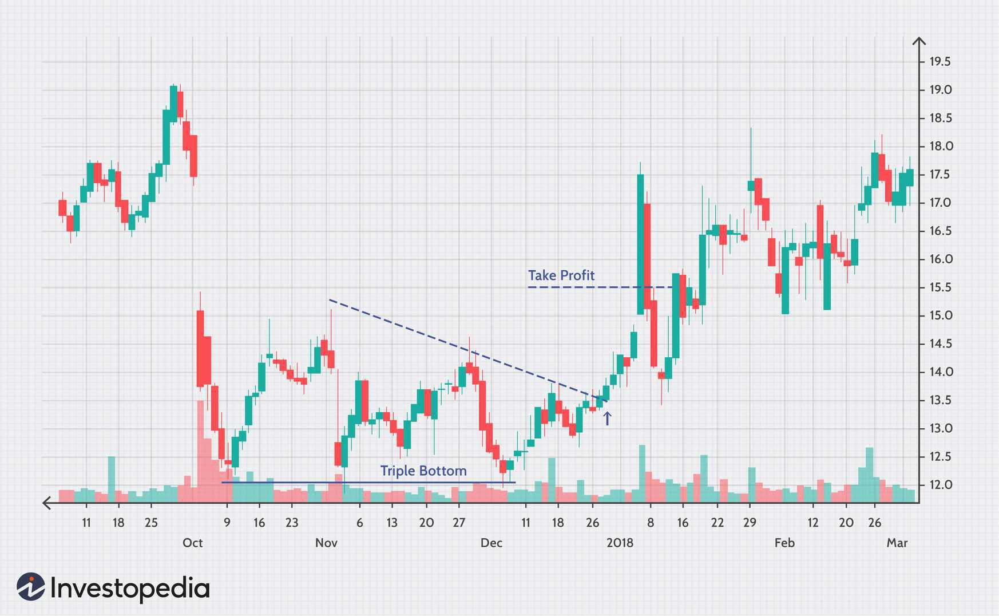

## Table of Contents

## What is the basic definition of 'bottom' in the context of financial markets?

In the context of financial markets, the term 'bottom' refers to the lowest point that a market, stock, or asset reaches during a specific period. This point is significant because it represents the moment when the price stops falling and potentially starts to rise again. Investors and traders pay close attention to these bottoms because they can signal the end of a downtrend and the beginning of a recovery or bullish trend.

Identifying a bottom can be challenging because it often only becomes clear in hindsight. Traders use various technical analysis tools and indicators, such as moving averages and support levels, to try to predict when a bottom might occur. However, false bottoms can occur, leading to what is known as a 'bear trap,' where the price appears to have bottomed out but then continues to fall. Understanding and correctly identifying a true bottom is crucial for making informed investment decisions and maximizing potential returns.

## How does the concept of 'bottom' differ between stocks, commodities, and currencies?

The concept of 'bottom' in financial markets is similar across stocks, commodities, and currencies, but there are some differences because of how each market works. For stocks, a bottom is the lowest price a stock reaches before it starts to go up again. This can happen because of things like bad news about the company or the economy, but when the bad news is over, the stock might start to recover. Commodities, like oil or gold, have bottoms too, but these can be affected by things like supply and demand, weather, or global events. For example, if there's too much oil, the price might drop until the supply goes down or demand goes up.

Currencies have bottoms as well, but these are influenced by different factors like interest rates, inflation, and the overall strength of a country's economy. When a currency hits a bottom, it means it's at its weakest point compared to other currencies. This can happen if a country's economy is doing badly or if there's a lot of uncertainty. While the basic idea of a bottom is the same – the lowest point before a possible recovery – the reasons why it happens can be different for stocks, commodities, and currencies. Understanding these differences can help investors make better decisions in each market.

## What are the common indicators used to identify a market bottom?

To spot a market bottom, people often look at certain signs. One common sign is when the price of a stock, commodity, or currency stops going down and starts to go up. This can be seen on a chart as a clear low point that doesn't get lower for a while. Another sign is a high trading [volume](/wiki/volume-trading-strategy) at the bottom. This means a lot of people are buying at that low price, which can be a good hint that the price might start going up soon.

Other signs include technical indicators like the Relative Strength Index (RSI), which shows if something is over-sold. When the RSI goes very low, it might mean the price has hit a bottom and could start to rise. Moving averages can also help. If the price goes below a moving average and then starts to go back above it, that could be a sign of a bottom. Lastly, looking at how people feel about the market can help. If everyone is feeling very negative and scared, it might be close to a bottom because there's nowhere to go but up when everyone is already feeling so bad.

## Can you explain the psychological factors that contribute to the formation of a market bottom?

When a market hits a bottom, it's often because of how people are feeling. When prices keep going down, people start to feel scared and worried. They might sell their investments because they don't want to lose more money. This fear can make the prices drop even more, until almost everyone who wants to sell has sold. At this point, the market can't go down much further because there aren't many people left who want to sell.

But then something changes. People start to see that the prices are really low, and they might think it's a good time to buy. This hope and the feeling that things can't get much worse can make people start buying again. As more people buy, the prices start to go up. This shift from fear to hope is what helps create a market bottom, where the prices stop falling and begin to rise again.

## What is the difference between a temporary bottom and a long-term bottom?

A temporary bottom is when the price of something, like a stock or a commodity, stops going down for a little while but then starts to drop again. It's like a short break in the fall. This can happen because some people think the price is low enough to buy, but not enough people agree, so the price keeps falling after a short time. Traders might get tricked into thinking the price has hit the bottom and start buying, only to see the price go down more. This is called a "bear trap."

A long-term bottom, on the other hand, is when the price really does stop falling and starts to go up for a longer time. This is a bigger change and usually happens when the reasons for the price drop, like bad news or too much supply, start to go away. More people start to feel hopeful and begin buying, which helps the price keep going up. Telling the difference between a temporary bottom and a long-term bottom can be hard, but it's important for deciding when to buy or sell.

## How do economic cycles influence the formation of market bottoms?

Economic cycles play a big role in when market bottoms happen. These cycles are like the ups and downs of the economy, with times of growth and times of slowdown. When the economy is slowing down or in a recession, stock prices, commodity prices, and even currency values can drop a lot. This is because people are worried and not spending as much money, which makes businesses struggle. As the economy keeps getting worse, prices keep falling until they reach a bottom. This bottom happens when the bad times are at their worst and people start to think things can't get any worse.

Once the economy starts to get better, people feel more hopeful. They start spending money again, and businesses start to do better. This hope and the beginning of recovery can make prices start to go up again. So, the market bottom forms at the point where the economy is at its lowest but is just about to start getting better. Understanding where we are in the economic cycle can help people guess when a market bottom might happen, but it's not easy because economic cycles can be hard to predict.

## What role do government policies and interventions play in establishing market bottoms?

Government policies and interventions can have a big effect on when market bottoms happen. When the economy is doing badly, the government might step in to help. They can do things like lowering interest rates, which makes it cheaper for people and businesses to borrow money. This can help the economy start to grow again. The government might also spend more money on things like building roads or helping people who are out of work. These actions can make people feel more hopeful and start spending money again, which can help prices stop falling and start to go up.

Sometimes, the government can also make rules that affect certain markets. For example, if the government puts limits on how much of a commodity, like oil, can be produced, it can change the supply and demand. If there's less oil, the price might go up, which could mean the bottom has been reached. But if the government's actions don't work well or if people don't trust the government, it can make things worse and keep prices falling longer. So, what the government does can either help create a market bottom by making the economy better or make it harder for a bottom to form if their actions don't help.

## Can you describe the technical analysis tools used to predict market bottoms?

Technical analysis tools help traders guess when a market might hit a bottom. One tool is the Relative Strength Index (RSI). It shows if something is being sold too much, which might mean it's close to a bottom. When the RSI goes below 30, it could be a sign that the price has fallen a lot and might start to go up soon. Another tool is moving averages. These are lines on a chart that show the average price over time. If the price goes below a moving average and then starts to go back above it, that could be a sign of a bottom. Traders also look at support levels, which are prices where the market has stopped falling before. If the price gets to a support level and starts to go up, it might mean a bottom has been reached.

Another important tool is volume. When the price hits a bottom, there's often a lot of trading happening. High volume at a low price can mean a lot of people are buying, which might push the price up. Chart patterns like the double bottom or the head and shoulders can also help. A double bottom looks like the letter "W" on a chart and shows two lows at about the same price. This can mean the price has found a bottom and might start to rise. The head and shoulders pattern looks like a person's head and shoulders and can signal a change from falling to rising prices. By using these tools together, traders can make better guesses about when a market might hit a bottom.

## What are some historical examples of market bottoms and their impacts on the economy?

One big example of a market bottom was in 2009, right after the financial crisis. Stock markets around the world had been falling for a long time because of problems with banks and the housing market. In March 2009, the U.S. stock market hit a bottom. This was when the prices were at their lowest before they started to go up again. The government stepped in with big plans to help the economy, like giving money to banks and spending on projects to create jobs. As people started to feel more hopeful and the economy began to get better, the stock market started to rise. This bottom was important because it marked the start of a long time of growth for the economy and the stock market.

Another example is the dot-com bubble bottom in 2002. In the late 1990s, many people were excited about new internet companies, and their stock prices went very high. But by 2000, people realized many of these companies were not making money, and the prices started to fall. By October 2002, the stock market hit a bottom. After this, the economy slowly started to get better, but it took a while. The dot-com bottom showed how important it is to be careful about investing in new things that seem exciting but might not be good long-term investments. It also led to changes in how people invest and how companies are valued.

## How do different investment strategies approach the identification and exploitation of market bottoms?

Different investment strategies have their own ways of figuring out when a market hits a bottom and how to use it to make money. Some investors, called value investors, look for stocks that are cheap because they think the price has fallen too far. They buy these stocks at the bottom, hoping to sell them later when the price goes up. They use things like looking at how much a company is worth compared to its stock price to decide when to buy. Other investors, like those who use technical analysis, use charts and tools to guess when a bottom might happen. They watch for signs like the RSI or moving averages to decide when to buy and sell.

Another strategy is called contrarian investing. Contrarians do the opposite of what most people are doing. When everyone is selling and feeling scared, contrarians start buying because they think the market is close to a bottom. They believe that when everyone is feeling bad, it's a good time to buy because the prices can't go much lower. Some investors also use a strategy called dollar-cost averaging, where they invest a set amount of money at regular times, no matter what the market is doing. This way, they end up buying more when prices are low at the bottom, which can help them make money when the market goes up again.

## What are the risks associated with trying to predict and invest at market bottoms?

Trying to guess when the market will hit a bottom and then investing at that time can be risky. One big risk is that you might think you've found the bottom, but it turns out to be a temporary bottom or a "bear trap." This means the price might keep falling after you buy, and you could lose money. Another risk is that it's hard to know for sure when the market has really hit a bottom. Even with tools like charts and indicators, it's still a guess, and you might buy too early or too late.

Another problem is that even if you guess the bottom right, the market might not go up right away. It can take a long time for prices to start rising again, and you might need to wait a while before you see any profit. During this time, you could be tempted to sell if the price keeps going down a bit more, or you might need your money for something else. So, trying to invest at market bottoms can be tricky and might not always work out the way you hope.

## How has the concept of market bottoms evolved with the advent of algorithmic trading and big data?

The idea of market bottoms has changed a lot because of [algorithmic trading](/wiki/algorithmic-trading) and big data. Before, people used to guess where the bottom was by looking at charts and numbers by hand. Now, computers can do this much faster and better. They use special math formulas to look at tons of information from the market all the time. This means they can spot patterns and signs of a bottom quicker than humans can. Because of this, the market can move faster, and sometimes bottoms can be harder to spot because the computers are always buying and selling.

Big data also helps because it gives traders a lot more information to look at. They can see what people are saying on the internet, what's happening in the news, and even things like the weather or how many people are shopping. All this can help guess when a bottom might happen. But it also makes things more complicated. With so much information, it's hard to know what's really important. And because everyone has access to this big data, the market can react very quickly to new information, making it trickier to find the right time to buy at the bottom.

## References & Further Reading

[1]: Bergstra, J., Bardenet, R., Bengio, Y., & Kégl, B. (2011). ["Algorithms for Hyper-Parameter Optimization."](https://dl.acm.org/doi/10.5555/2986459.2986743) Advances in Neural Information Processing Systems 24.

[2]: ["Advances in Financial Machine Learning"](https://www.amazon.com/Advances-Financial-Machine-Learning-Marcos/dp/1119482089) by Marcos Lopez de Prado

[3]: ["Evidence-Based Technical Analysis: Applying the Scientific Method and Statistical Inference to Trading Signals"](https://www.amazon.com/Evidence-Based-Technical-Analysis-Scientific-Statistical/dp/0470008741) by David Aronson

[4]: ["Machine Learning for Algorithmic Trading"](https://github.com/stefan-jansen/machine-learning-for-trading) by Stefan Jansen

[5]: ["Quantitative Trading: How to Build Your Own Algorithmic Trading Business"](https://www.amazon.com/Quantitative-Trading-Build-Algorithmic-Business/dp/1119800064) by Ernest P. Chan