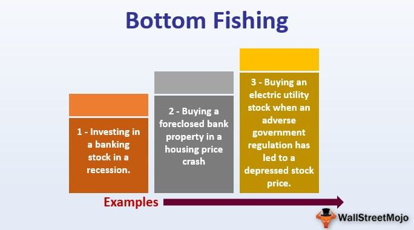

Bottom fishing in the stock market involves the practice of identifying and investing in stocks that appear to be undervalued and trading at their lowest potential price points. This approach is rooted in the objective of capitalizing on price rebounds, as these securities are typically anticipated to experience an upward correction when market conditions improve or when a company’s fundamentals recover. The allure of bottom fishing lies in the potential for substantial returns by purchasing stocks at significantly reduced prices. However, distinguishing distressed stocks—those that may never recover—from genuinely undervalued investments is crucial.

Algorithmic trading plays a significant role in modern-day investing strategies, offering a sophisticated toolset for investors, including those engaging in bottom fishing. Algorithms utilize complex mathematical models and statistical analysis to identify patterns and signals that may indicate valuable bottom fishing opportunities. They can enhance the speed and accuracy of executing trades, thus allowing investors to capitalize efficiently on fleeting opportunities in the stock market. With technological advancements and the growing availability of market data, integrating algorithmic trading into strategies such as bottom fishing has become increasingly relevant and advantageous.



In this article, readers can expect a comprehensive exploration of bottom fishing, beginning with a definition and its distinct characteristics compared to other investment strategies. We will then assess the associated risks and potential rewards, providing historical examples to illustrate successful implementations. Various strategies—such as value investing and technical analysis—will be detailed, along with their respective tools, including valuation ratios and cash flow projections. Furthermore, there will be a discussion on algorithmic trading's role in enhancing bottom fishing strategies, highlighting its speed and efficiency benefits. Key indicators for successful bottom fishing will be identified, followed by guidance on implementing bottom fishing strategies into investment portfolios effectively. Concluding with a summary, the article aims to equip readers with a deeper understanding of bottom fishing and its strategic application within the contemporary investing landscape.

## Table of Contents

## What is Bottom Fishing?

Bottom fishing is a strategic approach in the stock market aimed at identifying and investing in stocks that are perceived to be undervalued and trading at or near their lowest price points. The purpose of this strategy is to capitalize on the potential for a price rebound, allowing investors to acquire stocks at a perceived bargain price and profit from future appreciation as market conditions improve.

Stocks targeted in a bottom fishing strategy often share common characteristics. These stocks typically exhibit substantial price declines due to market overreactions, negative news, or broader economic downturns. However, despite their low prices, bottom fishing candidates often retain fundamental value. Their business models, assets, and market positioning suggest that their current diminished pricing is temporary. These stocks may also possess strong cash flow, manageable debt levels, or unique competitive advantages that can underpin recovery once market conditions stabilize.

Bottom fishing distinguishes itself from other investment strategies in several ways. While value investing shares the principle of seeking undervalued assets, bottom fishing is distinct in its focus on stocks that are currently suffering from adverse price movements, often at extreme levels. Unlike growth investing, which prioritizes companies with high earnings growth potential, bottom fishing looks at current undervaluations with an eye on future price recovery rather than immediate earnings growth.

Furthermore, bottom fishing diverges from [momentum](/wiki/momentum) strategies, which capitalize on the continuation of market trends. Instead, bottom fishing often involves contrarian bets against current market sentiments, requiring investors to assess when a stock's negative momentum is likely to reverse. This strategy demands a comprehensive analysis of the underlying factors affecting the stock's price and a belief in the potential for significant recovery. 

Ultimately, bottom fishing requires patience and a well-researched understanding of market dynamics to mitigate its inherent risks and potentially realize substantial returns.

## Understanding the Risks and Rewards

Bottom fishing in the stock market involves the strategic purchase of undervalued stocks that are perceived to be at or near their lowest price points. While this strategy can offer significant rewards, such as substantial returns during market recoveries, it also carries inherent risks. Understanding these risks and potential rewards is crucial for investors who wish to adopt this strategy effectively.

### Risks of Bottom Fishing

One of the primary risks associated with bottom fishing is the potential for prolonged depreciation. Stocks identified as undervalued might continue to decrease in value if market conditions do not improve or if the company's fundamentals weaken further. For instance, a company's declining sales, increasing debt, or changes in industry trends can result in sustained low stock prices, contrary to the investor's expectations. Moreover, relying on bottom fishing can lead investors to "catch a falling knife," where they purchase stocks too early, resulting in further losses as the stock price continues to fall.

Economic downturns or industry-specific crises can exacerbate these risks. During these periods, even fundamentally sound companies may experience extended declines in stock prices due to broader market sentiments. The risk of timing the market inaccurately is a significant challenge in bottom fishing; a misjudgment in assessing the bottom can lead to substantial financial losses.

### Rewards of Bottom Fishing

Despite the risks, bottom fishing can yield substantial rewards. The most notable benefit is the potential for sizable returns when market conditions improve and the stock price rebounds. Successful bottom fishing involves purchasing stocks at depressed prices with the anticipation that they will recover when the market or the company's performance improves.

An example of successful bottom fishing can be observed during the aftermath of the 2008 financial crisis. Investors who purchased financial stocks like Bank of America and Citigroup at their historically low prices during the downturn saw significant returns as these companies recovered in the following years. Another instance is the tech sector recovery post the dot-com bubble burst in the early 2000s, where investors who identified resilient companies reaped substantial profits over time.

### Historical Examples of Successful Bottom Fishing

One significant historical example includes Warren Buffett's investment in The Washington Post during the 1970s. At that time, the company faced numerous challenges, and its stock was substantially undervalued. Buffett's decision to purchase the stock at depressed prices resulted in massive returns as the company's value increased over time, exemplifying a successful bottom fishing scenario.

Another example is the investment in Ford Motor Company during the financial crisis of 2008. As one of the few automakers that avoided bankruptcy, Ford's stock was significantly undervalued amid broader industry pessimism. Investors who recognized Ford's potential amid the turmoil benefited substantially when the automotive markets rebounded.

In conclusion, while bottom fishing presents a clear pathway to potential gains, particularly during market recoveries, it is essential for investors to carefully weigh the risks. Both patience and in-depth research are vital components of a successful bottom fishing strategy, ensuring that investments are made based on sound analysis and not merely speculative anticipation.

## Bottom Fishing Strategies

Bottom fishing in the stock market involves strategies that capitalize on acquiring undervalued stocks that are anticipated to rise in the future. Among the myriad strategies, value investing and technical analysis are prominent methods employed by investors.

Value investing is a fundamental approach that involves examining a company's intrinsic value. This strategy typically targets stocks undervalued by the market, offering a margin of safety. Investors look for companies with strong fundamentals such as low price-to-earnings (P/E) ratios, high dividend yields, and solid earnings growth without excessive debt. The intrinsic value can be estimated through discounted cash flow (DCF) analysis, which projects future cash flows and discounts them to present value using a rate reflecting the investment's risk. A simplified DCF formula is:

$$
\text{DCF} = \sum \frac{CF_t}{(1 + r)^t}
$$

where $CF_t$ is the cash flow at time $t$, and $r$ is the discount rate.

Technical analysis, on the other hand, involves analyzing statistical trends from trading activities, such as price movements and trading volumes. Technical analysts use charts and other tools to identify patterns or signals that indicate potential price reversals or trends.

Patience and thorough research are critical to successful bottom fishing. Identifying undervalued stocks requires patience to navigate through market fluctuations and the ability to conduct in-depth research to understand the market conditions and the company's potential. This involves scrutinizing various financial metrics, industry performance, and macroeconomic indicators.

Valuation ratios such as the P/E ratio, price-to-book (P/B) ratio, and enterprise value to EBITDA (EV/EBITDA) provide insights into a stock's valuation relative to its earnings, asset value, and cash flow generation capabilities, respectively. Such ratios help investors make informed decisions when comparing companies within the same industry.

Cash flow projections are another essential component in bottom fishing. They help estimate a company's future profitability and assess its ability to sustain growth and cover liabilities. A practical approach involves projecting the company's income and expenses considering historical data and market conditions and then conducting a comparative analysis against industry peers.

In summary, bottom fishing strategies incorporate fundamental and technical analyses to identify investment opportunities. By leveraging valuation ratios and cash flow projections, investors can make well-informed decisions. Patience and extensive research underpin these strategies, ensuring that investors remain prudent and strategic despite market [volatility](/wiki/volatility-trading-strategies).

## The Role of Algorithmic Trading in Bottom Fishing

Algorithmic trading refers to the use of computer algorithms to execute trading decisions in financial markets. These algorithms, based on mathematical models and statistical analysis, can execute trades at speeds and frequencies that are impossible for human traders. Typically, this involves setting predetermined criteria, such as timing, price, or quantity, which the algorithms use to make decisions.

In the context of bottom fishing, [algorithmic trading](/wiki/algorithmic-trading) can be tailored to identify opportunities by automating the process of detecting undervalued stocks that are potentially at their lowest price point. Algorithms can be programmed to scan large volumes of data, including historical stock prices, financial statements, and other market indicators, to identify patterns or conditions that suggest a stock is undervalued. Machine learning techniques can further enhance these algorithms by enabling them to learn from market data, adjust strategies based on new information, and improve accuracy over time.

The main advantage of incorporating algorithmic trading in a bottom fishing strategy is its speed and precision. High-frequency algorithms can rapidly identify and act on market opportunities, executing trades within milliseconds. This capability allows investors to capitalize on market inefficiencies and adjust their positions swiftly before market conditions change. Additionally, algorithmic trading minimizes human error and emotions, which can be detrimental to investment decisions, particularly in volatile markets.

Algorithmic trading also allows for the [backtesting](/wiki/backtesting) of strategies using historical market data. Investors can simulate their bottom fishing strategies to evaluate their effectiveness under different market conditions without financial risk. This process involves adjusting parameters within the algorithm to optimize for the best possible outcomes based on past data.

Here's a simple example of how a Python algorithm might be structured to identify bottom fishing opportunities using basic financial metrics:

```python
import pandas as pd
import numpy as np

# Load stock data
data = pd.read_csv('stock_data.csv')

# Define bottom fishing criteria: P/E ratio and price thresholds
criteria = (data['P/E'] < 15) & (data['Price'] < data['52_Week_Low'] * 1.1)

# Filter stocks that meet the criteria
bottom_fish_stocks = data[criteria]

# Display potential bottom fishing opportunities
print(bottom_fish_stocks[['Symbol', 'P/E', 'Price']])
```

This simple script reads stock data, applies criteria to identify undervalued stocks based on their price-to-earnings (P/E) ratio and price relative to their 52-week low, and then outputs the potential candidates for bottom fishing. While real-world algorithms would be significantly more complex and [factor](/wiki/factor-investing) in additional variables, this example demonstrates the basic principle of how algorithmic trading can facilitate bottom fishing. 

In summary, algorithmic trading enhances bottom fishing by providing the tools for rapid, data-driven decisions that leverage computational power to identify potentially lucrative investment opportunities.

## Key Indicators for Successful Bottom Fishing

Successful bottom fishing in the stock market entails identifying undervalued stocks that have hit their lowest price point, with the expectation of capitalizing on future price increases. To achieve this, investors rely on a set of fundamental and technical indicators to make informed decisions.

### Fundamental Indicators

#### 1. Financial Health

Financial health is a primary consideration in determining whether a stock is undervalued or simply facing fundamental weaknesses. Key indicators include:

- **Earnings Per Share (EPS):** Represents a company's profit divided by the outstanding shares of its common stock. A consistently positive EPS suggests a company's ability to generate profit.

- **Price-to-Earnings Ratio (P/E):** Calculated as the market value per share divided by the EPS. A lower P/E ratio may indicate that a stock is undervalued compared to its peers.

- **Debt-to-Equity Ratio:** Measures a company's financial leverage by dividing its total liabilities by shareholder equity. A lower ratio indicates less risk, signifying prudent management of debt.

- **Free Cash Flow (FCF):** Represents the cash generated by a company after accounting for capital expenditures. Positive FCF is a strong indicator of financial health and the potential for reinvestment or debt reduction.

Analyzing these indicators helps investors assess the intrinsic value of a company and determine if the market price reflects potential conflicts in fundamentals.

#### 2. Market Trends

Market trends provide insights into broader economic conditions and sector performances. Investors examine:

- **Sector Rotation:** Understanding which sectors are currently favored or unfavored by the market can provide insight into where undervaluation might be more prevalent.

- **Economic Indicators:** Data such as GDP growth rates, unemployment rates, and interest rates offer context for market conditions influencing stock prices.

By considering market trends, investors can ascertain whether price declines are temporary market reactions or indicative of deeper structural issues.

#### 3. Investor Sentiment

Investor sentiment reflects the general mood of the market participants and is often a catalyst for price movements. Tools to gauge sentiment include:

- **Volatility Index (VIX):** Often referred to as the "fear index," it quantifies market volatility expectations. High levels can indicate negative sentiment, potentially creating opportunities for bottom fishing.

- **Short Interest:** High short interest indicates that many investors are betting against a stock, which could skew its current valuation and present buying opportunities upon a reversal in sentiment.

### Technical Indicators

Technical indicators utilize historical price and [volume](/wiki/volume-trading-strategy) data to predict future price movements and identify bottoms:

- **Relative Strength Index (RSI):** A momentum oscillator that measures the speed and change of price movements, typically used to identify overbought or oversold conditions. An RSI below 30 is often considered a signal of an oversold condition.

- **Moving Averages (MA):** Calculated as the average of a stock's price over a specific number of periods, moving averages can help identify trends and potential reversal points.

- **Bollinger Bands:** Utilize standard deviation around a moving average to assess volatility and potential price breakouts. A stock touching the lower band may indicate it is oversold.

### Diversification and Risk Management

While focusing on undervalued stocks, it is essential to maintain a diversified portfolio to mitigate risk. Diversification involves spreading investments across various sectors, asset classes, and geographic locations. This strategy reduces the impact of poor performance in any single investment.

Risk management involves setting stop-loss orders and position sizing to limit potential losses. Investors should establish clear investment objectives and risk tolerance levels to guide their bottom fishing strategy.

In conclusion, successful bottom fishing requires a comprehensive analysis of both fundamental and technical indicators, alongside prudent risk management. These elements work together to identify and capitalize on stocks poised for potential recovery.

## Implementing Bottom Fishing in Your Investment Portfolio

Incorporating bottom fishing into an investment portfolio involves a strategic approach aimed at identifying undervalued stocks that have the potential for significant appreciation. The following step-by-step guide outlines how investors can effectively implement this strategy:

### Step 1: Conduct Thorough Market Analysis

Start by analyzing market trends and the overall economic environment. This involves understanding macroeconomic indicators such as GDP growth, inflation rates, and interest rates, which can influence market cycles. Additionally, it is crucial to identify industries undergoing temporary setbacks versus those facing long-term declines.

### Step 2: Identify Potential Stocks

Focus on identifying stocks that exhibit characteristics typical of bottom fishing targets—these generally include significantly reduced prices due to overreactions to negative news or broader market downturns rather than fundamental issues within the company. Employ valuation ratios such as the Price-to-Earnings (P/E) ratio, Price-to-Book (P/B) ratio, and Dividend Yield to gauge undervaluation.

### Step 3: Utilize Simulators and Practice Accounts

Before committing actual capital, use simulators and practice accounts to model your bottom fishing strategies. Platforms like Investopedia's Stock Simulator or brokerage-provided demos offer virtual trading environments to test hypotheses and refine strategies without financial risk. This practice helps in understanding the volatility and potential pitfalls of bottom fishing.

### Step 4: Develop a Robust Investment Plan

Create a structured investment plan that includes entry and [exit](/wiki/exit-strategy) points based on thorough analysis. This plan should be rooted in clear criteria for stock selection, holding periods, and risk management strategies like stop-loss orders and position sizing to mitigate losses.

### Step 5: Implement Risk Management Techniques

Diversify the portfolio to manage risks associated with bottom fishing. Diversification involves spreading investments across various sectors and asset classes to reduce the impact of a single stock’s poor performance. Additionally, maintain a healthy allocation between bottom fishing positions and more stable investments to balance risk-reward dynamics.

### Step 6: Stay Informed and Flexible

Continuous learning and adaptation are vital to successful bottom fishing. Keep abreast with financial news, earnings reports, and market analysis to identify changes that might affect your portfolio. Be ready to adjust strategies based on new information, including rotating out of stocks that no longer meet your investment criteria.

### Step 7: Monitor and Review Portfolio Performance

Regularly monitor the performance of your investments to ensure they align with your strategic goals. Use metrics such as total return and benchmark comparisons to assess performance. Quarterly reviews can help identify when to hold, sell, or buy additional shares based on updated analyses and predictions.

### Conclusion

By following this guide, investors can effectively integrate bottom fishing into their investment strategies, leveraging opportunities presented by market fluctuations to acquire undervalued assets. This proactive approach combines both quantitative and qualitative analyses, relying on continuous evaluation and strategic adjustment to navigate the complexities of the stock market. Investors are encouraged to conduct independent research and consult with financial advisors to tailor the strategy to their specific financial goals.

## Conclusion

In this article, we explored the intricacies of the bottom fishing investment strategy and its significance in the stock market. Bottom fishing focuses on identifying and investing in stocks that are perceived to be undervalued and at their lowest price points. This approach holds the potential for considerable financial gains, especially during market recoveries when undervalued stocks can experience significant appreciation in value.

We also examined the role of algorithmic trading in enhancing bottom fishing strategies. The use of algorithms can increase the speed and accuracy of identifying potential bottom-fishing opportunities, enabling investors to make timely and informed decisions. Algorithmic trading brings the advantages of data-driven analysis and the ability to process large volumes of information which can be critical in fast-moving markets.

While bottom fishing offers the allure of high returns, it is crucial to remain aware of the inherent risks, such as the potential for stocks to remain undervalued for extended periods. Therefore, thorough research, prudent risk management, and diversification remain imperative components of a successful investment strategy.

Investors interested in bottom fishing should continue to educate themselves and stay updated with market trends to refine their strategies. Utilizing tools like simulators and practice accounts can help in honing investment techniques without the immediate risk of financial loss. Additionally, consulting with financial advisors is recommended, as they can provide personalized insights and guidance tailored to individual investment goals and risk profiles.

As the stock market landscape continues to evolve, combining traditional investment strategies with modern technological advancements like algorithmic trading offers a promising avenue for achieving investment success.

## References & Further Reading

[1]: Bergstra, J., Bardenet, R., Bengio, Y., & Kégl, B. (2011). ["Algorithms for Hyper-Parameter Optimization."](https://dl.acm.org/doi/10.5555/2986459.2986743) Advances in Neural Information Processing Systems 24.

[2]: ["Advances in Financial Machine Learning"](https://www.amazon.com/Advances-Financial-Machine-Learning-Marcos/dp/1119482089) by Marcos Lopez de Prado

[3]: ["Evidence-Based Technical Analysis: Applying the Scientific Method and Statistical Inference to Trading Signals"](https://www.amazon.com/Evidence-Based-Technical-Analysis-Scientific-Statistical/dp/0470008741) by David Aronson

[4]: ["Machine Learning for Algorithmic Trading"](https://github.com/stefan-jansen/machine-learning-for-trading) by Stefan Jansen

[5]: ["Quantitative Trading: How to Build Your Own Algorithmic Trading Business"](https://www.amazon.com/Quantitative-Trading-Build-Algorithmic-Business/dp/1119800064) by Ernest P. Chan

[6]: Graham, B. (1949). ["The Intelligent Investor"](https://en.wikipedia.org/wiki/The_Intelligent_Investor) by Benjamin Graham

[7]: Zacks, L. (2011). ["The Handbook of Equity Market Anomalies: Translating Market Inefficiencies into Effective Investment Strategies"](https://onlinelibrary.wiley.com/doi/book/10.1002/9781119200697)

[8]: Sharpe, W. F. (1963). ["A Simplified Model for Portfolio Analysis"](https://pubsonline.informs.org/doi/10.1287/mnsc.9.2.277) Management Science, 9(2), 277-293. 

[9]: Thorp, E. O. (1967). ["Beat the Market: A Scientific Stock Market System"](https://www.amazon.com/Beat-Market-Scientific-Stock-System/dp/0394424395) by Edward O. Thorp

[10]: Buffett, W. E. (1984). ["The Superinvestors of Graham-and-Doddsville,"](https://en.wikipedia.org/wiki/The_Superinvestors_of_Graham-and-Doddsville) Columbia Business School Magazine.