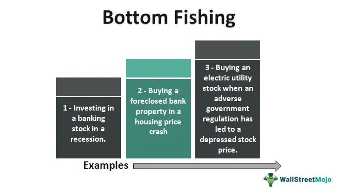

The stock market represents a labyrinth of opportunities and challenges, making it an intimidating environment for both new and seasoned investors. One strategy that holds particular allure is 'bottom fishing,' a method through which investors attempt to identify and capitalize on stocks that are undervalued and positioned for recovery. This approach inherently involves careful scrutiny of market signals, seeking those securities whose prices have declined temporarily, often due to adverse market conditions rather than reflecting the underlying financial health of the company.

In recent years, the rise of algorithmic trading has provided investors with advanced tools to enhance their bottom fishing strategies. Algorithmic trading employs complex algorithms to analyze data and execute trades at speeds and frequencies that are impossible for human traders, thereby augmenting bottom fishing strategies with increased speed and precision. The combination of these strategies represents a significant advancement in investment techniques, offering the ability to quickly exploit undervalued stocks through systematic and disciplined trading methods.



This article presents an exploration of the synergy between traditional investment strategies, the specific nuances of stock market bottom fishing, and the integration of algorithmic trading. Understanding these components is essential to navigate the complexities of the stock market, allowing investors to mitigate risks effectively while maximizing potential returns. By leveraging both traditional financial analysis and modern technological advancements, investors can potentially unlock opportunities that lie within the ever-changing dynamics of the stock market.

## Table of Contents

## Understanding Bottom Fishing in Stock Market

Bottom fishing in the stock market is a strategic approach aimed at identifying and purchasing stocks that have undergone significant price declines and are perceived to be undervalued. Investors often pursue this strategy with the anticipation that these stocks will rebound, leading to potential profits. The process of bottom fishing requires a thorough understanding of market dynamics and an ability to differentiate between temporary price declines and drops stemming from fundamental weaknesses.

Key indicators used to gauge a stock's temporary price decline include oversold conditions, price-to-earnings (P/E) ratios, and other fundamental metrics that suggest the stock's intrinsic value exceeds its current market price. Technical analysis tools, such as the Relative Strength Index (RSI), are also used to identify stocks that might be oversold. Stocks might show an RSI below 30, which is generally interpreted as a signal of being oversold.

Depth of research is crucial, as not all stocks that drop in price are suitable candidates for bottom fishing. The challenge lies in distinguishing between cyclical downturns and structural changes that could cause a continued decline. Investors might also look for signs of catalysts that could potentially reverse a stock's fortunes, such as pending earnings reports, industry developments, or broader economic indicators.

Despite its potential rewards, bottom fishing is inherently risky. Investors might find themselves holding onto stocks that continue to decline if the drop was not temporary but rather indicative of deeper issues within the company's fundamentals. In markets characterized by panic selling, such as during bear markets, many stocks might become undervalued, presenting more opportunities for bottom fishers. However, careful analysis is paramount to avoid the pitfall of "catching a falling knife," where one invests in a seemingly undervalued stock only to see its price fall further.

Bottom fishing is thus a balancing act of patience, analysis, and timing. It necessitates a blend of technical and [fundamental analysis](/wiki/fundamental-analysis) to effectively isolate stocks that are undervalued yet poised for recovery. Investors wielding this strategy must remain vigilant and adaptable, recognizing both the risks and opportunities that come with attempting to profit from market inefficiencies.

## Algorithmic Trading and Its Impact on Bottom Fishing

Algorithmic trading employs sophisticated algorithms to execute trades automatically based on pre-defined criteria, providing enhanced speed and accuracy over manual trading methods. This technological advantage is particularly beneficial to investors employing bottom fishing strategies, which focus on identifying stocks that are undervalued due to temporary price drops.

The speed of [algorithmic trading](/wiki/algorithmic-trading) allows investors to respond instantly to market conditions, capturing opportunities that might be missed with manual trading. By using algorithms, traders can set precise criteria for bottom fishing, such as identifying stocks that are trading at multi-year lows but have strong fundamentals. These algorithms can rapidly scan the market, filtering through vast amounts of data to pinpoint securities that meet the desired specifications.

Here's a simple example of how an algorithm might be programmed in Python to identify potential bottom fishing stocks:

```python
import yfinance as yf
import pandas as pd

# Define criteria for bottom fishing
def check_bottom_fish_stock(ticker):
    stock = yf.Ticker(ticker)
    hist_data = stock.history(period='1y')
    current_price = hist_data['Close'][-1]
    low_52week = hist_data['Low'].min()

    # Criteria: Current price is within 10% of the 52-week low
    if current_price <= (low_52week * 1.1):
        return True
    return False

# Example usage with a list of tickers
ticker_list = ['M', 'AAPL', 'GE']
bottom_fish_stocks = [ticker for ticker in ticker_list if check_bottom_fish_stock(ticker)]

print("Stocks potentially suitable for bottom fishing:", bottom_fish_stocks)
```

Algorithmic trading not only streamlines the identification of undervalued stocks but also reduces the influence of human error and emotional biases. By automating trading decisions, it imposes discipline, ensuring that trades are executed according to predetermined strategies without deviation due to human emotions like fear or greed.

The discipline and rigor of algorithmic trading can significantly enhance the success rate of bottom fishing strategies. By maintaining strict adherence to the set criteria and responding swiftly to market changes, traders can better capitalize on short-lived price discrepancies and position themselves for potential gains when the market corrects.

Moreover, the integration of algorithmic trading in bottom fishing facilitates the back-testing of strategies. Investors can use historical data to simulate their strategies and assess their effectiveness under various market conditions. This enables continual refinement and optimization, ensuring that the algorithms remain aligned with the investor's risk tolerance and market outlook.

In conclusion, algorithmic trading offers a powerful mechanism for bottom fishing, providing investors with the tools needed to efficiently scope out and capitalize on undervalued stocks, while enforcing consistency and precision in their trading strategies.

## Developing a Bottom Fishing Strategy with Algorithmic Tools

A successful bottom fishing strategy leverages algorithmic tools to efficiently identify and capitalize on undervalued stocks. By combining technical indicators with market insight, investors can position themselves to exploit price drops and potential recoveries.

### Identifying Potential Stocks

To pinpoint stocks suitable for bottom fishing, algorithms can be designed to track technical indicators such as the Relative Strength Index (RSI), Moving Average Convergence Divergence (MACD), and Bollinger Bands. These indicators provide insights into market [momentum](/wiki/momentum) and [volatility](/wiki/volatility-trading-strategies), helping to identify when a stock is oversold and potentially underpriced.

### Continuous Monitoring of Market Metrics

Algorithmic tools can be programmed to continuously monitor real-time market data, scanning for abrupt price declines that signal potential buying opportunities. This involves setting up automated alerts or triggers based on predefined criteria, ensuring that investors are promptly notified of market movements.

### Integrating Fundamental Analysis

Incorporating fundamental analysis into algorithmic trading strategies enhances the precision of stock selection. Fundamental metrics such as Price-to-Earnings (P/E) ratios, earnings forecasts, and revenue growth can be integrated within algorithms to assess the intrinsic value of stocks. This dual approach ensures that selected stocks are not only technically attractive but also fundamentally sound.

### Managing Risks with Stop-Loss Orders

To mitigate the risks inherent in bottom fishing, implementing stop-loss orders within trading algorithms is crucial. Stop-loss orders act as a risk management tool, automatically selling a stock when its price falls below a specified threshold. This mechanism safeguards investors from significant losses should a stock's price continue to decline.

### Testing and Optimizing Algorithms

Backtesting is a critical component of developing robust bottom fishing strategies. By applying trading algorithms to historical market data, investors can simulate different scenarios and refine their strategies. This process involves adjusting parameters to optimize for various market conditions, enhancing the algorithm's ability to make data-driven decisions.

```python
# Example: Simple Moving Average Crossover Strategy
import pandas as pd

def moving_average_crossover_strategy(stock_data):
    stock_data['SMA_50'] = stock_data['Close'].rolling(window=50).mean()
    stock_data['SMA_200'] = stock_data['Close'].rolling(window=200).mean()

    buy_signals = (stock_data['SMA_50'] > stock_data['SMA_200']) & (stock_data['SMA_50'].shift(1) <= stock_data['SMA_200'].shift(1))
    sell_signals = (stock_data['SMA_50'] < stock_data['SMA_200']) & (stock_data['SMA_50'].shift(1) >= stock_data['SMA_200'].shift(1))

    stock_data['Buy Signal'] = buy_signals
    stock_data['Sell Signal'] = sell_signals

    return stock_data[['Close', 'SMA_50', 'SMA_200', 'Buy Signal', 'Sell Signal']]

# Assuming 'data' is a DataFrame containing historical stock prices
sample_data = pd.DataFrame({
    'Close': [...] # List of closing prices
})

strategy_signals = moving_average_crossover_strategy(sample_data)
```

The integration of algorithmic tools in bottom fishing not only enhances decision-making but also adds an element of precision that manual trading cannot replicate. By synthesizing technical and fundamental analyses, setting robust risk management measures, and refining strategies through [backtesting](/wiki/backtesting), investors can significantly improve their bottom fishing outcomes.

## Case Study: Real-World Application of Bottom Fishing Algo Trading

In recent years, algorithmic trading has become a critical component of bottom fishing strategies, allowing investors to capitalize on temporary price declines with greater precision and efficiency. A notable example is the case of Macy's Inc., a prominent retail company that experienced significant stock price volatility. Traders employing algorithmic trading techniques were able to identify these price drops as opportunities for potential gains.

Macy's Inc. periodically encountered temporary price declines due to various market pressures, such as changes in consumer behavior and competitive challenges in the retail industry. These price shifts attracted bottom fishers who employed algorithms to efficiently scan vast amounts of market data, identifying Macy's stock during phases when it was undervalued. By leveraging algorithmic trading, these investors set precise entry and [exit](/wiki/exit-strategy) points, maximizing the potential for profitable rallies.

One effective technique involved the use of technical patterns, such as the inverse head and shoulders pattern, which can indicate a potential reversal in price trends. The inverse head and shoulders pattern consists of three price troughs, with the middle trough being the lowest. This formation suggests an upcoming upward [trend following](/wiki/trend-following) a period of decline. By programming algorithms to detect this pattern, traders were able to enter trades at strategic points, anticipating a rise in Macy's stock price.

Moreover, disciplined algorithmic trading allowed investors to mitigate risks associated with bottom fishing. For example, by implementing stop-loss orders within their trading algorithms, investors could automatically exit positions if the stock continued to decline beyond a specified threshold. This approach protected them from prolonged losses and preserved capital for future investment opportunities.

In addition to stop-loss mechanisms, backtesting played a crucial role in refining these algorithms. Traders tested their strategies against historical data to evaluate their performance under various market conditions. This process allowed for the optimization of parameters, enhancing the effectiveness of the trading algorithms when applied to real-time scenarios.

Overall, the application of algorithmic trading in bottom fishing strategies, exemplified by Macy's Inc., demonstrates the potential for disciplined and systematic approaches to leverage short-term market inefficiencies. Through the integration of technical analysis, pattern recognition, and risk management techniques, investors can unlock significant opportunities while minimizing exposure to prolonged losses.

## Limitations and Considerations

While rewarding, bottom fishing combined with algorithmic trading is not without risks. This combination of strategies requires a vigilant approach, considering the following key factors:

Algorithms require constant tuning and are subject to market unpredictability. The effectiveness of a trading algorithm is contingent on its adaptability to market changes and its ability to accommodate new data. An algorithm that worked well under one market condition might underperform or even incur losses under another. Therefore, continuous monitoring and periodic adjustments are essential to ensure that the algorithm remains relevant and effective.

Understanding algorithmic bias and ensuring it aligns with long-term investment goals is crucial. Algorithmic bias can stem from the assumptions made during the design of the algorithm or the historical data used for training. These biases can skew decision-making, leading to suboptimal trading outcomes. It is important for investors to scrutinize their algorithms to identify any biases and assess whether these biases align with their long-term goals. This may involve running simulations or backtests to evaluate how different market scenarios impact the algorithm's performance.

Investors should remain aware of market conditions that may affect the efficacy of their strategies. Various external factors, such as macroeconomic events, geopolitical developments, and changes in market sentiment, can drastically alter the market landscape. An overly rigid adherence to algorithmic suggestions without accounting for these conditions can expose investors to increased risks. Hence, staying informed about broader market trends and adjusting strategies accordingly is essential.

A blended approach of human oversight and algorithmic precision often yields the best results. While algorithms are proficient at handling large volumes of data and executing trades with speed and precision, human insight is invaluable in interpreting complex market dynamics and making nuanced decisions. Having human oversight ensures that the intuitive and qualitative aspects of investing complement the algorithm's quantitative capabilities. This partnership can help mitigate risks and enhance the overall effectiveness of the bottom fishing strategy.

By considering these factors, investors can better navigate the complexities associated with combining bottom fishing and algorithmic trading, optimizing their strategies for greater potential returns while managing inherent risks.

## Conclusion

Integrating bottom fishing with algorithmic trading represents a modern approach to value investing. By combining traditional financial analysis with the precision of algorithmic tools, investors can efficiently identify and capitalize on undervalued stocks. This synergy not only enhances the speed and accuracy of stock selection but also introduces a layer of discipline that mitigates emotional biases often seen in manual trading.

As markets continue to evolve, possessing the ability to quickly adapt strategies is crucial for maintaining a competitive edge. Algorithmic trading facilitates this adaptability by allowing investors to implement customizable trading algorithms that can be adjusted in response to changing market conditions. By leveraging real-time data analytics and automated decision-making processes, investors are better equipped to navigate market fluctuations and seize profitable opportunities.

For those practicing bottom fishing, algorithmic trading presents a formidable tool in unlocking hidden opportunities within a complex and dynamic market. By employing a methodological approach that fuses quantitative analysis with qualitative insights, investors can not only enhance their return potential but also manage risk more effectively. This integration underscores the importance of staying informed and technologically adept in today's fast-paced investment landscape.

## References & Further Reading

[1]: Bergstra, J., Bardenet, R., Bengio, Y., & Kégl, B. (2011). ["Algorithms for Hyper-Parameter Optimization."](https://dl.acm.org/doi/10.5555/2986459.2986743) Advances in Neural Information Processing Systems 24.

[2]: ["Advances in Financial Machine Learning"](https://www.amazon.com/Advances-Financial-Machine-Learning-Marcos/dp/1119482089) by Marcos Lopez de Prado

[3]: ["Evidence-Based Technical Analysis: Applying the Scientific Method and Statistical Inference to Trading Signals"](https://www.amazon.com/Evidence-Based-Technical-Analysis-Scientific-Statistical/dp/0470008741) by David Aronson

[4]: ["Machine Learning for Algorithmic Trading"](https://github.com/stefan-jansen/machine-learning-for-trading) by Stefan Jansen

[5]: ["Quantitative Trading: How to Build Your Own Algorithmic Trading Business"](https://www.amazon.com/Quantitative-Trading-Build-Algorithmic-Business/dp/1119800064) by Ernest P. Chan