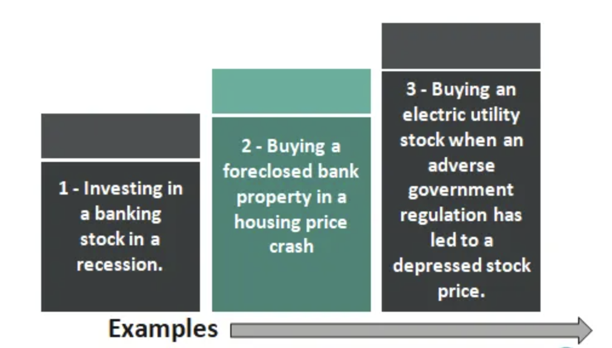

## Table of Contents

## What is bottom fishing in the context of investing?

Bottom fishing in investing means buying stocks or other assets that have fallen a lot in price. Investors do this because they believe the price will go back up in the future. They think the asset is now cheaper than it should be, so it's a good time to buy. This strategy can be risky because the price might keep falling, but it can also lead to big profits if the price does recover.

People often use bottom fishing when the market is down or when a specific company is having problems. They look for signs that the company will get better, like new management or a new product. If they are right, they can buy the stock at a low price and sell it later for a lot more. But if they are wrong, they might lose money. So, it's important to do a lot of research before trying bottom fishing.

## Why might an investor choose to engage in bottom fishing?

An investor might choose to engage in bottom fishing because they believe they can buy a stock at a low price and sell it later for a higher price. When a stock's price drops a lot, it might be because people are worried about the company. But if the investor thinks the company will get better, they might see the low price as a good chance to buy. They are hoping to make a big profit when the stock price goes back up.

However, bottom fishing can be risky. If the investor is wrong about the company getting better, the stock price might keep falling. This could mean the investor loses money instead of making a profit. That's why it's important for investors to do a lot of research before they decide to go bottom fishing. They need to look at things like the company's financial health, any new products or management changes, and what other people are saying about the company's future.

## What are the key indicators that a stock might be a good candidate for bottom fishing?

When thinking about bottom fishing, investors look at a few important things to decide if a stock is a good buy. One key thing is the company's financial health. They check if the company has a lot of debt or if it's making money. If the company is in a strong financial position, even if its stock price is low, it might be a good candidate for bottom fishing. Another thing to look at is the company's industry. If the whole industry is doing badly but the company is still doing okay, it might be a good time to buy.

Investors also look at what's happening with the company itself. If there are signs that things are getting better, like new products coming out or new people in charge, that can be a good sign. It's also important to see what other people think about the company's future. If analysts are starting to say good things about the company, it might be a good time to go bottom fishing. But remember, it's always risky, so doing a lot of research is key.

Lastly, the stock's price compared to its value is something to consider. If the stock price is much lower than what the company is actually worth, it might be undervalued. This can happen because of bad news or worries about the company, but if the investor thinks the worries are overblown, they might see it as a chance to buy. The key is to find stocks that are temporarily down but have a good chance of going back up.

## How can an investor differentiate between a temporarily undervalued stock and a value trap?

Telling the difference between a stock that's just temporarily undervalued and a value trap can be tricky. A temporarily undervalued stock is one that's gone down in price because of short-term problems, but the company is still strong and should get better. To spot these, investors look at things like the company's earnings, how much money it's making, and any good news about new products or leaders. They also check if the whole industry is doing badly but the company is doing okay. If the stock price is a lot lower than what the company is really worth, it might be a good time to buy.

On the other hand, a value trap is a stock that looks cheap but keeps going down in price. This happens because the company has big problems that won't go away soon. These problems could be too much debt, losing money, or bad management. To avoid value traps, investors need to look closely at the company's financial health and see if there are any signs that things will get better. If the problems seem too big to fix, it's better to stay away from the stock, even if it looks like a bargain.

In the end, the key is doing a lot of research. Investors should look at everything they can about the company, like its financial reports, what analysts are saying, and any news about the company. By taking their time and being careful, investors can make smarter choices and avoid falling into value traps while finding good opportunities for bottom fishing.

## What are some common mistakes beginners make when attempting bottom fishing?

Beginners often make the mistake of not doing enough research before they start bottom fishing. They might see a stock price go down a lot and think it's a good deal without looking at why the price dropped. They might not check the company's financial health, like how much debt it has or if it's making money. They also might not look at what's happening in the company's industry or any news about the company. Without this information, they can't tell if the stock is just temporarily undervalued or if it's a value trap that will keep losing value.

Another common mistake is getting too emotional about their investments. Beginners might buy a stock because they like the company or because they're scared of missing out on a good deal. But investing should be based on facts, not feelings. If the stock keeps going down, beginners might hold onto it too long, hoping it will go back up. This can lead to big losses if the stock never recovers. It's important to set clear goals and know when to sell a stock, even if it means taking a loss.

Lastly, beginners might not have a good plan for managing risk. They might put all their money into one stock, which is very risky. Instead, they should spread their money out over different stocks or types of investments. This way, if one stock does badly, they won't lose everything. They also might not use stop-loss orders, which can help limit how much they lose if a stock's price keeps falling. Having a clear plan for managing risk can help beginners avoid big mistakes when trying bottom fishing.

## Can you provide examples of successful bottom fishing strategies used by well-known investors?

Warren Buffett is a famous investor who has used bottom fishing to make big profits. One example is when he bought shares of American Express in 1964. The stock price had dropped a lot because of a big scandal, but Buffett saw that the company was still strong and would recover. He bought a lot of shares at a low price and held onto them. Over time, the stock price went back up, and he made a huge profit. This shows how bottom fishing can work if you do your research and believe in the company's future.

Another example is when Carl Icahn bought shares of Netflix in 2012. At that time, Netflix was struggling, and its stock price had fallen a lot. Icahn saw that the company had a lot of potential and was undervalued. He bought a big stake in Netflix and helped push the company to make changes that would make it stronger. Over the years, Netflix's stock price went up a lot, and Icahn made a lot of money from his investment. This shows how bottom fishing can be successful if you pick the right company and are willing to wait for it to get better.

## What role does market sentiment play in bottom fishing, and how can it be analyzed?

Market sentiment is how people feel about the market or a certain stock. When people are scared or worried, they might sell a lot, and the stock price goes down. This can make the stock look cheap, which is a good chance for bottom fishing. But if everyone is too scared and keeps selling, the price might keep going down. So, knowing what people are feeling can help you decide if it's a good time to buy.

To figure out market sentiment, you can look at a few things. One way is to read news and see what people are saying about the stock or the market. If a lot of people are saying bad things, it might mean the sentiment is negative. Another way is to look at things like the fear and greed index, which tells you if people are feeling scared or excited about the market. Also, you can watch how much people are buying or selling. If a lot of people are selling, it might mean they're worried. By understanding these signs, you can get a better idea of when to try bottom fishing.

## How should an investor assess the financial health of a company before bottom fishing?

Before trying bottom fishing, an investor needs to look at the company's financial health to see if it's a good buy. One important thing to check is the company's balance sheet, which shows how much money it has and how much it owes. If the company has a lot of debt and not much money, it might be in trouble. But if it has more money than debt, it's in a better spot. The investor should also look at the income statement to see if the company is making money or losing it. If the company is making a profit, that's a good sign. But if it's losing money, the investor needs to be careful.

Another thing to check is the company's cash flow statement, which tells you if the company has enough cash to keep going. If the company is bringing in more cash than it's spending, it's in a good position. The investor should also look at ratios like the debt-to-equity ratio and the price-to-earnings ratio. These numbers can help you see if the stock is cheap compared to what the company is worth. By looking at all these things, the investor can get a good picture of the company's financial health and decide if it's a good time to buy the stock.

## What are the psychological challenges associated with bottom fishing, and how can they be managed?

Bottom fishing can be tough on your mind because it means buying stocks when everyone else is selling. It's hard to go against what everyone else is doing. You might feel scared or worried that the stock price will keep going down. This fear can make you want to sell your stocks too soon, even if you believe in the company. Another problem is getting too hopeful. If you see the stock price start to go up a little, you might think it will keep going up fast, and you might not sell when you should.

To handle these feelings, it's important to have a clear plan before you start bottom fishing. Decide ahead of time when you will buy and sell the stock, and stick to your plan. It can also help to only invest money you can afford to lose. This way, you won't be too scared if the stock price goes down more. Talking to other investors or a financial advisor can also help. They can give you good advice and help you stay calm when the market is scary. By staying focused on your plan and not letting your feelings control your choices, you can do better at bottom fishing.

## How does sector analysis contribute to effective bottom fishing?

Sector analysis helps with bottom fishing by letting investors see how a whole industry is doing. If a sector is doing badly, like tech or energy, the prices of stocks in that sector might go down a lot. But if an investor thinks the sector will get better soon, they might see it as a good time to buy stocks that are now cheaper. By looking at the sector, the investor can tell if a stock is down because of problems with the whole industry or just with the company itself. This can help them pick stocks that are more likely to go back up in price.

Doing sector analysis also means looking at things like new laws, technology changes, or economic trends that might affect the sector. For example, if there's a new law that will help the renewable energy sector, stocks in that sector might be a good buy, even if they're down now. By understanding these bigger trends, an investor can find stocks that are undervalued because of short-term problems but have a good chance of doing well in the long run. This way, they can make smarter choices about which stocks to buy when bottom fishing.

## What advanced technical analysis tools are useful for identifying bottom fishing opportunities?

When looking for bottom fishing opportunities, investors can use advanced technical analysis tools to help them make better decisions. One useful tool is the Relative Strength Index (RSI). The RSI measures how fast a stock's price is going up or down and shows if it's overbought or oversold. If the RSI is below 30, it means the stock might be oversold and could be a good time to buy. Another tool is the Moving Average Convergence Divergence (MACD). The MACD looks at the difference between two moving averages of a stock's price. When the MACD line crosses above the signal line, it can be a sign that the stock's price might start going up, which is good for bottom fishing.

Another helpful tool is the Bollinger Bands. These are lines drawn above and below a stock's moving average that show how much the stock's price is changing. If the stock's price goes below the lower Bollinger Band, it might be a sign that the stock is undervalued and could be a good buy. Also, chart patterns like the double bottom can be useful. A double bottom happens when a stock's price goes down, goes back up a bit, then goes down again to about the same level before going up again. This pattern can mean the stock's price has hit a low point and might start going up, which is what bottom fishers are looking for. By using these tools together, investors can find better chances to buy stocks at low prices and make a profit when the prices go back up.

## How can an investor adapt bottom fishing strategies to different market cycles?

Bottom fishing can work differently depending on where the market is in its cycle. During a bear market, when prices are going down and people are scared, there are a lot of chances for bottom fishing. Stocks might be really cheap because everyone is selling. But it's important to pick the right stocks. Look for companies that are strong and will likely do well when the market gets better. Also, be ready to wait a long time for the stock price to go back up, because bear markets can last a while.

In a bull market, when prices are going up and people are excited, bottom fishing can be trickier. Stocks might not fall as much, so there are fewer chances to buy at a low price. But if a stock does go down a lot, it could be because of short-term problems. If you think the company will get better, it might be a good time to buy. Just make sure to do a lot of research and be ready for the stock to take a while to go back up, even in a bull market. By understanding the market cycle, you can change your bottom fishing strategy to find the best times to buy.

## References & Further Reading

[1]: Bergstra, J., Bardenet, R., Bengio, Y., & Kégl, B. (2011). ["Algorithms for Hyper-Parameter Optimization."](https://dl.acm.org/doi/10.5555/2986459.2986743) Advances in Neural Information Processing Systems 24.

[2]: ["Advances in Financial Machine Learning"](https://www.amazon.com/Advances-Financial-Machine-Learning-Marcos/dp/1119482089) by Marcos Lopez de Prado

[3]: ["Evidence-Based Technical Analysis: Applying the Scientific Method and Statistical Inference to Trading Signals"](https://www.amazon.com/Evidence-Based-Technical-Analysis-Scientific-Statistical/dp/0470008741) by David Aronson

[4]: ["Machine Learning for Algorithmic Trading"](https://github.com/stefan-jansen/machine-learning-for-trading) by Stefan Jansen

[5]: ["Quantitative Trading: How to Build Your Own Algorithmic Trading Business"](https://www.amazon.com/Quantitative-Trading-Build-Algorithmic-Business/dp/1119800064) by Ernest P. Chan