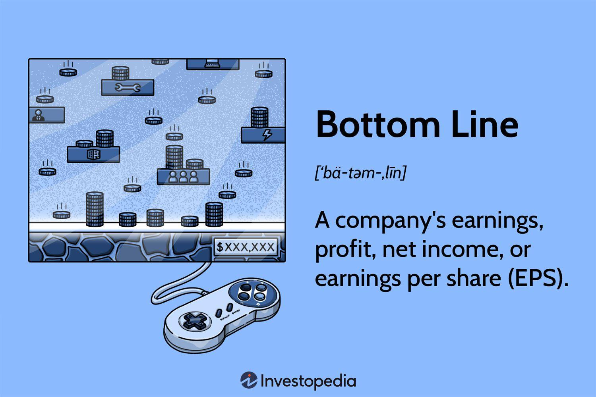

## Table of Contents

## What is the bottom line in accounting?

The bottom line in accounting refers to the last line of a company's income statement, which shows the net income or profit after all expenses have been subtracted from total revenue. It is called the bottom line because it is literally at the bottom of the financial statement and gives a clear picture of the company's financial performance over a specific period. This figure is crucial for business owners, investors, and analysts as it indicates whether the company is making a profit or incurring a loss.

Understanding the bottom line is essential for making informed business decisions. If the bottom line shows a profit, it means the company is doing well financially, which can attract investors and provide funds for growth and expansion. On the other hand, if the bottom line shows a loss, it may signal the need for cost-cutting measures or a review of business strategies to improve financial health. The bottom line, therefore, serves as a key indicator of a company's overall financial success and sustainability.

## How is the bottom line calculated?

The bottom line is calculated by starting with the total revenue, which is all the money a company earns from selling its products or services. From this total revenue, you subtract all the costs and expenses the company had to pay to run its business. These expenses include things like the cost of goods sold, salaries, rent, utilities, and other operating expenses. After subtracting all these costs, what's left is called the net income or profit, which is the bottom line.

Sometimes, there are other things to consider too, like taxes and interest on loans. These are also subtracted from the total revenue along with the other expenses. If the company has any other income, like from investments, that gets added back in. So, the simple way to think about it is: take all the money coming in, subtract all the money going out, and what you have left is the bottom line. If it's a positive number, the company made a profit; if it's negative, the company had a loss.

## Why is the bottom line important for a business?

The bottom line is really important for a business because it shows if the company is making money or losing money. It's like a report card that tells everyone, like the owners, investors, and even the people who might want to buy the company, how well the business is doing. If the bottom line is a big number, it means the business is doing great and making a lot of profit. But if it's a small number or even a negative number, it means the business might be struggling and not making enough money to cover all its costs.

Knowing the bottom line helps business owners make smart decisions. If the company is making a profit, they might decide to grow the business, maybe by opening new stores or hiring more people. They could also use the extra money to pay back loans or invest in new projects. But if the company is losing money, the owners might need to find ways to cut costs, like reducing expenses or finding cheaper ways to do things. This helps keep the business healthy and able to keep going, even when times are tough.

## Can the bottom line be negative, and what does it signify?

Yes, the bottom line can be negative. When the bottom line is negative, it means the company is losing money. It's like spending more than you earn. If a company's total expenses and costs are more than its total revenue, the bottom line will show a loss.

A negative bottom line is a warning sign for the business. It tells the owners and investors that something isn't working right. They might need to find ways to save money or make more sales to turn things around. If the bottom line stays negative for a long time, the company could face big problems, like running out of money or even going out of business.

## How does the bottom line differ from net income?

The bottom line and net income are actually the same thing. Both terms refer to the profit a company makes after all its costs and expenses are subtracted from its total revenue. You can find the bottom line at the very end of a company's income statement, which is why it's called the bottom line. It's the final number that shows if the company made money or lost money during a certain time period.

Even though they mean the same thing, people might use the term "bottom line" to talk about the overall financial health of a business. It's a quick way to see if the company is doing well or if it needs to make some changes. "Net income" is often used more formally in financial reports and accounting, but both terms give you the same important information about a company's profits.

## What factors can affect the bottom line of a company?

Many things can change a company's bottom line. One big thing is how much money the company makes from selling its products or services. If more people buy what the company is selling, the bottom line can go up. But if fewer people buy, or if the company has to lower its prices, the bottom line might go down. Another important thing is the cost of running the business. This includes things like paying workers, buying materials, and keeping the lights on. If these costs go up, it can hurt the bottom line unless the company finds a way to make more money.

Other things that can affect the bottom line are taxes and interest on loans. If taxes go up, or if the company has to pay more interest, it can take a bigger bite out of the profits. Sometimes, things outside the company's control, like the economy or new laws, can also make a difference. If the economy is doing well, people might spend more money, helping the company's bottom line. But if the economy is bad, people might spend less, which can hurt the bottom line. It's important for a company to keep an eye on all these things to stay healthy and make a profit.

## How can a company improve its bottom line?

A company can improve its bottom line by finding ways to make more money or spend less. One way to make more money is to sell more of what they have. They can do this by making their products or services better, so more people want to buy them. They can also try to reach new customers by selling in new places or using different ways to tell people about their products. Another way to make more money is to raise prices, but they have to be careful because if prices go up too much, people might stop buying.

Spending less is another way to help the bottom line. A company can look at all the things it spends money on and see if there are cheaper ways to do them. This might mean finding cheaper materials, using less energy, or finding ways to do things more efficiently. They can also look at their workers and see if they can do the same work with fewer people or if they can pay them less. Sometimes, a company might decide to stop doing things that cost a lot of money but don't help them make more money.

It's also important for a company to keep an eye on things like taxes and interest on loans. If they can find ways to pay less in taxes or get a better deal on loans, it can help their bottom line. Sometimes, things outside the company's control, like the economy or new laws, can affect the bottom line too. So, it's good for a company to be ready to change how they do things if the world around them changes.

## What role does the bottom line play in financial reporting?

The bottom line is a very important part of financial reporting. It's the last number you see on a company's income statement, and it tells you if the company made money or lost money during a certain time. It's like a final score that shows how well the company did. When people look at financial reports, they often go straight to the bottom line to see if the company is doing well or if it's in trouble. This number is important for people like the owners of the company, investors who might want to put money into the company, and even other companies that might want to buy it.

The bottom line helps everyone understand the company's overall financial health. If the bottom line is positive, it means the company made more money than it spent, which is good. This can make people feel confident about the company and might make them want to invest more money in it. But if the bottom line is negative, it means the company spent more money than it made, which is not good. This can make people worried and might make them think twice about putting money into the company. So, the bottom line is a key piece of information that helps everyone make smart decisions about the company.

## How do stakeholders use the bottom line to make decisions?

Stakeholders like owners, investors, and managers use the bottom line to see if a company is making money or losing money. It's like a report card that shows how well the business is doing. If the bottom line is positive, it means the company made more money than it spent, which is good news. This can make stakeholders feel confident and happy about the company. They might decide to invest more money in the business, or the owners might choose to grow the company by opening new stores or hiring more people.

But if the bottom line is negative, it means the company spent more money than it made, which is a problem. This can make stakeholders worried because it shows the business might be in trouble. They might decide to cut costs, like reducing expenses or finding cheaper ways to do things. Investors might think twice about putting more money into the company, and managers might need to change their plans to help the business start making money again. So, the bottom line is really important for stakeholders to make smart decisions about the company's future.

## What are the limitations of focusing solely on the bottom line?

Focusing only on the bottom line can make a company miss out on important things. For example, if a company just tries to make the bottom line bigger, it might not pay attention to other stuff like making customers happy or taking care of the environment. If customers are not happy, they might stop buying from the company, which can hurt it in the long run. Also, if a company does things that hurt the environment just to save money, it might get in trouble with the law or lose customers who care about the planet.

Another problem with focusing only on the bottom line is that it might make workers feel bad. If a company just tries to cut costs to make more profit, it might pay workers less or make them work harder. This can make workers unhappy and they might leave the company or not work as well. In the end, this can make the company worse off because happy workers usually do a better job and help the company succeed. So, it's important for a company to look at more than just the bottom line to stay healthy and successful.

## How does the bottom line impact a company's valuation?

The bottom line, which is the same as net income, is really important when people try to figure out how much a company is worth. If a company has a big, positive bottom line, it means they are making a lot of profit. This makes the company look good to people who might want to buy it or invest in it. They might think the company is doing well and will keep making money in the future, so they might be willing to pay more for it. On the other hand, if the bottom line is small or negative, it can make the company look less valuable. People might worry that the company is not doing well and might lose money, so they might not want to pay as much for it.

But the bottom line is not the only thing that matters when figuring out a company's value. Other things, like how much money the company has, how much it owes, and how well it's doing compared to other companies, are also important. Sometimes, a company might have a small bottom line but still be worth a lot because it has other good things going for it. So, while the bottom line is a big part of the story, it's just one piece of the puzzle when people are trying to decide how much a company is worth.

## What advanced strategies can be employed to optimize the bottom line in complex business environments?

In complex business environments, optimizing the bottom line often requires advanced strategies that go beyond simple cost-cutting or revenue boosting. One such strategy is to leverage data analytics to gain deeper insights into customer behavior and market trends. By analyzing large datasets, companies can identify patterns and opportunities that might not be visible through traditional methods. This can lead to more targeted marketing campaigns, improved product offerings, and better pricing strategies, all of which can increase revenue. Additionally, predictive analytics can help companies anticipate future trends and adjust their operations accordingly, reducing risks and enhancing profitability.

Another advanced strategy involves optimizing supply chain management. In a complex business environment, efficient supply chain operations can significantly impact the bottom line. Companies can use technologies like blockchain to increase transparency and reduce fraud, while implementing just-in-time inventory systems can minimize holding costs. Moreover, strategic sourcing and supplier relationship management can lead to better deals and more reliable supply chains, which in turn can lower costs and improve the bottom line. By focusing on these areas, businesses can achieve greater efficiency and cost savings, ultimately leading to improved profitability.

## What is the Accounting Bottom Line and How Can It Be Understood?

The 'bottom line' is a crucial financial metric that encapsulates a company's financial health and performance. It is commonly represented by the net income, which is defined as the difference between total revenues and total expenses over a specific period:

$$
\text{Net Income} = \text{Total Revenue} - \text{Total Expenses}
$$

This measure is essential for assessing a company's profitability, as it indicates the amount of profit remaining after all operational and financial obligations have been met. The 'bottom line' not only provides insights into the overall financial stability of a business but also acts as a guiding parameter for managerial decisions. Companies with a strong bottom line may attract potential investors and enhance their market credibility.

The reliability of the bottom line is heavily dependent on accurate accounting practices. Meticulous attention to detail in recording revenues and expenses ensures that the net income reflects a true and fair view of the business's financial position. This requires adherence to established accounting principles and standards, which serve to maintain consistency and comparability across financial periods.

To arrive at the bottom line, companies rely on various financial statements, with the income statement playing a pivotal role. The income statement, also known as the profit and loss statement, provides a detailed account of revenues, costs, and expenses within a given timeframe. It culminates in the net income figure, thereby directly contributing to the evaluation of the bottom line.

A comprehensive understanding of the bottom line supports businesses in evaluating their operational efficiency and financial sustainability. By scrutinizing the components that contribute to net income—such as cost of goods sold, operating expenses, and taxes—companies can identify areas for improvement and implement strategies to optimize financial performance. This proactive approach not only aids in sustaining profitability but also fortifies the business against economic uncertainties.

In conclusion, the bottom line serves as a fundamental measure of a company's financial prowess, influencing both internal management and external stakeholder perceptions. Accurate accounting, diligent financial analysis, and strategic decision-making are pivotal in safeguarding and enhancing this vital financial indicator.

## What is the Financial Significance of the Bottom Line?

The bottom line, commonly representing net income, is pivotal to assessing a company's long-term viability and success. It reflects a company's ability to efficiently generate profit from its operations after accounting for all expenses, taxes, and costs. This critical financial metric is utilized by investors and stakeholders to analyze financial performance, helping them determine the health and profitability of a business. 

A consistently positive bottom line is often indicative of a stable or growing company. It attracts investors by signaling robust financial health, which can lead to increased investment opportunities, a rise in stock prices, and improved credit ratings. Such financial stability enhances market credibility and opens avenues for expansion and innovation. For instance, companies with strong bottom lines are typically better positioned to reinvest in their operations, pursue new projects, and navigate economic downturns with more resilience.

Conversely, a negative bottom line can be a red flag. It may indicate financial distress, prompting companies to reevaluate their financial strategies and operational efficiencies. Persistent bottom line problems could lead to investor withdrawal, deteriorating credit ratings, and potential insolvency risk. Hence, companies must proactively manage their bottom line to maintain investor confidence and market standing.

Various factors influence the bottom line, chief among them being revenue trends and cost management strategies. An increase in revenue, driven by factors such as higher sales volumes, pricing strategies, and market expansion, can positively impact the bottom line. Conversely, effective cost management involves reducing unnecessary expenses, optimizing resource allocation, and improving production efficiency.

The relationship between revenue, costs, and the bottom line can be expressed mathematically as:

$$
\text{Net Income} = \text{Total Revenue} - \text{Total Expenses}
$$

To analyze these dynamics using Python:

```python
# Calculate net income
def calculate_net_income(total_revenue, total_expenses):
    return total_revenue - total_expenses

# Example usage
total_revenue = 100000
total_expenses = 75000
net_income = calculate_net_income(total_revenue, total_expenses)
print(f"Net Income: ${net_income}")
```

By understanding these critical components that impact the bottom line, businesses can formulate strategies to enhance profitability and ensure financial health. Initiatives to boost revenues while concurrently managing costs are essential pursuits for sustaining an organization's bottom line over the long term.

 to Algorithmic Trading

Algorithmic trading, commonly referred to as algo trading, employs sophisticated algorithms to automate the process of executing trading decisions in financial markets. At its core, algo trading utilizes pre-defined instructions based on variables such as timing, price, and [volume](/wiki/volume-trading-strategy), allowing for rapid execution of trades. This capability is particularly beneficial in markets like equities, [forex](/wiki/forex-system), and commodities, where speed and accuracy are crucial.

One notable advantage of [algorithmic trading](/wiki/algorithmic-trading) is its ability to handle large orders efficiently. By dissecting sizable transactions into smaller, strategically-timed trades, algorithms can minimize market impact and reduce transaction costs. This is achieved through strategies like Time-Weighted Average Price (TWAP) and Volume-Weighted Average Price (VWAP), which offer systematic approaches to placing trades over a specified period.

Algorithmic trading also excels in minimizing human errors, which can often stem from emotional decisions or cognitive biases. Automated systems operate based on data analysis and quantitative metrics, ensuring consistency and precision in trade execution. This not only enhances operational efficiency but also ensures compliance with regulatory standards, as algorithms can be programmed to adhere to specific trading rules.

A pivotal aspect of algorithmic trading is its reliance on historical data and market trends. By leveraging past data, traders can build predictive models to forecast future price movements. These models often incorporate complex mathematical and statistical techniques, such as [machine learning](/wiki/machine-learning) algorithms, to analyze patterns and optimize trading strategies.

The increasing prevalence of algo trading underscores the growing significance of technology in financial markets. As computing power has advanced, so too has the capacity to process vast amounts of data in real-time, enabling traders to execute strategies with unprecedented speed and accuracy.

Understanding the mechanics behind algorithmic trading is essential for market participants to navigate contemporary financial markets. Developing strategies requires a deep knowledge of programming languages, such as Python, which is commonly used for [backtesting](/wiki/backtesting) and developing trading models. Below is an example of a simple moving average crossover strategy implemented in Python:

```python
import pandas as pd

def moving_average_crossover(data, short_window, long_window):
    data['short_mavg'] = data['Close'].rolling(window=short_window, min_periods=1).mean()
    data['long_mavg'] = data['Close'].rolling(window=long_window, min_periods=1).mean()
    data['signal'] = 0
    data['signal'][short_window:] = np.where(data['short_mavg'][short_window:] > data['long_mavg'][short_window:], 1, 0)
    data['positions'] = data['signal'].diff()
    return data

# Example usage
data = pd.read_csv('stock_data.csv')
result = moving_average_crossover(data, short_window=40, long_window=100)
```

In conclusion, the advent of algorithmic trading has transformed how financial markets operate. Its ability to automate and optimize trading decisions has made it an indispensable tool for modern traders, offering advantages in speed, accuracy, and cost-efficiency. As technology continues to evolve, understanding and implementing algorithmic strategies will remain crucial for achieving success in the trading arena.

## References & Further Reading

[1]: Bergstra, J., Bardenet, R., Bengio, Y., & Kégl, B. (2011). ["Algorithms for Hyper-Parameter Optimization."](https://papers.nips.cc/paper/4443-algorithms-for-hyper-parameter-optimization) Advances in Neural Information Processing Systems 24.

[2]: ["Advances in Financial Machine Learning"](https://www.amazon.com/Advances-Financial-Machine-Learning-Marcos/dp/1119482089) by Marcos Lopez de Prado

[3]: ["Evidence-Based Technical Analysis: Applying the Scientific Method and Statistical Inference to Trading Signals"](https://www.amazon.com/Evidence-Based-Technical-Analysis-Scientific-Statistical/dp/0470008741) by David Aronson

[4]: ["Machine Learning for Algorithmic Trading"](https://github.com/stefan-jansen/machine-learning-for-trading) by Stefan Jansen

[5]: ["Quantitative Trading: How to Build Your Own Algorithmic Trading Business"](https://books.google.com/books/about/Quantitative_Trading.html?id=j70yEAAAQBAJ) by Ernest P. Chan