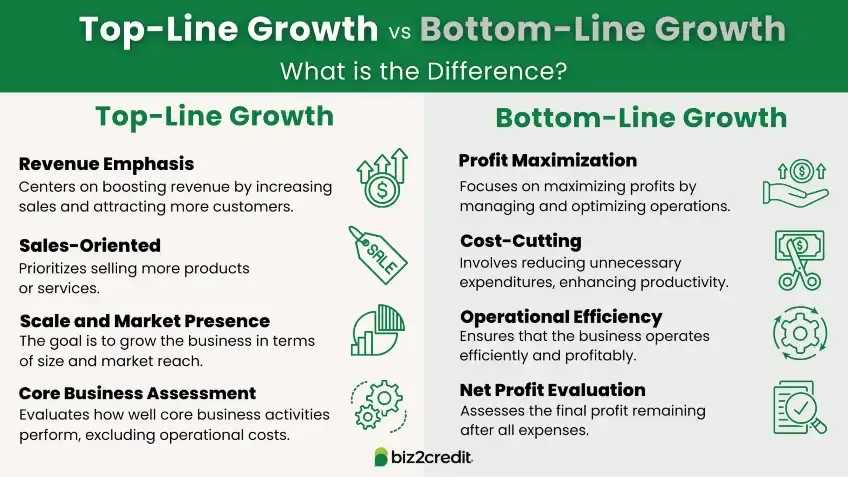

## Table of Contents

## What is the bottom line in business?

The bottom line in business is the final number on a company's income statement, showing if it made a profit or a loss. It's called the "bottom line" because it's the last line on the financial statement. This number is important because it tells business owners and investors if the company is doing well financially.

People often use the term "bottom line" to talk about the main result or the most important part of a decision. In business, focusing on the bottom line means making choices that will improve the company's profit. This can involve cutting costs, increasing sales, or finding new ways to make money.

## How is the bottom line calculated?

The bottom line is calculated by taking a company's total revenue and subtracting all its expenses. Revenue is the money the company earns from selling its products or services. Expenses include costs like salaries, rent, utilities, and the cost of goods sold. If the total revenue is more than the total expenses, the company has a profit. If the total expenses are more than the total revenue, the company has a loss.

To find the bottom line, you start with the company's income statement. This statement lists all the money coming in and all the money going out. You add up all the revenue and then subtract all the expenses. The number you get at the end is the bottom line. It's a simple but important calculation that shows whether the business is making money or losing money.

## Why is the bottom line important for businesses?

The bottom line is very important for businesses because it shows if they are making money or losing money. When a business knows its bottom line, it can see if it is doing well or if it needs to make changes. If the bottom line is a profit, it means the business is earning more money than it is spending. This is good because it shows the business is successful. If the bottom line is a loss, it means the business is spending more money than it is earning. This can be a warning sign that the business needs to find ways to cut costs or increase sales.

Knowing the bottom line also helps business owners and investors make decisions. For example, if a company wants to expand or invest in new projects, it needs to look at its bottom line to see if it can afford to do so. Investors also look at the bottom line to decide if they want to put money into a company. A good bottom line can attract more investment, which can help the business grow. In short, the bottom line is a key number that tells everyone involved with the business how it is doing financially.

## What are the components that affect the bottom line?

The bottom line is affected by many things. The main ones are revenue and expenses. Revenue is the money a business gets from selling things or services. If a business can sell more or charge more for what it sells, its revenue goes up. This can make the bottom line better. Expenses are all the costs a business has to pay, like salaries, rent, and the cost of making or buying what it sells. If a business can spend less on these things, its expenses go down. This also helps the bottom line.

Other things can affect the bottom line too. For example, taxes can take away from the bottom line. If taxes go up, the bottom line can go down. Interest on loans can also affect the bottom line. If a business has to pay a lot of interest, it can make the bottom line worse. Sometimes, things outside the business, like the economy or competition, can change the bottom line. If the economy is bad, people might buy less, which can hurt revenue. If there is a lot of competition, a business might have to lower prices, which can also hurt the bottom line.

## How can a company improve its bottom line?

A company can improve its bottom line by increasing its revenue and decreasing its expenses. To increase revenue, the company can try to sell more products or services. This can be done by finding new customers, selling to current customers more often, or raising prices if the market allows it. Another way to boost revenue is by introducing new products or services that meet the needs of customers. Marketing and advertising can also help bring in more sales, which in turn increases the bottom line.

To decrease expenses, a company can look for ways to spend less money. This might mean finding cheaper suppliers, cutting down on waste, or using resources more efficiently. Sometimes, it can mean reducing the number of employees or their working hours, but this should be done carefully to avoid hurting the business in other ways. The company can also try to negotiate better deals with landlords or utility providers to lower fixed costs. By managing both revenue and expenses well, a company can improve its bottom line and become more profitable.

## What is the difference between the top line and the bottom line?

The top line and the bottom line are two important numbers on a company's income statement. The top line is the total amount of money a company earns from selling its products or services. It's called the top line because it's the first number you see at the top of the income statement. People also call it revenue or sales. When a company's top line grows, it means they are selling more or charging more for what they sell.

The bottom line, on the other hand, is the final number on the income statement. It shows if the company made a profit or a loss after all expenses are subtracted from the top line. It's called the bottom line because it's at the end of the income statement. If the bottom line is positive, the company made a profit. If it's negative, the company had a loss. The bottom line is important because it tells everyone if the company is doing well financially.

Both the top line and the bottom line are important, but they show different things. The top line focuses on how much money is coming in, while the bottom line focuses on how much money is left after all costs are paid. A company can have a high top line but a low bottom line if its expenses are too high. On the other hand, a company can have a lower top line but a good bottom line if it manages its costs well.

## How does the bottom line impact financial statements?

The bottom line is very important for financial statements because it shows if a company made a profit or a loss. It is the last number on the income statement, which lists all the money the company earned and all the money it spent. If the bottom line is positive, it means the company made more money than it spent, which is good. If the bottom line is negative, it means the company spent more money than it earned, which can be a problem. People who read financial statements, like investors and business owners, look at the bottom line to see if the company is doing well or if it needs to make changes.

The bottom line also affects other parts of the financial statements. For example, it can change the balance sheet, which shows what the company owns and what it owes. If the bottom line is a profit, it can increase the company's equity, which is the value of the company. If the bottom line is a loss, it can decrease the equity. The bottom line can also affect the cash flow statement, which shows how money moves in and out of the company. A good bottom line means more cash is coming in, which can help the company grow or pay its bills. A bad bottom line can mean less cash, which can make it hard for the company to keep going.

## What strategies can be used to analyze the bottom line?

One way to analyze the bottom line is by looking at trends over time. You can compare the bottom line from different years or quarters to see if it is going up or down. If it is going up, it means the company is getting better at making money. If it is going down, it might mean the company needs to change something. You can also look at the bottom line as a percentage of the top line. This helps you see how much of the money the company earns turns into profit. If this percentage is going up, it means the company is getting better at keeping costs down.

Another strategy is to compare the bottom line with other companies in the same industry. This can help you see if the company is doing well compared to others. If the company's bottom line is better than its competitors, it might be doing something right. If it is worse, it might need to find new ways to make money or cut costs. You can also break down the bottom line to see where the money is coming from and where it is going. This can help you find areas where the company can improve, like selling more of a certain product or cutting back on certain expenses.

Lastly, you can use financial ratios to analyze the bottom line. Ratios like the profit margin, return on assets, and return on equity can show how well the company is using its money to make a profit. A high profit margin means the company is good at turning sales into profit. A high return on assets means the company is using its resources well to make money. By looking at these ratios, you can get a better idea of what is affecting the bottom line and what the company can do to make it better.

## How do economic conditions influence the bottom line?

Economic conditions can have a big impact on a company's bottom line. When the economy is doing well, people have more money to spend. This means they might buy more things, which can increase a company's sales and revenue. A good economy can also make it easier for companies to get loans or investments, which can help them grow and make more money. But if the economy is bad, people might not have as much money to spend. They might buy less, which can hurt a company's sales and make the bottom line worse. A bad economy can also make it harder for companies to get loans or investments, which can make it tough for them to keep going or grow.

Economic conditions can also affect the costs that a company has to pay. When the economy is good, prices for things like materials, labor, and rent might go up. This can increase a company's expenses and make the bottom line smaller. But if the economy is bad, prices might go down, which can help a company save money and improve the bottom line. Economic conditions can also change how much competition there is. In a good economy, more businesses might start up, which can make it harder for a company to keep its customers and prices high. In a bad economy, some businesses might close down, which can make it easier for a company to keep its customers and prices up.

## What are some common misconceptions about the bottom line?

One common misconception about the bottom line is that it only shows how much money a company makes. But the bottom line is more than just profit. It shows if a company is making or losing money after all its costs are taken away. This includes things like salaries, rent, and the cost of making or buying what the company sells. So, the bottom line is not just about making money; it's about how well a company manages all its money.

Another misconception is that a high bottom line always means a company is doing well. While a high bottom line is usually good, it doesn't tell the whole story. A company might have a high bottom line but still be in trouble if it has a lot of debt or if it's not investing in the future. Also, a company might have a low bottom line but be doing well if it's spending money to grow or if it's in an industry where profits are usually low. So, the bottom line is important, but it's just one part of understanding how a company is doing.

## How does the bottom line relate to corporate social responsibility?

The bottom line is the final number on a company's financial statement that shows if it made a profit or a loss. Corporate social responsibility (CSR) means a company tries to do good things for the world, like helping the environment or supporting the community. Some people think that focusing on CSR can hurt the bottom line because it costs money. But, doing good things can also help the bottom line. For example, if a company helps the environment, it might save money on energy costs. Or, if a company supports the community, it might get more customers who like what the company is doing.

CSR can also make the bottom line better in other ways. When a company does good things, it can make its brand stronger. This means more people might want to buy from the company, which can increase sales and profits. Also, doing good things can make employees happier and more loyal. Happy employees might work harder and stay with the company longer, which can save money on hiring and training new people. So, while CSR might cost money at first, it can help the bottom line in the long run by making the company more successful and respected.

## What advanced metrics can be used to further evaluate the bottom line?

To better understand the bottom line, companies can use advanced metrics like the operating margin. This metric shows how much profit a company makes from its main business after paying for things like salaries and the cost of making or buying what it sells. A high operating margin means the company is good at turning its main business into profit. Another useful metric is the net profit margin, which looks at how much profit is left after all costs, including taxes and interest on loans, are taken away. This gives a complete picture of how much money the company is really making.

Another important metric is the return on equity (ROE), which shows how well a company is using the money that shareholders have put into it. A high ROE means the company is doing a good job of turning that money into profit. The return on assets (ROA) is also helpful because it shows how well the company is using all its resources to make money. By looking at these advanced metrics, a company can see not just if it is making a profit, but how well it is managing all its money and resources to make that profit.

## What is the key to understanding business finance and financial metrics?

Business finance is the process of managing a company's monetary resources and investments to achieve economic stability and growth. At its core, it involves financial planning, budgeting, forecasting, and the management of financial risks and opportunities. A critical aspect of business finance is the use of financial metrics, which serve as valuable tools for evaluating the financial performance of a business. 

**Key Financial Metrics:**

1. **Net Earnings**: Net earnings, also known as net income, represent the total profit of a company after all expenses, taxes, and costs have been deducted from the total revenue. It serves as an indicator of a company's profitability. The formula for net earnings is:
$$
   \text{Net Earnings} = \text{Total Revenue} - \text{Total Expenses}

$$

   This metric is essential for assessing how effectively a company turns revenues into profit.

2. **Earnings Per Share (EPS)**: EPS calculates the portion of a company's profit allocated to each outstanding share of common stock. It is a critical indicator for investors, often used to gauge a company's profitability and compare it against peers. The formula for EPS is:
$$
   \text{EPS} = \frac{\text{Net Earnings} - \text{Preferred Dividends}}{\text{Average Outstanding Shares}}

$$

   A higher EPS indicates greater profitability on a per-share basis, which is attractive to investors.

3. **The Bottom Line**: The bottom line is synonymous with net profit, representing the total profit remaining after all expenses are subtracted from revenues. It signifies the company's capacity to generate shareholder value over time. Enhancing the bottom line can be achieved through strategies such as increasing sales, improving operational efficiency, and cutting unnecessary costs.

Understanding and interpreting these financial metrics are crucial for making informed strategic decisions, maintaining financial stability, and guiding a company's growth. They help corporate leaders and stakeholders evaluate past performance and anticipate future financial trajectories.

Through the effective stewardship of business finance and regular analysis of financial metrics, companies can better navigate the complexities of their financial landscapes, thereby ensuring sustainable growth and competitiveness in their respective markets.

## What Financial Metrics Are Relevant to Algo Trading?

In the landscape of algorithmic trading, the application of financial metrics is critical to gauge performance and manage risk effectively. Among these, the Sharpe Ratio, Sortino Ratio, and Maximum Drawdown stand out as essential tools for traders and analysts.

The **Sharpe Ratio** quantifies risk-adjusted return, enabling a comparison of the excess return per unit of total risk. It is calculated as:

$$
\text{Sharpe Ratio} = \frac{R_p - R_f}{\sigma_p}
$$

where $R_p$ is the portfolio return, $R_f$ is the risk-free rate, and $\sigma_p$ is the standard deviation of the portfolio's excess return. A higher Sharpe Ratio indicates better risk-adjusted performance.

The **Sortino Ratio** refines the Sharpe Ratio by isolating downside volatility, thus providing a more targeted assessment of risk. It is defined as:

$$
\text{Sortino Ratio} = \frac{R_p - R_f}{\sigma_d}
$$

where $\sigma_d$ is the standard deviation of the negative asset returns (downside deviation). By focusing solely on downside risk, the Sortino Ratio offers a nuanced perspective that is particularly beneficial when the primary concern is mitigating losses.

**Maximum Drawdown** measures the decline from the peak to the trough of an investment portfolio, highlighting the most significant drop experienced. It is expressed as:

$$
\text{Max Drawdown} = \frac{\text{Trough Value} - \text{Peak Value}}{\text{Peak Value}}
$$

This metric is crucial for understanding potential downside risk and helps in assessing the viability of different trading strategies under adverse conditions.

Incorporating these metrics allows algorithmic trading systems to optimize strategies by balancing risk and return, ultimately aiming to enhance performance while safeguarding against significant losses. These metrics guide decision-making by quantifying complex risk components, enabling more informed and strategic trading practices.

## References & Further Reading

[1]: Bergstra, J., Bardenet, R., Bengio, Y., & Kégl, B. (2011). ["Algorithms for Hyper-Parameter Optimization."](https://proceedings.neurips.cc/paper/2011/file/86e8f7ab32cfd12577bc2619bc635690-Paper.pdf) Advances in Neural Information Processing Systems 24.

[2]: ["Advances in Financial Machine Learning"](https://www.amazon.com/Advances-Financial-Machine-Learning-Marcos/dp/1119482089) by Marcos Lopez de Prado

[3]: ["Evidence-Based Technical Analysis: Applying the Scientific Method and Statistical Inference to Trading Signals"](https://www.amazon.com/Evidence-Based-Technical-Analysis-Scientific-Statistical/dp/0470008741) by David Aronson

[4]: ["Machine Learning for Algorithmic Trading"](https://github.com/PacktPublishing/Machine-Learning-for-Algorithmic-Trading-Second-Edition) by Stefan Jansen

[5]: ["Quantitative Trading: How to Build Your Own Algorithmic Trading Business"](https://www.amazon.com/Quantitative-Trading-Build-Algorithmic-Business/dp/1119800064) by Ernest P. Chan