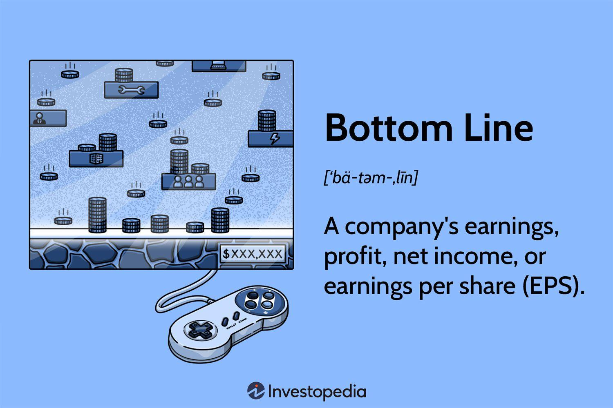

In the rapidly changing landscape of business finance, a deep understanding of financial metrics is vital for making well-informed decisions. Corporate leaders depend heavily on metrics like the bottom line to evaluate a company's financial wellbeing. The bottom line, representing net profit, acts as a critical indicator of a company's capacity to generate shareholder value and sustain growth. In parallel, algorithmic trading—commonly known as algo trading—is transforming investment management. By employing sophisticated algorithmic strategies, these automated trading systems aim to optimize returns by swiftly analyzing market conditions and executing trades at lightning speeds unattainable by human traders.

This article intends to examine the intersection of business finance, financial metrics, and algorithmic trading. It highlights the profound influence these concepts have on the bottom line and the broader investment arena. Recognizing the implications of these elements is essential for anyone involved in finance—whether as a seasoned trader navigating volatile markets, a finance executive steering strategic corporate decisions, or a newcomer eager to grasp the fundamentals of this field. Understanding the interplay between financial metrics and algorithmic strategies provides valuable insights, enabling stakeholders to enhance trading decisions and improve financial results. By bridging traditional financial analysis with modern technology-driven trading methodologies, businesses can position themselves for enduring success in an increasingly competitive marketplace.



## Table of Contents

## Understanding Business Finance and Financial Metrics

Business finance is the process of managing a company's monetary resources and investments to achieve economic stability and growth. At its core, it involves financial planning, budgeting, forecasting, and the management of financial risks and opportunities. A critical aspect of business finance is the use of financial metrics, which serve as valuable tools for evaluating the financial performance of a business. 

**Key Financial Metrics:**

1. **Net Earnings**: Net earnings, also known as net income, represent the total profit of a company after all expenses, taxes, and costs have been deducted from the total revenue. It serves as an indicator of a company's profitability. The formula for net earnings is:
$$
   \text{Net Earnings} = \text{Total Revenue} - \text{Total Expenses}

$$

   This metric is essential for assessing how effectively a company turns revenues into profit.

2. **Earnings Per Share (EPS)**: EPS calculates the portion of a company's profit allocated to each outstanding share of common stock. It is a critical indicator for investors, often used to gauge a company's profitability and compare it against peers. The formula for EPS is:
$$
   \text{EPS} = \frac{\text{Net Earnings} - \text{Preferred Dividends}}{\text{Average Outstanding Shares}}

$$

   A higher EPS indicates greater profitability on a per-share basis, which is attractive to investors.

3. **The Bottom Line**: The bottom line is synonymous with net profit, representing the total profit remaining after all expenses are subtracted from revenues. It signifies the company's capacity to generate shareholder value over time. Enhancing the bottom line can be achieved through strategies such as increasing sales, improving operational efficiency, and cutting unnecessary costs.

Understanding and interpreting these financial metrics are crucial for making informed strategic decisions, maintaining financial stability, and guiding a company's growth. They help corporate leaders and stakeholders evaluate past performance and anticipate future financial trajectories.

Through the effective stewardship of business finance and regular analysis of financial metrics, companies can better navigate the complexities of their financial landscapes, thereby ensuring sustainable growth and competitiveness in their respective markets.

## The Importance of the Bottom Line

The bottom line, representing a company's net profit, is essential for stakeholders and potential investors as it directly indicates a firm's financial health and its ability to increase shareholder value over time. Unlike the top line, which refers to total revenue, the bottom line demonstrates the actual profit after all expenses, taxes, and interest have been deducted. This metric provides a clear picture of the company's profitability, which is critical for evaluating its long-term viability.

Improving the bottom line involves various strategies that focus primarily on either increasing revenue or reducing costs while maintaining quality. Revenue can be enhanced through tactics such as market expansion, product innovation, and improved customer engagement. For example, developing new products or services or entering untapped markets can lead to higher sales volumes, thereby increasing revenue.

Cost management is another key approach to improving the bottom line. This involves streamlining operations to reduce waste and increase efficiency. Companies may employ techniques like lean manufacturing or adopt new technologies to automate processes, ultimately reducing costs. Cutting unnecessary expenses, such as renegotiating supplier contracts or improving supply chain logistics, can also contribute significantly.

Operational efficiency further impacts the bottom line. By optimizing resource allocation and minimizing downtime, companies can maximize their output relative to input, effectively turning investments into profit. Implementing robust internal controls and monitoring systems can prevent financial leakages and improve cash flow management.

An example of a financial strategy aimed at the bottom line could involve implementing cost-reduction projects without sacrificing product quality or customer satisfaction. For instance, a company might switch to a more cost-effective yet reliable raw material supplier, which reduces production costs while ensuring product standards are upheld.

In summary, the bottom line is a comprehensive measure of a company's actual financial performance. Strategies to enhance it should be multifaceted, focusing on both revenue growth and cost-effectiveness to ensure sustained profitability and shareholder satisfaction.

 to Algorithmic Trading

Algorithmic trading, often referred to as algo trading, employs computer algorithms to facilitate the execution of trades at speeds and frequencies that surpass human capabilities. This approach leverages advanced mathematical models and statistical analysis to automate trading decisions based on an array of market variables.

Central to [algorithmic trading](/wiki/algorithmic-trading) is the analysis of historical data patterns. By scrutinizing past market behaviors, algorithms can identify trends and correlations that may forecast future price movements. This historical perspective is enhanced by real-time market conditions, allowing algorithms to adapt to sudden changes in market sentiment, [liquidity](/wiki/liquidity-risk-premium), and [volatility](/wiki/volatility-trading-strategies).

Predictive analytics further enriches the algorithmic trading process. By utilizing [machine learning](/wiki/machine-learning) techniques, algorithms can continuously refine their predictive capabilities, learning from past mistakes and successes to better anticipate market trends. For instance, models can be trained to recognize patterns indicative of market rallies or downturns, enabling preemptive trading actions.

A significant advantage of algo trading is its capacity to strip trading of emotional influence, which often leads to inconsistent and irrational decision-making. Human emotions, such as fear and greed, can cause traders to act erratically. Automated systems, on the other hand, adhere strictly to pre-defined rules and strategies, promoting consistency and discipline.

Moreover, by minimizing human intervention, algo trading reduces the incidence of errors associated with manual trading. Fatigue, miscalculations, and oversight are eliminated, improving the overall reliability of trading operations.

The optimization of trading strategies through algorithmic trading is evident in the quest for better risk-adjusted returns. Metrics such as the Sharpe Ratio, which evaluates the trade-off between risk and reward, can be integrated into algorithms to enhance performance. By continuously assessing these metrics, algorithms can dynamically adjust positions, hedge risks, and capitalize on emerging opportunities, thereby optimizing returns.

In conclusion, algorithmic trading's ability to process vast amounts of data with precision offers a compelling framework for modern trading strategies. As techniques in computing and data analysis advance, the scope and efficacy of algo trading are poised to expand, cementing its role as a cornerstone of contemporary financial markets.

## Financial Metrics Relevant to Algo Trading

In the landscape of algorithmic trading, the application of financial metrics is critical to gauge performance and manage risk effectively. Among these, the Sharpe Ratio, Sortino Ratio, and Maximum Drawdown stand out as essential tools for traders and analysts.

The **Sharpe Ratio** quantifies risk-adjusted return, enabling a comparison of the excess return per unit of total risk. It is calculated as:

$$
\text{Sharpe Ratio} = \frac{R_p - R_f}{\sigma_p}
$$

where $R_p$ is the portfolio return, $R_f$ is the risk-free rate, and $\sigma_p$ is the standard deviation of the portfolio's excess return. A higher Sharpe Ratio indicates better risk-adjusted performance.

The **Sortino Ratio** refines the Sharpe Ratio by isolating downside volatility, thus providing a more targeted assessment of risk. It is defined as:

$$
\text{Sortino Ratio} = \frac{R_p - R_f}{\sigma_d}
$$

where $\sigma_d$ is the standard deviation of the negative asset returns (downside deviation). By focusing solely on downside risk, the Sortino Ratio offers a nuanced perspective that is particularly beneficial when the primary concern is mitigating losses.

**Maximum Drawdown** measures the decline from the peak to the trough of an investment portfolio, highlighting the most significant drop experienced. It is expressed as:

$$
\text{Max Drawdown} = \frac{\text{Trough Value} - \text{Peak Value}}{\text{Peak Value}}
$$

This metric is crucial for understanding potential downside risk and helps in assessing the viability of different trading strategies under adverse conditions.

Incorporating these metrics allows algorithmic trading systems to optimize strategies by balancing risk and return, ultimately aiming to enhance performance while safeguarding against significant losses. These metrics guide decision-making by quantifying complex risk components, enabling more informed and strategic trading practices.

## Improving Financial Outcomes through Metrics and Trading Strategies

Employing financial metrics and sophisticated algorithmic strategies can significantly enhance investment outcomes. One of the cornerstone practices in algorithmic trading is the implementation of stop-loss orders. These are pre-set levels that trigger an automatic sale of an asset if its price falls to a predetermined point. This strategy helps limit potential losses by providing a risk management framework that operates independently of emotional biases.

Dynamic position sizing is another essential method, which involves adjusting the size of a trading position based on market volatility and other risk factors. By calibrating position sizes relative to the perceived risk, traders can maintain a balanced risk-to-return ratio, aiming for sustainability and profitability in varying market conditions. 

Constant evaluation and adjustment of strategies are critical in the ever-evolving financial markets. This involves periodically reviewing algorithmic performance and market conditions to ensure that strategies remain effective. Such evaluations can lead to fine-tuning or completely overhauling existing strategies to better align with current market dynamics or investor goals.

Backtesting is an indispensable tool in this process, allowing traders to test their algorithms on historical data to assess how they would have performed in the past. The [backtesting](/wiki/backtesting) process can highlight potential weaknesses or strengths in a trading strategy, providing insights into its robustness. 

Optimization follows backtesting, involving fine-tuning algorithm parameters to maximize performance metrics. This iterative process helps in identifying the most effective parameters for achieving desired outcomes. For example, optimizing with constraints such as maximum drawdown or volatility targets can enhance a strategy's resilience to adverse market conditions.

Python provides a robust platform for developing and testing these strategies. Libraries like pandas for data manipulation, NumPy for numerical calculations, and [backtrader](/wiki/backtrader) or PyAlgoTrade for backtesting are invaluable for asset managers and traders. Here is a sample of Python code illustrating a basic backtesting setup using these libraries:

```python
import backtrader as bt

class MyStrategy(bt.Strategy):
    def __init__(self):
        self.sma = bt.indicators.SimpleMovingAverage(self.data.close, period=15)

    def next(self):
        if not self.position:
            if self.data.close[0] > self.sma[0]:  # Buy condition
                self.buy(size=10)
        elif self.data.close[0] < self.sma[0]:  # Sell condition
            self.sell(size=10)

cerebro = bt.Cerebro()
cerebro.addstrategy(MyStrategy)

data = bt.feeds.YahooFinanceData(dataname='AAPL', fromdate=datetime(2020, 1, 1), todate=datetime(2021, 1, 1))
cerebro.adddata(data)

cerebro.broker.setcash(10000)
cerebro.run()
```

This simple moving average strategy demonstrates the framework around which more complex and nuanced strategies can be built and backtested. By utilizing these advanced trading techniques and technologies, traders can optimize financial outcomes and significantly enhance the effectiveness of their investments.

## Conclusion

Business finance, strengthened by robust financial metrics, serves as the foundation for effective strategic decision-making and sustainable growth. By comprehensively understanding these metrics, businesses are equipped to assess their financial health, plan strategically, and enhance operational efficiency. Such an approach is crucial for maintaining competitive advantage and ensuring long-term success.

Algorithmic trading is the future of investing, offering a digital, data-driven methodology to manage investments and optimize returns. Algorithms allow traders to execute strategies at scale and speed beyond human capabilities, thereby minimizing emotional biases and errors. This technological advancement helps in tailoring investment strategies that can adapt to fluctuating market dynamics, thereby optimizing return on investment.

Integrating financial metrics with algorithmic trading strategies can substantially influence a company's bottom line. Metrics provide the quantitative benchmarks necessary for evaluating and refining trading strategies, ensuring they align with the desired financial outcomes. By leveraging this combination, businesses can gain insightful data, drive cost efficiencies, and boost profitability. For example, using key performance indicators such as the Sharpe Ratio in algorithmic systems allows traders to measure risk-adjusted returns, aligning investment strategies with risk tolerances. 

Overall, the synergy between robust financial metrics and sophisticated algorithmic strategies is pivotal for enhancing business success and improving financial outcomes. The strategic application of these elements can empower companies to make informed decisions, optimize operational performance, and secure a sustainable competitive edge in the investment landscape.

## References & Further Reading

[1]: Bergstra, J., Bardenet, R., Bengio, Y., & Kégl, B. (2011). ["Algorithms for Hyper-Parameter Optimization."](https://proceedings.neurips.cc/paper/2011/file/86e8f7ab32cfd12577bc2619bc635690-Paper.pdf) Advances in Neural Information Processing Systems 24.

[2]: ["Advances in Financial Machine Learning"](https://www.amazon.com/Advances-Financial-Machine-Learning-Marcos/dp/1119482089) by Marcos Lopez de Prado

[3]: ["Evidence-Based Technical Analysis: Applying the Scientific Method and Statistical Inference to Trading Signals"](https://www.amazon.com/Evidence-Based-Technical-Analysis-Scientific-Statistical/dp/0470008741) by David Aronson

[4]: ["Machine Learning for Algorithmic Trading"](https://github.com/PacktPublishing/Machine-Learning-for-Algorithmic-Trading-Second-Edition) by Stefan Jansen

[5]: ["Quantitative Trading: How to Build Your Own Algorithmic Trading Business"](https://www.amazon.com/Quantitative-Trading-Build-Algorithmic-Business/dp/1119800064) by Ernest P. Chan