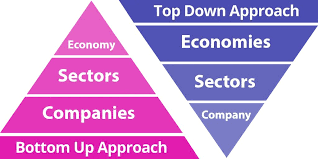

## Table of Contents

## What is bottom-up investing?

Bottom-up investing is a strategy where investors focus on individual companies rather than the overall market or economic trends. They look closely at a company's financial health, business model, and growth potential to decide if it's a good investment. Instead of worrying about what's happening in the economy or industry as a whole, bottom-up investors believe that strong companies can perform well even in tough times.

This approach involves a lot of detailed research into specific companies. Investors might look at things like a company's earnings, its management team, and its competitive advantages. By understanding these details, they hope to find undervalued stocks that have the potential to grow significantly. This method can be time-consuming, but it allows investors to build a portfolio based on their belief in the strength and future of individual businesses.

## What is a top-down approach in investing?

A top-down approach in investing means looking at the big picture first. Instead of starting with individual companies, investors who use this method begin by analyzing the overall economy and big trends. They might look at things like interest rates, employment rates, and government policies to see which industries are likely to do well. For example, if they think the economy is going to grow, they might invest in industries that do well during good economic times, like consumer goods or technology.

After figuring out which sectors or industries look promising, top-down investors then pick specific companies within those sectors to invest in. They believe that by understanding the broader economic environment, they can make better choices about where to put their money. This approach can help investors take advantage of big trends and shifts in the market, but it also means they might miss out on opportunities in individual companies that are doing well despite a tough economic climate.

## How do bottom-up and top-down approaches differ?

The main difference between bottom-up and top-down approaches in investing is where they start their analysis. Bottom-up investors begin by looking at individual companies. They focus on the details like a company's financial health, how it makes money, and its growth potential. They believe that strong companies can do well no matter what's happening in the economy. This means they spend a lot of time researching specific companies to find good investments.

On the other hand, top-down investors start with the big picture. They look at the overall economy, trends, and big events to decide which industries might do well. After they figure out which sectors are promising, they then choose specific companies within those sectors to invest in. They think that understanding the broader economic environment helps them make better investment choices. This approach can help them catch big trends, but they might miss out on strong companies in struggling industries.

In summary, bottom-up investors focus on the strength of individual companies, while top-down investors focus on the overall economic and industry trends. Both methods have their advantages and can be used together to create a well-rounded investment strategy.

## What are the key steps in implementing a bottom-up investment strategy?

Implementing a bottom-up investment strategy starts with researching individual companies in detail. You look at their financial statements to understand how much money they are making and how healthy their finances are. You also study the company's business model to see how they make money and what makes them different from their competitors. It's important to look at the management team too, to see if they have a good track record and can lead the company to grow. This step involves a lot of reading and analysis, but it helps you find companies that might be undervalued and have a lot of potential.

After you've done your research, you pick the companies you think are the best investments. You look for companies that have strong earnings, good growth prospects, and are led by a capable management team. Once you've chosen your companies, you buy their stocks and add them to your investment portfolio. You keep an eye on these companies over time, checking their performance and the news about them. If a company starts doing better than you expected, that's great. But if it starts to struggle, you might need to sell your shares and look for other opportunities. This way, you build a portfolio based on the strength and potential of individual companies, not just on what's happening in the market or economy.

## What are the main components of a top-down investment approach?

A top-down investment approach starts by looking at the big picture. You begin by studying the overall economy, like how fast it's growing, what interest rates are doing, and what the government is up to. You also look at big trends, like if people are spending more money or if new technologies are changing industries. By understanding these things, you can figure out which parts of the economy, or sectors, are likely to do well in the future. For example, if you think the economy is going to grow, you might focus on industries like technology or consumer goods that usually do well when times are good.

Once you've picked out the promising sectors, you then look for specific companies within those sectors to invest in. You still need to do some research on these companies, but it's less detailed than in a bottom-up approach. You might look at things like how much money the company is making and if it's growing, but you're mostly interested in how it fits into the bigger picture you've already figured out. This way, you can take advantage of big trends and shifts in the market, hoping that the sectors you've chosen will help your investments grow.

## Can you provide examples of bottom-up investing in action?

Imagine you're interested in investing in a company called GreenTech. You start by looking at GreenTech's financial statements and see that they've been making more money each year. You also read about their business model and find out they make eco-friendly products that are becoming more popular. You meet the CEO at a conference and are impressed with their vision for the future. After doing all this research, you decide GreenTech is a strong company with a lot of potential, so you buy their stock. Even if the economy is struggling, you believe GreenTech will keep growing because of its solid business and good management.

Another example is when you discover a small restaurant chain called FreshBites. You visit a few of their locations and love the food and atmosphere. You then look at their financials and see they're profitable and expanding to new cities. You talk to customers and employees and everyone seems happy with the company. Even though the restaurant industry is facing challenges, FreshBites seems to be doing well. You decide to invest in FreshBites because you believe in their unique approach and growth potential, not because of what's happening in the broader economy.

## What are some case studies of successful top-down investment strategies?

In the early 2000s, an investor noticed that the world was starting to use more renewable energy. They saw that governments were making rules to reduce pollution and that technology for solar and wind power was getting better. The investor decided to focus on the renewable energy sector. After [picking](/wiki/asset-class-picking) this sector, they looked for companies that were doing well in it. They found a company called SolarEdge, which made equipment for solar panels. By investing in SolarEdge early, the investor made a lot of money as the company grew and more people started using solar energy.

Another example is from the late 1990s when an investor saw that the internet was becoming a big deal. They realized that more people would start shopping online and that companies making websites and software would do well. The investor decided to focus on the technology sector, especially companies involved in the internet. They found a company called Amazon, which was just starting to sell [books](/wiki/algo-trading-books) online. By investing in Amazon early, the investor benefited as the company grew into a huge online marketplace. This shows how understanding big trends can lead to successful investments in specific companies.

## How do investors typically combine bottom-up and top-down methods in their portfolios?

Investors often mix bottom-up and top-down methods to make their investment portfolios better. They start by using the top-down approach to look at the big picture, like how the economy is doing or what trends are happening. For example, if they think the economy will grow, they might focus on industries that do well during good times, like tech or consumer goods. Once they pick these industries, they use the bottom-up approach to find the best companies within them. They look at things like how much money the companies make, how they run their business, and who is leading them. This way, they can take advantage of big trends and also invest in strong companies.

By combining these methods, investors can balance their risks and rewards. The top-down approach helps them catch big opportunities in the market, while the bottom-up approach lets them find hidden gems that might be overlooked. For instance, an investor might decide to invest in the healthcare sector because they think it will do well in the future. Then, they look at different healthcare companies and find one that is doing great but is not well-known yet. By using both approaches, investors can make smarter choices and build a portfolio that is ready for different economic situations.

## What are the potential advantages of using a bottom-up approach over a top-down approach?

Using a bottom-up approach can help you find great companies that might be missed by looking at the big picture. When you focus on individual companies, you can find ones that are doing really well even if their industry or the economy is struggling. This means you might discover hidden gems that other investors overlook because they're too focused on what's happening in the market as a whole. By spending time understanding each company's business, finances, and leadership, you can make more informed choices about where to put your money.

Another advantage of the bottom-up approach is that it can protect you from big market swings. If you invest in strong companies, they might keep doing well even when the economy goes through tough times. This can make your investments more stable because you're not as affected by what's happening in the economy. While a top-down approach can help you catch big trends, it might also lead you to invest in industries that are overhyped and could fall quickly if the market changes. By focusing on the strength of individual companies, you can build a more resilient portfolio.

## What risks and challenges are associated with top-down investing?

One risk of top-down investing is that you might miss out on good companies just because their industry or the economy isn't doing well. If you focus too much on the big picture, you might not see that some companies are doing great even when times are tough. This can make you miss chances to invest in strong businesses that could grow a lot.

Another challenge is that it can be hard to predict what will happen in the economy or with big trends. Sometimes, things change quickly and in ways you didn't expect. If you put all your money into sectors that you thought would do well, but then the economy takes a turn, your investments could lose value fast. So, even if you think you understand the big picture, it can still be risky because the future is hard to guess.

## How can advanced analytical tools enhance both bottom-up and top-down investment strategies?

Advanced analytical tools can really help bottom-up investors by making it easier to look at a lot of information about individual companies. These tools can quickly go through financial statements, find important numbers, and even use special math to predict how a company might do in the future. This means bottom-up investors can spend less time on the boring stuff and more time understanding what makes a company special. They can find hidden opportunities that might be hard to see without these tools. For example, they might use software to see patterns in a company's earnings that show it could grow a lot, even if the industry is struggling.

For top-down investors, these tools can help them understand big trends and the economy better. They can use data analysis to look at things like how fast the economy is growing, what people are spending money on, and how different industries are doing. This helps them pick the best sectors to invest in. Advanced tools can also use special models to predict what might happen in the future, which can be really useful for making smart choices about where to put money. By combining all this information, top-down investors can make better decisions about which industries will do well and then find the best companies within those industries.

## What are the latest trends and innovations in bottom-up and top-down investing?

One big trend in bottom-up investing is using [artificial intelligence](/wiki/ai-artificial-intelligence) (AI) and [machine learning](/wiki/machine-learning) to help find good companies to invest in. These tools can look at a lot of information really fast, like financial statements and news articles, to see if a company is doing well or might do well in the future. They can even spot patterns that are hard for people to see. This helps investors find hidden opportunities and make better choices about where to put their money. Another trend is that more people are using environmental, social, and governance ([ESG](/wiki/esg-investing)) factors to pick companies. They want to invest in businesses that are good for the planet and society, and these tools help them find companies that match their values.

For top-down investing, a big trend is using big data to understand the economy and big trends better. Investors are using all kinds of information, like social media posts and satellite images, to see what's happening in the world and predict what might happen next. This helps them pick the best industries to invest in. Another innovation is using real-time data to make quick decisions. With new technology, investors can see what's happening in the market right away and change their investments if they need to. This can help them take advantage of big opportunities and avoid risks.

## References & Further Reading

[1]: Bergstra, J., Bardenet, R., Bengio, Y., & Kégl, B. (2011). ["Algorithms for Hyper-Parameter Optimization."](https://dl.acm.org/doi/10.5555/2986459.2986743) Advances in Neural Information Processing Systems 24.

[2]: ["Advances in Financial Machine Learning"](https://www.amazon.com/Advances-Financial-Machine-Learning-Marcos/dp/1119482089) by Marcos Lopez de Prado

[3]: ["Evidence-Based Technical Analysis: Applying the Scientific Method and Statistical Inference to Trading Signals"](https://www.amazon.com/Evidence-Based-Technical-Analysis-Scientific-Statistical/dp/0470008741) by David Aronson

[4]: ["Machine Learning for Algorithmic Trading"](https://github.com/stefan-jansen/machine-learning-for-trading) by Stefan Jansen

[5]: ["Quantitative Trading: How to Build Your Own Algorithmic Trading Business"](https://www.amazon.com/Quantitative-Trading-Build-Algorithmic-Business/dp/1119800064) by Ernest P. Chan

[6]: Sharpe, W. F. (1964). ["Capital Asset Prices: A Theory of Market Equilibrium under Conditions of Risk."](https://onlinelibrary.wiley.com/doi/full/10.1111/j.1540-6261.1964.tb02865.x) The Journal of Finance.

[7]: Gordon, M. J. (1959). ["Dividends, Earnings, and Stock Prices."](http://piketty.pse.ens.fr/files/Gordon1959.pdf) The Review of Economics and Statistics.

[8]: Fabozzi, F. J., Focardi, S. M., & Kolm, P. N. (2010). ["Quantitative Equity Investing."](https://www.semanticscholar.org/paper/Quantitative-Equity-Investing%3A-Techniques-and-Fabozzi-Focardi/1c49a2a53919f7e65cb96f16691b8ff726fd3cd7) Wiley Finance.

[9]: Graham, B., & Dodd, D. (1934). ["Security Analysis."](https://books.google.com/books/about/Security_Analysis_The_Classic_1934_Editi.html?id=wXlrnZ1uqK0C) Whittlesey House.

[10]: Murphy, J. J. (1999). ["Technical Analysis of the Financial Markets."](https://archive.org/details/technicalanalysi0000murp) New York Institute of Finance.