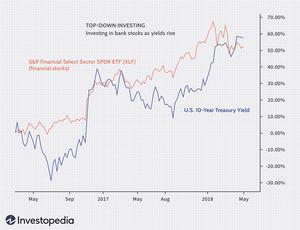

Investors employ a myriad of strategies to evaluate and select investment opportunities, each catering to different perspectives and financial goals. Among these, top-down investing, bottom-up investing, and algorithmic trading are particularly noteworthy. Each strategy boasts distinct methodologies and offers unique insights into the financial markets. Understanding their nuances can significantly aid investors in making informed decisions.

Top-down investing emphasizes the analysis of macroeconomic factors. Investors begin by scrutinizing the broader economic environment, considering elements such as GDP growth rates, inflation trends, and interest rate policies. This approach involves identifying global or regional economic trends and then narrowing down to sectors and individual securities that are likely to benefit from these trends.



In contrast, bottom-up investing focuses on evaluating individual companies. This strategy involves a thorough assessment of microeconomic factors including a company's financial statements, management capabilities, and growth prospects. Investors aim to identify undervalued stocks with significant potential for long-term growth, irrespective of the broader economic conditions.

Algorithmic trading represents a technological evolution in investing strategies. It utilizes advanced mathematical models and computing power to execute trades at high speeds and volumes. By automating the trading process, algorithmic trading seeks to minimize human errors and exploit market inefficiencies.

This article examines these strategies in detail, exploring their processes, advantages, and potential drawbacks. It aims to equip both novice and experienced investors with a comprehensive understanding of these investment approaches. By understanding and potentially combining these strategies, investors can enhance their ability to navigate the dynamic financial markets and achieve their investment objectives.

## Table of Contents

## Top-Down Investing: A Macro Perspective

Top-down investing is a strategy that begins with an analysis of the broader economic environment, concentrating on macroeconomic indicators such as GDP, inflation, and interest rates. This systematic approach allows investors to gain an understanding of the overall economic climate and predict which sectors or regions are poised to perform well given current and anticipated conditions.

Investors employing a top-down approach first assess the economic landscape, identifying macroeconomic trends that might influence various industries. By examining factors such as GDP growth rates, inflation trends, and [interest rate](/wiki/interest-rate-trading-strategies) movements, they can discern how these elements might favor or hinder different economic sectors. For instance, a rising GDP might indicate favorable conditions for consumer discretionary stocks, while an environment of increasing interest rates could pose challenges for sectors reliant on borrowing, such as real estate or utilities.

The next step involves selecting sectors or regions that are likely to benefit from these macroeconomic trends. This sector or regional focus provides a strategic filter, narrowing down the universe of potential investments to those areas predicted to flourish under prevailing conditions. For instance, in a booming economy with rising consumer spending, sectors like technology or consumer goods might be prioritized.

A significant advantage of top-down investing is its emphasis on diversification across regions and sectors. By spreading investments across a variety of sectors that react differently to economic shifts, investors can mitigate risk and reduce the likelihood of large portfolio drawdowns caused by industry-specific declines. This diversified approach can help cushion the portfolio against [volatility](/wiki/volatility-trading-strategies) and economic downturns in specific sectors.

However, the top-down strategy is not without its limitations. While it excels in capturing broad sectoral growth, it may overlook individual stocks with high potential that exist within underperforming sectors. For example, a sector deemed unattractive based on macroeconomic factors may still contain companies that, due to strong management or innovation, could outperform.

Despite this potential drawback, top-down investing remains a popular strategy for its ability to align investment decisions with macroeconomic trends, offering a comprehensive perspective on how to allocate resources in the vast landscape of financial markets. By continuously monitoring macroeconomic indicators and adjusting sector allocations accordingly, investors can potentially achieve a balanced portfolio that is both robust and flexible to changing economic conditions.

## Bottom-Up Investing: Focusing on the Micro

Bottom-up investing centers on the analysis of individual companies, emphasizing microeconomic factors such as financial health, management quality, and growth prospects. This strategic approach is characterized by [fundamental analysis](/wiki/fundamental-analysis)—a method frequently employed to identify stocks believed to be undervalued with the potential for long-term appreciation. Fundamental analysis involves evaluating a company's financial statements, assessing metrics like earnings, revenue, and cash flow, as well as considering qualitative factors like corporate governance and strategic initiatives.

Investors who adopt a bottom-up strategy focus intensively on company-specific details, sometimes visiting company facilities or reviewing comprehensive analyst reports. This meticulous approach increases the likelihood of identifying 'hidden gem' stocks that may be overlooked by the broader market due to their market capitalization or absence in mainstream investment discussions.

The primary appeal of bottom-up investing lies in its potential for higher returns through the identification and investment in individual stocks. By concentrating on the intrinsic value and potential growth of a corporation, investors can make investment decisions less swayed by short-term market fluctuations or broader economic conditions. However, this focus on individual companies also means the strategy carries higher risks. External economic shifts or industry-wide downturns can impact individual stocks despite their intrinsic merits. Thus, while investors might achieve substantial gains, they must remain vigilant about shifting market dynamics that could unfavorably impact their investments.

In summary, bottom-up investing offers a focused approach that prioritizes individual company strengths and undervaluations, though it necessitates careful consideration of external risks and the potential for unexpected economic changes.

## Algorithmic Trading: The Role of Technology

Algorithmic trading uses complex mathematical models and cutting-edge technology to perform trades at high speed and large volumes. This approach aims to enhance trading efficiency by reducing human intervention, thereby helping secure optimal prices for financial instruments. Algorithms process vast datasets at extraordinary speed, enabling quick responses to market changes, which is crucial in volatile environments where rapid decision-making can be pivotal.

One of the notable strengths of [algorithmic trading](/wiki/algorithmic-trading) is its ability to integrate strategies from both top-down and bottom-up investing. Algorithms can be programmed to account for macroeconomic indicators and sector analyses associated with a top-down approach, as well as the financial metrics and firm-specific details emphasized in bottom-up analysis. This versatility allows for a comprehensive strategy that can adapt to various market conditions. 

Despite its advantages, algorithmic trading is not free from risks. For instance, the phenomenon of market flash crashes illustrates the potential pitfalls. Flash crashes occur when automated trading systems malfunction or when their algorithms produce unanticipated outcomes in response to extreme market conditions. These crashes can result in sudden and dramatic drops in asset prices, often corrected quickly but potentially leading to significant short-term financial disruptions.

Implementing algorithmic trading requires robust technological infrastructure, sophisticated software, and thorough testing to ensure systems function as intended. Python, due to its robust libraries and ease of use, is a favored language for building these algorithms. Here's a simple example of a moving average crossover strategy implemented in Python:

```python
import pandas as pd
import numpy as np

def moving_average_strategy(prices, short_window=40, long_window=100):
    # Generate signals
    signals = pd.DataFrame(index=prices.index)
    signals['Signal'] = 0.0

    # Create short simple moving average
    signals['ShortMA'] = prices.rolling(window=short_window, min_periods=1, center=False).mean()

    # Create long simple moving average
    signals['LongMA'] = prices.rolling(window=long_window, min_periods=1, center=False).mean()

    # Generate trading signals
    signals['Signal'][short_window:] = np.where(signals['ShortMA'][short_window:] > signals['LongMA'][short_window:], 1.0, 0.0)

    # Calculate trading orders
    signals['Positions'] = signals['Signal'].diff()

    return signals

# Example usage
prices = pd.Series([random data])  # Replace with actual financial data
strategy_signals = moving_average_strategy(prices)
```

In the above code, this basic algorithm determines trading signals based on the crossover of short- and long-term moving averages. Such models serve as foundational tools in more sophisticated algorithmic trading strategies that utilize additional data sources and advanced analytics for decision-making processes.

Consequently, while algorithmic trading presents opportunities for maximizing trading efficiency and exploiting market opportunities, its successful deployment demands a blend of technological prowess and careful strategy formulation. Investors should weigh the benefits against the potential risks before embracing this approach fully.

## Combining Strategies for Optimal Results

Incorporating both top-down and bottom-up investing strategies can provide a powerful approach for building a robust investment portfolio. By blending these methodologies, investors are able to harness the macroeconomic insights of top-down investing alongside the granular focus of bottom-up analysis.

A hybrid strategy enables investors to take advantage of broad economic trends while simultaneously identifying investment opportunities at the company level. For example, an investor might use top-down analysis to identify growing sectors, such as renewable energy, propelled by favorable government policies and technological advancements. Subsequently, they can apply bottom-up research to select the most promising companies within that sector, examining metrics such as revenue growth, profit margins, and management efficiency. This dual-layered approach helps in capturing gains from both overarching market shifts and specific corporate strengths.

The combination of these strategies also mitigates some inherent risks associated with each approach. While top-down investing provides diversification across sectors and regions, bottom-up investing offers the potential for high returns from individual stocks, even those in less favorable industries. By leveraging both, investors can achieve a balanced asset allocation that spreads risk and targets high-growth potential. 

Successful implementation of a combined strategy requires meticulous planning. Strategic asset allocation is crucial, involving the selection of asset classes that align with the investor's risk profile and financial goals. Sector analysis complements this by identifying areas of the economy likely to experience growth, driven by macroeconomic factors. Additionally, company evaluation remains integral, focusing on the intrinsic value and growth prospects of selected stocks. This comprehensive analysis ensures that the portfolio is well-positioned to maximize returns while managing risk.

Ultimately, investors need to consider their individual risk tolerance and investment objectives when determining how to integrate these strategies. Some may prioritize stability and consistent growth, thereby leaning towards a more diversified and conservative approach. Others might aim for higher returns and be willing to embrace greater risk, opting for a concentrated portfolio centered on high-potential stocks. By aligning these investment strategies with personal goals, investors can enhance their financial outcomes in a dynamic market environment.

## Conclusion

Top-down, bottom-up, and algorithmic trading are three prominent strategies that offer different pathways to investment success. Each strategy possesses unique advantages and challenges, requiring investors to evaluate their own preferences and market perspectives critically. For example, top-down investing may appeal to those who prioritize global economic trends, while bottom-up investing may attract individuals focused on the intrinsic value of specific companies. Algorithmic trading, meanwhile, suits those with a technical inclination who can develop or access the necessary technological infrastructure.

Choosing the right strategy depends heavily on individual goals, risk tolerance, and prevailing market conditions. An investor aiming for long-term, steady growth might prefer a bottom-up approach, whereas one inclined toward capitalizing on short-term market volatility might gravitate towards algorithmic trading. Market conditions also play a crucial role; during periods of economic uncertainty, a top-down approach could prove beneficial by focusing on more resilient sectors.

In an increasingly complex financial landscape, understanding these strategies and their applications can provide a competitive edge. By gaining insights into the nuances of each approach, investors can better anticipate market movements and adjust their tactics accordingly. Implementing the right mix of strategies, tailored to personal objectives and market dynamics, enhances an investor's ability to navigate financial markets effectively.

With informed decision-making and strategic planning, investors can significantly enhance their portfolio performance and achieve their financial objectives. Effective integration of these strategies involves careful consideration of asset allocation and risk management, ensuring that an investor's approach is both diversified and aligned with their financial goals. By staying informed and adaptable, investors stand to improve their chances of success across various market environments.

## References & Further Reading

[1]: Bergstra, J., Bardenet, R., Bengio, Y., & Kégl, B. (2011). ["Algorithms for Hyper-Parameter Optimization."](https://dl.acm.org/doi/10.5555/2986459.2986743) Advances in Neural Information Processing Systems 24.

[2]: ["Advances in Financial Machine Learning"](https://www.amazon.com/Advances-Financial-Machine-Learning-Marcos/dp/1119482089) by Marcos Lopez de Prado

[3]: ["Evidence-Based Technical Analysis: Applying the Scientific Method and Statistical Inference to Trading Signals"](https://www.amazon.com/Evidence-Based-Technical-Analysis-Scientific-Statistical/dp/0470008741) by David Aronson

[4]: ["Machine Learning for Algorithmic Trading"](https://github.com/stefan-jansen/machine-learning-for-trading) by Stefan Jansen

[5]: ["Quantitative Trading: How to Build Your Own Algorithmic Trading Business"](https://www.amazon.com/Quantitative-Trading-Build-Algorithmic-Business/dp/1119800064) by Ernest P. Chan

[6]: Sharpe, W. F. (1964). ["Capital Asset Prices: A Theory of Market Equilibrium under Conditions of Risk."](https://onlinelibrary.wiley.com/doi/full/10.1111/j.1540-6261.1964.tb02865.x) The Journal of Finance.

[7]: Gordon, M. J. (1959). ["Dividends, Earnings, and Stock Prices."](http://piketty.pse.ens.fr/files/Gordon1959.pdf) The Review of Economics and Statistics.

[8]: Fabozzi, F. J., Focardi, S. M., & Kolm, P. N. (2010). ["Quantitative Equity Investing."](https://www.semanticscholar.org/paper/Quantitative-Equity-Investing%3A-Techniques-and-Fabozzi-Focardi/1c49a2a53919f7e65cb96f16691b8ff726fd3cd7) Wiley Finance.

[9]: Graham, B., & Dodd, D. (1934). ["Security Analysis."](https://books.google.com/books/about/Security_Analysis_The_Classic_1934_Editi.html?id=wXlrnZ1uqK0C) Whittlesey House.

[10]: Murphy, J. J. (1999). ["Technical Analysis of the Financial Markets."](https://archive.org/details/technicalanalysi0000murp) New York Institute of Finance.