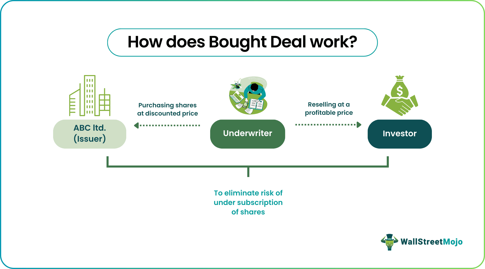

## Table of Contents

## What is a bought deal in the context of an Initial Public Offering (IPO)?

A bought deal is a type of agreement used in an Initial Public Offering (IPO) where an investment bank or underwriter buys all the shares from the company planning to go public. The underwriter then sells these shares to the public. This method is quick and gives the company a guaranteed amount of money right away because the underwriter takes on the risk of selling the shares.

In a bought deal, the company knows exactly how much money it will get from the IPO because the underwriter commits to buying all the shares at a set price. This can be helpful for the company, especially if it needs funds quickly. However, if the underwriter can't sell the shares at a profit, it might lose money. So, the underwriter will usually only agree to a bought deal if it believes the shares will be popular with investors.

## How does a bought deal differ from a traditional IPO?

In a traditional IPO, a company works with an investment bank to sell its shares directly to the public. The bank helps set the price of the shares and tries to sell them to investors. The company doesn't know exactly how much money it will get because it depends on how many shares investors buy. If the IPO doesn't go well and not many shares are sold, the company might not get as much money as it hoped.

A bought deal is different because the investment bank agrees to buy all the shares from the company at a set price before they are sold to the public. This means the company knows exactly how much money it will get right away. The bank then takes on the risk of selling the shares to investors. If the shares don't sell well, the bank could lose money, but the company still gets its money. This makes a bought deal faster and more certain for the company, but riskier for the bank.

## What are the advantages of a bought deal for the issuing company?

A bought deal gives the issuing company a quick and sure way to get money. When the company agrees to a bought deal, the investment bank buys all the shares at a set price. This means the company knows right away how much money it will get. This can be really helpful if the company needs money fast for things like growing the business or paying off debts.

Another advantage is that the company doesn't have to worry about the IPO not going well. In a traditional IPO, if not enough people buy the shares, the company might not get as much money as it hoped. But in a bought deal, the bank takes on that risk. So, the company can focus on its business without worrying about how the shares will sell.

## What risks do underwriters face in a bought deal?

In a bought deal, underwriters take on a big risk. They agree to buy all the shares from the company at a set price. If they can't sell these shares to the public for at least that price, they could lose money. This means the underwriters have to be very sure that the shares will be popular with investors. If the market changes or if investors aren't interested, the underwriters could be stuck with shares they can't sell.

Another risk is that the underwriters might have to sell the shares at a lower price than they hoped. If the market isn't as good as they thought, they might have to drop the price to get people to buy the shares. This can cut into their profits or even cause them to lose money. So, they have to be good at guessing what the market will do and how much people will want to buy the shares.

## Can you explain the process of executing a bought deal?

When a company wants to do a bought deal, it talks to an investment bank. The company tells the bank how many shares it wants to sell and at what price. If the bank agrees, it buys all the shares from the company right away. This means the company gets its money fast and knows exactly how much it will get. The bank then starts selling these shares to the public.

After buying the shares, the bank tries to sell them to investors. The bank might use its own network of investors or advertise the shares to get people interested. If the shares are popular, the bank can sell them at a good price and make a profit. But if the shares don't sell well, the bank might have to lower the price or keep the shares, which could mean losing money. So, the bank has to be careful and think the shares will be popular before agreeing to a bought deal.

## How does a bought deal affect the pricing of an IPO?

In a bought deal, the price of the IPO is set before the shares are sold to the public. The company and the investment bank agree on a price, and the bank buys all the shares at that price. This means the company knows exactly how much money it will get from the IPO. The bank then tries to sell the shares to investors at a higher price to make a profit. If the bank thinks the shares will be popular, it might set a higher price, but if it's not sure, it might set a lower price to make sure the shares sell.

The pricing in a bought deal can be different from a traditional IPO. In a traditional IPO, the price can change based on how much investors want to buy the shares. If a lot of people want to buy, the price might go up. If not many people want to buy, the price might go down. But in a bought deal, the price is fixed, so the company gets the same amount of money no matter what. This can be good for the company because it knows exactly how much money it will get, but it can be risky for the bank if the shares don't sell well at the set price.

## What role does market condition play in deciding to use a bought deal?

Market conditions are really important when a company decides to use a bought deal for its IPO. If the market is doing well and investors are feeling good about buying new shares, a company might choose a bought deal. This is because the investment bank will be more willing to buy all the shares at a good price if it thinks it can sell them easily to investors. The company can then get its money quickly and not worry about how the shares will sell.

On the other hand, if the market is not doing well, it might be harder to do a bought deal. The investment bank might be worried that it won't be able to sell the shares at a profit, so it might not want to buy all the shares from the company. In this case, the company might have to go with a traditional IPO instead, where the price can change based on how many people want to buy the shares. So, the company has to look at the market and decide if a bought deal is the right choice.

## How do bought deals impact the aftermarket performance of an IPO?

Bought deals can affect how the shares do after the IPO. When an investment bank buys all the shares and then sells them to the public, it might set the price a bit lower to make sure it can sell all the shares. This can help the shares start trading at a good price in the market. But if the price is too low, the shares might go up a lot right after the IPO, which can make some investors happy but might make the company feel like it could have gotten more money.

On the other hand, if the investment bank sets the price too high and the shares don't sell well, it might have to lower the price later. This can make the shares go down after the IPO, which can upset investors who bought the shares at the higher price. So, the way the investment bank prices the shares in a bought deal can really affect how the shares do in the market after the IPO. It's all about finding the right balance to make sure the company gets its money and the investors are happy too.

## What are some historical examples of successful bought deals?

One good example of a successful bought deal happened with Shopify in 2015. Shopify, a company that helps people sell things online, wanted to raise money. They did a bought deal with investment banks, who bought all the shares at a set price. The banks then sold these shares to the public. Shopify got its money quickly and the shares did well in the market, making everyone happy.

Another example is when Airbnb went public in 2020. Airbnb, a company that lets people rent out their homes, chose a bought deal for its IPO. The investment banks bought all the shares and then sold them to investors. Even though the market was a bit shaky because of the COVID-19 pandemic, the shares sold well. Airbnb got the money it needed, and the shares went up after the IPO, showing that the bought deal worked out well for them.

## How do regulatory frameworks influence the use of bought deals in different countries?

Regulatory frameworks can make a big difference in how companies use bought deals for their IPOs in different countries. Some countries have strict rules about how IPOs can be done, which might make it harder to do a bought deal. For example, a country might need a lot of information from the company before it can sell shares, or it might have rules about how the shares can be sold to the public. If the rules are too strict, investment banks might not want to take the risk of buying all the shares in a bought deal.

In other countries, the rules might be easier, which can make bought deals more common. If the regulations are not too hard, investment banks might feel more comfortable buying all the shares and then selling them to investors. This can help companies get their money faster and with less worry about how the shares will sell. So, the way a country's laws are set up can really affect whether companies choose to do a bought deal for their IPO.

## What are the considerations for an investor when participating in a bought deal?

When thinking about buying shares in a bought deal, investors need to look at the price the investment bank is selling the shares for. Since the bank buys all the shares from the company at a set price, it might sell them to investors at a slightly higher price to make a profit. Investors should think about if this price is a good deal compared to what they think the shares are really worth. If the price seems too high, the shares might not do well in the market after the IPO, and the investor could lose money.

Another thing to consider is how popular the company is with other investors. If a lot of people want to buy the shares, it might be easier for the investment bank to sell them all and make a profit. This can be good for the investor because it might mean the shares will go up in value after the IPO. But if not many people are interested, the bank might have to lower the price to sell the shares, which can make the shares go down in value. So, investors should look at how much other people want to buy the shares before deciding to invest in a bought deal.

## How have technological advancements and financial innovations altered the dynamics of bought deals in recent years?

Technological advancements and financial innovations have made bought deals easier and faster in recent years. With better technology, companies can share information with investment banks and investors more quickly. This means that the whole process of setting up a bought deal can happen faster. Also, new financial tools and online platforms help investment banks reach more investors. This can make it easier for them to sell the shares they bought from the company, which is good for both the bank and the company.

Another way technology has changed bought deals is by making it easier to predict how shares will do in the market. With more data and better ways to analyze it, investment banks can make better guesses about what price to set for the shares. This can help them make sure they can sell the shares at a profit and not lose money. For investors, this means they can look at more information before deciding to buy shares in a bought deal, which can help them make smarter choices.

## How does algorithmic trading influence IPO strategies?

Algorithmic trading profoundly influences Initial Public Offering (IPO) strategies by offering enhanced capabilities in executing large-scale financial transactions with notable speed, accuracy, and consistency. Its incorporation into IPO processes leverages sophisticated computational algorithms to analyze extensive datasets, identify market trends, and optimize trade executions in real-time, thereby providing a competitive edge to participating investors and underwriters.

The deployment of [algorithmic trading](/wiki/algorithmic-trading) techniques allows for a deeper analysis of market sentiment preceding, during, and immediately following an IPO. By applying [machine learning](/wiki/machine-learning) and natural language processing algorithms, trading systems can sift through vast amounts of data from social media, news outlets, and financial statements to gauge investor sentiment. This sentiment analysis plays a critical role in shaping pricing and marketing strategies by enabling a more informed decision-making process.

Furthermore, algorithmic trading enhances [volatility](/wiki/volatility-trading-strategies) management during IPOs. The inherent volatility associated with IPOs can be mitigated through algorithmic strategies that execute trades at an optimal time, ensuring minimal market impact. Algorithms can dynamically adjust trading parameters based on real-time market conditions, thus minimizing the adverse effects of price swings.

In mathematical terms, these algorithms often utilize statistical models such as time series analysis or regression models to predict future price movements or to determine the optimal trade execution strategy. For example, a model might try to forecast the price $P_t$ at time $t$ using a simple moving average:

$$
P_t = \frac{P_{t-1} + P_{t-2} + \ldots + P_{t-n}}{n}
$$

where $n$ is the number of periods considered in the moving average. By predicting the prices, algorithms can decide whether to buy or sell shares in strategically advantageous batches.

Python provides accessible libraries for implementing such strategies. For example, a basic implementation for calculating a moving average could look like this:

```python
import numpy as np

def moving_average(prices, window_size):
    return np.convolve(prices, np.ones(window_size)/window_size, 'valid')

prices = [10, 20, 30, 40, 50, 60]
window_size = 3
print(moving_average(prices, window_size))
```

In addition to managing volatility and sentiment, algorithmic trading significantly impacts the pricing strategy during IPOs. By continuously processing market data, these algorithms identify price ceilings and floors, ensuring shares are neither overvalued nor undervalued when introduced to the market. This real-time computational power aids underwriters and investors in establishing a fair and market-driven IPO price, increasing the likelihood of a successful offering.

As IPOs become more competitive and globally interconnected, the reliance on algorithmic trading as a cornerstone of IPO strategy will likely intensify, providing enhanced efficiency and precision in all phases of the public offering process.

## References & Further Reading

[1]: Aguilar, D. O. (2018). ["Bought Deals: A Strategic Option for Equity Capital-Raising."](https://theceosrighthand.co/capital-raising-strategy/)

[2]: Harris, L. (2003). ["Trading and Exchanges: Market Microstructure for Practitioners."](https://academic.oup.com/book/52292) Oxford University Press.

[3]: Lopez de Prado, M. A. (2018). ["Advances in Financial Machine Learning."](https://www.amazon.com/Advances-Financial-Machine-Learning-Marcos/dp/1119482089) Wiley.

[4]: Middleton, L., & Basal, M. (2020). ["Algorithmic Trading: Winning Strategies and Their Rationale."](https://www.wiley.com/en-us/Algorithmic+Trading%3A+Winning+Strategies+and+Their+Rationale-p-9781118676998) Wiley.

[5]: Tuckman, B., & Serrat, A. (2011). ["Fixed Income Securities: Tools for Today's Markets."](https://www.amazon.com/Fixed-Income-Securities-Todays-Markets/dp/0470891696) Wiley.

[6]: Wood, D. M., & Henry, L. (2019). ["Initial Public Offerings: A Practical Guide."](https://www.researchgate.net/publication/284772074_Initial_public_offerings) Bloomsbury Professional.