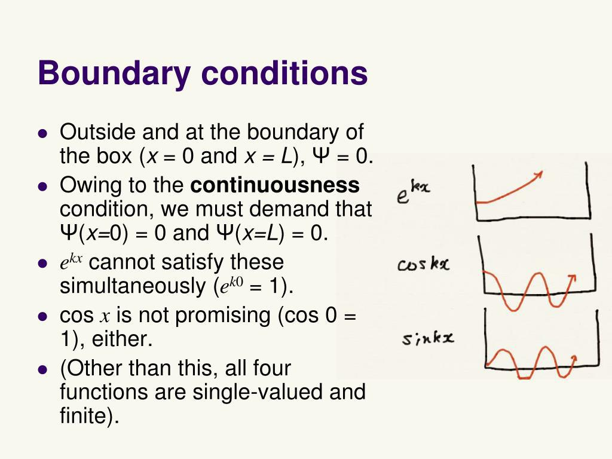

## Table of Contents

## What are boundary conditions in the context of physics and engineering?

Boundary conditions are rules or limits set at the edges or boundaries of a physical system or mathematical model. They help us understand how things behave at the edges of the system. Imagine you're filling a bathtub with water. The boundary conditions would tell you what happens to the water at the edges of the tub, like whether it sticks to the sides or slips along them.

In physics and engineering, boundary conditions are important because they help solve problems more accurately. For example, when engineers design a bridge, they need to know how the bridge's ends are supported. Are they fixed in place, or can they move a bit? This information helps them predict how the whole bridge will behave under different conditions, like wind or traffic. By setting the right boundary conditions, engineers and scientists can make better predictions and designs.

## Why are boundary conditions important in solving differential equations?

Boundary conditions are crucial when solving differential equations because they give us the information we need about how a system behaves at its edges. Think of a differential equation like a puzzle. The equation itself gives you the rules for how things change inside the puzzle, but you need the boundary conditions to know what's happening at the edges. Without them, you can't complete the puzzle because you don't know how to fit the pieces together at the boundaries.

In practical terms, boundary conditions help make sure the solutions to differential equations match the real world. For example, if you're solving an equation to predict the temperature inside a room, you need to know the temperature at the walls. If the walls are kept at a constant temperature, that's a boundary condition. By including this information, you can find a solution that accurately reflects what's happening in the room. Without the right boundary conditions, your solution might not make sense or be useful in real life.

## Can you explain the difference between Dirichlet and Neumann boundary conditions?

Dirichlet and Neumann boundary conditions are two common types of boundary conditions used in solving differential equations. Dirichlet boundary conditions specify the value of the function itself at the boundary. Imagine you're solving an equation to find the temperature in a room. If you use Dirichlet conditions, you're telling the equation what the temperature should be at the walls. For example, if you set the wall temperature to 20 degrees Celsius, that's a Dirichlet condition.

On the other hand, Neumann boundary conditions specify the value of the derivative of the function at the boundary. Going back to the temperature example, Neumann conditions would tell you how fast the temperature is changing at the walls, not what the temperature is. If you say the temperature change at the wall is zero, it means no heat is flowing through the wall. Both types of conditions help you solve equations more accurately, but they give different kinds of information about what's happening at the edges of your system.

## How do boundary conditions affect the solution of a partial differential equation?

Boundary conditions are like rules that tell us what's happening at the edges of a problem we're trying to solve with a partial differential equation. Imagine you're trying to figure out how heat spreads through a metal rod. The equation itself helps you understand how heat moves inside the rod, but you need boundary conditions to know what's happening at the ends of the rod. If you say one end is kept at a constant temperature, that's a boundary condition. This information helps you find the right solution because it gives you a starting point at the edges.

Without the right boundary conditions, the solution to your partial differential equation might not match what's happening in the real world. For example, if you're modeling how water flows in a river, you need to know what's happening at the riverbanks. If you get the boundary conditions wrong, your solution might show water flowing in ways that don't make sense. By setting the correct boundary conditions, you make sure your solution fits the real situation, helping you predict and understand things better.

## What are mixed or Robin boundary conditions and where are they typically used?

Mixed or Robin boundary conditions are a type of boundary condition that combines features of both Dirichlet and Neumann conditions. Instead of just telling you the value of a function at the boundary, like Dirichlet does, or the rate of change of the function, like Neumann does, Robin conditions use a mix of both. They're like a recipe that includes a bit of the function's value and a bit of its derivative at the boundary. This combination can be useful in situations where the boundary behavior is more complex.

Robin boundary conditions are often used in heat transfer problems, where they can model situations where heat loss is proportional to both the temperature difference and the rate of temperature change at the boundary. For example, engineers might use them to design cooling systems for electronics, where the heat flow depends on both the temperature of the device and how quickly that temperature is changing. They're also used in fluid dynamics, where the flow of a fluid along a boundary might depend on both the fluid's speed and the pressure at the boundary. By using Robin conditions, scientists and engineers can create more accurate models that reflect real-world conditions more closely.

## How do you apply boundary conditions in numerical methods like the finite element method?

When you use numerical methods like the finite element method to solve problems, boundary conditions help make sure your answers match the real world. Imagine you're trying to figure out how heat spreads through a metal plate. You break the plate into small pieces, or elements, and use math to find out what's happening in each piece. But you need to tell the computer what's happening at the edges of the plate. That's where boundary conditions come in. If you know the temperature at the edges, you use Dirichlet conditions to set those temperatures. If you know how fast the temperature is changing at the edges, you use Neumann conditions.

To apply boundary conditions in the finite element method, you first set up your problem by dividing the area into elements and figuring out how they connect. Then, you add the boundary conditions to the equations that describe how things change within each element. For Dirichlet conditions, you directly set the value of the function at the nodes on the boundary. For Neumann conditions, you adjust the equations to include the rate of change at those boundary nodes. By doing this, you make sure the solution fits the real-world situation, helping you get accurate results from your calculations.

## What challenges arise when implementing boundary conditions in computational simulations?

When you're doing computational simulations, putting in the right boundary conditions can be tricky. One big challenge is making sure the conditions you set match what's happening in the real world. If you get them wrong, your whole simulation might give you results that don't make sense. For example, if you're simulating how water flows in a river, you need to know what's happening at the riverbanks. If you set the wrong boundary conditions, your simulation might show water flowing in ways that aren't realistic.

Another challenge is dealing with complex boundaries. In real life, things like the edges of a material or the surface of a fluid might not be simple straight lines. They could be curved or have different properties at different spots. This makes it harder to set up the boundary conditions in your simulation. You might need to use more advanced math or split the boundary into smaller parts to handle it correctly. Getting this right can take a lot of time and effort, but it's important for making sure your simulation is accurate.

## How do boundary conditions influence the stability and convergence of numerical solutions?

Boundary conditions can really affect how stable and accurate your numerical solutions are. Think of stability like keeping a bike steady while riding it. If your boundary conditions are set up wrong, it's like trying to ride a bike with wobbly wheels – your solution might start to shake and become unreliable. For example, if you're solving a heat transfer problem and you set the temperature at the edges to be too high or too low, the whole solution might start to go crazy and not give you the right answers.

Convergence is about getting closer and closer to the right answer as you do more calculations. Imagine you're trying to guess a number, and with each guess, you want to get closer to the correct number. If your boundary conditions are off, it's like guessing numbers that are way too high or too low – you'll never get close to the right answer. So, making sure your boundary conditions are set correctly helps your numerical method to keep improving and getting closer to the real solution.

## Can you describe a real-world example where incorrect boundary conditions led to significant errors?

Imagine engineers trying to design a new airplane wing. They use a computer program to figure out how air flows over the wing. The program needs to know what's happening at the edges of the wing, like the air pressure and speed. If the engineers set the wrong boundary conditions, the program might think the air is doing something completely different from what it does in real life. For example, they might set the air pressure at the wing's edge to be too high. This mistake could make the program predict that the wing will break under the pressure, even though it wouldn't in real life.

This wrong prediction could lead to big problems. The engineers might change the wing's design to make it stronger, but that would make the airplane heavier and less efficient. Or, they might decide the wing is safe based on the wrong information and then find out during a test flight that it's not strong enough. Either way, using the wrong boundary conditions caused the engineers to make decisions based on bad information, which could delay the project, cost a lot of money, or even be dangerous.

## What advanced techniques exist for handling complex boundary conditions in fluid dynamics?

In fluid dynamics, dealing with complex boundary conditions can be tough. One advanced technique that helps is called the immersed boundary method. It lets you model how a fluid flows around objects with weird shapes without having to change the grid you use for your calculations. Instead of fitting the grid to the object's shape, you keep the grid simple and add forces to the equations to mimic the object's effect on the fluid. This makes it easier to handle things like the flow around fish swimming or blood moving through the heart.

Another technique is the use of adaptive mesh refinement. This means you can make the grid you use for calculations finer or coarser in different places. Where the boundary conditions are complex, like near the edges of a wing or a ship's hull, you can use a finer grid to get more detailed information. In other places, you can use a coarser grid to save time and computing power. This helps you get accurate results without using too much computer memory or time. Both of these methods help scientists and engineers better understand and predict how fluids behave in the real world.

## How do boundary conditions in quantum mechanics differ from those in classical physics?

In quantum mechanics, boundary conditions are different from classical physics because they deal with probabilities and wave functions instead of exact positions and velocities. In classical physics, you might say a ball must stay on a table and can't fall off, so you set the boundary condition at the edge of the table. But in quantum mechanics, you're looking at where a particle is most likely to be found, not where it definitely is. So, the boundary conditions help define the space where the particle's wave function exists, like setting up the walls of a box where an electron might be trapped.

These boundary conditions in quantum mechanics can lead to some strange results. For example, if you set up a particle in a box, the boundary conditions at the walls of the box can cause the particle's wave function to form standing waves, kind of like how a guitar string vibrates between its ends. This means the particle can only have certain energies, which is different from classical physics where energy can change smoothly. So, in quantum mechanics, boundary conditions not only set the stage for where things happen, but they also shape the possible outcomes in ways that don't happen in the classical world.

## What research is being conducted to improve the modeling of boundary conditions in multiphysics problems?

Scientists and engineers are working hard to make better models for boundary conditions in problems where different types of physics come together, like heat, fluid flow, and electricity. One big area they're looking at is using [machine learning](/wiki/machine-learning) to help set up these conditions. Machine learning can look at a lot of data from experiments and simulations to figure out the best way to set the boundaries. This can make the models more accurate and save time because the computer can learn and adjust the conditions automatically.

Another important research direction is developing new numerical methods that can handle the tricky parts of boundary conditions in multiphysics problems. For example, they're working on ways to make the computer grid more flexible, so it can fit better around complex shapes and boundaries. This helps the simulation match what's happening in the real world more closely. By combining these new methods with better data from experiments, researchers hope to create models that are more reliable and useful for solving real-world problems.

## References & Further Reading

[1]: Bergstra, J., Bardenet, R., Bengio, Y., & Kégl, B. (2011). ["Algorithms for Hyper-Parameter Optimization."](https://dl.acm.org/doi/10.5555/2986459.2986743) Advances in Neural Information Processing Systems 24.

[2]: ["Advances in Financial Machine Learning"](https://www.amazon.com/Advances-Financial-Machine-Learning-Marcos/dp/1119482089) by Marcos Lopez de Prado

[3]: ["Evidence-Based Technical Analysis: Applying the Scientific Method and Statistical Inference to Trading Signals"](https://www.amazon.com/Evidence-Based-Technical-Analysis-Scientific-Statistical/dp/0470008741) by David Aronson

[4]: ["Machine Learning for Algorithmic Trading"](https://github.com/stefan-jansen/machine-learning-for-trading) by Stefan Jansen

[5]: ["Quantitative Trading: How to Build Your Own Algorithmic Trading Business"](https://www.amazon.com/Quantitative-Trading-Build-Algorithmic-Business/dp/1119800064) by Ernest P. Chan