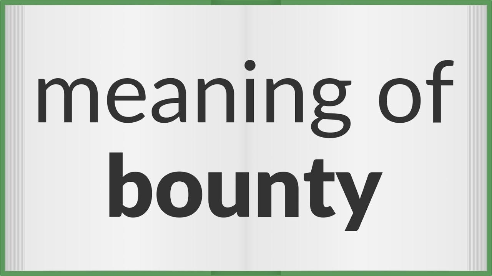

## Table of Contents

## What is the basic definition of a bounty?

A bounty is a reward that someone offers for doing a specific task or achieving a certain goal. It's like a prize that you can earn by completing something that the person who set the bounty wants done. For example, a company might offer a bounty for finding bugs in their software, or a government might offer a bounty for information leading to the capture of a criminal.

Bounties are used to encourage people to take action and help solve problems. They can be set by individuals, organizations, or governments, and the reward can be money, goods, or other benefits. Bounties are often used when the task is difficult or when it's important to get results quickly.

## How did the concept of bounties originate?

The concept of bounties has been around for a long time, going back to ancient times. In the old days, kings and rulers would offer rewards to people who could help them win battles or catch criminals. For example, if a king wanted to catch a thief, he might offer a reward, like gold or land, to anyone who could bring the thief to him. This was a way to get people to help without having to do everything themselves.

Over time, the idea of bounties spread to different parts of the world and was used for many different things. In the Wild West of America, sheriffs would offer bounties for catching outlaws. Later on, businesses started using bounties too. For example, a company might offer money to anyone who could find a problem in their product. Today, bounties are still used to encourage people to help solve problems or achieve goals, showing how this old idea keeps finding new uses.

## What are the common uses of bounties in modern times?

In modern times, bounties are often used by tech companies to improve their products. They offer rewards to people who can find bugs or security holes in their software. This is called a bug bounty program. It helps companies make their products safer and better. For example, a company like Google might offer money to anyone who can find a problem in their systems. This way, they can fix the issues before they cause bigger problems.

Bounties are also used in the world of cryptocurrencies and blockchain. People can offer rewards for creating new features or solving technical challenges. For example, someone might offer a bounty in Bitcoin for a new app that uses blockchain technology. This encourages developers to work on projects that might not have funding otherwise. It's a way to get more people involved in building and improving these technologies.

Another common use of bounties today is in crowdsourcing and innovation. Companies or individuals can offer rewards for ideas or solutions to specific problems. For example, a company might offer a bounty for the best new product idea or a solution to a business challenge. This can bring in fresh ideas from people all over the world, helping to drive innovation and solve problems in new ways.

## Can you explain the difference between a bounty and a reward?

A bounty and a reward are similar because they both involve getting something in return for doing a task. But they are a bit different. A bounty is usually offered before someone does something. It's like a promise. For example, if a company says they will pay money to anyone who can find a bug in their software, that's a bounty. The company is asking for help and offering a reward for it.

A reward, on the other hand, can be given after something has already happened. It's like a thank you or a prize for something that was done. For example, if a child finds a lost dog and brings it back to its owner, the owner might give the child a reward. The reward was not promised before the child found the dog, but it was given as a thank you afterward. So, the main difference is that a bounty is offered before the task, while a reward can be given after the task is done.

## How are bounties typically structured in a business or organizational context?

In a business or organizational context, bounties are often set up to encourage people to help solve specific problems or achieve certain goals. A company might create a clear set of rules for the bounty, like what needs to be done, how much the reward will be, and how long the bounty will last. For example, a tech company might offer a bounty for finding bugs in their software. They would explain what kinds of bugs they are looking for, how much money they will pay for each one, and when the bounty program ends. This helps make sure everyone knows what they need to do to get the reward.

The structure of a bounty can also include ways to make sure the work is done well. The company might have a team of experts who check the work before giving out the reward. This helps make sure the solutions are good and useful. For example, if someone finds a bug in the software, the company's experts would check to make sure it's a real bug and that it's important enough to deserve the reward. This way, the company can be sure they are getting good help and the person who finds the bug gets a fair reward.

## What legal considerations should be taken into account when setting up a bounty?

When setting up a bounty, it's important to think about the legal rules that might affect it. One big thing to consider is making sure the bounty follows the laws about contracts. When you offer a bounty, it's like making a promise to pay someone if they do what you ask. This promise needs to be clear and fair, so everyone knows what they need to do to get the reward. If the rules are not clear, or if the bounty is not fair, it could cause legal problems. Also, you need to make sure the bounty does not break any other laws, like laws about privacy or encouraging illegal actions.

Another thing to think about is how the bounty might affect taxes. The money or reward you give out might be seen as income for the person who gets it, and they might need to pay taxes on it. You might also need to report the bounty to the tax authorities. It's a good idea to talk to a lawyer or a tax expert to make sure you are doing everything right. This way, you can avoid any legal trouble and make sure the bounty works the way you want it to.

## How do online platforms facilitate the use of bounties?

Online platforms make it easy to set up and use bounties. They let people from all over the world see the bounty and try to complete it. The platform usually has a place where you can write down all the details about the bounty, like what you want done and how much the reward will be. This way, everyone knows what they need to do to get the reward. The platform also helps keep track of who is working on the bounty and who finishes it first. This makes it fair and clear for everyone.

These platforms also help with checking the work that people do for the bounty. They might have a system where experts can look at the work and decide if it's good enough to get the reward. This helps make sure the work is done well and that the right people get the reward. Plus, online platforms often have ways to pay the reward easily, like using online payment systems. This makes it simple for the person who set up the bounty to give the reward to the person who did the work.

## What are some successful examples of bounty programs in tech companies?

One successful example of a bounty program in tech companies is Google's Vulnerability Reward Program. Google started this program to make their products safer. They offer money to people who find bugs or security problems in their software. This helps Google fix these issues before they cause bigger problems. Many people have found bugs and gotten rewards, making Google's products better and more secure.

Another good example is Microsoft's Bug Bounty Program. Microsoft uses this program to find and fix problems in their software, like Windows and Office. They pay people who find bugs, which helps them make their products safer and work better. The program has been successful in finding many important bugs, showing how bounties can help tech companies improve their products.

## How can bounties be used effectively in open source software development?

Bounties can be used effectively in open source software development to encourage people to fix bugs or add new features. When someone offers a bounty for a specific task, like fixing a problem in the code, it gets more people interested in helping. This is good because open source projects often need more help, and bounties can bring in people who might not have worked on the project otherwise. The person who offers the bounty can set a clear goal, like fixing a certain bug, and offer a reward, like money or recognition, for anyone who can do it well.

Using bounties also helps make sure that the work done on the open source project is good quality. When a bounty is offered, the people in charge of the project can check the work before giving out the reward. This makes sure that the fixes or new features are useful and meet the project's standards. Bounties can also help the open source community grow, because more people might get involved when they see they can earn something for their work. This way, bounties help keep the project moving forward and improving.

## What are the potential risks and challenges associated with implementing a bounty system?

Setting up a bounty system can have some risks and challenges. One big problem is making sure the rules are clear. If people don't understand what they need to do to get the reward, they might get upset or confused. This can lead to legal issues if someone feels they were treated unfairly. Another risk is that some people might try to cheat to get the reward. They might do things that aren't helpful or even harmful to get the money. This can hurt the project or company offering the bounty.

Another challenge is managing the bounty system. It takes time and effort to check all the work people do for the bounty. If the company doesn't have enough people to do this, it can be hard to make sure the work is good enough to deserve the reward. Also, if the bounty is too small, people might not be interested in trying to complete it. On the other hand, if the bounty is too big, it might cost the company a lot of money. Finding the right balance is important but can be tricky.

## How can the success of a bounty program be measured and evaluated?

The success of a bounty program can be measured by looking at how many people take part and how many tasks get done. If a lot of people try to complete the bounty, it means the reward is good enough to get their attention. Also, if many tasks are finished, it shows that the bounty is helping to solve problems or achieve goals. For example, if a tech company offers a bounty for finding bugs in their software, they can count how many bugs are found and fixed. This helps them see if the bounty is working well.

Another way to evaluate a bounty program is by checking the quality of the work done. If the work is good and useful, it means the bounty is attracting the right people. The company can have experts check the work to make sure it meets their standards. They can also ask people who use the product if they notice any improvements. If the users are happy with the changes, it's a sign that the bounty program is successful. This way, the company can see if the bounty is really helping to make their product better.

## What advanced strategies can be employed to optimize the impact of a bounty system?

To make a bounty system work better, it's important to set clear goals and rewards. If people know exactly what they need to do and how much they will get for it, they are more likely to try to complete the bounty. It's also a good idea to offer different levels of rewards for different tasks. This way, people can choose the tasks that match their skills and the reward they want. Another strategy is to use social media and online communities to spread the word about the bounty. This can bring in more people and make the bounty more successful.

Another way to improve a bounty system is by making sure the work is checked carefully. Having experts look at the work before giving out the reward helps make sure it's good quality. It's also important to give feedback to the people who try to complete the bounty. This can help them do better next time and keep them interested in the program. Lastly, keeping the bounty program going for a long time can help. If people know the bounty will be around for a while, they might be more likely to take part and keep trying to complete tasks.

## What is the relationship between Reinforcement Learning and Reward Functions?

Reinforcement learning (RL) involves creating algorithms that learn optimal trading strategies through reward functions. These functions serve to evaluate actions based on their outcomes, with the primary objective being the maximization of long-term trading profit. The reward function is pivotal in guiding the learning process, as it provides the algorithm with the feedback necessary to gauge the success or failure of its actions.

In the context of [algorithmic trading](/wiki/algorithmic-trading), a reward function might be defined to reflect profit and loss, taking into account transaction costs and risk adjustments. For instance, a simple reward function could be:

$$
R_t = P_t - C_t
$$

where $R_t$ is the reward at time $t$, $P_t$ is the profit at time $t$, and $C_t$ represents the transaction costs incurred at time $t$. This function directly incentivizes strategies that minimize costs and maximize profits.

The design of reward functions in [reinforcement learning](/wiki/reinforcement-learning) is crucial for several reasons. First, they directly impact the short-term performance of trading algorithms by influencing the immediate decisions made by these models. A well-structured reward function can encourage trading behaviors aligned with the strategic goals of the trader or institution. Conversely, poorly designed rewards may lead to suboptimal trading actions that focus on short-term gains at the expense of long-term profit and risk management.

Moreover, the adaptability of trading algorithms is significantly affected by how rewards are structured. Reinforcement learning frameworks often rely on experience replay and exploration strategies to improve model performance over time. For example, using an epsilon-greedy strategy, the algorithm selects random actions a fraction $\epsilon$ of the time to explore new strategies:

```python
import numpy as np

def epsilon_greedy(Q, state, epsilon):
    if np.random.rand() < epsilon:
        return np.random.choice(len(Q[state]))
    else:
        return np.argmax(Q[state])
```

This ensures ongoing adaptation and learning, provided that the reward function continues to offer meaningful feedback as market conditions evolve.

Overall, the careful construction of reward functions in reinforcement learning is integral to producing robust and adaptable trading algorithms. These functions shape not only immediate trading decisions but also lay the groundwork for enduring strategic success in volatile market environments. As algorithmic trading continues to develop, refining the interplay between reinforcement learning and reward functions will remain a central focus for practitioners seeking efficiency and profitability.

## References & Further Reading

[1]: Bergstra, J., Bardenet, R., Bengio, Y., & Kégl, B. (2011). ["Algorithms for Hyper-Parameter Optimization."](https://papers.nips.cc/paper/4443-algorithms-for-hyper-parameter-optimization) Advances in Neural Information Processing Systems 24.

[2]: ["Advances in Financial Machine Learning"](https://www.amazon.com/Advances-Financial-Machine-Learning-Marcos/dp/1119482089) by Marcos Lopez de Prado

[3]: ["Evidence-Based Technical Analysis: Applying the Scientific Method and Statistical Inference to Trading Signals"](https://www.amazon.com/Evidence-Based-Technical-Analysis-Scientific-Statistical/dp/0470008741) by David Aronson

[4]: ["Machine Learning for Algorithmic Trading"](https://github.com/stefan-jansen/machine-learning-for-trading) by Stefan Jansen

[5]: ["Quantitative Trading: How to Build Your Own Algorithmic Trading Business"](https://www.amazon.com/Quantitative-Trading-Build-Algorithmic-Business/dp/1119800064) by Ernest P. Chan