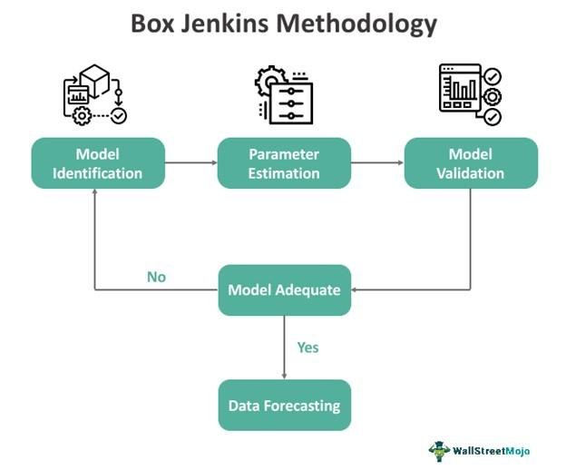

## Table of Contents

## What is Box-Jenkins analysis?

Box-Jenkins analysis is a method used to understand and predict patterns in data over time. It was developed by George Box and Gwilym Jenkins and is mainly used for time series data, which is data collected at regular intervals, like daily sales or monthly temperatures. The main goal of Box-Jenkins analysis is to create a model that can accurately forecast future values based on past data. This method involves several steps, including identifying the right type of model, estimating the parameters of the model, and checking if the model fits the data well.

The process starts with looking at the data to see if it shows any clear patterns or trends. Then, a model is chosen from a group of models called ARIMA models, which stands for AutoRegressive Integrated Moving Average. The ARIMA model is tweaked until it fits the data as closely as possible. After the model is set, it's tested to make sure it works well and can predict future values accurately. If it doesn't work well, the model is adjusted or a different model is tried. Box-Jenkins analysis is widely used in fields like economics, finance, and meteorology because it helps make better predictions about the future.

## Who developed the Box-Jenkins method?

The Box-Jenkins method was developed by two statisticians named George Box and Gwilym Jenkins. George Box was born in England in 1919 and spent much of his career working in the United States. Gwilym Jenkins was also from England, born in 1932. Together, they came up with a way to analyze and predict data over time, which they shared in their book "Time Series Analysis: Forecasting and Control" published in 1970.

Their method, called Box-Jenkins analysis, focuses on time series data, which is information collected at regular time intervals. This could be anything from daily stock prices to monthly rainfall amounts. The goal of the method is to build a model that can accurately predict future values based on past data. This has been very helpful in many areas like business, weather forecasting, and economics, where understanding future trends can be very important.

## What are the main steps involved in the Box-Jenkins methodology?

The Box-Jenkins methodology involves several key steps to create a model that can predict future values from time series data. The first step is to look at the data closely to see if there are any patterns or trends. This is called the identification stage. During this stage, you might use graphs or other tools to understand the data better. Once you have a good idea of the data's behavior, you choose an ARIMA model, which stands for AutoRegressive Integrated Moving Average. ARIMA models are good at capturing different kinds of patterns in time series data.

After choosing the right type of ARIMA model, the next step is to estimate the model's parameters. This means figuring out the specific numbers that make the model work best for your data. This step is called estimation. You use special math techniques to find these numbers. Once you have the model set up with the right parameters, you move to the diagnostic checking stage. Here, you check if the model fits the data well. You might look at how well the model's predictions match the actual data and see if there are any patterns left in the errors that the model didn't catch. If the model doesn't fit well, you go back and adjust it or try a different model.

The final step in the Box-Jenkins methodology is using the model to make forecasts. If the model passes the diagnostic checks, you can use it to predict future values. These predictions can be very useful for planning and decision-making in many fields like business, finance, and weather forecasting. The whole process of Box-Jenkins analysis is about making sure the model you use is the best one for your data, so your predictions are as accurate as possible.

## How does the Box-Jenkins method differ from other time series forecasting techniques?

The Box-Jenkins method is special because it focuses a lot on making sure the model fits the data just right. It uses ARIMA models, which are very good at catching different patterns in time series data. Unlike simpler methods that might just look at past data and make guesses, Box-Jenkins goes through several steps to make sure the model is the best it can be. It starts by looking at the data closely to find any patterns or trends, then picks the right ARIMA model, adjusts it to fit the data, and checks to make sure it works well. If it doesn't, the method goes back and tries again until it gets it right.

Other time series forecasting methods might not be as thorough. For example, simple moving averages just look at recent data to make predictions, which can miss important patterns. Exponential smoothing methods do a bit better by giving more weight to recent data, but they still might not catch all the patterns that an ARIMA model can. The Box-Jenkins method is more detailed and flexible, allowing it to handle a wider range of data patterns and make more accurate predictions. It's like using a detailed map instead of just following the main road - you get a better picture of where you're going.

## What types of data are best suited for Box-Jenkins analysis?

Box-Jenkins analysis works best with time series data, which is information collected over time at regular intervals. This could be things like daily sales numbers, monthly temperatures, or yearly stock prices. The method is really good at finding patterns in this kind of data, like trends that go up or down, or data that repeats in cycles. It's especially useful for data where the future values depend a lot on what happened in the past, like in economic data or weather forecasts.

The data should also be stationary, which means the patterns in the data stay the same over time. If the data isn't stationary, Box-Jenkins analysis can still work, but you'll need to make some adjustments to the data first, like taking differences between values to make it stationary. This method is popular in fields like finance, economics, and meteorology because it helps make better predictions about the future based on what's happened before.

## Can you explain the concept of stationarity in the context of Box-Jenkins analysis?

Stationarity is a key idea in Box-Jenkins analysis. It means that the patterns in the data stay the same over time. For example, if you're looking at monthly sales data, stationarity means that the average sales, how much sales vary, and how sales relate to each other from one month to the next stay constant. If the data is stationary, it's easier to build a good model because the patterns you find in the past will likely continue into the future.

In Box-Jenkins analysis, if the data isn't stationary, you need to make it stationary first. You can do this by taking differences between values. For example, instead of looking at the sales numbers directly, you might look at the difference between this month's sales and last month's sales. This process, called differencing, can help make the data stationary so that the Box-Jenkins method can work well. Once the data is stationary, you can go ahead with the rest of the steps in the Box-Jenkins process to build your model and make predictions.

## What are the common models used in the Box-Jenkins approach, such as AR, MA, and ARIMA?

In the Box-Jenkins approach, you use different types of models to understand and predict time series data. One common model is the AR model, which stands for AutoRegressive. This model looks at how past values of the data affect future values. It's like saying today's temperature might be similar to yesterday's because they're related. The AR model uses a formula where future values are a sum of past values, each multiplied by a special number called a coefficient.

Another model is the MA model, which stands for Moving Average. This model looks at how past errors, or the differences between what was predicted and what actually happened, affect future values. It's like saying if we were off by a lot last time, we might need to adjust our predictions this time. The MA model uses a formula where future values are a sum of past errors, each multiplied by a coefficient.

The most common model in the Box-Jenkins approach is the ARIMA model, which stands for AutoRegressive Integrated Moving Average. This model combines the ideas of AR and MA models and adds something called differencing to make the data stationary. ARIMA models are very flexible and can handle a lot of different patterns in time series data. They use a formula that includes both past values and past errors, all adjusted by coefficients, to predict future values.

## How do you identify the appropriate ARIMA model for a given time series data set?

To identify the right ARIMA model for your time series data, you first need to look closely at the data to see if it's stationary. Stationary means the patterns in the data stay the same over time. If the data isn't stationary, you'll need to make it stationary by taking differences between values. This is called differencing. Once the data is stationary, you can start to figure out the best ARIMA model. You do this by looking at graphs like the autocorrelation function (ACF) and the partial autocorrelation function (PACF). These graphs help you see how past values and past errors affect future values.

The ACF graph shows you how values at different time lags relate to each other. If you see a slow decline in the ACF, it might mean you need an AR part in your model. The PACF graph shows you the direct relationship between values at different time lags, without the influence of values in between. If you see a sharp cut-off in the PACF, it might mean you need an MA part in your model. By looking at these graphs, you can guess the right numbers for the AR and MA parts of your ARIMA model. You might need to try a few different models to see which one fits the data best. Once you pick a model, you can use it to make predictions and check if it works well. If it doesn't, you might need to go back and try a different model.

## What are the diagnostic checks performed after fitting an ARIMA model?

After fitting an ARIMA model, you do some checks to see if the model fits the data well. This is called diagnostic checking. One thing you look at is the residuals, which are the differences between the actual data and what the model predicted. If the model is good, these residuals should look random and not show any patterns. You can use graphs like the ACF of the residuals to see if there are any patterns left that the model didn't catch. If you see a pattern, it means the model might need to be adjusted or a different model might be better.

Another check is to see if the residuals are normally distributed. This means they should spread out evenly around zero, like a bell curve. You can use a histogram or a special test like the Jarque-Bera test to check this. If the residuals aren't normally distributed, it could mean the model isn't capturing all the patterns in the data. You might also look at other [statistics](/wiki/bayesian-statistics) like the Ljung-Box test to see if there's any leftover correlation in the residuals. If any of these checks show problems, you go back and tweak the model or try a different one until it fits the data well.

## How can one evaluate the performance of a Box-Jenkins model?

To evaluate the performance of a Box-Jenkins model, you look at how well the model's predictions match the actual data. One way to do this is by checking the residuals, which are the differences between the actual values and what the model predicted. If the residuals are random and don't show any patterns, it's a good sign that the model is working well. You can use graphs like the autocorrelation function (ACF) of the residuals to see if there are any patterns left. If you see a pattern, it means the model might need to be adjusted or a different model might be better.

Another way to evaluate the model is by checking if the residuals are normally distributed. This means they should spread out evenly around zero, like a bell curve. You can use a histogram or a special test like the Jarque-Bera test to check this. If the residuals aren't normally distributed, it could mean the model isn't capturing all the patterns in the data. You might also look at other statistics like the Ljung-Box test to see if there's any leftover correlation in the residuals. If any of these checks show problems, you go back and tweak the model or try a different one until it fits the data well.

## What are some practical applications of Box-Jenkins analysis in various industries?

Box-Jenkins analysis is used a lot in business to help companies predict how much they might sell in the future. By looking at past sales data, companies can use Box-Jenkins models to figure out if sales are going up or down, or if there are any patterns like more sales during certain times of the year. This helps them plan better, like knowing how much to produce or how many workers they'll need. For example, a store might use Box-Jenkins to predict how many winter coats they'll sell during the cold months, so they can order just the right amount.

In finance, Box-Jenkins analysis helps people predict stock prices or how the economy might do in the future. By looking at past stock prices or economic data, they can use ARIMA models to guess what might happen next. This can be really helpful for making smart investments or planning budgets. For instance, a bank might use Box-Jenkins to predict interest rates, which can help them decide what kinds of loans to offer.

## What are the limitations and potential pitfalls of using the Box-Jenkins method?

The Box-Jenkins method can be tricky to use because it needs a lot of data to work well. If you don't have enough data, or if the data has big gaps, the model might not be very accurate. Also, the method assumes that the patterns in the data will stay the same in the future, which isn't always true. If something big changes, like a new law or a big event, the model might not catch it and could give wrong predictions.

Another problem is that the Box-Jenkins method can be hard to understand and use. It takes a lot of time and skill to pick the right model and make sure it fits the data well. If you don't do it right, you might end up with a model that doesn't work well. Plus, even if you do everything right, the model might still miss some important patterns in the data, especially if the data is very complicated or has a lot of different things affecting it.

## What are the components of the Box-Jenkins Model?

The Box-Jenkins Model is fundamentally based on the ARIMA framework, which stands for Autoregressive Integrated Moving Average. This model is utilized primarily for analyzing time-series data to understand and predict future points in the series. The ARIMA model functions by decomposing the time-series data into three core components: autoregression (AR), integration (I), and moving average (MA).

Autoregression (AR) represents a model where the current value in a time series is explained by its previous values. This is mathematically expressed as:

$$
X_t = c + \phi_1 X_{t-1} + \phi_2 X_{t-2} + \ldots + \phi_p X_{t-p} + \varepsilon_t
$$

where $X_t$ is the current data point, $c$ is a constant, $\phi_1, \phi_2, \ldots, \phi_p$ are the parameters of the model, and $\varepsilon_t$ is white noise. The order of the autoregressive model is denoted by $p$.

Integration (I) refers to the process of differencing the series to make it stationary. A time series is said to be stationary if its statistical properties such as mean and variance remain constant over time. Differencing, the process of taking the difference between consecutive observations, helps in stabilizing the mean of a time series by removing changes in the level of a time series, thereby eliminating (or reducing) trend and seasonality elements. The number of differences needed to achieve stationarity is denoted by the parameter $d$.

The Moving Average (MA) component models the error term as a linear combination of error terms occurring contemporaneously and at various times in the past. This can be expressed as:

$$
X_t = \mu + \varepsilon_t + \theta_1 \varepsilon_{t-1} + \theta_2 \varepsilon_{t-2} + \ldots + \theta_q \varepsilon_{t-q}
$$

where $\mu$ is the mean of the series, $\theta_1, \theta_2, \ldots, \theta_q$ are the parameters of the model, and $\varepsilon_t$ is the error term. The order of the moving average model is denoted by $q$.

Combining these components gives the ARIMA model, which is characterized by the three parameters $(p, d, q)$. Each of these parameters plays a crucial role: 

- $p$ is the number of lag observations included in the model, (also called the lag order).
- $d$ is the number of times that the raw observations are differenced.
- $q$ is the size of the moving average window.

These parameters allow the ARIMA model to fit a wide range of time-series data by selecting the most appropriate levels of autoregression, integration, and moving average. By understanding and adjusting these parameters, researchers and practitioners are able to tailor models to accurately represent the underlying patterns present in historical data, which is pivotal for forecasting.

## References & Further Reading

[1]: Box, G.E.P., & Jenkins, G.M. (1970). ["Time Series Analysis: Forecasting and Control."](https://link.springer.com/chapter/10.1057/9781137291264_6) San Francisco: Holden-Day. 

[2]: Hamilton, J.D. (1994). ["Time Series Analysis."](https://press.princeton.edu/books/hardcover/9780691042893/time-series-analysis) Princeton University Press.

[3]: Brockwell, P.J., & Davis, R.A. (2002). ["Introduction to Time Series and Forecasting."](https://link.springer.com/book/10.1007/978-3-319-29854-2) Springer.

[4]: Chatfield, C. (2000). ["The Analysis of Time Series: An Introduction."](https://www.taylorfrancis.com/books/mono/10.4324/9780203491683/analysis-time-series-chris-chatfield) Chapman and Hall/CRC.

[5]: Wei, W.W.S. (2006). ["Time Series Analysis: Univariate and Multivariate Methods."](https://www.researchgate.net/publication/236651810_Time_Series_Analysis_Univariate_and_Multivariate_Methods_2nd_edition_2006) Addison-Wesley.

[6]: ["Statsmodels Python Library: Documentation"](https://www.statsmodels.org/stable/index.html) 

[7]: ["R Forecast Package Documentation"](https://www.rdocumentation.org/packages/forecast/versions/8.23.0)

[8]: ["MathWorks Econometrics Toolbox"](https://www.mathworks.com/products/econometrics.html)