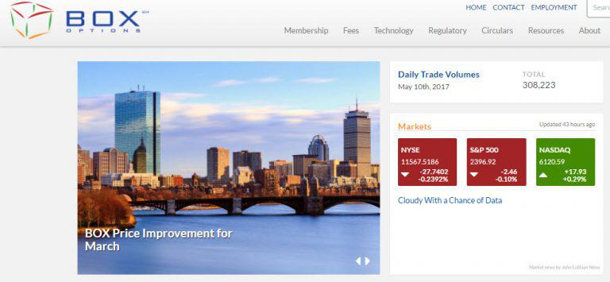

The financial market landscape is rapidly changing, with options trading becoming a vital element of contemporary investment strategies. Options trading, which allows investors the flexibility to hedge risks or speculate on price movements, has gained significant traction in recent years. BOX Exchange LLC, founded in 2012, has established itself as a leading entity in the options trading market through its innovative use of technology and its ability to provide a competitive trading environment. The exchange's focus on equity options trading and the offer of both electronic and open outcry trading venues give traders flexibility and efficiency. 

Algorithmic trading, commonly referred to as algo trading, has become a cornerstone of modern options trading by enhancing trade execution efficiency and precision. By employing complex algorithms to automatically execute trades based on pre-set criteria, algo trading minimizes human error and emotional bias. The combination of BOX Exchange's cutting-edge technological advancements and the strategic implementation of algorithmic trading optimizes the potential of options trading. 



In this article, we aim to explore how the integration of options trading, financial markets, BOX Exchange, and algorithmic trading can create a powerful synergy. This synergy not only elevates market participation but also expands trading opportunities for traders who are keen to harness the strategic advantages offered by these elements. Understanding this intersection can be crucial for traders looking to navigate and succeed in the dynamic world of financial markets.

## Table of Contents

## Overview of BOX Exchange

BOX Exchange LLC, inaugurated in 2012, functions as an automated national securities exchange with a strong emphasis on equity options trading. BOX Exchange distinguishes itself by providing both electronic and open outcry trading environments, making it a highly adaptable platform suited for a diverse range of trading strategies and participants. This versatility is further enhanced by its robust regulatory framework, which ensures adherence to federal securities laws, thus maintaining the integrity and transparency of the market.

At the core of BOX Exchange's innovation are several advanced features designed to cater to the needs of modern traders. Notably, the SOLA Trading Platform serves as a critical component of the exchange's technological infrastructure, offering high-speed execution and the capacity to support a wide array of trading strategies. The platform is tailored to meet the demands of algo-driven participants by processing and responding to trading orders in milliseconds, thus facilitating a seamless trading experience for all users.

Another distinguishing feature of BOX Exchange is the Price Improvement Period (PIP), an initiative that provides traders with opportunities for price improvement on their orders. During the PIP, market participants can compete with each other by submitting better prices within a specified timeframe, ultimately benefiting traders through potentially enhanced execution prices. This feature not only adds value for traders but also promotes competitive pricing and increased [liquidity](/wiki/liquidity-risk-premium) in the market.

Through the implementation of these features, BOX Exchange continues to offer significant advantages to its users, reinforcing its status as a leading player in the options trading market. The exchange's commitment to providing a secure, efficient, and technologically advanced trading environment positions it as an essential hub for traders seeking to leverage the complexities and opportunities inherent in options trading.

## Understanding Options Trading

Options are financial instruments classified as derivatives, providing the holder the right, but not the obligation, to buy or sell an underlying asset, such as stocks, at a predetermined price on or before a specific expiration date. This unique characteristic separates options from futures contracts, which obligate parties to execute a transaction at a future date. 

There are two primary types of options: calls and puts. A call option gives the holder the right to purchase an asset at the strike price, while a put option gives the right to sell. Traders can buy or sell either type, enabling diverse strategic opportunities. For instance, purchasing a call option offers the potential for significant gains if the underlying asset’s price rises, while selling a put option can generate income in flat or rising markets.

Options trading is esteemed for its versatility. Investors utilize it for hedging risks against adverse price movements, speculating on future fluctuations, and extracting value from market inefficiencies. Hedging with options protects against possible losses in an investor's portfolio by establishing positions that become profitable with the opposite price movement. Speculation involves taking calculated risks to achieve potential gains, often by predicting the direction of market trends. Moreover, options can be used to capitalize on disparities in market information that might cause particular assets to be mispriced temporarily. 

The complexities inherent in options trading necessitate a sophisticated understanding of various components. One crucial aspect is options pricing models, which determine the fair value of an option. The Black-Scholes model is a seminal model in finance, providing a theoretical estimate for European-style options. The Black-Scholes formula calculates the option price based on factors such as the current price of the underlying asset (S), the strike price (K), time to expiration (T), risk-free [interest rate](/wiki/interest-rate-trading-strategies) (r), and [volatility](/wiki/volatility-trading-strategies) (σ) of the asset.

The formula for a call option (C) price is expressed as:

$$

C = S \cdot N(d_1) - K \cdot e^{-rT} \cdot N(d_2) 
$$

And for a put option (P) price:

$$

P = K \cdot e^{-rT} \cdot N(-d_2) - S \cdot N(-d_1) 
$$

Where:
$$

d_1 = \frac{\ln(\frac{S}{K}) + (r + \frac{\sigma^2}{2})T}{\sigma \sqrt{T}}
$$
$$

d_2 = d_1 - \sigma \sqrt{T}
$$

$N(\cdot)$ denotes the cumulative distribution function of the standard normal distribution.

Overall, traders who grasp these elements and tools like the Black-Scholes model can effectively assess and manage their options strategies, enhancing their potential for success in sophisticated financial markets.

## The Role of Algorithmic Trading

Algorithmic trading involves the use of advanced computer algorithms to automatically execute trading orders according to specific criteria, ensuring both precision and speed. In options trading, this technology facilitates the rapid execution of intricate trading strategies, significantly enhances risk management capabilities, and optimizes overall trading efficiency.

The automation of trade execution through algorithms allows traders to act on complex strategies that would otherwise be challenging to implement manually. By structuring predefined rules that consider various factors such as time, price, and [volume](/wiki/volume-trading-strategy), [algorithmic trading](/wiki/algorithmic-trading) achieves high-speed execution, which is crucial in the fast-paced world of options trading. Moreover, algos are capable of continuously monitoring market conditions and executing trades more swiftly than human traders, providing a competitive advantage in terms of response time.

One of the main benefits of algorithmic trading is its ability to minimize emotional bias. Human traders are often influenced by emotions such as fear and greed, which can lead to suboptimal decision-making. In contrast, algorithm-based trading strictly adheres to the logic encoded in its algorithms, eliminating emotional interference and promoting consistent execution of strategies.

Furthermore, algorithmic trading empowers traders with the capability to back-test trading strategies using historical market data. By simulating how a strategy would have performed in the past, traders can refine their approaches and optimize parameters to enhance future performance. This process involves downloading datasets (e.g., using libraries like `pandas` in Python), cleaning and processing the data, and applying statistical models to evaluate potential outcomes. Python code snippet to demonstrate a simple back-test might look like this:

```python
import pandas as pd

# Sample data loading
data = pd.read_csv('historical_data.csv', parse_dates=['date'])
data.set_index('date', inplace=True)

# Example simple moving average strategy
data['SMA_20'] = data['close'].rolling(window=20).mean()
data['SMA_50'] = data['close'].rolling(window=50).mean()

# Simulated trading signals
data['signal'] = 0
data.loc[data['SMA_20'] > data['SMA_50'], 'signal'] = 1
data.loc[data['SMA_20'] <= data['SMA_50'], 'signal'] = -1

# Evaluate strategy performance
data['daily_return'] = data['close'].pct_change()
data['strategy_return'] = data['signal'].shift(1) * data['daily_return']

# Calculate cumulative returns
cumulative_return = (1 + data['strategy_return']).cumprod() - 1
final_return = cumulative_return.iloc[-1]

print("Final return of the strategy:", final_return)
```

The code loads historical stock price data, calculates simple moving averages, generates trading signals based on these averages, and evaluates the strategy's returns. This process helps traders refine their strategies before deploying them in live markets.

These aspects of algorithmic trading bolster the efficacy of options trading, supporting traders in navigating complex financial landscapes with enhanced precision and strategy execution capabilities.

## BOX Exchange and Algorithmic Trading

BOX Exchange's infrastructure is designed to support algorithmic trading effectively, ensuring a seamless integration of advanced technology and market resources. This support is exemplified by the exchange's high-speed trading environment, which facilitates rapid execution of trades—a critical component in a landscape where milliseconds can significantly impact the profitability of trading strategies. The ability of an exchange to process large volumes of transactions swiftly and accurately is indispensable for algorithm-driven traders, who rely on precise and timely execution to optimize their trading strategies.

A key feature of BOX Exchange that enhances algorithmic trading capabilities is the SOLA Trading Platform. This platform's architecture is tailored for high-frequency trading, characterized by its ability to process orders in milliseconds. The rapid response time of the SOLA Trading Platform allows traders to implement sophisticated algorithmic strategies that can exploit fleeting market opportunities—a critical advantage in the competitive field of options trading.

The focus on technological innovation by BOX Exchange translates into a robust marketplace that caters specifically to the needs of algorithm-driven traders. This focus encompasses not only speed but also the provision of real-time market data, an essential resource for algorithmic trading systems. Real-time data is crucial for the development and execution of trading algorithms, enabling traders to react to market movements instantaneously and adjust their strategies based on current market conditions.

In summary, BOX Exchange's technological innovations, highlighted by the SOLA Trading Platform, provide a competitive edge to traders who employ algorithmic trading strategies. By facilitating a high-speed trading environment and delivering real-time market data, BOX Exchange empowers traders to achieve efficiency and effectiveness in options trading.

## Developing Algorithmic Strategies for Options Trading

Developing algorithmic strategies for options trading requires a solid grasp of market dynamics and statistical analysis to optimize trading parameters effectively. The fundamental aim is to create algorithms that can respond swiftly to market changes and execute trades based on pre-defined rules. To this end, statistical methods, such as regression analysis and [machine learning](/wiki/machine-learning) models, can be applied to detect patterns, forecast price movements, and assess market volatility.

Risk management is a cornerstone of algorithmic trading strategies. A well-designed algorithmic system includes mechanisms for setting stop-loss thresholds, thereby limiting potential losses if the market moves unfavorably. Additionally, such systems are adept at adjusting positional deltas, which measure an option's sensitivity to changes in the underlying asset's price. By continuously adjusting these deltas, traders can maintain a hedged position irrespective of market fluctuations.

Apart from basic risk control measures, advanced algorithmic strategies employ dynamic hedging techniques to manage option Greeks – a set of measures that describe how the price of an option changes with respect to different factors. Key Greeks include delta, gamma, vega, theta, and rho. Dynamic hedging involves adjusting the portfolio to remain neutral against these variables. For instance, delta-neutral strategies ensure that the portfolio value is unaffected by small moves in the underlying asset's price.

Ensuring a balanced portfolio in volatile markets is crucial. This balance can be achieved by recalibrating the algorithm to align with changing market conditions, thus managing the overall risk exposure effectively. For example, a Python-based approach may involve using libraries such as NumPy and Pandas for numerical computations or scikit-learn for implementing machine learning models. Here is a simple illustration of how one might adjust deltas using Python:

```python
import numpy as np

# Hypothetical function to calculate delta based on a simple Black-Scholes model
def calculate_delta(S, K, T, r, sigma):
    from scipy.stats import norm
    d1 = (np.log(S/K) + (r + 0.5 * sigma**2) * T) / (sigma * np.sqrt(T))
    return norm.cdf(d1)

# Current parameters
S = 100  # Current stock price
K = 100  # Option strike price
T = 1    # Time to expiration in years
r = 0.05 # Risk-free interest rate
sigma = 0.2 # Volatility

# Calculate delta
delta = calculate_delta(S, K, T, r, sigma)

print(f"Delta: {delta}")
```

The above code demonstrates how one might calculate the delta of an option, which can then be used to adjust positional exposure dynamically. By continually assessing these Greeks, algorithmic strategies not only protect against adverse market shifts but also take advantage of trading opportunities that align with the trader’s strategic goals. As markets evolve, the continuous optimization of these strategies is essential, ensuring algorithms remain robust, adaptive, and able to harvest alpha in increasingly complex financial landscapes.

## Challenges and Considerations

Algorithmic trading, despite its advantages in precision and speed, presents several challenges that traders must navigate. One of the primary concerns is technical risk, which encompasses potential failures in the software and hardware systems that execute trades. These failures can result in significant financial losses if not managed properly. To mitigate these risks, traders need robust infrastructure and backup systems to maintain uninterrupted trading activities. Additionally, implementing thorough testing and validation protocols can help identify and rectify potential issues before they manifest in live trading environments.

Model risk is another critical consideration, arising from the assumptions and parameters embedded within the trading algorithms. As financial markets are highly dynamic, models based on historical data may not always predict future movements accurately. Incorrect modeling assumptions or changes in market conditions can lead to suboptimal trading decisions. To address model risk, traders should adopt adaptive algorithms that can adjust to varying market conditions and conduct regular reviews and updates of their trading models to incorporate new data and insights.

The potential for market manipulation is a notable concern in algo trading. Algorithmic strategies, particularly those involving high-frequency trading ([HFT](/wiki/high-frequency-trading-strategies)), can be exploited to create artificial market movements or manipulate asset prices. Therefore, traders must ensure that their strategies comply with regulatory standards and do not inadvertently contribute to market instability. Rigorous compliance checks and internal controls can help prevent malpractice and ensure ethical trading practices.

Regulatory compliance remains a fundamental responsibility for algorithmic traders. As financial regulations evolve, traders must stay informed and adjust their strategies to meet new compliance requirements. This involves maintaining detailed records of trading activities and ensuring transparency in algorithmic operations. Regular audits and compliance training can support traders in adhering to regulatory standards.

Continuous monitoring and refinement of algorithms are vital for maintaining their performance and adaptability. Since market conditions can change rapidly, algorithms must be capable of adjusting their parameters in real-time to preserve their effectiveness. Employing sophisticated monitoring tools that track algorithm performance and signal anomalies can aid in identifying areas for improvement. Machine learning techniques can be utilized to enhance algorithms by learning from ongoing market data, thereby improving their predictive accuracy and robustness.

In conclusion, while algorithmic trading offers significant advantages, it requires careful management of technical and model risks, adherence to regulatory standards, and ongoing refinement of strategies. Traders who manage these challenges effectively are better positioned to leverage the benefits of algo trading in a competitive market environment.

## Conclusion

The intersection of options trading, BOX Exchange, and algorithmic trading represents a powerful synergy that significantly enhances both market participation and trading opportunities. With the rapid evolution of financial technology, BOX Exchange has successfully integrated advanced trading systems, such as its SOLA Trading Platform, which is specifically designed to cater to the demands of modern traders. This integration facilitates an automated, high-frequency trading environment that accommodates complex algorithmic strategies, enabling traders to execute orders with unprecedented speed and accuracy.

The deployment of algorithmic trading within BOX Exchange not only improves the efficiency of the trading process but also reduces the latency associated with order execution. Algorithms can analyze market trends and execute trades in milliseconds, making it possible to exploit short-term price fluctuations and optimize trading outcomes. This technological advancement supports a competitive trading landscape where informed decision-making and strategic expansions are crucial.

For traders, understanding and leveraging these elements can produce significant strategic advantages. The ability to automate complex strategies minimizes human error and emotional influence, allowing for consistent and disciplined trading approaches. Moreover, the capacity to back-test strategies using historical data enables traders to fine-tune their algorithms and enhance their predictive accuracy.

In conclusion, the synergy between options trading, BOX Exchange, and algorithmic trading creates a robust framework that empowers traders in the fast-paced financial markets. By capitalizing on cutting-edge trading technologies, traders can optimize their strategies, effectively manage risk, and achieve superior performance outcomes. This alignment of technology and trading provides a forward-looking platform that is poised to continue evolving with market demands.

## References & Further Reading

[1]: Black, F., & Scholes, M. (1973). ["The Pricing of Options and Corporate Liabilities."](https://www.cs.princeton.edu/courses/archive/fall09/cos323/papers/black_scholes73.pdf) Journal of Political Economy, 81(3), 637–654.

[2]: Box Options Exchange. ["BOX Exchange Information."](https://boxexchange.com/regulatory/rulebook-filings/) BOX Options Market.

[3]: Johnson, B., & Yan, Y. (2018). ["Opinion: Why You Should Consider Algorithmic Trading."](https://www.researchgate.net/publication/330952938_Cooperative_Learning_The_Foundation_for_Active_Learning) Nassau Financial Group.

[4]: Treleaven, P., Galas, M., & Lalchand, V. (2013). ["Algorithmic Trading Review."](https://dl.acm.org/doi/10.1145/2500117) The Computer Journal, 57(11), 1898–1909.

[5]: López de Prado, M. (2018). ["Advances in Financial Machine Learning."](https://www.amazon.com/Advances-Financial-Machine-Learning-Marcos/dp/1119482089) Wiley.

[6]: Chan, E. P. (2009). ["Quantitative Trading: How to Build Your Own Algorithmic Trading Business."](https://github.com/ftvision/quant_trading_echan_book) Wiley Trading.