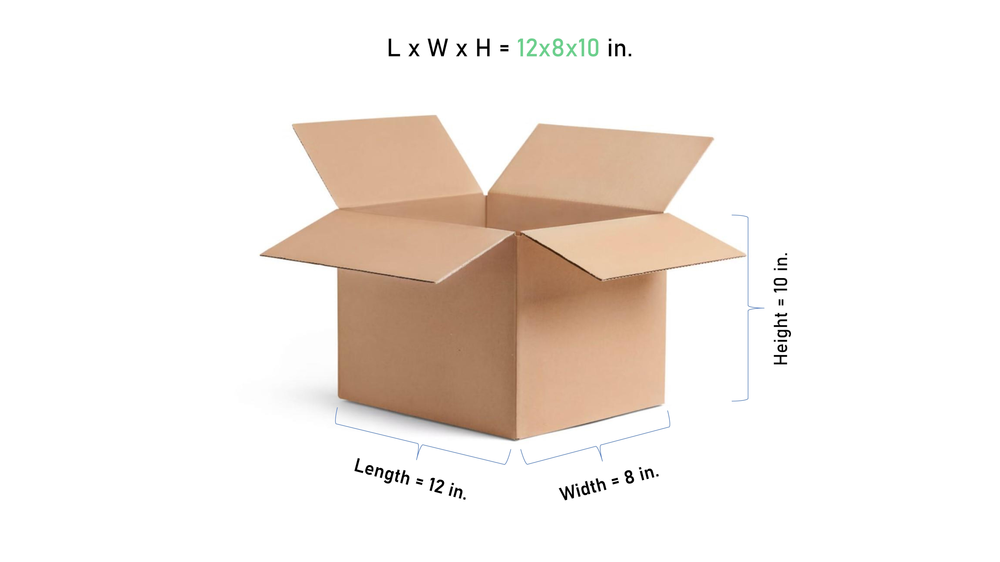

## Table of Contents

## What is the basic definition of box size?

Box size refers to the dimensions of a box, usually measured in length, width, and height. It tells you how big the box is and how much space it takes up. Knowing the box size is important for packing items, shipping, and storing things.

When you talk about box size, you might use different units like inches, centimeters, or feet, depending on where you are or what you need. For example, a small box might be 12 inches by 8 inches by 4 inches. This helps you know if your items will fit inside and if the box will fit in a certain space.

## How is box size measured?

To measure a box's size, you need to find out its length, width, and height. Start by laying the box flat on a surface. Use a ruler or a tape measure to measure the longest side of the box from one end to the other. This is the length. Then, measure the shorter side that runs parallel to the length. This is the width. Finally, measure from the bottom of the box to the top to get the height.

When you measure, make sure to measure the outside of the box. This gives you the total size including the thickness of the box material. It's important to be accurate so you know how much space the box will take up. If you're measuring for shipping, some places might ask for the inside dimensions instead, so always check what you need.

## Why is box size important in packaging?

Box size is important in packaging because it helps make sure your things fit well and stay safe. If the box is too big, your items might move around inside and get damaged. If the box is too small, you might not be able to fit everything you need, or you might have to force things in, which can also cause damage. Using the right size box means your items are snug and secure, which is good for shipping or storing.

Also, the right box size can save money. Smaller boxes cost less to ship because they weigh less and take up less space. If you use a box that's just the right size, you won't need as much packing material to fill empty space, which saves money too. Plus, using the right size box is better for the environment because you're not wasting materials. So, choosing the right box size is good for your items, your wallet, and the planet.

## What are the standard box sizes used in shipping?

In shipping, there are some common box sizes that people use a lot. These sizes help make shipping easier because everyone knows them. Some popular sizes are small boxes like 8x8x8 inches or 12x12x12 inches. Medium boxes might be around 16x16x16 inches or 18x18x18 inches. For bigger things, large boxes could be 24x24x24 inches or even 30x30x30 inches. These sizes are easy to find and work well for many different things you might need to ship.

These standard sizes are also good because they fit well on shipping trucks and in warehouses. When boxes are all about the same size, it's easier to stack them and use space better. This can save money on shipping because you can fit more boxes in a truck. Plus, many shipping companies have special rates for these standard sizes, which can help keep costs down. So, using these common box sizes can make shipping simpler and cheaper.

## How does box size affect shipping costs?

Box size can change how much you pay to ship things. If your box is bigger, it might cost more to ship because it takes up more room on the truck or plane. Also, bigger boxes usually weigh more, and shipping companies charge more for heavier packages. So, if you can use a smaller box that still fits your stuff, you might save money on shipping.

Using the right size box can also help you save on packing materials. If your box is too big, you need more bubble wrap or packing peanuts to fill the empty space, and that costs money. But if you use a box that's just the right size, you won't need as much extra stuff. This not only saves money but also helps the environment by using less material. So, choosing the right box size is good for your wallet and the planet.

## What are the common materials used for different box sizes?

Different box sizes can be made from different materials, but cardboard is the most common one. Cardboard is strong and can be made into many sizes, from small boxes for shipping little things to big boxes for moving furniture. It's also cheap and easy to recycle, which is good for the environment. Sometimes, people use corrugated cardboard for bigger or heavier items because it's even stronger and has a wavy layer inside that helps protect what's inside.

For smaller boxes, you might see them made from paperboard, which is thinner and lighter than cardboard. Paperboard is good for things like gift boxes or packaging for small items like jewelry. It's easy to print on, so it can look nice too. For really big or heavy things, people might use wooden crates. Wood is very strong and can handle a lot of weight, but it's heavier and more expensive than cardboard. Each material has its own use depending on the size and weight of what you're packing.

## How can box size be optimized for storage efficiency?

To make the best use of storage space, choosing the right box size is very important. When you use boxes that are the same size, it's easier to stack them neatly. This means you can fit more boxes into the same space. If you have boxes of all different sizes, they won't stack well, and you'll end up with wasted space. So, try to use standard sizes that fit well together. This helps you store more things in a smaller area.

Another way to optimize box size for storage is to use boxes that are just big enough for what you're storing. If you use boxes that are too big, you'll waste space inside the box and in your storage area. But if you use boxes that are the right size, you can fit more boxes in the same space. Also, think about how you'll arrange the boxes. If you can stack them all the way to the ceiling, you'll use the space better. So, pick box sizes that work well with your storage space and how you plan to stack them.

## What role does box size play in product protection during transit?

Box size is really important for keeping your things safe when they're being shipped. If the box is too big, your items might move around inside and get damaged. It's like if you're riding a bumpy bus and you're not holding on tight—you might get bumped around. Using a box that's just the right size means your stuff stays snug and doesn't move much. This helps keep everything safe, even if the box gets tossed around during shipping.

Also, the right box size means you can use less packing material. If the box fits your items well, you don't need as much bubble wrap or packing peanuts to fill empty space. This makes the box lighter and cheaper to ship, but it also means your items are held in place better. When you use less packing material, it's easier to pack things tightly, and that helps protect them from getting banged up during transit. So, [picking](/wiki/asset-class-picking) the right box size is key to making sure your things arrive in one piece.

## How do regulations impact the choice of box size in different industries?

Regulations can change how big or small a box can be in different industries. For example, in the food industry, there are rules about how food should be packed to stay safe and fresh. This might mean using boxes that are a certain size so they can fit in special storage or shipping containers. In the medical industry, there are strict rules about how medicines and equipment need to be packed. This can mean using boxes that are just the right size to make sure everything stays safe and secure during shipping.

In the electronics industry, there are rules about how to pack things to protect them from damage and to follow safety standards. This might mean using boxes that are strong enough and the right size to fit all the pieces snugly. Some countries have rules about the maximum size of packages for shipping, which can affect what size boxes companies use. So, knowing the rules in your industry helps you pick the right box size to follow the law and keep your products safe.

## What advanced technologies are used to determine the optimal box size for custom orders?

Advanced technologies like 3D scanning and computer software help find the best box size for custom orders. When you have something special to ship, you can use a 3D scanner to make a picture of it. The scanner measures every part of the item, so the computer knows exactly how big it is. Then, special software looks at this picture and figures out the smallest box size that will fit the item perfectly. This way, you don't waste any space, and your item stays safe.

Another technology that helps is called [machine learning](/wiki/machine-learning). It's like a smart computer that learns from past orders. If you've shipped lots of different things before, the computer can look at all that information and guess what size box will work best for your new custom order. It can even suggest the best way to pack the item inside the box so it doesn't move around. Using these technologies makes it easier to pick the right box size and save money on shipping and packing materials.

## How does box size influence consumer perception and purchasing decisions?

The size of a box can change how people think about a product. If a box is big and looks fancy, people might think the product inside is special or high quality. They might feel excited to open it, like it's a treat or a gift. On the other hand, if a box is small and plain, people might think the product isn't as good or worth less money. So, the size of the box can make people feel different about what's inside before they even see it.

Box size can also affect how people decide to buy things. If a product comes in a big box, people might think it's a better deal, even if the product itself isn't any bigger or better. This can make them more likely to buy it. But if a box is too big, people might worry about where they'll put it at home or if it's worth the shipping cost. So, companies need to think about how the size of the box will make people feel and decide if it will help or hurt their sales.

## What are the latest trends in box size design and sustainability?

One big trend in box size design is making boxes that fit just right. Companies are using smart technology to make boxes that are the perfect size for each item. This means less empty space inside the box, which saves on shipping costs and uses less material. It's good for the environment because it means less waste. Some companies even let you customize the box size online, so you can pick the best size for what you're sending.

Another trend is focusing on sustainability. More and more, people want boxes that are good for the planet. This means using materials that can be recycled or that come from plants, like cardboard made from recycled paper or even mushroom-based packaging. Companies are trying to make boxes that break down naturally and don't harm the environment. They're also using less plastic and more eco-friendly inks for printing on the boxes. These trends help make sure that the boxes we use today don't hurt the world we'll live in tomorrow.

## What are some examples of box size measurement algorithms?

One common approach to box size measurement in trading algorithms is the use of fixed box sizes. In this method, the box size remains constant and does not adjust to changing market conditions. Fixed box sizing is simple to implement and allows traders to interpret price movements with a clear and consistent structure. However, its rigidity can lead to missed opportunities in volatile markets or excessive noise in stable periods. 

Adaptive Box Scaling introduces flexibility by adjusting box sizes based on market [volatility](/wiki/volatility-trading-strategies). This approach involves using volatility indices to dynamically modify the box size, therefore capturing significant movements while filtering out noise. This method can respond to fluctuations in the market more swiftly than fixed box sizes, offering a potentially more balanced view of price action.

The Mean Average True Range (ATR) is frequently applied to determine box sizes. ATR measures the degree of price variability, and using it for box sizing helps in accommodating both stable and volatile market conditions. The formula for ATR is:

$$
\text{ATR} = \frac{1}{n} \sum_{i=1}^{n} \text{TR}_i
$$

where $\text{TR}_i$ is the true range for a given period $i$, and $n$ is the number of periods considered. Using the ATR, traders can set box sizes that naturally expand or contract as market volatility changes.

Machine learning techniques are increasingly being explored for their potential to predict optimal box sizes. By leveraging historical data and pattern recognition algorithms, traders can develop models that estimate the most effective box size settings. These algorithms aim to optimize trading strategies by continuously refining their predictions based on the latest market data. Python's machine learning libraries, such as scikit-learn, may be utilized for this purpose.

The effectiveness of each algorithm depends on market conditions and the trader's specific objectives. Fixed box sizes offer simplicity but lack flexibility, Adaptive Box Scaling responds well to market dynamics, ATR-based methods provide a balance, and machine learning models promise enhanced predictive capabilities. Careful consideration of these factors is crucial when selecting an appropriate box size measurement algorithm for a trading strategy.

## References & Further Reading

[1]: ["Advances in Financial Machine Learning"](https://www.amazon.com/Advances-Financial-Machine-Learning-Marcos/dp/1119482089) by Marcos Lopez de Prado

[2]: ["Evidence-Based Technical Analysis: Applying the Scientific Method and Statistical Inference to Trading Signals"](https://www.amazon.com/Evidence-Based-Technical-Analysis-Scientific-Statistical/dp/0470008741) by David Aronson

[3]: ["Machine Learning for Algorithmic Trading"](https://github.com/PacktPublishing/Machine-Learning-for-Algorithmic-Trading-Second-Edition) by Stefan Jansen

[4]: ["Quantitative Trading: How to Build Your Own Algorithmic Trading Business"](https://books.google.com/books/about/Quantitative_Trading.html?id=j70yEAAAQBAJ) by Ernest P. Chan