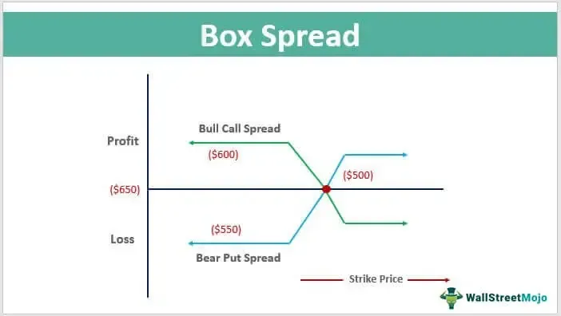

Box spread options trading is a sophisticated financial strategy that plays a crucial role in arbitrage and risk management. At its core, this strategy involves creating a "box" through the combination of a bull call spread and a matching bear put spread. The bull call spread consists of buying and selling call options at different strike prices, while the bear put spread involves buying and selling put options at corresponding strike prices. This dual-spread approach allows traders to potentially exploit pricing inefficiencies in the options market.

The execution of box spreads can be complex due to the necessity for precise timing and coordination. This complexity is mitigated through the use of algorithmic trading, which automates market transactions and enables traders to quickly identify and act on arbitrage opportunities where box spreads might be mispriced. Algorithms enhance the efficiency of executing these strategies by optimizing trade execution, reducing costs, and maximizing potential profitability.



This article will examine the fundamental aspects of box spread strategies, outlining their practical applications and inherent risks. Additionally, it will explore how algorithmic trading contributes to the successful implementation of box spreads, making them a vital tool for financial risk management.

## Table of Contents

## Understanding Box Spread Options

A box spread is a strategic financial maneuver in options trading, combining two distinct vertical spreads: a bull call spread and a bear put spread. Both these components share identical strike prices and expiration dates. The bull call spread involves purchasing a call option at a lower strike price while selling another call option at a higher strike price. Conversely, the bear put spread entails buying a put option at a higher strike price and selling a put option at a lower strike price.

This configuration is leveraged to establish what is essentially a synthetic loan. The box spread, in this context, mirrors the function of a zero-coupon bond. By structuring a box spread, investors can capitalize on discrepancies in the options market to extract a risk-free profit, assuming transaction costs and potential execution disparities are effectively managed.

The payoff of a box spread is relatively straightforward. Theoretically, it equates to the difference between the strike prices utilized in the spread at the point of expiration. For instance, suppose the strike prices are set at $100 and $105. As expiration approaches, the box spread's payoff should close to $5, which is the difference between the higher strike price ($105) and the lower strike price ($100).

In practical application, the primary aim in initiating a box spread is to achieve a net credit that exceeds the cost of establishing and unwinding the position. This translates to locking in a profit by strategically exploiting priced inefficiencies in the options market. Realistically, achieving the theoretical payoff of a box spread is contingent upon the precise execution of trades. Traders must navigate challenges such as fluctuating market conditions and transaction costs to optimize profitability. Thus, while the theoretical foundations of a box spread suggest a simplistic payoff mechanism, practically capturing these returns necessitates advanced trading acumen and judicious financial management.

## The Role of Algorithmic Trading in Box Spread Strategy

Algorithmic trading plays a pivotal role in the efficient execution of box spread strategies by automating complex market transactions. This automation enables traders to efficiently manage and execute trades, optimizing both timing and cost-effectiveness. Traders utilize sophisticated algorithms to pinpoint [arbitrage](/wiki/arbitrage) opportunities, specifically when box spreads are mispriced or undervalued in the market, allowing for potential profit.

The essence of [algorithmic trading](/wiki/algorithmic-trading) lies in its ability to swiftly process vast amounts of market data, which is essential in identifying subtle price discrepancies that can be exploited. By employing algorithms, traders can continuously monitor market conditions, adjusting their strategies in real-time to maintain a competitive edge.

In practical terms, algorithms evaluate multiple pricing scenarios to determine when box spreads—combinations of call and put options with the same strike prices and expiration dates—offer a profitable spread. The theoretical value of a box spread is determined by the difference between the strike prices at expiration. Any deviation from this value can be flagged by algorithms as an arbitrage opportunity.

For example, consider a situation where the theoretical value of a box spread is calculated as $K_2 - K_1$, where $K_1$ and $K_2$ represent two different strike prices. If the market price deviates significantly from this outcome, algorithmic systems can be programmed to automatically engage in this trade, purchasing the undervalued options and selling the overvalued ones, thus securing a risk-free profit.

Here's a simplified Python snippet demonstrating such an algorithmic approach:

```python
def box_spread_arbitrage(option_prices, strike_price_diff):
    theoretical_value = strike_price_diff
    market_value = sum(option_prices)

    if market_value < theoretical_value:
        return "Buy Box Spread"
    elif market_value > theoretical_value:
        return "Sell Box Spread"
    else:
        return "No Arbitrage Opportunity"

# Example usage
option_prices = [call_price1, put_price1, call_price2, put_price2]
strike_price_diff = strike2 - strike1
decision = box_spread_arbitrage(option_prices, strike_price_diff)
print(decision)
```
In addition to identifying opportunities, algorithmic trading supports effective execution by timing the buying and selling transactions to minimize the impact of market slippage and transaction costs. Algorithms can also prioritize which orders to execute first, taking into account current market [liquidity](/wiki/liquidity-risk-premium) and aiming to reduce the costs associated with large orders.

Thus, the integration of algorithmic trading in box spread strategies not only enhances the ability to discover underpricing but also ensures that transactions are carried out with precision, ultimately maximizing profitability while mitigating risks associated with manual trading processes.

## Financial Risks Associated with Box Spread Trading

Box spread trading, although considered a low-risk strategy, is not devoid of financial risks that can significantly affect its profitability. One notable risk is the potential cost of commissions associated with executing multiple options trades required to establish a box spread. Since a box spread involves both a bull call spread and a bear put spread, the accumulation of transaction costs can erode the narrow margins typically expected from this strategy. Traders therefore need to carefully consider these fees when calculating potential profits.

Interest rate movements also pose a notable risk to box spread trading. The value of a box spread is influenced by the implied [interest rate](/wiki/interest-rate-trading-strategies), which can fluctuate with changes in the broader interest rate environment. As interest rates rise or fall, the theoretical value of the box spread, computed as the difference between the strike prices at expiration, may diverge from expected outcomes. Thus, an unforeseen change in interest rates could reduce the expected payoff and affect the strategy's efficacy.

Early exercise risk is another consideration, particularly relevant with American-style options. American options can be exercised at any time before expiration, compared to European options which can only be exercised at maturity. This creates a risk that short positions within a box spread might be exercised unexpectedly, potentially leading to unanticipated financial exposure or the need for immediate corrective action by the trader. Early exercise can disrupt the intended timeline of the box spread, making it essential for traders to vigilantly manage and adjust their positions if necessary. 

These risks highlight the importance of comprehensive risk assessment and strategic planning in box spread trading, underscoring the need for expertise and precise execution to achieve desired outcomes effectively.

## Advantages and Disadvantages of Box Spread Options

Box spread options trading is utilized by traders to create low-risk profit scenarios and achieve synthetic loans, often at rates more advantageous than those offered through traditional financing. The strategy capitalizes on discrepancies in option pricing to lock in a profit by executing a combination of positions that mathematically guarantee returns. 

### Advantages

The primary advantage of box spread options lies in their ability to provide a low-risk profit opportunity. Utilizing both a bull call spread and a bear put spread with identical strike prices and expiration dates, a trader effectively secures a hedged position. This results in a defined profit margin equal to the difference between the strike prices, less the cost of initiating the trades. For instance, if the strike prices differ by $10, the theoretical profit, assuming no other costs, would be $10 at expiration.

Moreover, box spreads can be employed to create synthetic loans. When box spreads are priced efficiently, they mimic the characteristics of zero-coupon bonds, offering traders the advantage of securing funds through the options market at potentially lower implied interest rates compared to standard financial loans. This can be particularly appealing in environments where interest rates are unfavorable or credit access is constrained.

### Disadvantages

Despite these benefits, box spread options present significant challenges, primarily in their high transaction costs. Each box spread involves multiple option contracts, usually requiring four separate transactions. As a result, the cumulative effect of brokerage fees and commissions can erode profit margins significantly. 

Additionally, precise execution is crucial in maintaining the profitability of box spreads. Small mispricings or delays in executing the necessary trades can negate the intended risk-free profit. Therefore, this strategy demands a robust infrastructure and agility in trade execution, often facilitated by algorithmic trading systems.

The returns generated from box spreads are typically minimal, aligning them more with a low-yield, low-risk strategy suited for specific market conditions. This is especially true in highly efficient markets where the potential arbitrage profits are quickly neutralized by market forces. As such, box spreads might not be the most attractive option for investors seeking substantial returns, but they do offer a stable mechanism for cash management and temporary liquidity solutions in the options market.

## Practical Examples and Case Studies

Box spread options trading, through its use of both bull call and bear put spreads with consistent strike prices and expiration dates, provides unique opportunities for arbitrage and risk management. This section explores real-world examples and case studies to elucidate how box spreads can be effectively constructed and the potential payoffs they can achieve.

**Numerical Example of a Box Spread**

To better understand how a box spread is constructed, consider an equities market scenario involving the following options on a stock trading at $50:

1. Buy a call with a strike price of $50 at $5.
2. Sell a call with a strike price of $60 at $2.
3. Buy a put with a strike price of $60 at $4.
4. Sell a put with a strike price of $50 at $1.

The total cost of setting up this box spread is calculated as:

$$
\text{Total Cost} = (5 - 2) + (4 - 1) = 6
$$

At expiration, the spread's value is determined by the difference between the strike prices of the options:

$$
\text{Payoff at expiration} = 60 - 50 = 10
$$

The expected profit is derived by subtracting the total cost from the payoff:

$$
\text{Profit} = 10 - 6 = 4
$$

Thus, this box spread results in a profit of $4 per unit.

**Case Study: Box Spread Trading on Robinhood**

Traders on platforms like Robinhood have used box spreads to manage risk and leverage arbitrage opportunities. In one notable case, an algorithmic trader identified an underpriced box spread. By automating the calculations, the trader configured a similar spread as calculated above. However, they faced challenges with order execution due to Robinhood's platform limitations on multi-leg options strategies, highlighting a common issue where technical constraints can impact the potential profitability of the strategy.

Despite the challenges, the trade emphasized the importance of accurate timing and execution enabled by technological advancements. The trader leveraged algorithmic strategies to optimize order execution, reducing market exposure time that could otherwise lead to adverse price movements.

On the flip side, some traders have experienced failed executions primarily due to high transaction costs exceeding the narrow profit margins typical of box spreads. Additionally, liquidity constraints on the platform occasionally led to suboptimal execution prices, eroding the arbitrage edge that the box spread was supposed to offer. 

These examples underscore the critical role of precise execution and attention to platform-specific constraints when engaging in box spread trading. Careful risk management is essential to mitigate potential pitfalls, such as premature exercise risk and varying commission structures, which can directly affect profitability.

Real-world applications and case studies reinforce the complexity yet potential profitability of box spread options when executed with an informed and strategic approach. With advances in algorithmic trading, these strategies have become more accessible to retail investors, though still requiring a sophisticated understanding to navigate successfully.

## Conclusion

Box spread options trading serves as a sophisticated instrument for risk management and arbitrage, primarily appealing to advanced traders due to its complex nature. This strategy capitalizes on the theoretical payoff derived from the difference between the strike prices of a bull call spread and a bear put spread, executed at equivalent expiration dates. When implemented with precision, box spreads can simulate zero-coupon bonds, offering traders synthetic loans. However, the profitability of this strategy is contingent upon optimal execution, thorough comprehension of market dynamics, and awareness of associated risks.

The infusion of algorithmic trading into box spread strategies significantly augments their effectiveness and efficiency. Algorithms automate the identification and execution of arbitrage opportunities, thereby reducing human error and improving timing accuracy. Such technological advancements enable traders to swiftly capitalize on pricing inefficiencies, often undetected through manual trading methods. Consequently, algorithmic trading not only enhances the overall operational efficiency but also bolsters the success rate of executing box spread transactions.

Despite being a low-risk strategy, box spread options trading is not devoid of challenges. Potential pitfalls include high transaction costs, interest rate risks, and premature exercise of options, especially when dealing with American-style contracts. Mitigating these risks necessitates a deep understanding of the strategy and careful execution to ensure the delicate balance needed to maintain profitability.

In essence, box spread options trading, when augmented by algorithmic trading, provides a robust framework for financial risk management. Yet, the nuanced nature of this strategy means that it is best suited for traders with a sophisticated grasp of options markets. Mastery of these elements enables traders to harness the advantages of box spreads while effectively navigating the inherent risks.

## References & Further Reading

[1]: Boyle, P. P., & Vorst, T. (1992). ["Option Replication in Discrete Time with Transaction Costs."](https://onlinelibrary.wiley.com/doi/10.1111/j.1540-6261.1992.tb03986.x) Journal of Finance, 47(1), 271-293.

[2]: ["Options, Futures, and Other Derivatives"](https://www.amazon.com/Options-Futures-Other-Derivatives-10th/dp/013447208X) by John C. Hull

[3]: Gunawan, T., Kwan, C. C., & Zhang, Z. (2003). ["Box Spread Arbitration: Theory and Empirical Analysis."](https://onlinelibrary.wiley.com/doi/abs/10.1002/adma.202404618) Financial Management, 32(2), 31-61.

[4]: ["Algorithmic Trading: Winning Strategies and Their Rationale"](https://www.wiley.com/en-us/Algorithmic+Trading%3A+Winning+Strategies+and+Their+Rationale-p-9781118746912) by Ernie Chan

[5]: Haugh, M., & Kogan, L. (2004). ["Pricing of American Options: A Duality Approach."](https://www.jstor.org/stable/30036577) Management Science, 50(9), 1141-1161.

[6]: Harwood, W. (2007). ["Box Spread Pricing and Arbitrage"](https://accountend.com/understanding-box-spread-definition-examples-and-applications/). Social Science Research Network.
