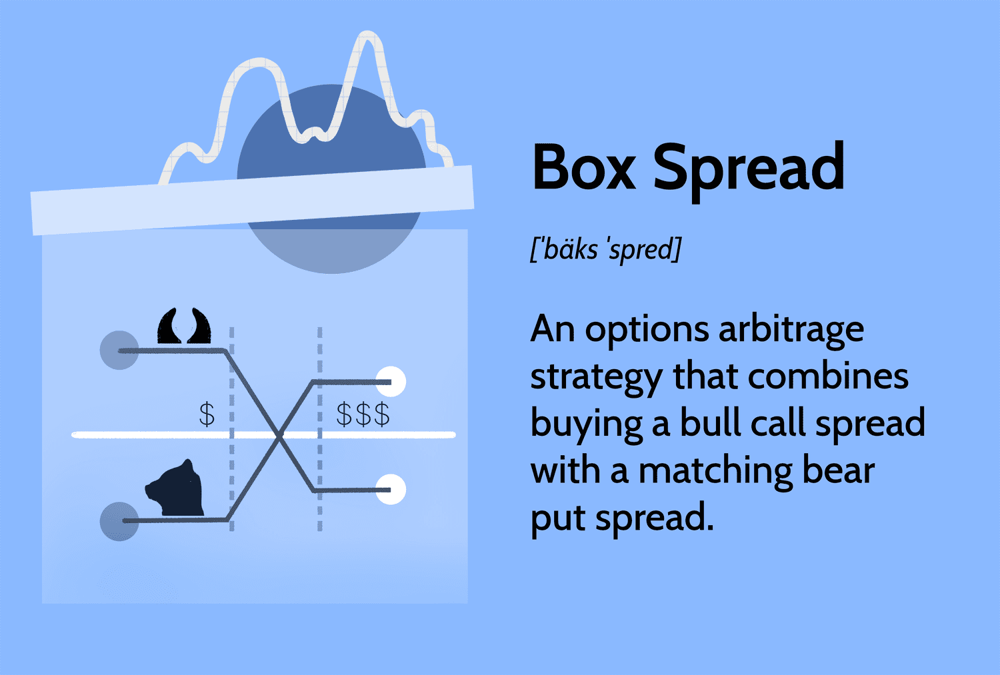

## Table of Contents

## What is a box spread in options trading?

A box spread is a type of options trading strategy that involves four different options contracts. It combines a bull call spread and a bear put spread with the same expiration dates and strike prices. The goal of a box spread is to create a position that has a very predictable outcome, often used to earn a small, risk-free profit due to differences in option pricing.

In simple terms, a box spread works by buying and selling options in a way that the total cost of the position is less than the difference between the strike prices of the options. If everything goes as planned, the trader can lock in a small profit when the options expire. However, box spreads are considered complex and are not commonly used by beginner traders because they require a good understanding of options pricing and market mechanics.

## How does a box spread work?

A box spread is a way to make money in options trading by using four different options. You do this by buying a call option and selling a call option at different prices, and at the same time, buying a put option and selling a put option at those same different prices. All these options have the same date when they end. The trick is to make sure that the total amount you pay for these options is less than the difference between the prices of the options. If you can do this, you can make a small profit that is almost sure to happen.

For example, imagine you buy a call option with a price of $50 and sell a call option with a price of $60. At the same time, you buy a put option with a price of $60 and sell a put option with a price of $50. If the total cost of setting up this trade is less than $10 (the difference between $60 and $50), you can lock in a profit. When the options expire, you will either exercise the call and put options you bought or the ones you sold will be exercised against you, but either way, you end up with a small profit. This strategy is complex and usually used by experienced traders who understand how options are priced.

## What are the components of a box spread?

A box spread is made up of four options: two call options and two put options. You buy one call option at a lower price and sell another call option at a higher price. At the same time, you buy one put option at the higher price and sell another put option at the lower price. All these options have the same expiration date.

The key to a box spread is to make sure that the total amount you spend on setting up this trade is less than the difference between the prices of the options. For example, if the lower price is $50 and the higher price is $60, the difference is $10. If you can set up the trade for less than $10, you can lock in a small profit when the options expire. This strategy is complex and usually used by experienced traders who understand how options are priced.

## What are the main uses of a box spread?

A box spread is mainly used to make a small, almost sure profit from differences in how options are priced. Traders use it when they see that the total cost of setting up the trade is less than the difference between the prices of the options. For example, if the difference between the prices is $10 and they can set up the trade for $9, they can lock in a $1 profit.

Box spreads are complex and usually used by experienced traders. They need a good understanding of options pricing and market mechanics. Not many beginner traders use box spreads because they are hard to set up and manage correctly.

## Can you explain the mechanics of setting up a box spread?

To set up a box spread, you need to buy and sell four different options. Start by buying a call option at a lower price and selling another call option at a higher price. At the same time, buy a put option at the higher price and sell a put option at the lower price. All these options should have the same date when they expire. The trick is to make sure that the total cost of setting up this trade is less than the difference between the prices of the options. For example, if the lower price is $50 and the higher price is $60, the difference is $10. If you can set up the trade for less than $10, you can lock in a small profit.

When the options expire, one of two things will happen. If the price of the stock is above the higher price ($60 in our example), the call option you bought at $50 will be exercised, and you will buy the stock at $50. The call option you sold at $60 will also be exercised against you, so you will sell the stock at $60. At the same time, the put option you bought at $60 will expire worthless, and the put option you sold at $50 will also expire worthless. You will end up with a $10 profit from the stock transactions minus the cost of setting up the trade. If the stock price is below the lower price ($50), the opposite happens, but you still end up with the same profit. This strategy is complex and usually used by experienced traders who understand how options are priced.

## What are the potential benefits of using a box spread?

The main benefit of using a box spread is that it can give you a small, almost sure profit. If you set up the trade right, the total cost of the options will be less than the difference between the prices of the options. For example, if the difference between the prices is $10 and you can set up the trade for $9, you can lock in a $1 profit. This can be good for traders who want to make a little bit of money without taking a big risk.

Another benefit is that a box spread can be a good way to learn about options pricing and market mechanics. Because the strategy is complex, it can help experienced traders understand how options are priced and how they can take advantage of small differences in those prices. However, because box spreads are hard to set up and manage correctly, they are usually used by traders who already know a lot about options trading.

## What are the risks associated with box spreads?

Box spreads can be tricky and have some risks. One big risk is that the trade might not work out like you planned. If the options you buy and sell are not priced right, you might end up losing money instead of making a profit. Also, setting up a box spread can be hard because you need to find the right options at the right prices, and sometimes the market might not let you do that easily.

Another risk is that box spreads need a lot of money to set up. You need to buy and sell four options, which means you need to have enough cash or margin in your account. If you don't have enough money, you might not be able to do the trade. Plus, even if you do set up the trade right, there might be fees and other costs that can eat into your small profit, making it not worth the trouble.

## How does the pricing of a box spread affect its profitability?

The pricing of a box spread is very important for its profitability. A box spread works by buying and selling four options in a special way. You want the total cost of these options to be less than the difference between the prices of the options. For example, if the difference between the prices is $10, you want to set up the trade for less than $10. If you can do this, you can make a small profit that is almost sure to happen. But if the options are not priced right, the total cost might be more than the difference, and you could lose money instead of making a profit.

Setting up a box spread can be hard because you need to find the right options at the right prices. Sometimes, the market might not let you do that easily. Also, even if you set up the trade right, there might be fees and other costs that can eat into your small profit. This means that even a small difference in the pricing of the options can make a big difference in whether the box spread is profitable or not. So, it's really important to pay close attention to how the options are priced when you're thinking about using a box spread.

## What is the role of interest rates in a box spread?

Interest rates play a big part in box spreads. When you set up a box spread, you're using money to buy and sell options. If interest rates are high, it costs more to borrow money to do the trade. This can make the total cost of the box spread higher, which might eat into your profit. On the other hand, if interest rates are low, it's cheaper to borrow money, so the cost of setting up the trade might be lower, and you could make a bigger profit.

Also, interest rates can affect how options are priced. When interest rates go up, the price of call options usually goes up too, and the price of put options usually goes down. This can change the total cost of your box spread. If you're not careful, these changes can make the box spread less profitable or even cause you to lose money. So, it's important to keep an eye on interest rates when you're thinking about using a box spread.

## How do transaction costs impact the effectiveness of a box spread?

Transaction costs can make a big difference in how well a box spread works. When you set up a box spread, you have to buy and sell four options. Each of these trades can have fees, like commissions or other charges. If these fees add up to a lot of money, they can make the total cost of setting up the box spread higher than you planned. If the total cost is more than the difference between the prices of the options, you might not make any profit at all. So, it's really important to think about these costs before you decide to use a box spread.

Even if you can set up the box spread for less than the difference between the option prices, high transaction costs can still eat into your profit. For example, if the difference between the prices is $10 and you set up the trade for $9, you might think you're going to make a $1 profit. But if the fees add up to $0.50, your profit goes down to just $0.50. This means that even small transaction costs can have a big impact on whether a box spread is worth doing. So, always check the fees and other costs before you start trading.

## What are some advanced strategies for optimizing a box spread?

One way to optimize a box spread is to pay close attention to the timing of when you set up the trade. Since the goal is to make sure the total cost of the options is less than the difference between their prices, you might want to wait for the right moment when the options are priced in your favor. This could mean watching the market closely and being ready to act quickly when the prices line up just right. Another strategy is to use different expiration dates for the options if the rules allow it. Sometimes, using options that expire at different times can help you find better prices and increase your chances of making a profit.

Another advanced strategy involves understanding and using interest rates to your advantage. Since borrowing money to set up a box spread can be affected by interest rates, you might want to do the trade when rates are low. This can make the cost of setting up the trade cheaper, which means a bigger profit for you. Also, knowing how interest rates affect option prices can help you choose the right options to buy and sell. For example, if you think interest rates are going to go up, you might want to buy call options and sell put options to take advantage of the changes in their prices. By keeping an eye on interest rates and using them smartly, you can make your box spread more effective.

## How can regulatory changes affect the use of box spreads?

Regulatory changes can have a big impact on box spreads. If the rules about how options can be traded change, it might be harder or easier to set up a box spread. For example, if the rules say you can't use certain kinds of options or if they change the fees you have to pay, it could make the total cost of the box spread go up or down. This means you might not be able to make a profit like you planned.

Also, if the rules change about how much money you need to have in your account to trade options, it could affect whether you can even do a box spread. Sometimes, new rules might make it so you need more money to set up the trade, which could stop you from doing it if you don't have enough cash. Keeping up with regulatory changes is important because they can change how well a box spread works and whether it's worth doing.

## What are some practical examples and case studies?

Box spread options trading, through its use of both bull call and bear put spreads with consistent strike prices and expiration dates, provides unique opportunities for arbitrage and risk management. This section explores real-world examples and case studies to elucidate how box spreads can be effectively constructed and the potential payoffs they can achieve.

**Numerical Example of a Box Spread**

To better understand how a box spread is constructed, consider an equities market scenario involving the following options on a stock trading at $50:

1. Buy a call with a strike price of $50 at $5.
2. Sell a call with a strike price of $60 at $2.
3. Buy a put with a strike price of $60 at $4.
4. Sell a put with a strike price of $50 at $1.

The total cost of setting up this box spread is calculated as:

$$
\text{Total Cost} = (5 - 2) + (4 - 1) = 6
$$

At expiration, the spread's value is determined by the difference between the strike prices of the options:

$$
\text{Payoff at expiration} = 60 - 50 = 10
$$

The expected profit is derived by subtracting the total cost from the payoff:

$$
\text{Profit} = 10 - 6 = 4
$$

Thus, this box spread results in a profit of $4 per unit.

**Case Study: Box Spread Trading on Robinhood**

Traders on platforms like Robinhood have used box spreads to manage risk and leverage arbitrage opportunities. In one notable case, an algorithmic trader identified an underpriced box spread. By automating the calculations, the trader configured a similar spread as calculated above. However, they faced challenges with order execution due to Robinhood's platform limitations on multi-leg options strategies, highlighting a common issue where technical constraints can impact the potential profitability of the strategy.

Despite the challenges, the trade emphasized the importance of accurate timing and execution enabled by technological advancements. The trader leveraged algorithmic strategies to optimize order execution, reducing market exposure time that could otherwise lead to adverse price movements.

On the flip side, some traders have experienced failed executions primarily due to high transaction costs exceeding the narrow profit margins typical of box spreads. Additionally, liquidity constraints on the platform occasionally led to suboptimal execution prices, eroding the arbitrage edge that the box spread was supposed to offer. 

These examples underscore the critical role of precise execution and attention to platform-specific constraints when engaging in box spread trading. Careful risk management is essential to mitigate potential pitfalls, such as premature exercise risk and varying commission structures, which can directly affect profitability.

Real-world applications and case studies reinforce the complexity yet potential profitability of box spread options when executed with an informed and strategic approach. With advances in algorithmic trading, these strategies have become more accessible to retail investors, though still requiring a sophisticated understanding to navigate successfully.

## References & Further Reading

[1]: Boyle, P. P., & Vorst, T. (1992). ["Option Replication in Discrete Time with Transaction Costs."](https://onlinelibrary.wiley.com/doi/10.1111/j.1540-6261.1992.tb03986.x) Journal of Finance, 47(1), 271-293.

[2]: ["Options, Futures, and Other Derivatives"](https://www.amazon.com/Options-Futures-Other-Derivatives-10th/dp/013447208X) by John C. Hull

[3]: Gunawan, T., Kwan, C. C., & Zhang, Z. (2003). ["Box Spread Arbitration: Theory and Empirical Analysis."](https://onlinelibrary.wiley.com/doi/abs/10.1002/adma.202404618) Financial Management, 32(2), 31-61.

[4]: ["Algorithmic Trading: Winning Strategies and Their Rationale"](https://www.wiley.com/en-us/Algorithmic+Trading%3A+Winning+Strategies+and+Their+Rationale-p-9781118746912) by Ernie Chan

[5]: Haugh, M., & Kogan, L. (2004). ["Pricing of American Options: A Duality Approach."](https://www.jstor.org/stable/30036577) Management Science, 50(9), 1141-1161.

[6]: Harwood, W. (2007). ["Box Spread Pricing and Arbitrage"](https://accountend.com/understanding-box-spread-definition-examples-and-applications/). Social Science Research Network.
