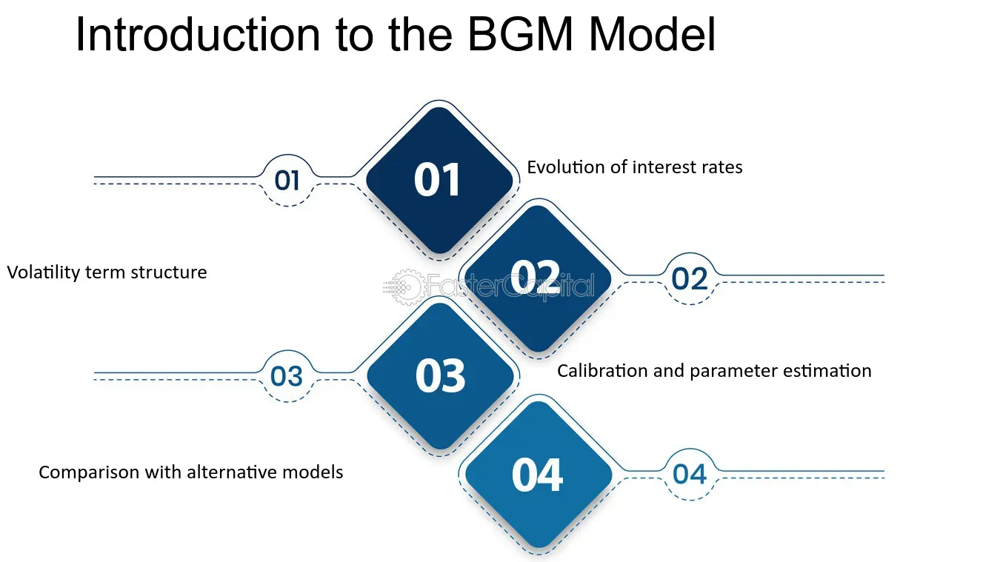

## Table of Contents

## What is the Brace Gatarek Musiela (BGM) Model?

The Brace Gatarek Musiela (BGM) Model, also known as the LIBOR market model, is a financial model used to price interest rate derivatives. It focuses on modeling the evolution of forward rates, like LIBOR rates, over time. The BGM model is popular because it directly uses market-observable data, such as forward rates and volatilities, which makes it more practical for traders and risk managers in the financial industry.

In simple terms, the BGM model helps predict how interest rates might change in the future. It does this by looking at how these rates have moved in the past and using that information to make educated guesses about future movements. This is important for people who buy or sell financial products that depend on interest rates, as it helps them understand and manage the risks involved.

## Who are the key contributors to the development of the BGM Model?

The BGM Model was developed by a team of three key contributors: Alan Brace, Dariusz Gatarek, and Marek Musiela. Alan Brace is a mathematician who has worked extensively in the field of financial modeling. Dariusz Gatarek, also a mathematician, has made significant contributions to the theory of interest rate models. Marek Musiela, another mathematician, is well-known for his work in stochastic processes and their applications in finance.

These three individuals collaborated to create a model that would be more practical for the financial markets. Their work resulted in the BGM Model, which is appreciated for its use of market-observable data. This makes it easier for traders and risk managers to apply the model in real-world scenarios, helping them to better understand and manage the risks associated with [interest rate](/wiki/interest-rate-trading-strategies) derivatives.

## How does the BGM Model differ from the Black-Scholes Model?

The BGM Model and the Black-Scholes Model are both used in finance to help people understand and predict how prices of certain financial products might change. But they focus on different things. The Black-Scholes Model is used to price options, which are contracts that give the buyer the right to buy or sell an asset at a set price. It looks at the price of the asset, the time until the option expires, and how much the asset's price might move around. On the other hand, the BGM Model is used to price interest rate derivatives, like swaps and caps. It focuses on predicting how interest rates, like LIBOR rates, will change over time.

One big difference between these models is what they use to make their predictions. The Black-Scholes Model uses things like the current price of the asset and how much that price might change, but it doesn't use real market data directly. Instead, it relies on assumptions about how the market works. The BGM Model, however, uses actual data from the market, like forward rates and how much those rates might change. This makes the BGM Model more practical for people who work in finance because they can see and use real numbers from the market to make their predictions.

## What are the main applications of the BGM Model in finance?

The BGM Model is mainly used in finance to help people who work with interest rate derivatives. These are financial products like interest rate swaps, caps, and floors, which depend on how interest rates change over time. People use the BGM Model to predict how these rates might move in the future. This helps them figure out what these financial products might be worth and how much risk they might be taking on.

Another big use of the BGM Model is in risk management. Banks and other financial institutions use it to understand how changes in interest rates could affect their portfolios of interest rate derivatives. By using the BGM Model, they can see how their investments might perform under different scenarios and make better decisions about how to manage their risks. This is really important because it helps them protect themselves from big losses if interest rates move in unexpected ways.

## Can you explain the mathematical framework of the BGM Model?

The BGM Model works by looking at how forward interest rates, like LIBOR rates, might change over time. It uses a thing called stochastic calculus, which is a kind of math that helps predict how things that change randomly might behave. In the BGM Model, these forward rates are modeled as random processes. Each forward rate follows a path that can be described by something called a stochastic differential equation. This equation takes into account the current value of the rate, how much the rate might change ([volatility](/wiki/volatility-trading-strategies)), and how rates at different times might be related to each other (correlation).

To make the model more useful, it uses real data from the market. This includes the current forward rates and how much those rates might change, which is called volatility. The BGM Model also looks at how these rates might move together, which is called correlation. By using this real data, the model can make predictions that are more in line with what's actually happening in the market. This makes it easier for people in finance to use the model to figure out the value of interest rate derivatives and manage their risks.

## How does the BGM Model handle interest rate derivatives?

The BGM Model helps people in finance figure out the value of interest rate derivatives like swaps, caps, and floors. It does this by predicting how forward interest rates, like LIBOR rates, might change in the future. The model uses real data from the market, such as the current forward rates and how much those rates might change, which is called volatility. By looking at this data, the BGM Model can make educated guesses about how these rates will move over time. This helps people understand what these financial products might be worth and how they might behave under different scenarios.

In addition to pricing, the BGM Model is also used for risk management. Banks and other financial institutions use it to see how changes in interest rates could affect their portfolios of interest rate derivatives. The model allows them to test different scenarios and see how their investments might perform if interest rates go up or down. By doing this, they can make better decisions about how to protect themselves from big losses if interest rates move in unexpected ways. This makes the BGM Model a really important tool for managing the risks that come with dealing in interest rate derivatives.

## What are the advantages of using the BGM Model over other interest rate models?

One big advantage of using the BGM Model is that it uses real data from the market, like forward rates and how much those rates might change. This makes it easier for people in finance to understand and predict how interest rates might move in the future. Other models might rely more on assumptions and less on actual market data, which can make their predictions less accurate. The BGM Model's use of real data means that it can be more practical and reliable for people who work with interest rate derivatives like swaps and caps.

Another advantage is that the BGM Model is good at handling the risks that come with interest rate derivatives. It helps banks and other financial institutions see how their investments might be affected if interest rates go up or down. This is really important because it helps them make better decisions about how to manage their risks. By using the BGM Model, they can test different scenarios and figure out how to protect themselves from big losses. This makes the BGM Model a valuable tool for anyone who needs to understand and manage the risks of dealing with interest rates.

## What are the limitations or criticisms of the BGM Model?

One criticism of the BGM Model is that it can be hard to use because it needs a lot of information about the market. It uses things like forward rates and how much those rates might change, which can be tricky to get right. If the information is not accurate, the model's predictions might not be very good. This can make it difficult for people who want to use the model to understand and predict how interest rates will move in the future.

Another limitation is that the BGM Model assumes that the way interest rates move stays the same over time. In real life, things can change a lot, and interest rates might not follow the same patterns in the future as they did in the past. This means the model's predictions might not always be right, especially if the market changes in ways that the model doesn't expect. People who use the BGM Model need to be careful and keep an eye on how well it's working, so they can adjust their plans if things start to go differently than expected.

## How is the BGM Model implemented in practice by financial institutions?

Financial institutions use the BGM Model to help them figure out the value of interest rate derivatives like swaps and caps. They start by gathering real data from the market, such as the current forward rates and how much those rates might change. This information is put into the model, which then predicts how these rates will move over time. By doing this, the institutions can understand what these financial products might be worth and how they might behave in different situations. It's like using a map to see where you might go based on where you are now and what the road conditions are like.

In practice, the BGM Model is also used for managing risks. Banks and other financial institutions use it to see how changes in interest rates could affect their portfolios of interest rate derivatives. They can test different scenarios to see how their investments might perform if interest rates go up or down. This helps them make better decisions about how to protect themselves from big losses if interest rates move in unexpected ways. It's like having a weather forecast for your financial investments, helping you prepare for different possibilities.

## What are some case studies or real-world examples where the BGM Model was effectively used?

One real-world example where the BGM Model was effectively used is in the trading desks of major banks like JPMorgan Chase. These banks use the BGM Model to price and manage their portfolios of interest rate derivatives. For instance, when a trader at JPMorgan needs to value a complex interest rate swap, they feed the current market data into the BGM Model. The model then helps them predict how the forward rates might change over time, allowing them to accurately price the swap and understand its risk exposure. This helps the bank make informed trading decisions and manage their risk effectively.

Another example involves a [hedge fund](/wiki/hedge-fund-trading-strategies) like Citadel, which uses the BGM Model to manage its interest rate risk. Hedge funds often deal with large volumes of interest rate derivatives, and the BGM Model helps them understand how different interest rate scenarios could impact their investments. By running various simulations through the BGM Model, Citadel can see how their portfolio might perform if interest rates rise or fall. This allows them to adjust their strategies to minimize potential losses and maximize returns, showcasing the practical utility of the BGM Model in real-world financial management.

## How can the BGM Model be calibrated to market data?

To use the BGM Model, you need to make sure it matches the real data from the market. This is called calibration. You start by taking the current forward interest rates and how much those rates might change, which is called volatility. You put this information into the BGM Model and then adjust the model until its predictions line up with what's actually happening in the market. This might mean changing the numbers for volatility or how different rates move together, which is called correlation. The goal is to make the model's guesses as close as possible to the real market prices of interest rate derivatives like swaps and caps.

Once the BGM Model is calibrated, it can be used to predict how interest rates might change in the future. This is important for people in finance because it helps them understand what their financial products might be worth and how much risk they might be taking on. By using real market data to fine-tune the model, they can make more accurate predictions. This means they can make better decisions about buying, selling, or managing their interest rate derivatives. The BGM Model's ability to be calibrated to market data makes it a powerful tool for anyone working with interest rates.

## What are the latest advancements or modifications to the BGM Model in recent research?

Recent research has focused on making the BGM Model more accurate and easier to use. One advancement is the development of better ways to calibrate the model. Researchers have created new methods that use more types of market data, like swaptions and caps, to make the model's predictions more in line with what's happening in the market. Another improvement is the use of more advanced math to handle the way interest rates move together, which is called correlation. This helps the model predict how rates might change in a way that's more realistic and useful for people in finance.

Another area of recent work is making the BGM Model work better with new financial products. As the market changes, new types of interest rate derivatives are created, and researchers are modifying the BGM Model to handle these new products. For example, some studies have looked at how to use the BGM Model for pricing and risk management of more complex derivatives like Bermudan swaptions. These advancements help financial institutions stay up-to-date and manage their risks more effectively in a changing market.

## What are the theoretical foundations of the BGM Model?

The BGM model, commonly referred to as the LIBOR market model, provides a framework for modeling the evolution of forward LIBOR (London Interbank Offered Rate) rates, which are pivotal in the pricing and risk management of interest rate derivatives. This model, which emerged in the late 1990s, sought to create a more realistic representation of the behavior of interest rates in financial markets compared to its predecessors.

One of the core assumptions of the BGM model is that interest rates follow a stochastic process. Specifically, the forward LIBOR rates, denoted as $L(t; T_1, T_2)$, are considered to be log-normally distributed. This assumption enables the model to capture the actual market dynamics, where interest rates exhibit random fluctuations influenced by various economic factors.

To accurately model the behavior of these interest rates, the BGM framework incorporates stochastic volatility and term structure modeling. Stochastic volatility refers to the idea that the volatility of interest rates is not constant but varies over time according to a stochastic process. This approach is crucial for representing the erratic behavior often observed in real-world financial markets. On the other hand, term structure modeling helps in understanding how interest rates evolve over different maturities, linking the short-term and long-term interest rates systematically.

Mathematically, the evolution of the forward LIBOR rate in the BGM model is often expressed by the following stochastic differential equation:

$$
dL(t; T_i, T_{i+1}) = L(t; T_i, T_{i+1}) \left( \mu(t)dt + \sigma(t) dW(t) \right)
$$

where $L(t; T_i, T_{i+1})$ is the forward rate at time $t$ for the period $[T_i, T_{i+1}]$, $\mu(t)$ is the drift term, $\sigma(t)$ is the volatility, and $dW(t)$ represents the increment of a Wiener process (or Brownian motion).

The BGM model emerged as a response to the limitations encountered in earlier interest rate models, such as the Black-Derman-Toy (BDT) model and the Ho-Lee model. The BDT model, for instance, assumed a recombining tree structure, which sometimes oversimplified the complexities of interest rate movements. The Ho-Lee model, on the other hand, used a simpler one-[factor](/wiki/factor-investing) approach that could not fully capture the multi-dimensional nature of real-world interest rates. The BGM model addressed these shortcomings by offering a multifactor approach, allowing for more flexible and accurate modeling of the interest rate curve and its derivatives.

Overall, the introduction of the BGM model marked a significant advancement in the field of interest rate modeling, providing a more robust tool for practitioners engaged in pricing and managing the risk associated with interest rate derivatives.

## References & Further Reading

[1]: Brace, A., Gatarek, D., & Musiela, M. (1997). "The market model of interest rate dynamics." Mathematical Finance, 7(2), 127-155.

[2]: Glasserman, P. (2003). "[Monte Carlo Methods in Financial Engineering](https://link.springer.com/book/10.1007/978-0-387-21617-1)." Springer.

[3]: Hull, J. C. (2006). "[Options, Futures, and Other Derivatives](https://www.semanticscholar.org/paper/Options%2C-Futures%2C-and-Other-Derivatives-Hull/89bdee500c8623864fc9eb7a471546aa713acc44)." Prentice Hall.

[4]: James, J. & Webber, N. (2000). "[Interest Rate Modelling](https://archive.org/details/interestratemode0000jame)." John Wiley & Sons.

[5]: Andersen, L. & Piterbarg, V. (2010). "[Interest Rate Modeling](https://books.google.com/books/about/Interest_Rate_Modeling.html?id=oI2fcQAACAAJ): Volume II: Term Structure Models." Atlantic Financial Press.