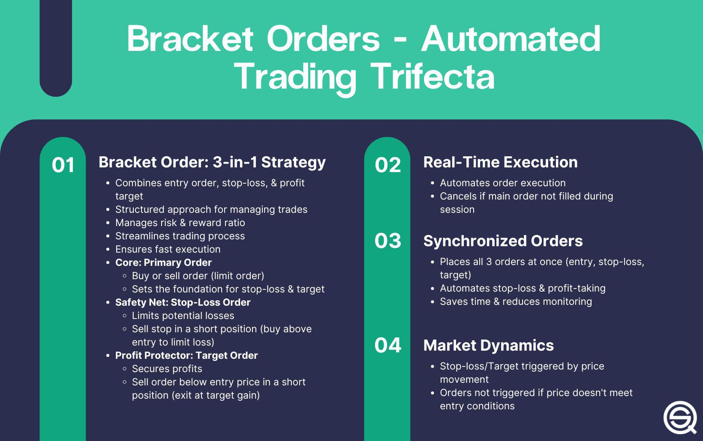

Understanding the complexities of stock market trading requires sophisticated tools and strategic approaches. The ever-evolving nature of financial markets means that traders must leverage advanced technologies to stay competitive and achieve success. In recent years, algorithmic trading has transformed the way market participants buy and sell stocks, automating decision-making processes to enhance speed, efficiency, and accuracy. These algorithms operate based on pre-defined criteria, allowing traders to capitalize on market opportunities far more quickly than manual methods would permit.

This article outlines the growing importance of algorithmic trading in modern financial markets, particularly focusing on strategies featuring bracketed sell orders. Bracketed sell orders are designed to effectively manage risk by locking in profits and setting limits on potential losses simultaneously. This dual-focus strategy optimizes trade exits and imposes discipline, a critical aspect of success in today's highly volatile trading environments.



By examining these elements, the article will demonstrate how traders can optimize their trading strategies and manage risks more effectively. Through a detailed exploration of how to incorporate bracketed sell orders with algorithmic trading, readers will gain insights into creating more robust and efficient trading systems. This comprehensive look at the intersection of bracketed sell orders and algorithmic trading strategies aspires to equip traders with the understanding needed to enhance their market participation and trading outcomes.

## Table of Contents

## What is Algorithmic Trading?

Algorithmic trading involves using computer programs to automate the process of buying and selling financial instruments. These automated systems execute trades based on pre-defined criteria, which can include factors such as timing, price, and quantity. The main advantage is the speed and precision with which trades can be executed, surpassing human capabilities. 

Algorithms are designed to identify profitable trading opportunities at a much faster rate than manual analysis. By scanning vast datasets and continuously monitoring market conditions, these algorithms capitalize on even the smallest market inefficiencies. For example, an [arbitrage](/wiki/arbitrage) algorithm might buy a stock where it is undervalued and simultaneously sell it where it is overvalued, thus taking advantage of price differences that exist only for a few seconds.

The development of algorithms involves creating sophisticated trading strategies that can handle complex decision-making processes. These strategies are often backtested on historical data to ensure robustness before they are implemented in live markets. The process of backtesting allows traders to evaluate how an algorithm would have performed on prior market data and refine it for maximum efficacy.

Algorithmic trading substantially enhances market efficiency and precision. By eliminating human intervention from trade execution, it reduces the potential for human error and removes emotional biases from trading decisions. Emotions like fear and greed can often lead to poor decision-making; [algorithmic trading](/wiki/algorithmic-trading) seeks to mitigate this by adhering strictly to the logic encoded in the algorithms.

Moreover, algorithmic trading contributes to increased market [liquidity](/wiki/liquidity-risk-premium). The continuous presence of algorithmic traders in the market ensures that orders are filled more quickly, thus narrowing bid-ask spreads and reducing costs for all market participants.

Overall, algorithmic trading represents a significant advancement in trading technology. By leveraging the computational strength of machines, traders can implement complex trading strategies with a level of speed and accuracy unattainable by human traders alone. As technology continues to evolve, the capabilities of algorithmic trading are expected to grow, further transforming financial markets.

 to Bracketed Sell Orders

A bracketed sell order is an essential tool in stock trading, serving a dual purpose: locking in profits and limiting potential losses. This order consists of three integral parts: the initial sell order, a take-profit order, and a stop-loss order. The initial sell order defines the base transaction, where the trader decides to sell a certain number of shares at a specific price. The take-profit order is set above the initial sell order to automatically sell the shares when they reach a desired higher price, effectively capturing gains made from a price increase. Conversely, the stop-loss order is set below the initial sell order to limit losses by automatically selling if the price drops to a certain level.

This strategy is crucial for executing trade [exit](/wiki/exit-strategy) strategies with accuracy. By predefining exit points, traders can manage their trades with reduced emotional involvement, as decisions are made objectively based on set criteria rather than on emotional responses to market fluctuations.

The discipline enforced by bracketed sell orders contributes significantly to maintaining a structured trading approach. By locking in profits and setting loss limits beforehand, traders can follow a disciplined plan regardless of market [volatility](/wiki/volatility-trading-strategies). This can protect their capital from drastic market movements, providing stability and predictability in trading outcomes.

In volatile markets, bracketed sell orders prove especially beneficial, as they allow traders to capitalize on price swings while managing risk effectively. For instance, during times of high market volatility, setting a bracketed sell order can help traders ensure that they exit trades at profitable levels while guarding against excessive loss should the market move unfavorably. Traders have effectively used these orders in scenarios where rapid price changes occur, enabling them to lock in favorable prices or swiftly execute trades to minimize losses.

Overall, bracketed sell orders are a powerful element in a trader's toolkit, promoting disciplined trading and enabling well-defined exit strategies that can optimize trading outcomes even in unstable market conditions.

## Developing an Investment Strategy with Bracketed Sell Orders

Developing an investment strategy that incorporates bracketed sell orders necessitates a thorough understanding of various market components. This includes comprehensive market analysis, precise trend identification, diligent [backtesting](/wiki/backtesting), risk management, and setting realistic goals and expectations.

**Essential Elements of a Robust Strategy**

1. **Market Analysis and Trend Identification**

To effectively utilize bracketed sell orders, traders must conduct meticulous market analysis and accurately identify trends. This involves examining historical data to discern market patterns and fluctuations. Technical analysis tools such as moving averages, RSI (Relative Strength Index), and MACD (Moving Average Convergence Divergence) are instrumental in forecasting price movements and setting appropriate bracket levels. For example, a moving average may reveal an upward trend, suggesting a higher take-profit level, while the RSI can indicate overbought conditions, prompting a tighter stop-loss position.

2. **Backtesting for Strategy Validation**

Backtesting is the process of testing a trading strategy on historical data to assess its effectiveness before applying it in real-time trading. This procedure is crucial for validating the bracketed strategy's anticipated performance. It helps traders optimize their exit criteria by simulating various market scenarios and adjusting bracket levels accordingly. A Python snippet for backtesting could look like this:

```python
import pandas as pd

def backtest_strategy(data, take_profit, stop_loss):
    """
    Backtest bracketed sell order strategy.
    :param data: DataFrame containing historical price data
    :param take_profit: target profit level
    :param stop_loss: loss mitigation level
    :return: historical performance metrics
    """
    for index, row in data.iterrows():
        # Simulate trade logic
        entry_price = row['entry']
        if row['high'] >= entry_price * take_profit:
            # Take-profit condition met
            pass
        elif row['low'] <= entry_price * stop_loss:
            # Stop-loss triggered
            pass
    # Calculate and return performance metrics
    return None

# Example usage
historical_data = pd.read_csv('historical_prices.csv')
performance = backtest_strategy(historical_data, 1.05, 0.95)
```

3. **Risk Management Techniques**

Implementing robust risk management is pivotal to safeguarding capital when using bracketed sell orders. Techniques like position sizing, diversification, and maintaining an optimal risk-reward ratio fortify the strategy against unexpected market shifts. A typical approach is setting a risk-reward ratio of 1:2 or better, meaning potential profits should at least double the potential losses. This ensures that even if a smaller number of trades are profitable, the overall strategy remains lucrative.

4. **Realistic Goals and Expectations**

Establishing realistic goals and expectations is crucial in any trading strategy. Setting targeted profit objectives and defining acceptable loss thresholds allow traders to maintain discipline and avoid emotional decision-making. It's important to align trading activities with market realities and personal objectives, considering factors like the available capital, market conditions, and individual risk tolerance. Realistic goal-setting prevents overtrading and supports consistent application of bracketed strategies.

In conclusion, developing a robust investment strategy using bracketed sell orders requires a comprehensive approach involving thorough market analysis, rigorous backtesting, effective risk management, and pragmatic goal-setting. By integrating these elements, traders can enhance their ability to optimize trades and manage risks successfully.

## Integrating Algorithmic Trader with Bracketed Sell Orders

Integrating bracketed sell orders into an algorithmic trading system involves codifying precise trading rules, leveraging technological tools, and capitalizing on the strategic benefits these systems offer. Algorithmic trading systems execute trades based on predefined criteria, and incorporating bracketed sell orders requires a well-structured approach to ensure efficiency and accuracy.

Codifying trading rules into algorithms that support bracketed orders entails defining the conditions under which trades are executed, modified, or terminated. These conditions include the setup of the initial sell order, alongside the parameters for both take-profit and stop-loss orders. Typically, the rules are structured using conditional logic in programming languages such as Python. Below is a simplistic Python pseudocode representation of such a strategy:

```python
class BracketOrder:
    def __init__(self, entry_price, take_profit_pct, stop_loss_pct):
        self.entry_price = entry_price
        self.take_profit_price = entry_price * (1 + take_profit_pct / 100)
        self.stop_loss_price = entry_price * (1 - stop_loss_pct / 100)

    def execute(self, current_price):
        if current_price >= self.take_profit_price:
            return "Take Profit Triggered"
        elif current_price <= self.stop_loss_price:
            return "Stop Loss Triggered"
        else:
            return "Hold"

# Example usage
order = BracketOrder(entry_price=100, take_profit_pct=5, stop_loss_pct=2)
print(order.execute(current_price=102))
```

Technological aspects and software tools crucial for this integration include robust trading platforms, API access to marketplaces, and backtesting frameworks. Platforms such as MetaTrader, TradeStation, or more sophisticated proprietary systems often provide the necessary infrastructure. They enable traders to deploy algorithms to live markets, monitor executions in real-time, and adjust parameters dynamically. Moreover, backtesting tools such as those offered by QuantConnect or Backtrader allow traders to validate their strategies using historical data, ensuring the bracketed system’s effectiveness before applying it in live trading scenarios.

Examples of algorithms incorporating bracketed sell orders typically highlight enhanced trading performance. For instance, high-frequency trading systems frequently use [artificial intelligence](/wiki/ai-artificial-intelligence) to adaptively refine bracket levels based on real-time market conditions. These systems might utilize [machine learning](/wiki/machine-learning) algorithms to predict price movements and optimize the bracket parameters dynamically, thus reducing slippage and maximizing return potential.

The combination of algorithmic precision with the strategic advantages of bracketed orders offers several benefits. By removing human emotion from trading decisions, these systems ensure consistency and discipline. Automated adjustment of bracket levels based on market volatility can result in better risk management and profitability. Additionally, the ability to process high volumes of data in real-time enables quick adaptation to changing market environments, enhancing overall trading outcomes.

In summary, integrating bracketed sell orders into algorithmic trading systems involves a meticulous blend of rule codification, technological infrastructure, and strategic foresight, ultimately leading to more disciplined and potentially more successful trading activities.

## Case Studies and Real-World Applications

Case studies in algorithmic trading with bracketed sell orders reveal valuable insights into the practical applications and benefits of these strategies. The following examples illustrate varying approaches and outcomes, demonstrating how traders at different experience levels have harnessed this combination effectively.

### Case Study 1: High-Frequency Trading Firm
A high-frequency trading ([HFT](/wiki/high-frequency-trading-strategies)) firm integrated bracketed sell orders within their algorithmic trading systems to manage the high [volume](/wiki/volume-trading-strategy) and rapid execution of trades. The steps taken included:

1. **Development of Algorithms:** The firm used advanced machine learning models to predict short-term market movements. Key algorithms were programmed to initiate a sell order when a specific threshold was met, automatically placing corresponding take-profit and stop-loss orders.

2. **Optimization and Backtesting:** Rigorous backtesting was conducted to fine-tune bracket levels. The firm utilized historical data to simulate various market conditions, refining parameters to enhance profitability and reduce risk exposure.

3. **Implementation in Live Trading:** When deployed in live trading, the system consistently optimized trade exits, ensuring that profits were locked in while potential losses were minimized.

Challenges faced included market volatility impacting predicted trends. The firm mitigated this by dynamically adjusting the bracket levels based on real-time volatility metrics.

### Case Study 2: Individual Day Trader
An experienced day trader used a custom-built algorithmic platform that allowed for the execution of bracketed sell orders on mid-cap stocks known for their volatility.

1. **Custom Coding of Algorithms:** The trader incorporated Python-based scripts to automate trade entries and exits based on technical indicators, such as moving averages and relative strength index (RSI).

2. **Risk Management Strategy:** A conservative approach was taken by setting narrow bracket levels to quickly capture gains and limit potential losses. The strategy involved high-discipline execution, avoiding overtrading.

3. **Adaptive Strategy Execution:** By frequently reviewing performance metrics and market feedback, the trader adjusted the algorithm to remain aligned with market changes, which reinforced a robust risk management framework.

The primary challenge was ensuring that the algorithm was robust enough to handle unexpected market events. This was addressed by incorporating machine learning techniques to enable adaptive responses to market changes.

### Lessons Learned
1. **Importance of Fine-Tuning Algorithms:** The necessity of precise algorithm calibration was evident in achieving favorable outcomes. Small adjustments in bracket levels could lead to significant impacts on profitability.

2. **Adaptability to Market Conditions:** Algorithms must be adaptable to shifting market realities. This requires ongoing monitoring and modifications based on real-time data analysis.

3. **Robust Risk Management:** Bracketed strategies provide a structured approach to risk management, essential for both individual traders and firms. Setting realistic targets and stop-loss levels helps preserve capital while securing gains.

4. **Continuous Learning and Development:** Engaging in backtesting and learning from past trades enhances the efficacy of trading strategies, facilitating continuous growth and adaptation in trading practices.

These case studies underscore the effectiveness of integrating bracketed sell orders with algorithmic trading. By leveraging technology and maintaining a disciplined approach, traders can optimize performance and navigate the complexities of stock market trading efficiently.

## Challenges and Considerations

Implementing bracketed sell orders within an algorithmic trading framework offers substantial advantages, yet it is fraught with challenges that require careful consideration. One of the foremost challenges lies in the unpredictable nature of market conditions, which can significantly influence the performance of bracketed orders. Volatile markets, characterized by rapid price fluctuations, pose the risk of premature triggering of stop-loss or take-profit levels, potentially resulting in suboptimal exits. Additionally, low liquidity environments may lead to slippage, where the execution price deviates from the expected price, affecting the expected returns of bracketed strategies.

Algorithmic trading also entails specific ethical and regulatory considerations. Regulatory bodies like the Securities and Exchange Commission (SEC) and the Financial Industry Regulatory Authority (FINRA) have laid down stringent guidelines to ensure market integrity and prevent manipulative practices. Algorithms must comply with these regulations, ensuring that trade executions do not lead to market distortions such as flash crashes, which have been associated with high-frequency trading. Ethical considerations include ensuring fairness in trade executions and avoiding the use of algorithms that may exploit market inefficiencies to the detriment of individual investors.

The dynamic nature of financial markets necessitates keeping abreast of innovative strategies and technologies. As market paradigms shift, the adaptability of trading algorithms becomes crucial. Innovations in machine learning and artificial intelligence continuously redefine the landscape of algorithmic trading. Consequently, traders must ensure that their algorithms are updated and refined to leverage these advancements, integrating sophisticated data analysis capabilities to enhance predictive accuracy and strategy efficacy.

Lastly, ongoing education and adaptation are vital components for successfully navigating the evolving world of trading strategies. Traders and algorithm developers should engage in continuous learning to understand emerging trends, regulatory updates, and technological advancements. Participating in forums, attending workshops, and enrolling in courses can equip traders with the knowledge required to optimize their strategies continually. Moreover, maintaining a flexible mindset to modify and enhance algorithms in response to new information or changing market conditions can provide a competitive edge.

In conclusion, while bracketed sell orders within algorithmic trading frameworks present considerable advantages in risk management and execution precision, they require meticulous attention to market conditions, regulatory compliance, technological advancements, and continuous learning to be effectively employed.

## Conclusion

In summary, this article has explored the essential components of stock trading investment strategies, focusing on the integration of bracketed sell orders and algorithmic trading. Combining these two approaches allows traders to capitalize on the precision and efficiency offered by automated systems while maintaining a disciplined approach to risk management. Bracketed sell orders provide the framework for setting clear profit targets and stop-loss levels, ensuring that trades are executed with predetermined exit strategies that help safeguard investments.

Algorithmic trading enhances this process by removing emotional bias, increasing market liquidity, and enabling rapid execution of trades based on accurate data analysis. The automation of trading rules allows for consistent application of strategies across various market conditions. By integrating bracketed sell orders with algorithmic systems, traders can achieve a strategic advantage that optimizes their trading performance.

Readers are encouraged to further explore these strategies and evaluate their potential application in personal trading practices. The dynamic nature of the stock market requires continuous learning, adaptation, and refinement of trading strategies to cope with evolving market environments and regulatory landscapes. As traders embrace these sophisticated methods, they can potentially transform their trading outcomes, achieving greater success and stability.

## References & Further Reading

[1]: Bergstra, J., Bardenet, R., Bengio, Y., & Kégl, B. (2011). ["Algorithms for Hyper-Parameter Optimization."](https://papers.nips.cc/paper/4443-algorithms-for-hyper-parameter-optimization) Advances in Neural Information Processing Systems 24.

[2]: ["Advances in Financial Machine Learning"](https://www.amazon.com/Advances-Financial-Machine-Learning-Marcos/dp/1119482089) by Marcos Lopez de Prado

[3]: ["Evidence-Based Technical Analysis: Applying the Scientific Method and Statistical Inference to Trading Signals"](https://www.amazon.com/Evidence-Based-Technical-Analysis-Scientific-Statistical/dp/0470008741) by David Aronson

[4]: ["Machine Learning for Algorithmic Trading"](https://github.com/stefan-jansen/machine-learning-for-trading) by Stefan Jansen

[5]: ["Quantitative Trading: How to Build Your Own Algorithmic Trading Business"](https://www.amazon.com/Quantitative-Trading-Build-Algorithmic-Business/dp/1119800064) by Ernest P. Chan