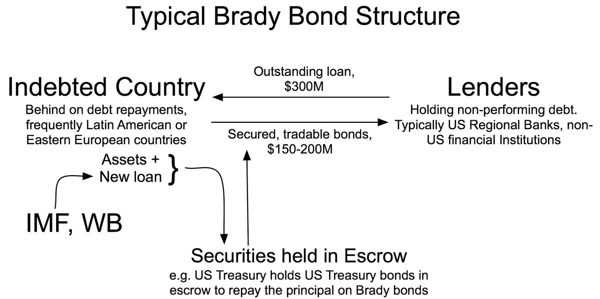

## Table of Contents

## What are Brady Bonds?

Brady Bonds are special types of bonds that were created to help countries that owed a lot of money to other countries. In the late 1980s, many countries in Latin America had big debts and couldn't pay them back. The United States wanted to help these countries, so they came up with a plan named after the then-U.S. Treasury Secretary, Nicholas Brady. The plan allowed these countries to swap their old loans for new bonds, which were called Brady Bonds. These new bonds were easier to manage because they had lower interest rates and longer times to pay them back.

The idea behind Brady Bonds was to help these countries get out of debt and start growing their economies again. The bonds were backed by U.S. Treasury bonds, which made them safer for investors. This meant that investors were more willing to buy them, and the countries could get the money they needed to pay off their old debts. Over time, many countries used Brady Bonds to reduce their debt and improve their financial situation. This helped stabilize their economies and made it easier for them to borrow money in the future.

## Who were Brady Bonds named after?

Brady Bonds were named after Nicholas Brady. He was the U.S. Treasury Secretary at that time. The bonds were created to help countries in Latin America that had a lot of debt.

In the late 1980s, these countries were struggling to pay back their loans. So, the U.S. came up with a plan to help them. The plan allowed these countries to exchange their old debts for new bonds, which were called Brady Bonds. These new bonds were easier to manage and helped the countries get out of debt.

## What was the purpose of introducing Brady Bonds?

The purpose of introducing Brady Bonds was to help countries in Latin America that had big debts in the late 1980s. These countries were having a hard time paying back their loans, which was causing problems for their economies. The U.S. wanted to help these countries, so they came up with a plan called the Brady Plan. This plan allowed these countries to swap their old, hard-to-pay loans for new bonds, which were called Brady Bonds.

Brady Bonds were easier for these countries to manage because they had lower interest rates and longer times to pay them back. This helped the countries reduce their debt and start growing their economies again. The bonds were also backed by U.S. Treasury bonds, which made them safer for investors. This meant that investors were more willing to buy them, and the countries could get the money they needed to pay off their old debts. Over time, many countries used Brady Bonds to improve their financial situation and stabilize their economies.

## How do Brady Bonds work?

Brady Bonds are a special kind of bond that helped countries in Latin America that had a lot of debt. In the late 1980s, these countries were having trouble paying back their loans. So, the U.S. came up with a plan to help them. The plan let these countries trade their old loans for new bonds, which were called Brady Bonds. These new bonds were easier to handle because they had lower interest rates and took longer to pay back. This made it easier for the countries to manage their debt.

The bonds were backed by U.S. Treasury bonds, which made them safer for people who wanted to invest in them. Because they were safer, more investors were willing to buy them. This helped the countries get the money they needed to pay off their old debts. Over time, many countries used Brady Bonds to reduce their debt and make their economies stronger. This helped them get out of debt and start growing their economies again.

## What countries were eligible to issue Brady Bonds?

Brady Bonds were mainly for countries in Latin America that had big debts in the late 1980s. These countries were having a hard time paying back their loans, so the U.S. wanted to help them. The plan let these countries swap their old loans for new bonds, which were called Brady Bonds. Countries like Argentina, Brazil, and Mexico were among those that issued Brady Bonds.

These bonds were easier to manage because they had lower interest rates and took longer to pay back. This helped the countries reduce their debt and start growing their economies again. The bonds were also backed by U.S. Treasury bonds, which made them safer for investors. This meant that investors were more willing to buy them, helping the countries get the money they needed to pay off their old debts.

## What types of Brady Bonds exist?

There are two main types of Brady Bonds: par bonds and discount bonds. Par bonds were issued at their face value, which means the amount you pay for them is the same as the amount you get back when they mature. These bonds had a lower [interest rate](/wiki/interest-rate-trading-strategies), but the countries had to pay back the full amount they borrowed. Discount bonds, on the other hand, were sold for less than their face value. This meant that investors could buy them at a lower price, but they would get the full face value back when the bonds matured. These bonds had a higher interest rate to make up for the discount.

Both types of Brady Bonds helped countries manage their debt better. Par bonds were good for countries that wanted to pay back their debt slowly over time with lower interest rates. Discount bonds were better for countries that wanted to pay back their debt quickly, even if it meant paying a higher interest rate. By offering these different types of bonds, countries could choose the option that worked best for their financial situation.

## How did Brady Bonds affect the economies of issuing countries?

Brady Bonds helped the economies of the countries that issued them by making it easier for them to manage their big debts. In the late 1980s, many countries in Latin America had a lot of debt and were struggling to pay it back. The Brady Bonds allowed these countries to swap their old loans for new bonds that were easier to handle. These new bonds had lower interest rates and took longer to pay back, which meant the countries could slowly pay off their debt without too much pressure. This helped stabilize their economies because they didn't have to worry so much about their debts.

The bonds also made it easier for these countries to get more money from investors. Because the Brady Bonds were backed by U.S. Treasury bonds, they were seen as safer investments. This meant more people were willing to buy them, and the countries could use the money from selling these bonds to pay off their old debts. Over time, this helped the countries reduce their debt and start growing their economies again. By managing their debt better, these countries could focus on building their economies and improving the lives of their people.

## What were the key features of Brady Bonds?

Brady Bonds were special bonds that helped countries in Latin America with big debts. They were created in the late 1980s when these countries were having trouble paying back their loans. The U.S. came up with a plan to let these countries swap their old loans for new bonds, which were called Brady Bonds. These new bonds were easier to manage because they had lower interest rates and took longer to pay back. This made it easier for the countries to slowly pay off their debt without too much pressure.

The bonds were also backed by U.S. Treasury bonds, which made them safer for investors. Because they were safer, more investors were willing to buy them. This helped the countries get the money they needed to pay off their old debts. There were two main types of Brady Bonds: par bonds and discount bonds. Par bonds were sold at their face value with lower interest rates, while discount bonds were sold for less than their face value but had higher interest rates. This gave countries different options to manage their debt in a way that worked best for them.

## What were the risks associated with investing in Brady Bonds?

Investing in Brady Bonds came with some risks. One big risk was that the countries issuing the bonds might not be able to pay them back. These countries had a lot of debt already, and even though the bonds were easier to manage, there was still a chance they could default, or not pay back the money they owed. Another risk was that the value of the bonds could go down. If the economy of the country issuing the bond got worse, the bond's value could drop, and investors could lose money.

There were also risks because of changes in interest rates. If interest rates went up, the value of the bonds could go down because new bonds would be more attractive to investors. Also, even though the bonds were backed by U.S. Treasury bonds, there was still a risk that the backing might not be enough if the country defaulted. This made some investors nervous about putting their money into Brady Bonds.

## How did Brady Bonds contribute to the development of emerging markets?

Brady Bonds helped the development of emerging markets by making it easier for countries with a lot of debt to manage their money. In the late 1980s, many countries in Latin America had big debts and were struggling to pay them back. The Brady Bonds let these countries swap their old, hard-to-pay loans for new bonds that were easier to handle. These new bonds had lower interest rates and took longer to pay back, which meant the countries could slowly pay off their debt without too much pressure. This helped these countries become more stable and focus on growing their economies.

The bonds also brought more money into these emerging markets. Because the Brady Bonds were backed by U.S. Treasury bonds, they were seen as safer investments. This made more investors willing to buy them, and the countries could use the money from selling these bonds to pay off their old debts. Over time, this helped the countries reduce their debt and start growing their economies again. By managing their debt better, these countries could focus on building their economies and improving the lives of their people, which is a big part of developing emerging markets.

## What was the impact of Brady Bonds on global financial markets?

Brady Bonds had a big impact on global financial markets. They helped countries in Latin America that had a lot of debt in the late 1980s. These countries were having trouble paying back their loans, which was causing problems for their economies and the global financial markets. The Brady Bonds let these countries swap their old loans for new bonds that were easier to handle. This helped them manage their debt better and made their economies more stable. As a result, global financial markets became more stable too, because these countries were less likely to default on their debts.

The bonds also brought more money into these emerging markets. Because the Brady Bonds were backed by U.S. Treasury bonds, they were seen as safer investments. This made more investors from around the world willing to buy them. The money from selling these bonds helped the countries pay off their old debts and start growing their economies again. This increased confidence in emerging markets and encouraged more investment in them. Over time, this helped develop these markets and made the global financial system more diverse and resilient.

## What lessons can be learned from the Brady Bonds experience for future debt restructuring?

The Brady Bonds experience teaches us that helping countries with a lot of debt can be good for everyone. By letting countries swap their old, hard-to-pay loans for new bonds that were easier to manage, the Brady Bonds helped these countries get out of debt and start growing their economies again. This made the global financial markets more stable because these countries were less likely to default on their debts. It also showed that when countries can manage their debt better, they can focus on building their economies and improving the lives of their people.

Another lesson from the Brady Bonds is the importance of making investments safer for people who want to buy them. By backing the bonds with U.S. Treasury bonds, more investors were willing to buy them. This brought more money into the countries that needed it, helping them pay off their old debts. For future debt restructuring, it's important to find ways to make new financial tools attractive to investors while also helping countries manage their debt better. This can help emerging markets grow and make the global financial system stronger and more diverse.

## References & Further Reading

[1]: Cline, W. R. (1995). ["International Debt Reexamined."](https://archive.org/details/internationaldeb0000clin_k8v1) Institute for International Economics.

[2]: Eichengreen, B., & Portes, R. (eds) (1995). ["Crisis? What Crisis? Orderly Workouts for Sovereign Debtors."](https://cepr.org/publications/books-and-reports/crisis-what-crisis-orderly-workouts-sovereign-debtors) Centre for Economic Policy Research.

[3]: Bulow, J., & Rogoff, K. (1989). ["Sovereign Debt: Is to Forgive to Forget?"](https://www.jstor.org/stable/1804772) National Bureau of Economic Research Working Paper No. 2623.

[4]: Claessens, S., & Diwan, I. (1990). ["Investment Incentives: New Money, Debt Relief, and the Critical Role of Conditionality in the Debt Crisis."](https://www.jstor.org/stable/3990025) The World Bank Economic Review.

[5]: Stiglitz, J. E., & Weiss, A. (1981). ["Credit Rationing in Markets with Imperfect Information."](https://www.jstor.org/stable/1802787) The Quarterly Journal of Economics, 90(3), 393-410.