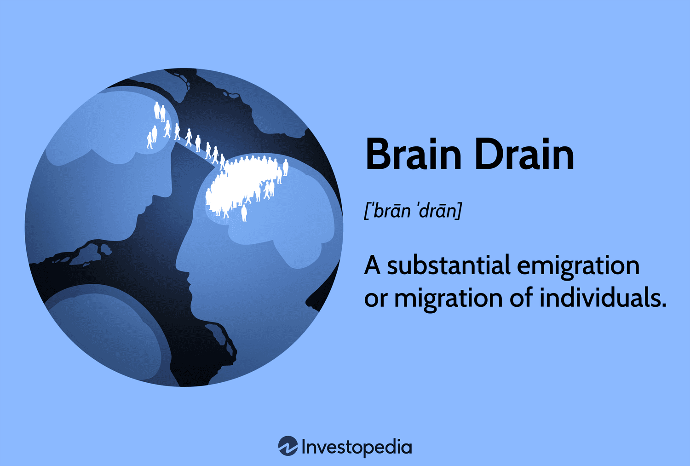

In today’s globalized world, the movement of skilled professionals, commonly referred to as 'brain drain,' has emerged as a significant concern for both developing and developed nations. This phenomenon is particularly noticeable in the context of economic migration, where individuals relocate in search of better job opportunities, superior working conditions, and improved standards of living. The migration of skilled workers can have profound effects on the economies of both the source and the destination countries, reshaping labor markets and influencing economic development.

One of the key factors influencing this migration is the rapid evolution of industries driven by technological advancements. Algorithmic trading, a modern approach to financial markets, epitomizes this trend. This form of trading, characterized by the use of algorithms to automate trading strategies, presents unique challenges and opportunities. The introduction and advancement of algorithmic trading have significantly impacted the financial sector, leading to increased demand for highly skilled professionals equipped with both financial acumen and technological expertise.

As algorithmic trading becomes more prevalent, it draws financial professionals towards advanced markets endowed with the necessary infrastructure and growth prospects. These professionals seek roles in major financial hubs renowned for pioneering in algorithmic and high-frequency trading. The development and optimization of trading algorithms require a deep understanding of both finance and technology, making these roles highly specialized and sought after.

This article examines the multifaceted economic impact of brain drain, with a particular focus on how skilled migration intertwined with technological innovations like algorithmic trading affects global economies. Both source and recipient countries face distinct economic challenges and opportunities as a result of professional migration driven by the desire to engage with cutting-edge financial technologies and markets.

## Table of Contents

## Understanding Brain Drain

Brain drain refers to the emigration of educated and skilled individuals from one country to another. This migration is predominantly motivated by the pursuit of better working conditions, higher salaries, and enhanced living standards. In recent years, the flow of talent has increasingly favored developed countries, where opportunities for professional growth and personal improvement are more abundant. 

Key drivers of brain drain encompass various socio-economic and political factors. Political instability in a home country can prompt individuals to seek more secure environments, while restrictive policies may limit personal and professional freedoms. Additionally, economic disparities, such as a lack of competitive salaries and limited job prospects, often encourage professionals to relocate to regions with robust economies and high demand for specialized skills. Furthermore, the allure of advanced technology and superior education systems in foreign nations can be a decisive [factor](/wiki/factor-investing), as individuals seek environments where their skills can be fully utilized and further developed.

The definition of brain drain extends beyond mere geographic movement. It also manifests within industries as professionals shift from sectors offering limited advancement to those providing more lucrative or stable opportunities. This internal migration can be observed across various global sectors, where the demand for cutting-edge skills and innovation outpaces supply, prompting a redistribution of talent into burgeoning fields such as technology and finance. This dynamic underscores the importance of creating sustainable environments that nurture talent and provide opportunities for professional growth to mitigate the adverse effects of brain drain on economies and societies.

## Economic Impact of Brain Drain

The economic ramifications of brain drain manifest in multiple ways, significantly impacting both source and recipient countries. In nations from which skilled individuals emigrate, the primary consequence is often a reduced pool of talent, which can hamper innovation and slow economic growth. The exodus of educated professionals, such as scientists, engineers, and healthcare workers, creates a skills gap that impedes developmental progress. This loss leads to increased challenges in sectors that are crucial for economic advancement, such as technology and healthcare, potentially stifling new initiatives and reducing the country's competitive edge on a global scale.

Recipient countries, on the other hand, generally experience a phenomenon known as "brain gain," where the influx of skilled professionals enhances their labor forces. This enrichment often results in heightened levels of innovation and productivity, contributing positively to economic development. Developed nations, which are often the recipients of this talent influx, can see substantial increases in their technological and scientific outputs. This concentrated accumulation of talent in developed regions can further widen the economic disparities between these countries and their developing counterparts.

For the source countries, the challenges extend beyond mere economic stagnation. The departure of skilled workers can lead to a reduction in consumer spending and a subsequent dip in tax revenues, as these individuals and their families relocate and spend their earnings abroad. This financial shift can strain public services, as there is less tax revenue to fund essential services such as education, healthcare, and infrastructure development. The cumulative effect of these deficiencies is a weakening of public confidence and a potential increase in socioeconomic instability.

The loss of skilled labor also exerts pressure on the education and training systems of source countries, which must grapple with the challenge of continuously replenishing their talent pools. While remittances from emigrant workers can provide short-term financial relief, this is not a sustainable solution for long-term economic health. Instead, sustained efforts in developing strong local industries, enhancing education systems, and improving working conditions are imperative to mitigate the adverse effects of brain drain and support the overall economic resilience of affected nations.

## The Role of Algorithmic Trading in Migration

Algorithmic trading, an advanced method of executing financial transactions, has significantly transformed global financial markets. By employing computer algorithms to execute a large number of orders in rapid succession, [algorithmic trading](/wiki/algorithmic-trading) allows for more precise, faster, and often more profitable trades than traditional methods. This revolution has profoundly influenced the migration patterns of financial professionals, prompting a surge of interest in major financial hubs worldwide.

The growth of algorithmic and high-frequency trading requires specialized skills in mathematics, [statistics](/wiki/bayesian-statistics), computer science, and finance, making these roles highly sought after. Consequently, financial professionals with expertise in developing and optimizing trading algorithms are compelled to seek opportunities in countries where these advanced trading environments are prominently established, such as the United States, the United Kingdom, and Singapore. These nations host the necessary infrastructure, regulatory frameworks, and technological advancements that support sophisticated trading operations, making them attractive destinations for migrating talent.

For nations and financial institutions lagging behind in technological adoption, the inability to provide robust facilities and necessary tools in algorithmic trading presents a significant risk of losing out on valuable human capital. These countries may face a competitive disadvantage, lacking the workforce needed to innovate and enhance their financial services sector. The absence of adequate investment in technology and professional development exacerbates this issue, as professionals are more inclined to relocate to regions offering greater potential for career advancement, competitive salaries, and professional growth.

This migration trend also underlines the broader economic implications of brain drain in the financial sector. Countries unable to retain their skilled professionals might experience a talent deficit, affecting their economic growth and innovation potential. Conversely, destination countries experience a 'brain gain,' enriching their financial markets with diverse expertise and skills that drive innovation and increase market efficiency.

In summary, the evolution of algorithmic trading is a key driver of migration for financial professionals, propelling them towards significant financial centers that provide the infrastructure and opportunities necessary for growth in this domain. Nations aspiring to retain and attract such talent must rapidly adapt to the technological demands of algorithmic trading, ensuring their participation in and contribution to the evolving global financial landscape.

## Case Studies

Countries such as Ukraine and Puerto Rico have become notable examples of brain drain, driven by skilled individuals seeking economic opportunities abroad. This phenomenon is not limited to any one industry, impacting various sectors including technology and finance.

In Ukraine, economic challenges and political instability have significantly contributed to the migration of skilled professionals. According to the International Organization for Migration, a substantial number of IT specialists, engineers, and healthcare professionals have sought employment in countries offering better economic prospects and stability. The country's particularly strong IT sector has seen professionals relocate to tech hubs in Europe and North America, where advanced infrastructure and educational opportunities are prevalent.

Likewise, Puerto Rico faces its own brain drain issues. The island's ongoing economic crisis, accentuated by high public debt and inadequate infrastructure, has pushed many skilled individuals, notably healthcare workers and engineers, to seek employment on the mainland United States. The Puerto Rico Institute of Statistics reported that thousands have left the island, contributing to a reduced tax base and hampering local economic recovery efforts.

In both cases, the allure of advanced markets equipped with better technological frameworks plays a critical role. This is particularly evident in industries like algorithmic trading, where the competitive nature of financial markets in cities like New York, London, and Singapore attracts top talent from smaller markets. The advanced technology and complex financial instruments available in these hubs offer unparalleled opportunities for professionals seeking to excel in algorithmic and high-frequency trading.

These case studies not only illustrate the personal benefits for migrating professionals—such as higher salaries and greater professional growth—but also underscore the challenges faced by source countries. Brain drain leads to a critical loss of skilled workforce, which has long-term implications on their economies. They experience a diminished ability to innovate and grow, further perpetuating the cycle of migration.

Addressing brain drain requires a multifaceted approach. Countries must enhance local opportunities through investments in education and technology while creating stable economic environments to retain talent. Additionally, fostering international partnerships can help distribute knowledge and opportunities, potentially alleviating some effects of this complex global issue.

## Strategies to Mitigate Brain Drain

Enhancing local opportunities through investment in education, technology, and competitive salaries can effectively address the challenge of brain drain. Prioritizing education by upgrading the curriculum to include skills in high demand globally, such as digital literacy, data analysis, and [artificial intelligence](/wiki/ai-artificial-intelligence), equips the workforce to compete internationally. Furthermore, increased funding for research and development can encourage innovation and create opportunities that attract and retain skilled professionals.

Investing in technology infrastructure ensures that local markets remain competitive. This involves not only the physical infrastructure, such as high-speed internet and modern communication networks, but also fostering a tech-driven business environment. By creating technology hubs and innovation centers, nations can stimulate local entrepreneurship and attract international businesses, thus creating a vibrant job market that incentivizes professionals to stay.

Offering competitive salaries and benefits is essential in keeping talent from migrating. Aligning remuneration packages with global standards can deter the financial lure of foreign opportunities. Additionally, implementing performance-based incentives and offering continuous professional development helps maintain a motivated and skilled workforce.

Policies and reforms targeting the core of economic, social, and political stability are essential. Amending economic policies to reduce unemployment and underemployment can ensure that skilled individuals find suitable opportunities within their home countries. Social policies aimed at improving the quality of life, including healthcare, housing, and work-life balance, make staying locally more appealing. Politically, establishing a stable and transparent governance framework encourages confidence among professionals and investors alike, fostering a conducive environment for personal and professional growth.

International partnerships and collaborations are pivotal in sharing global knowledge and distributing opportunities. By engaging in bilateral agreements and multinational ventures, countries can facilitate knowledge exchange and skill development. Academic and professional exchanges between institutions can expose local talent to global best practices, while collaborative research projects allow for innovative outputs that benefit all parties involved.

Fostering ties with the diaspora community can also play a strategic role in mitigating brain drain. Encouraging expatriates to contribute to their home countries through investments, mentoring, or collaborative projects can lead to knowledge transfer and capacity building. Implementing policies that facilitate dual citizenship or ease the return of professionals can further integrate this global network into the local economy.

These strategies underscore the importance of a holistic approach, where enhancing local conditions and building international linkages work in synergy to retain skilled individuals and reduce the negative impact of brain drain on source countries.

## Conclusion

Brain drain is a multifaceted issue influenced by economic ambitions, societal changes, and technological advancements, such as algorithmic trading. It involves the migration of skilled professionals seeking better opportunities, which presents both challenges and opportunities for countries. Developing nations often suffer from the loss of human capital, leading to reduced innovation and slower economic growth, while developed nations benefit from the influx of talent, enhancing their economic and technological standing.

The primary challenge is harmonizing the aspirations of individuals with the efforts of nations trying to retain this valuable human capital. Skilled professionals are often driven by higher salaries, better working conditions, and more advanced technological opportunities, which prompts them to migrate to more developed countries. Addressing these aspirations requires a comprehensive approach.

Countries can mitigate the adverse effects of brain drain by implementing multi-faceted strategies. Investing in local education systems and technology sectors can create homegrown opportunities that compete with those abroad. Ensuring competitive salaries and improving working conditions can also make local markets more attractive to skilled professionals. Additionally, fostering political and economic stability will enhance living standards and contribute to retaining talent.

International partnerships and collaborations can play a crucial role in distributing global knowledge and opportunities more evenly. By promoting cross-border research and technological exchanges, countries can improve their competitive stance and make their markets more appealing to skilled professionals. Such collaborations can help generate a balanced flow of talent, minimizing the negative impacts of brain drain while supporting sustainable economic growth.

In conclusion, brain drain demands an integrated approach that aligns national policies with global trends. By addressing local shortcomings and enhancing international cooperation, countries can retain their skilled workforce and leverage their human capital for economic development and prosperity.

## References & Further Reading

[1]: Bergstra, J., Bardenet, R., Bengio, Y., & Kégl, B. (2011). ["Algorithms for Hyper-Parameter Optimization."](https://papers.nips.cc/paper/4443-algorithms-for-hyper-parameter-optimization) Advances in Neural Information Processing Systems 24.

[2]: ["Advances in Financial Machine Learning"](https://www.amazon.com/Advances-Financial-Machine-Learning-Marcos/dp/1119482089) by Marcos Lopez de Prado

[3]: ["Evidence-Based Technical Analysis: Applying the Scientific Method and Statistical Inference to Trading Signals"](https://www.amazon.com/Evidence-Based-Technical-Analysis-Scientific-Statistical/dp/0470008741) by David Aronson

[4]: ["Machine Learning for Algorithmic Trading"](https://github.com/stefan-jansen/machine-learning-for-trading) by Stefan Jansen

[5]: ["Quantitative Trading: How to Build Your Own Algorithmic Trading Business"](https://www.amazon.com/Quantitative-Trading-Build-Algorithmic-Business/dp/1119800064) by Ernest P. Chan