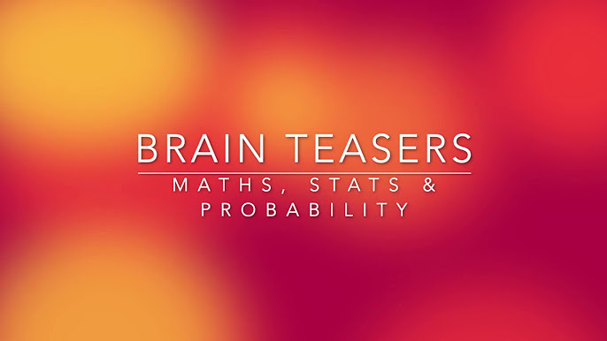

Brainteasers often evoke mixed feelings. Many see them as a mere diversion, an unnecessary mental gymnastics that doesn't add real value to one's skill set. This perspective changes, however, when we consider the competitive world of high-frequency trading and market-making, where brainteasers aren't just a quirky part of job interviews but a daily mental exercise to stay sharp and prepared. This article delves into the world of brainteasers, not just as a tool for interview preparation, but as a critical exercise in sharpening one's analytical and problem-solving skills, especially in the high-stakes environment of trading and market analysis.

In this section are brainteasers you may get in interviews with quantitative high frequency trading groups.

## Table of Contents

## Market Making and Betting

- Flip 98 fair coins and 1 HH coin and 1 TT coin. Given that you see an H, what is the probability that it was the HH coin? Explain in layman’s terms.
- Flip 10000 fair coins. You are offered a 1-1 bet that the sum is less than 5000. You can bet 1, 2, ..., 100 dollars. How much will you bet. How much will you bet if someone tells you that the sum of the coins is less than 5100?
- Roll a die repeatedly. Say that you stop when the sum goes above 63. What is the probability that the second to last value was X. Make a market on this probability. Ie what is your 90 percent confidence interval.
- There are closed envelopes with $2, $4, $8, $16, $32, and $64 lined up in sorted order in front of you. Two envelopes next to each other are picked up and shuffled. One is given to you and one is given to your friend. You and you friend then open your own envelopes, look inside, and then decide whether or not to offer to trade. If you both agree to trade, then you will swap. Assume you open your envelope and see $16. Should you offer to trade?
- Generate N random values from a random variable where the value N comes from some other variable. Make a market on the sum of the values.
- Find the log-utility optimal fraction of your capital to bet on a fair coinflip where you win x on a heads and lose y on tails.
- This question is very hard to explain. It is intended to judge how much of a feel you have for risk in an adversarial setting with various bits of information about how much your counterparty might be trying to screw you and how much control they have over the game. It goes something like this: The interviewer, who has the mannerisms of an amateur magician, holds up a top hat. He puts five yellow nerf balls in it. Pulls one ball from the hat. It is a yellow nerf ball. Would you bet on the next four balls being yellow? What if I made you pay to play? What if I was your friend? What if your friend put the balls in? What if I made you pay more? etc etc...
- Explain how you would handle a trading model with 25 factors differently than one with 100. What you would ask or do next if the 100 factor model had 25% better performance than the 25 factor model?
- If a stock starts at a price of p and then goes up x% then down x%, is its price greater than, less than, or equal to p?
- You have 100 dollars. You are playing a game where you wager x dollars on a biased coin flip with a 90 percent probability of heads. You make 2x if it’s heads and lose the x dollars if it’s tails. How much do you think you should bet on each flip if you are going to play for 100 flips?
- Make a market on a derivative with a price equal to the number of pothole covers in New York.

## Probability

- What is the pobability of getting exactly 500 heads out of 1000 coin flips? Approximate it to within 5% of the true value without a calculator.
- Play a game like chess or pingpong. You only have two opponents, A and B. A is better than B. You will play three games. There are only two orders you can play: ABA and BAB. Which gives you a better chance of winning?
- Play a 1 vs 1 game. I roll a 6 sided die, if I get a 1 I win, if not you roll. If you get a 6 you win, otherwise I go again... What are my chances of winning and what are yours?
- Normal 52 card deck. Cards are dealt one-by-one. You get to say when to stop. After you say stop you win a dollar if the next card is red, lose a dollar if the next is black. Assuming you use the optimal stopping strategy, how much would you be willing to pay to play? Proof?
- Assume there is a diagnostic drug for detecting a certain cancer. It is 99% sensitive and 99% specific. 0.5% of the population has this cancer. What is the probability that a randomly selected person from the population has this cancer given that you diagnose them using the drug and it comes back positive?
- You have 3 pancakes in a stack. 1 is burned on both sides, 1 burned on 1 side, 1 burned on no sides. What is P(burned on other side — burned on the top)?
- Roll a die until the first 6. What’s the expected number of rolls? What’s the expected number of rolls until two sixes in a row? How about a six then a five? Are they different?
- Say you roll a die, and are given an amount in dollar equal to the number on the die. What would you pay to play this game if you played it a many times in a row? Now say that when you roll the die, you’re allowed to either take the money that you’d get with the roll, or roll a second time; if you roll a second time, you’re obligated to take the number of dollars that you get with the second roll. Now what is the worth of the game? Same thing as above, except you have an option to play the game a third time.
- Let’s say you’re playing a two-player game where you take turns flipping a coin and whoever flips heads first wins. If the winner gets 1 dollar, how much would you pay to go first instead of second?
- Two fair coins are flipped behind a curtain. You are told at least one came up heads. Given that information and nothing else, what is the probability that both landed heads?
- You are trying to determine the price a casino should charge to play a dice game. The player rolls a die and gets paid the amount on the face, however he can choose to re-roll the dice, giving up the chance to take the first payout amount before seeing the second result. Similarly he has the same option on the second roll, but after the second re-roll, he must keep the amount shown the third time. How much should the casino charge to break even in expectation on this game assuming the player chooses the best strategy?
- You have 5 quarters on the table in front of you: four fair (regular two-sided coins) and one double-sided (both sides are heads). You pick one of them up at random, flip it five times, and get heads each time. Given this information, what is the probability that you picked up the double-sided quarter?

## Retention of Coursework

- Analyze the results of a multiple linear regression given a few plots, datapoints, and p-values.
- Explain collinearity
- Assume you have data generated by the process $y = Ax + w$ where $w$ is white noise. What is the least squares estimate of $x$? Give the matrix equation and the intuition behind “least squares”.
- What is the t-value in a linear regression and how is it calculated?
- Derive the maximum likelihood estimate for the mean of a bernoulli random variable given data [on a whiteboard].
- If $v$ is a column vector, then how many non-zero eigenvalues does the matrix $aaT$ have? what are the eigenvalues? What are the corresponding eigenvectors? What are the eigenvectors corresponding to the
zero eigen values?

## Mental Math

Answer as quickly as possible.

- $7^3$
- 15% of 165
- one million minus 1011
- 54% of 123
- $55^2$

## Pattern Finding

- Find the next number in the sequence (2.1 pts):
1, 3, 7, 12, 18, 26, 35, 45, 56, 69, 83, 98, 114, 131...
    - Answer: 150
    - Solution: take first differences twice (second differences) and then notice the pattern:
    first diffs: 2, 4, 5, 6, 8, 9, 10, 11, 13, 14, 15, 16, 17
    2nd diffs: 2, 1, 1, 2, 1, 1, 1, 2, 1, 1, 1, 1, 2, so the next first diff is 19, so the next number is 150
- Find three whole, positive numbers that have the same answer when multiplied together as when added together (1.0 pt).
    - Answer: 1, 2, 3
- We put a spore in a test tube. Every hour the spore divides into three parts, each the same size as the original spore. If we put the first spore in the tube at noon and at 6pm the tube is completely full, at what time is the tube 1/3 full? (1.8 pts)
    - Answer: 5pm
- If 75% of all women are tall, 75% of all women are brunette, and 75% of all women are pretty, what is the minimum percentage who are tall, brunette, pretty women? (2.7 pts)
    - Answer: 25%
    - Solution: Use geometric probability
- A month begins on a Friday and ends on a Friday, too. What month is it? (1.0 pt)
    - Answer: February
    - Solution: February is the only month with a number of days which is divisible by 7 (28 days).
- There is one in a minute, two in a moment, but only one in a million years. What is it? (1.1 pts)
    - Answer: the letter ‘m’
    - Solution: ‘m’inute = 1; ‘m’o‘m’ent = 2; ‘m’illion years = 1
- Find the next number in this sequence: (3.2 pts)
1248, 1632, 6412, 8256...
    - Answer: 5121
    - Solution: Write down the sequence: 1, 2, 4, 8, 16, 32, 64, 128, 256...
    Delete all the spaces: 1248163264128256...
    Add spaces back after ever four numbers to get the original sequence.
    So extending it we know the next numbers are 512, 1024 ie 5121024 ie 5121, ...

## Math and Logic

- A girl is swimming in the middle of a perfectly circular lake. A wolf is running at the edge of the lake waiting for the girl. The wolf is within a fence surrounding the lake, but it cannot get out of the fence. The girl can climb over the fence. However if the wolf is at the edge of the lake where the girl touches it, then it will eat her. The wolf runs 2 times faster than the girl can swim. Assume the wolf always runs toward the closest point on the edge of the lake to where the girl is inside. Can the girl escape? If so, what path should she swim in?
- The hands on a clock cross each other at midnight. What time do they cross each other next?
- Three people are standing in a circle in a duel. Alan has 100% accuracy, Bob has 66% accuracy, and Carl has 33%. It is a fight to the death – only one person can walk away. They take turns starting with Carl, then Bob, then Alan, and so on. Assume each person plays rationally to maximize their chance of walking away. What is Carl’s action on the first round?
- $x^{x^{x^{x^{...}}}}=2$. What is $x$?
- What is $\sqrt{2+ \sqrt{2+ \sqrt{2+ \sqrt{2+ \sqrt{2+···}}}}}$?
- A line segment is broken into three pieces. What is the probability they form a triangle?
- What is the probability that three points chosen uniformly and independently on a circle fall on a semi-circle?
- We have two concentric circles. A chord of the larger circle is tangent to the smaller circle and has length 8. What’s the area of the annulus–the region between the two circles?
- There are a cup of milk and a cup of water. Take one teaspoon of milk, put into the water cup; mix well. Take one teaspoon of the mixture in the water cup and put into the milk cup then mix well. Which is higher: the percentage of water in the milk cup or the percentage of milk in the water cup ?
- Two trains are 30 miles apart and are on track for a head-on collision – one train is going at 20 miles per hour and the the other is going at 40 miles per hour. If there is a bird flying back and forth between the fronts of the two trains at 10 miles per hour, what is the total distance the bird will travel before the trains hit?
- A 10-by-10-by-10 cube constructed from 1-by-1-by-1 cubes falls into a bucket of paint. How many little cubes have at least one face with paint on it?
- Write a function to find the median of a list.
- You have an unsorted array of the numbers 1 to 50 in a random order. Let’s say one of the numbers is somehow missing. Write an efficient algorithm to figure which is missing.
- What is $(1+\frac{1}{n})^n$ as n→∞?
- The number of lilipads on a pond doubles each minute. If there is 1 lilipad initially at time t = 0, therefore 2 at t = 1, 4 at t = 3, 8 at t = 4, etc and the pond is totally covered at time t = 60, then how much of the pond’s surface is still visible at time t = 58?
- How can a cheesecake be cut three times to get eight equal slices?
- The airplane passengers problem (can be looked up in the brainteasers forum): say you have 100 passengers boarding a plane with 100 seats. the first person to board is a weird old lady who, instead of going to her own seat, seats in one of the seats uniformly at random (she could pick her own, but she could also pick someone else’s seat). From then on, when a person boards, they’ll sit in their own seat if it’s available, and if their seat is taken by someone, they’ll pick one of the remaining seats uniformly at random and sit there. What is the probability that the last person sits in his/her own seat?
- A company has a value V which is uniformly distributed between 0 and 1. You are planning to place a bid B for the company. If B is smaller than V, then your bid loses and you get nothing; if B is larger than V, you get to purchase the company at price B, and the company will end up being worth 1.5 * V. What price B should you bid to maximize your profit?
- On a sheet of paper, you have 100 statements written down. the first says, “at most 0 of these 100 statements are true.” The second says, “at most 1 of these 100 statements are true.” ... The nth says, “at most (n-1) of these 100 statements are true.” ... the 100th says, “at most 99 of these statements are true.” How many of the statements are true?
- You and your spouse host a party with eight other couples. At the beginning of the party, people proceed to shake the hands of those they know. No one shakes their own hand or their spouse’s hand. After this shaking of hands is done, you take a survey of how many hands each person shook, and it turns out that excluding yourself, the numbers of hands shook by everyone else are distinct—that is, no one shook the same number of hands as anyone else. How many hands did your spouse shake?
- You have two decks of cards: one has 13 reds and 13 blacks, and the other has 26 reds and 26 blacks. We play a game in which you select one of the two decks, and pick two cards from it; you win the game if you select two black cards. Which deck should you select to maximize your chances of winning? Try to do this problem in your head, without writing any calculations down.
- You have a deck of 52 cards, and you keep taking pairs of cards out of the deck. If a pair of cards are both red, then you win that pair; if a pair of cards are both black, then I win that pair; if a pair of cards has one red and one black, then it’s discarded. If, after going through the whole deck, you have more pairs than I do, then you win 1 dollar, and if I have more pairs than you do, I win 1 dollar. What is the value of this game in the long run?

## Conclusion

The realm of brainteasers, particularly in the context of quantitative high-frequency trading, is a testament to the importance of critical thinking and analytical skills in high-pressure environments. These puzzles aren't merely for entertainment or intellectual showmanship; they are a fundamental part of a trader's toolkit, helping to develop and maintain the sharpness required for making split-second decisions. Whether you are a seasoned trader or a newcomer to the field, embracing these challenges can be a game-changer, enhancing your ability to assess risk, make rapid calculations, and navigate the complex world of market dynamics. In a field where the stakes are high and the competition is fierce, mastering these brainteasers could very well be the edge you need to excel.

💡 **Read more:**

- Trading strategies papers with code on [Equities](https://wiki.paperswithbacktest.com/trading-strategies/equities), [Cryptocurrencies](https://wiki.paperswithbacktest.com/trading-strategies/cryptocurrencies), [Commodities](https://wiki.paperswithbacktest.com/trading-strategies/commodities), [Currencies](https://wiki.paperswithbacktest.com/trading-strategies/currencies), [Bonds](https://wiki.paperswithbacktest.com/trading-strategies/bonds), [Options](https://wiki.paperswithbacktest.com/trading-strategies/options)
- [A curated list](https://github.com/paperswithbacktest/awesome-systematic-trading) of awesome libraries, packages, strategies, books, blogs, and tutorials for systematic trading
- [A bunch of datasets](https://huggingface.co/paperswithbacktest) for quantitative trading
- [A website to help you](https://paperswithbacktest.com/) become a quant trader and achieve financial independence