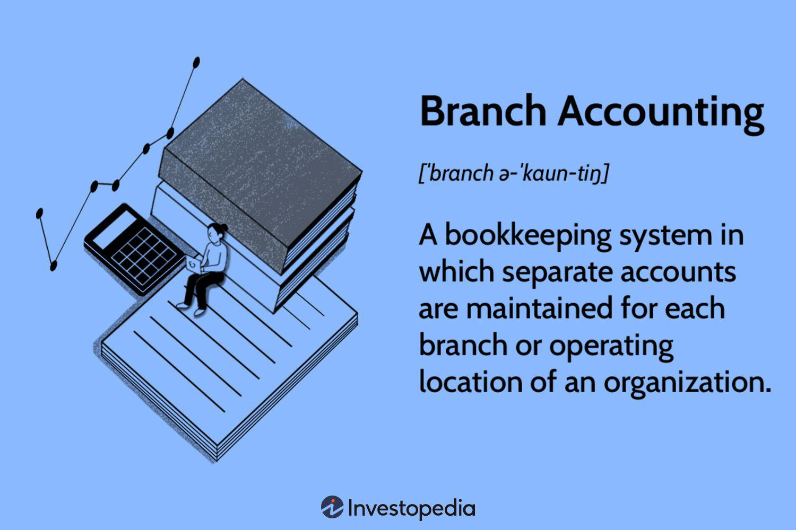

Accounting methods, financial management, branch accounting, and algorithmic trading form a complex and intertwined framework critical to modern financial and corporate operations. These elements drive efficient decision-making, strategic planning, and competitiveness.

Accounting methods, including cash basis, accrual basis, and mark-to-market, provide the foundation for financial reporting and compliance. Each method offers distinct advantages and challenges, and their appropriate selection is essential for accurate reflection of a company's financial health. In decentralized organizations, branch accounting becomes a necessity. This approach allows separate financial records for different locations or departments, ensuring transparency and accountability. By maintaining distinct accounts for each branch, companies can better manage resources, assess performance, and comply with regulations across widespread operations.



Algorithmic trading has transformed financial markets through automation and speed, with high-frequency trading representing a significant portion of market activities. These sophisticated trading systems rely heavily on precise accounting practices to handle massive volumes of transactions and ensure compliance with financial regulations. The integration of accounting practices and trading platforms is crucial in reducing errors and maintaining robust financial records, which are necessary for regulatory scrutiny and strategic maneuvering.

Financial management acts as the glue within this interconnected system, overseeing the implementation of accounting methods and ensuring that branch operations adhere to a company’s overarching strategy. Efficient financial management enhances oversight by aligning accounting practices with business objectives, enabling companies to adapt rapidly to market dynamics and technological advancements.

The synergy of accurate accounting methods, strategic financial management, branch accounting, and algorithmic trading is crucial for enhancing organizational performance. Companies that effectively integrate these elements can achieve a competitive edge, ensuring sustainable growth and long-term success in today's fast-evolving financial landscape.

## Table of Contents

## Understanding Accounting Methods

Accounting methods are essential in determining how companies record and report financial data, directly influencing decision-making, taxation, and compliance. Various accounting methods cater to different business needs and external regulatory requirements, including cash basis, accrual basis, and mark-to-market accounting.

### Cash Basis Accounting

Cash basis accounting records financial transactions at the time cash is exchanged. This method is straightforward and offers the benefit of simplicity and immediate visibility into cash flow. Its main disadvantage lies in the potential misrepresentation of a company's financial health, as it does not account for receivables or payables.

**Advantages:**
- Simplicity in recording transactions.
- Direct insight into cash flow, beneficial for small businesses with straightforward transactions.

**Disadvantages:**
- Potential for inaccurate financial performance analysis.
- Non-compliance with Generally Accepted Accounting Principles (GAAP), making it unsuitable for publicly traded companies.

### Accrual Basis Accounting

Accrual basis accounting records revenues and expenses when they are earned or incurred, regardless of when the cash is actually exchanged. This method conforms to GAAP standards and provides a more accurate picture of a company's financial status.

**Advantages:**
- Provides a comprehensive view of financial position and performance.
- Aligns with GAAP, enabling comparability and compliance for public entities.

**Disadvantages:**
- Complexity in tracking and managing transactions.
- More resource-intensive, requiring robust accounting systems.

### Mark-to-Market Accounting

Mark-to-market accounting, also known as fair value accounting, values an asset based on its current market price rather than its historical cost. This method reflects real-time financial conditions, essential for industries like finance and investments subject to rapid market fluctuations.

**Advantages:**
- Reflects accurate market conditions, which is crucial for financial instruments.
- Provides timely financial information based on current data.

**Disadvantages:**
- Volatility in reported earnings due to market fluctuations.
- Complexity and potential manipulation of market prices can lead to inconsistent reporting.

### Specific Accounting Methods: FIFO, LIFO, and Weighted Average Cost

#### FIFO (First-In, First-Out)

FIFO assumes that the oldest inventory is sold first. This method is prevalent in perishable goods industries, aligning cost flow with the actual physical flow of goods.

**Advantages:**
- Simple implementation.
- Reflects true cost and aids in inflationary periods by showing higher income.

**Disadvantages:**
- Potential high tax liabilities as older, lower-cost inventory is replaced by higher-cost items.

#### LIFO (Last-In, First-Out)

LIFO assumes that the newest inventory is sold first. Common in industries where inventory costs are rising, it allows companies to reduce taxable income by matching recent higher costs with current revenues.

**Advantages:**
- Lower taxes in inflationary environments by reducing reported profits.
- Matches current costs with revenues, providing a realistic earnings view.

**Disadvantages:**
- LIFO inventory value may be understated, leading to possible perception of financial weakness.
- Not allowed under International Financial Reporting Standards (IFRS).

#### Weighted Average Cost

Weighted average cost assigns an average cost to each inventory item, calculated by dividing the total cost of goods available for sale by the total units available.

**Advantages:**
- Smoothens cost fluctuations over reporting periods.
- Simplifies inventory management through consistent pricing.

**Disadvantages:**
- May not reflect actual physical flow of goods.
- Potentially imprecise cost alignment in varied pricing environments.

### Application Across Industries

These accounting methods have widespread implications depending on the industry. For example, the FIFO method is particularly suited for food retailers where perishable inventory requires regular turnover, while LIFO might be more applicable in industries like oil and gas where inventory costs tend to increase. Meanwhile, accrual accounting remains a staple for large corporations across all sectors due to its alignment with regulatory compliance and accurate financial portrayal.

Tax implications of each method are also significant. Methods like FIFO may increase tax liabilities under inflationary conditions, highlighting the need for strategic planning in selecting the appropriate accounting approach. Furthermore, financial analysis and decision-making rely heavily on accurate accounting methods, as they provide the foundation for evaluating company performance and strategic direction.

## Financial Management in Decentralized Organizations

Financial management plays a crucial role in the operation of decentralized organizations through the application of branch accounting. Branch accounting is an essential practice that allows multi-branch operations to maintain financial transparency and accountability. By keeping separate accounts for each branch, firms can accurately assess the performance of individual branches, leading to more informed strategic decisions.

The historical evolution of branch accounting can be traced back to the early days of commercial expansion, where businesses began to recognize the need for a systematic approach to managing accounts in multiple locations. As enterprises grew and expanded geographically, the challenges of consolidating accounts necessitated the development of methods to manage finances effectively. Modern-day applications of branch accounting continue to evolve with technological advancements, allowing real-time data integration and more precise financial oversight.

Maintaining separate accounts for different branches not only ensures transparency but also provides an indispensable tool for performance evaluation and accountability. It facilitates clear reporting of revenues, expenses, assets, and liabilities for each branch. This detailed insight helps organizations identify profitable branches and those requiring strategic intervention or resource redistribution. In addition, it aids in pinpointing operational inefficiencies, thereby enabling corrective measures to improve overall business performance.

Despite its advantages, branch accounting presents several challenges for financial managers. One of the primary challenges is ensuring compliance with varying local regulations, which can differ significantly depending on the branch location. Navigating these regulatory landscapes requires meticulous attention to detail and a comprehensive understanding of applicable laws to avoid legal pitfalls.

Another challenge is achieving efficient operation across all branches while maintaining a cohesive financial strategy. This involves implementing standardized processes and procedures that can seamlessly adapt to the unique characteristics of each branch. Financial managers must also contend with the complexities of consolidating disparate financial data into a unified report that accurately reflects the organization's overall financial condition.

Furthermore, technological integration poses a significant challenge, as it requires sophisticated accounting systems capable of handling large volumes of data from multiple sources. Financial managers must ensure that these systems are robust and secure, providing reliable financial information while protecting sensitive data against cyber threats.

In summary, financial management in decentralized organizations through branch accounting is essential for maintaining transparency, accountability, and operational efficiency. While the method presents challenges such as compliance with diverse regulations and technological integration, its successful implementation can significantly enhance the financial health and strategic direction of a business.

## Branch Accounting: A Detailed Examination

Branch accounting is a specialized subset of accounting that facilitates financial management and control in organizations with multiple branches or locations. In large and geographically dispersed corporations, branch accounting serves a crucial role by systematically recording and managing the financial transactions of each branch as distinct segments of the parent organization. This ensures meticulous tracking of each branch's performance and enables tailored financial reporting.

### Definition and Purpose

Branch accounting involves maintaining separate accounting records for each branch of a business. This approach allows an organization to assess the profitability and performance of individual branches, offering insights into areas of strength and those requiring improvement. By keeping detailed records, companies can make informed decisions on resource allocation, strategic planning, and operational adjustments, enhancing overall efficiency and profitability.

### Methods Used in Branch Accounting

Several methods are employed in branch accounting to suit different organizational needs and branch structures:

1. **Debtor System**: This system focuses on managing branch debtors and inventory. Branch transactions are recorded in a manner that displays each branch's financial status, typically involving a branch account in the head office books, where the branch is treated as a debtor or creditor.

2. **Income Statement System**: Here, each branch maintains its own set of financial statements, facilitating a separate assessment of its profitability. This method provides a detailed view of each branch’s financial performance, contributing to effective management oversight and decision-making.

3. **Stock and Debtors System**: In this method, detailed records of branch inventories and debtors are maintained separately. It allows for precise tracking of stock movement and debtor management at the branch level, thus enhancing inventory control and cash flow management.

### Advantages of Branch Accounting

Branch accounting provides numerous benefits, including:

- **Accountability**: By maintaining distinct records for each branch, transparency is enhanced, enabling accurate monitoring and reporting of financial activities. This accountability aids in assessing managerial performance and making data-driven decisions.

- **Control**: It allows the central office to enforce financial controls and compliance across various locations, reducing risks associated with financial discrepancies and fraud.

- **Performance Evaluation**: Branch accounting enables precise performance measurement, facilitating targeted strategies to improve productivity and growth across different business segments.

- **Resource Allocation**: By evaluating branch-specific financial data, organizations can make informed decisions regarding resource distribution, ensuring optimal investment in profitable areas and strategic realignment where necessary.

### Real-World Examples

Several organizations have effectively implemented branch accounting to optimize their operations:

- **Fast Food Chains**: Global restaurant franchises, such as McDonald's, utilize branch accounting to manage their numerous outlets globally. Each location’s financial data is tracked separately, enabling the corporation to understand regional performance and consumer preferences better.

- **Retail Chains**: Companies like Walmart employ branch accounting to streamline their vast network of stores. This structure facilitates efficient inventory management and sales monitoring, contributing to a synchronized supply chain and tailored marketing strategies.

- **Banking Institutions**: Banks such as HSBC use branch accounting to maintain the financial records of their numerous branches and ATMs worldwide. This method supports compliance with varying regulatory requirements and enables localized financial control.

Branch accounting is integral to modern financial management within decentralized organizations. By enabling detailed oversight and control of disparate business segments, it fosters accountability, enhances performance, and supports strategic growth initiatives.

## Algorithmic Trading and Accounting Practices

Algorithmic trading, also known as algo trading, is the use of computer algorithms to execute trades automatically in financial markets. It has gained significant traction over the past decade due to its ability to process large volumes of transactions at high speed, making it a critical component of modern financial markets. Algorithmic trading allows for precise and efficient execution of trades by using pre-defined criteria including timing, price, and [volume](/wiki/volume-trading-strategy), thereby minimizing human intervention.

One of the primary challenges posed by [algorithmic trading](/wiki/algorithmic-trading) is the unique accounting problems that arise from high-frequency trading ([HFT](/wiki/high-frequency-trading-strategies)) and large transaction volumes. High-frequency trading implies executing thousands of orders in fractions of a second. This creates an enormous amount of data that needs to be accurately recorded, reconciled, and reported in near real-time for financial and compliance purposes. Traditional accounting systems may struggle to handle the volume and speed of data management, necessitating more advanced and automated underwriting processes.

Accounting plays a vital role in ensuring that algorithmic trading activities meet regulatory standards set by financial authorities such as the Securities and Exchange Commission (SEC) in the United States. Ensuring compliance requires accurate financial record-keeping, detailed audit trails, and transparency. Accountants must be equipped to handle frequent audits and regulatory scrutiny. This is crucial as algorithmic trading often involves multiple jurisdictions with differing regulatory requirements, adding complexity to compliance efforts.

In response to these challenges, automated accounting systems integrated with trading platforms have become indispensable. These systems are designed to handle the complexity and speed of algorithmic trading transactions. They facilitate real-time recording and analysis of transactions, ensuring that the information remains current and accurate. This integration allows for the seamless flow of data between trading activities and financial reporting systems, enabling organizations to maintain robust and transparent financial records.

An essential feature of automated accounting systems is their ability to perform real-time reconciliation of accounts. For instance, the transaction data collected during trading activity can be continuously matched against financial records to identify discrepancies immediately. This reduces the risk of errors and enhances the reliability of financial information.

Python is a popular programming language used in the development of these automated systems due to its simplicity and powerful data handling capabilities. For example, Python libraries such as Pandas, NumPy, and financial APIs can be employed to automate transaction recording and analysis:

```python
import pandas as pd

# Simulating trades data
trades = pd.DataFrame({
    'trade_id': [1, 2, 3],
    'timestamp': ['2023-10-01 10:00:00', '2023-10-01 10:00:01', '2023-10-01 10:00:02'],
    'quantity': [100, 150, 200],
    'price': [25.5, 25.75, 25.6]
})

# Calculating total trade value
trades['trade_value'] = trades['quantity'] * trades['price']
```

In conclusion, the integration of sophisticated algorithmic trading strategies with equally advanced accounting systems ensures both efficiency and compliance in the fast-paced financial markets. This synergy not only helps in maintaining robust financial records but also supports organizations in aligning their trading activities with broader financial regulations and business objectives.

## Synergies Between Accounting, Financial Management, and Algo Trading

The intersection of accounting methods, financial management, and algorithmic trading thrives on precision and strategic alignment. Accounting practices significantly influence financial decision-making and strategy within algorithmic trading. Accurate financial reporting, resulting from sound accounting methods such as mark-to-market, underpins the credibility and reliability of financial data, ensuring traders make informed decisions.

Real-time financial insights derived from robust accounting frameworks are integral to algorithmic trading strategies. For instance, mark-to-market accounting offers a snapshot of an asset's current value, crucial for traders executing high-frequency strategies. It enables the immediate reassessment of positions, adjusting strategies in response to market fluctuations. This ability to dynamically realign trading strategies based on up-to-date financial data exemplifies the synergy between accounting and trading.

Financial management functions as the backbone, aligning accounting practices with broader business goals in algorithmic trading. It ensures that financial strategies are congruent with the organization's overall objectives, including profitability, risk management, and compliance. Sound financial management practices involve setting rigorous performance benchmarks and leveraging accounting data to evaluate strategic outcomes.

Effective integration of accounting and financial management in algo trading is highlighted by organizations such as Goldman Sachs and Renaissance Technologies. These firms have successfully developed robust accounting frameworks that seamlessly integrate with their trading algorithms. For example, automated accounting systems, integrated with trading platforms, facilitate the efficient handling of large transaction volumes, ensuring compliance and operational efficiency. These systems are designed to perform real-time reconciliation of trades, vital for maintaining accurate financial records and regulatory reporting.

A case study illustrating the successful integration of these elements can be seen in the operations of Renaissance Technologies. Known for its [quantitative trading](/wiki/quantitative-trading) approaches, the firm depends heavily on sophisticated accounting systems to manage the complexities of algorithmic trading. The automated systems handle vast amounts of data, ensuring precise trade reconciliation and accurate financial reporting, thus providing the firm with a competitive edge in decision-making.

In summary, accounting, financial management, and algorithmic trading are interdependent, with each element enhancing the effectiveness of the others. The alignment of accounting methods and financial management strategies with trading activities is crucial for optimizing financial performance, ensuring regulatory compliance, and achieving strategic business objectives. This integrated approach not only enhances operational efficiency but also drives innovation and competitive advantage in financial markets.

## Conclusion

Choosing the appropriate accounting methods for different business contexts is paramount to ensuring accurate financial reporting and strategic decision-making. Cash basis, accrual basis, and mark-to-market accounting each have unique advantages and challenges that can impact financial transparency and compliance. The selection of methods like FIFO, LIFO, or weighted average cost similarly influences tax obligations and inventory management. It's crucial for businesses to assess their specific needs and industry requirements to determine the most suitable accounting practices.

Branch accounting plays a pivotal role in enhancing company performance, particularly in decentralized and multi-branch organizations. By maintaining distinct accounts for different branches, companies can ensure transparency, accountability, and effective financial management. This segmentation aids in identifying profit centers, controlling expenditures, and facilitating more strategic resource allocation. As businesses continue to expand geographically, the effective application of branch accounting principles becomes integral to maintaining cohesion and financial control across various operations.

In a rapidly evolving technological landscape, businesses are encouraged to adapt their accounting and financial practices to stay competitive. The integration of automated accounting systems, especially in sectors like algorithmic trading, exemplifies the need to embrace technological advancements. Such innovations enable the handling of high volumes of transactions with greater accuracy and efficiency, ensuring compliance with regulatory standards and fostering trust with stakeholders.

Finally, financial professionals are called upon to deepen their understanding of the interplay between accounting methods, financial management, and emerging technologies like algorithmic trading. By doing so, they can drive business success, enable strategic foresight, and ensure organizational resilience amid market changes. As financial landscapes become increasingly complex, the capacity to integrate robust accounting frameworks with innovative trading practices will serve as a powerful catalyst for growth and sustainability.

## References & Further Reading

[1]: ["Branch Accounting"](https://www.investopedia.com/terms/b/branch-accounting.asp) on Investopedia.

[2]: ["Understanding Cash vs. Accrual Accounting"](https://www.forbes.com/advisor/business/cash-vs-accrual-accounting/) by the U.S. Small Business Administration.

[3]: ["High-Frequency Trading: A Practical Guide to Algorithmic Strategies and Trading Systems"](https://www.wiley.com/en-us/High+Frequency+Trading%3A+A+Practical+Guide+to+Algorithmic+Strategies+and+Trading+Systems-p-9780470579770) by Irene Aldridge.

[4]: ["Accounting for Investments, Equities, Futures and Options"](https://www.wiley.com/en-us/Accounting+for+Investments%2C+Volume+1%3A+Equities%2C+Futures+and+Options-p-9781118179611) by R. Venkata Subramani.

[5]: ["International Financial Reporting Standards"](https://www.iasplus.com/en/standards) (IFRS) maintained by the IFRS Foundation and IASB.

[6]: ["Financial Management Theory and Practice"](https://www.cengage.com/c/financial-management-theory-practice-16e-brigham-ehrhardt/9781337902601/?searchIsbn=ISBN%209781337902601) by Eugene F. Brigham and Michael C. Ehrhardt.

[7]: ["Algorithmic Trading and DMA: An introduction to direct access trading strategies"](https://archive.org/details/algorithmictradi0000john) by Barry Johnson.