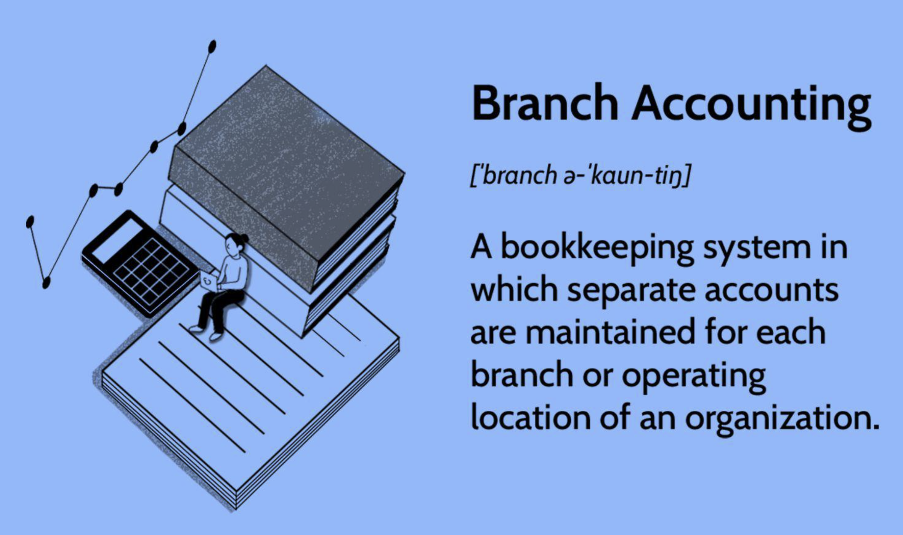

## Table of Contents

## What is branch accounting?

Branch accounting is a system used by companies to keep track of the financial activities of their different branches or locations. It helps the main office understand how each branch is performing by recording and reporting the income, expenses, assets, and liabilities of each branch separately. This way, the company can see which branches are doing well and which ones need more support or changes.

Using branch accounting, a company can make better decisions about where to invest money or how to improve operations. For example, if one branch is making a lot of profit, the company might decide to open more branches in similar areas. On the other hand, if a branch is losing money, the company can look at the branch's accounts to find out why and fix the problems. This helps the company manage its branches more effectively and grow its business.

## Why is branch accounting important for businesses with multiple locations?

Branch accounting is really important for businesses that have more than one location. It helps them keep track of how each branch is doing financially. By looking at the accounts of each branch, the main office can see which branches are making money and which ones are not. This way, they can make smart decisions about where to spend more money or where to make changes.

For example, if one branch is doing really well, the business might decide to open more branches in similar areas. On the other hand, if a branch is losing money, the company can use the branch's accounts to figure out why and fix the problems. This helps the business run better and grow in the right way.

## What are the different types of branch accounting systems?

There are mainly two types of branch accounting systems: dependent branch accounting and independent branch accounting. Dependent branch accounting is used when a branch does not keep its own full set of [books](/wiki/algo-trading-books). Instead, the head office keeps track of the branch's financial activities. The head office records all the transactions, like sales and expenses, and then adjusts the branch's account to reflect these activities. This system is simpler and is often used for smaller branches that don't need a lot of detailed accounting.

Independent branch accounting, on the other hand, is used when a branch keeps its own complete set of books. This means the branch records its own transactions, like sales, purchases, and expenses, and then sends a summary of these records to the head office. The head office then combines these summaries with its own records to get a full picture of the company's financial health. This system is more detailed and is often used for larger branches that need more control over their own financial activities.

## How do you set up a branch accounting system?

Setting up a branch accounting system starts with deciding if you want to use a dependent or independent system. For a dependent system, the head office will need to create a separate account for each branch in its own books. This involves setting up accounts for the branch's assets, liabilities, income, and expenses. The head office will then record all the branch's transactions, like sales and costs, and adjust the branch's account to keep it up to date. This system is good for smaller branches because it's simpler and the head office can easily keep track of everything.

For an independent system, each branch needs to set up its own complete set of books. This means the branch will record its own transactions, like sales, purchases, and expenses, in its own accounting system. The branch then sends a summary of these records to the head office regularly. The head office will combine these summaries with its own records to see the whole company's financial picture. This system is better for larger branches because it gives them more control over their own finances and allows for more detailed reporting.

## What are the key components of branch accounting?

The key components of branch accounting include the recording of branch transactions, maintaining separate branch accounts, and regular reporting to the head office. For a dependent branch accounting system, the head office keeps track of the branch's financial activities by recording all transactions in its own books. This includes recording the branch's sales, expenses, assets, and liabilities. The head office then adjusts the branch's account to reflect these activities, ensuring that the branch's financial performance is accurately represented.

In an independent branch accounting system, the branch itself records its own transactions in a complete set of books. This means the branch keeps track of its own sales, purchases, and expenses, and then sends a summary of these records to the head office. The head office uses these summaries to combine with its own records, providing a full picture of the company's financial health. Both systems require careful tracking and reporting to ensure that the company can make informed decisions about its branches.

## How does branch accounting differ from standard accounting practices?

Branch accounting is a way of keeping track of the money stuff for different parts of a big company, like different stores or offices. It's different from standard accounting because it focuses on each branch separately, instead of looking at the whole company all at once. In branch accounting, the head office or each branch keeps their own records of things like sales, costs, and what they own or owe. This helps the company see how each branch is doing on its own, so they can make better choices about where to spend money or fix problems.

Standard accounting, on the other hand, looks at the whole company's money situation all together. It doesn't break things down by branch but looks at the total sales, expenses, and assets of the entire business. This is good for understanding the overall health of the company but doesn't give detailed info about how each branch is doing. So, branch accounting is more detailed for each part of the company, while standard accounting gives a big picture view of the whole business.

## What are the common challenges faced in implementing branch accounting?

One of the main challenges in setting up branch accounting is making sure that all the branches follow the same rules and ways of recording their money stuff. If each branch does things differently, it can be hard for the head office to put all the information together and understand how the whole company is doing. This can lead to mistakes and make it tough to make good decisions about the business.

Another challenge is keeping everything up to date and correct. When you have lots of branches, it can be a big job to make sure all the numbers are right and that the head office gets the information on time. If something goes wrong or if the information is late, it can mess up the company's plans and make it hard to see if the branches are doing well or not.

Also, choosing between a dependent or an independent branch accounting system can be tricky. A dependent system is simpler but might not give enough detail for bigger branches. An independent system gives more control and detail, but it can be harder to manage and might need more training for the people working at the branches. Finding the right balance can be a big challenge for companies.

## How can branch accounting improve financial management across multiple branches?

Branch accounting helps companies manage their money better across different branches by keeping track of each branch's financial activities separately. This way, the head office can see exactly how much money each branch is making or losing. If a branch is doing really well, the company might decide to open more branches in similar areas. On the other hand, if a branch is struggling, the company can look at the branch's accounts to find out why and fix the problems. This helps the company use its money more wisely and make smart decisions about where to invest.

Having a good branch accounting system also makes it easier to spot trends and patterns in each branch's performance. The head office can compare the branches to see which ones are doing better and why. This can help them figure out what works and what doesn't, so they can share successful strategies with other branches. By keeping a close eye on each branch's finances, the company can make sure all its branches are working well together and help the whole business grow stronger.

## What are the best practices for maintaining accurate branch accounting records?

To keep branch accounting records accurate, it's important for all branches to follow the same rules and ways of recording their money stuff. This means using the same accounting methods and software across all branches. It helps the head office put all the information together easily and see how the whole company is doing. Training the people at each branch on how to do the accounting right is also key. They need to know how to record sales, expenses, and other financial activities correctly. Regular checks and reviews can help catch any mistakes early and keep the records clean.

Another good practice is to make sure that the records are updated and shared with the head office on time. This means setting up a schedule for when the branches should send their financial reports. Using technology, like cloud-based accounting systems, can make it easier to share and update information quickly. It's also helpful to have someone at the head office who is in charge of looking over the branch reports and making sure everything adds up. By keeping everything organized and on track, the company can trust that its branch accounting records are accurate and useful for making decisions.

## How do you integrate branch accounting with overall corporate accounting?

Integrating branch accounting with overall corporate accounting means making sure the financial information from all the branches fits together with the company's total financial picture. The head office needs to take the records from each branch, whether they are from a dependent or independent system, and combine them with its own records. This way, the company can see how each branch is doing and how the whole business is performing. It's important to use the same accounting methods and software across all branches to make sure the numbers match up and everything is recorded the same way.

To do this well, the head office should set up a system where branches send their financial reports regularly. This could be monthly or quarterly, depending on what works best for the company. The head office then reviews these reports, checks for any mistakes, and adds them to the company's overall accounts. By keeping everything organized and making sure the branch and corporate records are in sync, the company can make better decisions and manage its money more effectively across all its locations.

## What role does technology play in modern branch accounting systems?

Technology plays a big role in making branch accounting easier and more accurate. With modern accounting software, branches can keep track of their money stuff in real-time. This means the head office can see what's happening at each branch right away, without waiting for reports to come in. The software also helps make sure everyone is using the same rules and ways of recording their numbers, which makes it easier to put all the information together and see how the whole company is doing.

Using technology like cloud-based systems means that branches can share their financial information with the head office quickly and safely. This helps the company keep everything up to date and catch any mistakes early. Plus, technology can automate a lot of the boring parts of accounting, like adding up numbers or making reports, so the people at the branches and the head office can spend more time looking at the numbers and making smart decisions about the business.

## How can advanced analytics be used to enhance decision-making in branch accounting?

Advanced analytics can really help companies make better decisions about their branches by looking at the numbers in new ways. By using special tools, companies can find patterns and trends in the financial data from each branch. For example, they can see which branches are doing well and why, or spot problems early before they get too big. This helps the head office decide where to put more money or which branches need help to do better.

Using advanced analytics also means companies can predict what might happen next. They can use the data to guess how much money a branch might make in the future or what could go wrong. This way, they can plan ahead and make choices that will help the whole business grow. By understanding the numbers better, the company can make smarter decisions about opening new branches, closing old ones, or changing how they do things to make more money.

## References & Further Reading

[1]: ["Branch Accounting"](https://www.investopedia.com/terms/b/branch-accounting.asp) on Investopedia.

[2]: ["Understanding Cash vs. Accrual Accounting"](https://www.forbes.com/advisor/business/cash-vs-accrual-accounting/) by the U.S. Small Business Administration.

[3]: ["High-Frequency Trading: A Practical Guide to Algorithmic Strategies and Trading Systems"](https://www.wiley.com/en-us/High+Frequency+Trading%3A+A+Practical+Guide+to+Algorithmic+Strategies+and+Trading+Systems-p-9780470579770) by Irene Aldridge.

[4]: ["Accounting for Investments, Equities, Futures and Options"](https://www.wiley.com/en-us/Accounting+for+Investments%2C+Volume+1%3A+Equities%2C+Futures+and+Options-p-9781118179611) by R. Venkata Subramani.

[5]: ["International Financial Reporting Standards"](https://www.iasplus.com/en/standards) (IFRS) maintained by the IFRS Foundation and IASB.

[6]: ["Financial Management Theory and Practice"](https://www.cengage.com/c/financial-management-theory-practice-16e-brigham-ehrhardt/9781337902601/?searchIsbn=ISBN%209781337902601) by Eugene F. Brigham and Michael C. Ehrhardt.

[7]: ["Algorithmic Trading and DMA: An introduction to direct access trading strategies"](https://archive.org/details/algorithmictradi0000john) by Barry Johnson.