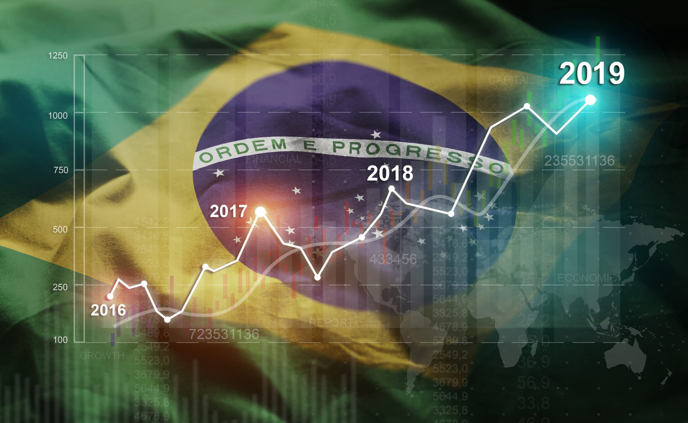

## Table of Contents

## What are Exchange-Traded Funds (ETFs)?

Exchange-Traded Funds (ETFs) are a type of investment that allows you to buy a collection of stocks, bonds, or other assets in a single purchase. They are traded on stock exchanges, just like individual stocks, which means you can buy and sell them throughout the trading day at market prices. This makes ETFs a convenient way to diversify your investments without having to buy each asset separately.

ETFs are popular because they offer a way to spread out your risk. Instead of putting all your money into one company or one type of investment, you can own a little bit of many different ones. This can help protect your money if one of the investments doesn't do well. Plus, ETFs often have lower fees than mutual funds, making them a cost-effective choice for many investors.

## How do ETFs differ from mutual funds?

ETFs and mutual funds are both ways to invest in a bunch of different things at once, but they work a bit differently. ETFs are traded on stock exchanges, just like buying and selling stocks. This means you can buy or sell them anytime during the trading day at whatever price they're going for at that moment. On the other hand, mutual funds are bought and sold at the end of the trading day, based on the total value of all the investments in the fund at that time. So, if you want to be able to trade throughout the day, ETFs might be better for you.

Another difference is how they're managed and what they cost. ETFs usually track an index, like the S&P 500, which means they try to match the performance of that index without a lot of active buying and selling. This often makes them cheaper to own because they don't need a lot of people to manage them. Mutual funds, on the other hand, are often actively managed, which means there are people making decisions about what to buy and sell to try to beat the market. This can lead to higher fees because you're paying for that management.

In summary, ETFs give you more flexibility to trade during the day and are usually cheaper, while mutual funds might be more hands-on but could come with higher costs. Both can be good choices depending on what you're looking for in an investment.

## What are Brazil Exchange-Traded Funds?

Brazil Exchange-Traded Funds, or Brazil ETFs, are a type of investment that lets you put your money into a bunch of different companies in Brazil all at once. They work just like other ETFs, which means you can buy and sell them on a stock exchange during the trading day. Brazil ETFs usually focus on Brazilian stocks, which can be a good way to invest in Brazil's economy without having to pick out individual companies yourself.

These ETFs can be a smart choice if you want to spread out your risk. Instead of putting all your money into one Brazilian company, you can own a little bit of many different ones. This can help protect your investment if one company doesn't do well. Plus, like other ETFs, Brazil ETFs often have lower fees than mutual funds, which can save you money over time.

## What types of Brazil ETFs are available to investors?

There are several types of Brazil ETFs that investors can choose from. One common type is a broad market [ETF](/wiki/etf-trading-strategies), which invests in a wide range of companies listed on the Brazilian stock exchange. These ETFs track indexes like the Bovespa Index, which represents the overall performance of the Brazilian stock market. This can be a good option if you want to get a general exposure to Brazil's economy without focusing on specific sectors.

Another type of Brazil ETF focuses on specific sectors of the Brazilian economy. For example, there are ETFs that invest only in Brazilian companies involved in energy, finance, or materials. These sector-specific ETFs can be a good choice if you have a particular interest in one part of Brazil's economy or if you think that sector will do better than others in the future.

Lastly, there are ETFs that invest in Brazilian companies of different sizes. Some focus on large-cap companies, which are big and well-established businesses, while others might focus on small-cap companies, which are smaller and might have more room to grow. Choosing between these can depend on your risk tolerance and investment goals.

## How can one invest in Brazil ETFs?

To invest in Brazil ETFs, you first need to open a brokerage account. This is like opening a bank account, but it's used for buying and selling investments like stocks and ETFs. You can choose from many online brokers, and once you've picked one, you'll need to fill out some forms and deposit money into your account. After that, you can start looking for Brazil ETFs to buy.

Once you have your brokerage account set up, you can search for Brazil ETFs using the broker's trading platform. You'll need to enter the ticker symbol for the ETF you want to buy, which you can find by doing a quick search online or on the broker's website. After you've found the right ETF, you can place an order to buy it, just like you would buy a stock. You'll need to decide how many shares you want to buy and at what price, and then the broker will execute your order. From there, you can keep an eye on how your investment is doing and make changes if you need to.

## What are the benefits of investing in Brazil ETFs?

Investing in Brazil ETFs can help you spread out your risk. Instead of putting all your money into one Brazilian company, you can own a little bit of many different ones. This can protect your investment if one company doesn't do well. Brazil ETFs also let you invest in Brazil's economy without having to pick out individual companies yourself, which can be hard if you don't know a lot about Brazilian businesses.

Another benefit is that Brazil ETFs can give you a chance to grow your money in a different way. Brazil's economy is different from the U.S. or other countries, so investing there can help balance out your overall investments. Plus, Brazil ETFs often have lower fees than mutual funds, which means you get to keep more of your money over time.

## What are the risks associated with Brazil ETFs?

Investing in Brazil ETFs can be risky because Brazil's economy can be up and down. Things like changes in government, problems with money, or big swings in what people buy and sell can affect how well Brazilian companies do. If the economy in Brazil goes down, the value of your Brazil ETF might go down too. This means you could lose money if you need to sell your ETF when the market is doing badly.

Another risk is that Brazil ETFs focus on just one country. If something bad happens in Brazil, like a natural disaster or a big political change, it can hurt all the companies in the ETF. This can be a problem if you have a lot of your money in Brazil ETFs because you're not spreading out your risk as much as you would if you invested in different countries. It's important to think about how much risk you're okay with before you put a lot of money into Brazil ETFs.

## How do Brazil ETFs track their underlying assets?

Brazil ETFs track their underlying assets by following a specific index, like the Bovespa Index, which represents the performance of the Brazilian stock market. The ETF manager buys and sells stocks to match the companies in the index as closely as possible. This means if a company's stock goes up or down in the index, the ETF will try to do the same thing, so it stays in line with the index.

Sometimes, Brazil ETFs might use a method called "sampling" to track their index. This means instead of buying every single stock in the index, the ETF manager picks a smaller group of stocks that act a lot like the whole index. This can save time and money, but it still tries to give investors a similar return to what the full index would give. Either way, the goal is to make sure the ETF's performance is as close as possible to the index it's tracking.

## What are the tax implications of investing in Brazil ETFs?

When you invest in Brazil ETFs, you need to think about taxes. If you make money from your ETF by selling it for more than you paid, you might have to pay capital gains tax. In the U.S., if you hold the ETF for more than a year, the tax rate is usually lower than if you hold it for less than a year. Also, if the ETF pays you dividends, you'll have to pay taxes on those too. The tax rate on dividends can be different depending on your income and how the ETF is set up.

Another thing to think about is that Brazil might have its own taxes on investments. If the ETF invests directly in Brazilian companies, there could be taxes in Brazil that affect the ETF's performance. These taxes might be taken out before you get your dividends or when the ETF sells stocks. It's a good idea to talk to a tax advisor to understand all the taxes you might have to pay when investing in Brazil ETFs.

## How do Brazil ETFs perform compared to other emerging market ETFs?

Brazil ETFs can be a bit up and down compared to other emerging market ETFs. Brazil's economy can go through big changes because of things like politics, money problems, or big swings in what people buy and sell. This can make Brazil ETFs more risky but also means they might grow a lot if things go well. On the other hand, other emerging market ETFs might spread out their risk more by investing in different countries, like China, India, or South Korea. This can make them a bit safer but might not give you the same big growth chances as a Brazil ETF.

When you look at how Brazil ETFs have done in the past, they can be all over the place. Some years, they might do better than other emerging market ETFs because Brazil's economy is doing well. Other years, they might do worse if Brazil's economy is struggling. It's hard to say for sure how they'll do in the future because it depends on a lot of things that can change. If you're thinking about investing in Brazil ETFs, it's a good idea to look at how they've done over time and compare them to other emerging market ETFs to see what might be the best fit for you.

## What are the key factors to consider when selecting a Brazil ETF?

When [picking](/wiki/asset-class-picking) a Brazil ETF, it's important to think about what the ETF is trying to do. Some Brazil ETFs try to follow the whole Brazilian stock market, while others focus on certain parts of the economy, like energy or finance. You need to decide if you want to spread your money across lots of different companies or if you think one part of Brazil's economy will do better than others. Also, look at how much the ETF costs to own. ETFs with lower fees can save you money over time, so it's good to compare the fees of different Brazil ETFs.

Another thing to consider is how risky you want your investment to be. Brazil ETFs can be more up and down than other ETFs because Brazil's economy can change a lot. If you don't mind taking bigger risks, a Brazil ETF might be a good choice. But if you want something safer, you might want to look at ETFs that invest in more than one country. It's also a good idea to look at how the ETF has done in the past. This can give you an idea of what to expect, but remember that past performance doesn't mean the ETF will do the same in the future.

## How can investors use Brazil ETFs for portfolio diversification?

Investors can use Brazil ETFs to spread out their money and lower their risk. Instead of putting all your money into one country or one type of investment, you can use Brazil ETFs to invest in a bunch of different companies in Brazil all at once. This means if one company or even the whole Brazilian market doesn't do well, it won't hurt your whole investment as much. By adding Brazil ETFs to your portfolio, you're not putting all your eggs in one basket, which can help protect your money.

Brazil ETFs can also help you balance out your investments. Brazil's economy is different from the U.S. or other countries, so it might do well when other places are struggling. This can be a good way to make sure your money is growing even if one part of the world is having a tough time. By including Brazil ETFs in your portfolio, you're giving yourself a chance to grow your money in a different way and spread out your risk across different parts of the world.

## References & Further Reading

[1]: Bergstra, J., Bardenet, R., Bengio, Y., & Kégl, B. (2011). ["Algorithms for Hyper-Parameter Optimization."](https://papers.nips.cc/paper/4443-algorithms-for-hyper-parameter-optimization) Advances in Neural Information Processing Systems 24.

[2]: ["Advances in Financial Machine Learning"](https://www.amazon.com/Advances-Financial-Machine-Learning-Marcos/dp/1119482089) by Marcos Lopez de Prado

[3]: ["Evidence-Based Technical Analysis: Applying the Scientific Method and Statistical Inference to Trading Signals"](https://www.amazon.com/Evidence-Based-Technical-Analysis-Scientific-Statistical/dp/0470008741) by David Aronson

[4]: ["Machine Learning for Algorithmic Trading"](https://github.com/stefan-jansen/machine-learning-for-trading) by Stefan Jansen

[5]: ["Quantitative Trading: How to Build Your Own Algorithmic Trading Business"](https://www.amazon.com/Quantitative-Trading-Build-Algorithmic-Business/dp/1119800064) by Ernest P. Chan