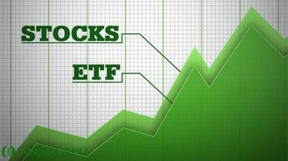

Brazil's financial market is increasingly gaining global attention due in part to its diverse economic base and significant growth potential. As the largest economy in Latin America, Brazil is rich in natural resources, has a burgeoning tech sector, and boasts a rapidly expanding financial infrastructure. Consequently, these dynamics make Brazil an appealing destination for both domestic and international investors. The Brazilian stock exchange, B3, is a key player in this landscape, facilitating robust volumes of trading and offering a wide range of investment products, including Exchange-Traded Funds (ETFs).

ETFs are investment funds traded on stock exchanges, similar to stocks. They hold assets such as stocks, commodities, or bonds and generally operate with an arbitrage mechanism designed to keep trading close to its net asset value. The popularity of ETFs among investors can be attributed to characteristics such as diversification, cost-effectiveness, and liquidity. By investing in ETFs, investors gain exposure to specific sectors or broader market indices without bearing the full risk and cost of directly managing a portfolio of individual stocks. This makes ETFs particularly attractive when considering investment in emerging markets like Brazil, where the volatility of individual equities can be high.



In recent years, algorithmic trading has emerged as a pivotal strategy within modern financial markets. It involves the use of computer algorithms to automate trading decisions, execute orders, and manage risk. The advantages of algorithmic trading are manifold: it offers precision, operates at high speeds, and removes the influence of human emotions from trading decisions. The capacity to analyze and respond to market conditions in real-time provides a significant edge, particularly in volatile markets.

The purpose of this article is to examine how the investment strategies involving Brazil ETFs can be enhanced through the application of algorithmic trading. By leveraging computational power and sophisticated algorithms, investors can optimize their ETF portfolios for better performance and risk management. The intersection of ETFs and algorithmic trading opens up opportunities for innovation, offering a strategic advantage in navigating Brazil's evolving financial ecosystem.

Combining ETFs with algorithmic trading strategies proffers several benefits. Investors can take advantage of algorithmic systems to analyze market trends and implement trades that align with their investment objectives automatically and efficiently. This synergy not only facilitates improved portfolio management but also enables the navigation of Brazil's dynamic market with enhanced precision and agility. By exploring the synergy between Brazil ETFs and algorithmic trading, investors can tap into Brazil's growing market potential while employing sophisticated tools to optimize their investment strategies.

## Table of Contents

## Understanding Brazil ETFs

Exchange-Traded Funds (ETFs) are investment funds traded on stock exchanges, much like stocks. They aim to track indices, commodities, or various asset categories, facilitating investment in a specific market without needing to pick individual securities. Brazil ETFs are designed to offer investors exposure to a wide range of Brazilian assets, reflecting the country's dynamic economic landscape.

### Definition and Role of Brazil ETFs

Brazil ETFs provide a vehicle for investment in one of the world's largest and most diverse emerging markets. These funds predominantly track indices that comprise Brazilian stocks, allowing investors to gain exposure to key sectors of the Brazilian economy. They are particularly appealing to investors seeking to diversify their portfolios and capitalize on Brazil's economic growth prospects without directly investing in individual Brazilian companies.

### Key Characteristics of Brazil ETFs

1. **Diversification**: Brazil ETFs typically consist of a basket of various Brazilian stocks or sectors, providing broad market exposure and reducing specific company risk. This diversification is critical when investing in emerging markets, where individual asset performance can be volatile.

2. **Cost-effectiveness**: Like most ETFs, Brazil ETFs are generally more cost-effective than mutual funds. They have lower expense ratios, and their passive management minimizes fees, making them attractive for cost-conscious investors.

3. **Ease of Trading**: ETFs are traded on major stock exchanges, allowing investors to buy and sell shares with the same ease as trading individual stocks. This offers liquidity and flexibility, enabling investors to quickly adjust their positions based on market conditions.

### Popular Sectors in Brazil Covered by ETFs

Given Brazil's vast natural resources and robust economic sectors, ETFs often focus on energy, agriculture, and technology. 

- **Energy**: Brazil is a leading producer of oil and biofuels, attracting energy-focused ETFs. Companies like Petrobras often feature prominently in these funds.
- **Agriculture**: As a top exporter of coffee, soybeans, and sugar, Brazil's agricultural sector is well-represented in various ETFs.
- **Technology**: With a burgeoning tech industry, Brazilian technology companies have increasingly become part of ETF portfolios, though the sector is still emerging compared to more established ones like energy and agriculture.

### Investing in Brazil ETFs as a Way to Gain Exposure to Emerging Markets

Emerging markets like Brazil present unique growth opportunities due to their expanding economies and increasing consumer bases. Brazil ETFs enable investors to tap into this growth while spreading risks across multiple sectors and securities. By investing in Brazil ETFs, investors obtain a stake in the country's economic potential, which includes growth prospects stemming from infrastructure development, urbanization, and technological advancements.

### Overview of Top Brazil ETFs and Their Market Performance

There are several Brazil-focused ETFs available, each with unique characteristics and performance metrics. Some of the most notable include:

- **iShares MSCI Brazil ETF (EWZ)**: This is one of the most popular Brazil ETFs, offering a broad representation of Brazilian equities and commonly used as a benchmark for Brazil-focused investments.

- **VanEck Vectors Brazil Small-Cap ETF (BRF)**: Focused on smaller, potentially high-growth companies, this ETF provides exposure to more volatile, less-represented segments of the Brazilian market.

- **First Trust Brazil AlphaDEX Fund (FBZ)**: This ETF uses a stock selection methodology attempting to outperform traditional market-cap-weighted indices, offering a distinct approach to Brazil investing.

The performance of these ETFs fluctuates based on various factors, including global economic conditions, commodity prices, and political developments within Brazil. Investors choosing Brazil ETFs should consider these dynamics, along with historical performance and fees, in making informed investment decisions.

 to Algorithmic Trading

Algorithmic trading, often termed as algo trading, refers to the use of computer algorithms to automatically execute trading orders at high speed and with minimal human intervention. It has revolutionized the financial markets by automating the decision-making process, thereby increasing efficiency and enabling strategies that would be impossible to execute manually. At its core, [algorithmic trading](/wiki/algorithmic-trading) relies on predefined criteria such as timing, price, quantity, or any mathematical model, to decide when and how trades should occur.

The evolution of algorithmic trading can be traced back to the early adoption of computer technology in trading floors during the late 20th century. The advent of electronic communications networks (ECNs) in the 1990s and the subsequent rise of high-frequency trading ([HFT](/wiki/high-frequency-trading-strategies)) have further propelled its growth. These advancements have allowed traders to execute large volumes of trades much quicker than a human trader, sometimes in fractions of a second. 

Technological advancements, including the development of powerful computing systems, high-speed internet, direct market access (DMA), and sophisticated algorithms, have significantly facilitated algorithmic trading. These technologies enable the efficient handling of vast amounts of data and support complex computations required for making real-time trading decisions. The use of [machine learning](/wiki/machine-learning) and [artificial intelligence](/wiki/ai-artificial-intelligence) in recent years has further refined algorithmic trading strategies, allowing algorithms to learn and adapt to ever-changing market conditions.

The advantages of algorithmic trading are considerable. Speed is a critical [factor](/wiki/factor-investing), as algorithms can process information and execute orders faster than human traders. This capability is crucial in markets where price discrepancies may exist for only milliseconds. Accuracy is another advantage, with algorithms executing trades exactly as programmed, thus eliminating human errors. Additionally, algorithmic trading removes emotional influences from trading decisions, mitigating the risks associated with human psychological biases, such as fear and greed.

Several popular algorithms are pivotal to trading strategies. Trend-following algorithms analyze historical market data to identify potential trends and initiate trades based on these patterns. Arbitrage algorithms exploit price differences of identical or similar financial instruments across different markets or in various forms. Market-making algorithms provide [liquidity](/wiki/liquidity-risk-premium) by simultaneously offering buy and sell orders, aiming to profit from the spread between these orders.

Algorithmic trading significantly impacts market dynamics and liquidity. By facilitating rapid and high-[volume](/wiki/volume-trading-strategy) trades, algorithms contribute to market efficiency, narrowing bid-ask spreads and increasing overall market liquidity. However, they can also introduce [volatility](/wiki/volatility-trading-strategies), particularly when multiple algorithms act on the same signals. Moreover, the use of algorithms may lead to flash crashes, where rapid, automated selling results in dramatic price declines.

In conclusion, algorithmic trading has become an integral part of modern financial markets, offering numerous benefits over traditional trading methods. Its continued evolution is expected as technology advances, reshaping the landscape of trading across various financial instruments.

## The Synergy Between Brazil ETFs and Algorithmic Trading

Algorithmic trading significantly enhances investment strategies involving Brazil ETFs by using mathematical models and algorithms to guide buying and selling decisions. This approach complements Brazil [ETF](/wiki/etf-trading-strategies) investments by providing precision, speed, and the ability to process vast amounts of data quickly, which are crucial in a dynamic and volatile emerging market like Brazil.

Algorithmic trading platforms and analytical tools allow investors to implement strategies that can dynamically adjust to market conditions. These tools often include [backtesting](/wiki/backtesting) features, enabling investors to test their strategies against historical data to ensure robustness and reliability. Platforms such as MetaTrader, QuantConnect, and [Interactive Brokers](/wiki/interactive-brokers-api) offer comprehensive environments where traders can code, test, and deploy their automated strategies efficiently.

One successful example of an algorithmic strategy with Brazil ETFs is the [momentum](/wiki/momentum)-based approach, which involves buying ETFs showing an upward price trend over a specified period. Such strategies typically use moving averages or the relative strength index (RSI) to define entry and [exit](/wiki/exit-strategy) points. This algorithm evaluates the most recent ETF prices relative to its historical averages, executing buy/sell orders when specific thresholds are reached.

```python
# Example: Calculating a simple moving average (SMA) in Python
import pandas as pd

def calculate_sma(prices, window):
    return prices.rolling(window=window).mean()

# Sample ETF price data
etf_prices = pd.Series([10, 11, 12, 14, 13, 13, 14, 15, 17, 19])

# Calculate 3-day SMA
sma = calculate_sma(etf_prices, 3)
print(sma)
```

Despite the advantages, several risks must be considered when integrating algorithms with ETF investments. Market volatility in emerging markets like Brazil can pose significant risks, as algorithms might react excessively to sudden price movements, leading to suboptimal trading decisions. Additionally, errors in algorithm design, incorrect market assumptions, or failure to adjust strategies to changing market conditions can result in losses.

Investors can leverage algorithmic trading to optimize their ETF portfolios by utilizing diversification strategies. Algorithms can be programmed to assess risk and allocate assets across various sectors, like energy, agriculture, and technology, which are prominent in Brazilian ETFs. They can also continuously analyze market data to rebalance portfolios in response to market shifts, thereby optimizing returns.

In conclusion, algorithmic trading offers a powerful tool for investors in Brazil ETFs, providing enhanced precision, speed, and adaptability, while acknowledging potential risks and the need for robust strategies. By leveraging this technology, investors can significantly optimize their ETF portfolios, ensuring they are well-positioned to capitalize on Brazil's emerging market opportunities.

## Challenges and Considerations

Trading Brazil Exchange-Traded Funds (ETFs) using algorithmic strategies presents a range of challenges and considerations that investors must navigate. One of the primary concerns is regulatory considerations and compliance issues within Brazil's financial market. The regulatory environment in Brazil is overseen by the Comissão de Valores Mobiliários (CVM), which sets stringent guidelines and frameworks that market participants must adhere to. It is crucial for algorithmic traders to ensure compliance with these regulations to avoid legal repercussions. This includes understanding the nuances of local trading laws and staying updated with any changes in regulatory policies that could impact algorithmic trading activities.

Technological infrastructure and access to real-time data are also pivotal considerations. High-frequency trading algorithms, for instance, require robust technology infrastructure capable of handling large volumes of data with minimal latency. Inadequate infrastructure can lead to delayed data processing, which can adversely affect the execution of trades. Access to real-time market data is essential for making informed trading decisions, and any lapses can result in missed opportunities or suboptimal trade executions. Companies must invest in state-of-the-art technology and ensure uninterrupted access to market data to maintain competitive advantage.

Managing risks and volatility is another major challenge when employing algorithmic trading strategies with Brazil ETFs. The Brazilian market, characterized by its emerging status, can exhibit higher volatility compared to more developed markets. Algorithms must be meticulously designed to manage this volatility and mitigate risks associated with sudden market swings. Techniques such as robust backtesting, diversification, and dynamic stop-loss settings can be used to handle volatility. 

Looking ahead, future trends in Brazil's ETF and algorithmic trading landscape are likely to be influenced by technological advancements and evolving regulatory frameworks. With continuous improvements in machine learning and artificial intelligence, algorithmic strategies are expected to become more sophisticated, potentially leading to more precise and profitable trading decisions. Additionally, as the Brazilian financial market grows, more international players may become interested, possibly leading to increased competition and innovation in both ETFs and algorithm-driven trade methodologies.

Overall, traders employing algorithms for Brazil ETFs must consider a spectrum of factors — from regulatory compliance and technological preparedness to risk management. Remaining informed about both the opportunities and challenges will be essential for maximizing successful outcomes in this dynamic landscape.

## Conclusion

Combining Brazil ETFs with algorithmic trading presents a strategic advantage for investors seeking to optimize their investment returns. Brazil ETFs provide a diversified, cost-effective, and easily tradable option to gain exposure to Brazil's dynamic financial market. By integrating algorithmic trading strategies, investors can leverage the advantages of speed, precision, and emotion-free decision-making to enhance their ETF investment strategies. Algorithmic trading allows for the rapid execution of trades based on pre-defined criteria, which is particularly beneficial in a volatile market environment like that of Brazil.

Investors are encouraged to consider Brazil's growing financial market through ETFs as it continues to develop and present numerous opportunities. With sectors such as energy, agriculture, and technology experiencing growth, Brazil ETFs offer a window into these emerging markets. The application of algorithmic trading provides a technological edge, making it crucial for investors to adapt and utilize advanced trading techniques to stay competitive.

Looking to the future, the synergy between Brazil ETFs and algorithmic trading will likely increase as technological advancements continue to evolve, bringing more sophisticated tools and platforms to the market. This evolution will not only improve the efficiency of trading but also enhance the ability to manage risks associated with market volatility and regulatory changes.

Investors should actively explore the potential of Brazil ETFs through the application of algorithmic trading. By doing so, they position themselves to capitalize on the growth trajectory of Brazil's financial markets. Embracing these strategies allows for optimized portfolios that are better aligned with market movements and investor goals. As the financial landscape shifts, the integration of technology and innovative investment methods will be key to achieving superior returns.

## References & Further Reading

[1]: Bergstra, J., Bardenet, R., Bengio, Y., & Kégl, B. (2011). ["Algorithms for Hyper-Parameter Optimization."](https://papers.nips.cc/paper/4443-algorithms-for-hyper-parameter-optimization) Advances in Neural Information Processing Systems 24.

[2]: ["Advances in Financial Machine Learning"](https://www.amazon.com/Advances-Financial-Machine-Learning-Marcos/dp/1119482089) by Marcos Lopez de Prado

[3]: ["Evidence-Based Technical Analysis: Applying the Scientific Method and Statistical Inference to Trading Signals"](https://www.amazon.com/Evidence-Based-Technical-Analysis-Scientific-Statistical/dp/0470008741) by David Aronson

[4]: ["Machine Learning for Algorithmic Trading"](https://github.com/stefan-jansen/machine-learning-for-trading) by Stefan Jansen

[5]: ["Quantitative Trading: How to Build Your Own Algorithmic Trading Business"](https://www.amazon.com/Quantitative-Trading-Build-Algorithmic-Business/dp/1119800064) by Ernest P. Chan