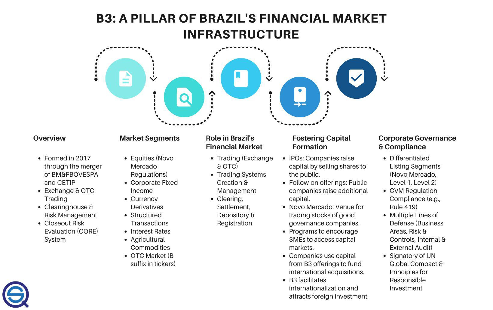

BM&F Bovespa, established through the merger of the São Paulo Stock Exchange (Bovespa) and the Brazilian Mercantile & Futures Exchange (BM&F) in 2008, stands as a key financial hub in Latin America. It plays a crucial role in the development and integration of financial markets in the region, offering a diverse array of products and services that cater to both local and international investors.

The exchange is central to the futures trading landscape in Brazil, providing a platform for trading a wide range of derivative instruments. Futures contracts, which are agreements to buy or sell an asset at a predetermined future date and price, are essential tools for both hedging and speculation. By facilitating these transactions, BM&F Bovespa enhances liquidity and enables price discovery in various asset classes including commodities, currencies, and financial indices.

In recent years, algorithmic trading has become increasingly significant on BM&F Bovespa. This method uses computer programs to execute trades based on predefined criteria at speeds and frequencies that human traders cannot match. The integration of algorithmic strategies offers numerous advantages: increased trading speed, reduced transaction costs, and improved market efficiency. The technological sophistication of BM&F Bovespa's infrastructure supports the use of such strategies, underscoring the exchange's commitment to innovation.

For investors, BM&F Bovespa is not just a platform for trading; it represents an opportunity to access one of the fastest-growing markets in the world. Its importance extends beyond the Brazilian borders, attracting international investors seeking exposure to Latin America's dynamic economies. The exchange's reputation for regulatory rigor and investor protection further amplifies its appeal, ensuring a secure trading environment.

This introduction sets the scene for a comprehensive exploration of the wide array of products and services provided by BM&F Bovespa. Understanding the exchange's intricate structure and the pivotal role of algorithmic trading in today's fast-paced financial markets highlights the ongoing evolution and potential of this essential institution. The subsequent sections will provide a detailed examination of these facets, illustrating why BM&F Bovespa is a cornerstone of financial activity in Latin America.

## Table of Contents

## History and Evolution of BM&F Bovespa

BM&F Bovespa's origins trace back to 1985 when it was established as the Brazilian Mercantile & Futures Exchange (BM&F) by key members associated with the Bovespa stock exchange. The intention was to cater to the growing demand for a structured futures market in Brazil, facilitating the trading of products like derivatives and commodities. This embryonic step set the foundation for what would eventually become a significant player in the global financial ecosystem. 

In 2008, a pivotal moment arrived with the merger between BM&F and Bovespa Holding, creating BM&F Bovespa. This merger was instrumental in consolidating the capabilities of both entities into a unified structure, forming one of the world’s largest and most diverse exchanges. The integration not only enhanced the market reach but also streamlined operations, providing a single platform for a plethora of financial instruments. This merger solidified BM&F Bovespa's role as a central financial exchange in Latin America.

Key milestones in the evolution of BM&F Bovespa include its transition to a for-profit status. In 2007, the exchange went public, listing its shares on its own platform under the ticker BVMF3. This move was indicative of a broader strategy adopted by many exchanges globally during that period, aiming to enhance corporate governance and attract broader investor participation. The public listing facilitated access to capital markets, enhancing the exchange's ability to invest in technology and other expansion initiatives.

Strategic partnerships have been a cornerstone of BM&F Bovespa's growth strategy. A notable alliance was formed with CME Group, a leader in derivatives marketplaces, which was critical in expanding the exchange's technological capacity and global reach. This partnership allowed mutual access to each other's products, broadening the array of instruments available to investors and traders on both platforms.

BM&F Bovespa has consistently championed innovation and international collaboration as part of its strategic direction. The exchange has been at the forefront of adopting cutting-edge technologies, enhancing the trading experience with initiatives such as the implementation of advanced trading systems and infrastructure. These innovations have been pivotal in improving efficiency and [liquidity](/wiki/liquidity-risk-premium), thereby attracting a more diverse set of market participants.

In summary, the history and evolution of BM&F Bovespa highlight a trajectory marked by strategic mergers, public listing, and a keen focus on partnerships and technological advancements. These developments have reinforced its position as a leading financial hub in Latin America, embodying a commitment to innovation and global integration.

## Structure and Business Model

BM&F Bovespa has long been recognized for its robust dual approach to trading, encompassing both open outcry and electronic methods. Open outcry, a traditional form of trading where dealers and traders vociferously negotiate prices in person, was historically the backbone of the exchange. However, as technological advancements accelerated, BM&F Bovespa also adopted electronic trading platforms. This dual system allowed the exchange to cater to a wide range of market participants, preserving the human element of open outcry while embracing the efficiency of digital platforms.

The exchange's clearing infrastructure is fortified by three specialized clearinghouses designed to manage and settle various categories of financial transactions. These are:

1. **The Equities Clearinghouse (CBLC)**: Handling stocks and equity derivatives, this clearing unit ensures the seamless settlement of trades, offering market participants reduced counterparty risk.

2. **The Derivatives Clearinghouse**: Primarily responsible for processing futures, options, and other derivative products, this clearinghouse plays a pivotal role in maintaining the integrity and smooth operation of Brazil's derivative markets.

3. **The Foreign Exchange Clearinghouse**: This unit clears and settles currency-related transactions, helping to stabilize and standardize procedures in a volatile market segment.

The progress from open outcry to screen-based trading marked a significant transition at BM&F Bovespa. This shift was bolstered by the development and expansion of the Global Trading System (GTS), which provided a state-of-the-art platform for executing trades electronically. The GTS enhanced speed and accessibility, offering market participants a more efficient means of trading diverse financial instruments.

Technological advances have been critical in facilitating electronic trading since the early 2000s. For example, the exchange implemented sophisticated matching engines capable of processing thousands of transactions per second. These systems employ algorithms to ensure optimal trade execution and fair pricing, thereby enhancing market liquidity and reducing transaction costs for traders.

The efficiencies embedded in BM&F Bovespa's structure provide several strategic advantages. The integration of advanced technology reduces latency, enabling faster trading and minimizing slippage. Furthermore, the diverse clearinghouse architecture enhances risk management, ensuring that every trade is settled accurately and promptly. These features collectively position BM&F Bovespa as a competitive and innovative force within global financial markets.

## Products and Services

The BM&F Bovespa exchange, now part of B3 following its 2017 merger with Cetip, offers a diverse range of financial products catering to a broad spectrum of market participants. Key among these offerings are futures, options, and swaps that allow participants to engage in risk management, speculation, and investment across various asset classes.

**Futures Contracts:** 

BM&F Bovespa offers extensive futures contracts, vital tools for investors looking to hedge risks or speculate on future price movements. Among the available contracts, real-denominated [interest rate](/wiki/interest-rate-trading-strategies) futures stand out as a dominant segment due to their crucial role in the Brazilian financial market. These contracts allow participants to hedge interest rate fluctuations in the country's currency, the Brazilian Real (BRL).

Commodity futures are another critical component, with soybeans, coffee, and sugar as notable examples. Brazil's global standing as a leading producer in these sectors makes these futures contracts particularly significant for both local and international traders looking to gain exposure to these markets.

**Options Contracts:**

The exchange provides options across various asset classes, including equity indices, individual stocks, and currencies. Options contracts give traders the right, but not the obligation, to buy or sell an underlying asset at a predetermined price, providing a versatile tool for implementing speculative or hedging strategies.

**Currency and Equity Index Futures:**

BM&F Bovespa facilitates trading in currency futures, allowing market participants to hedge against foreign exchange risks or take speculative positions on currency movements. Popular contracts include those involving the Brazilian Real against major global currencies. Equity index futures, such as those based on the Bovespa Index (Ibovespa), offer exposure to the performance of the overall Brazilian stock market, allowing participants to speculate on or hedge against market movements.

**Swaps:**

Swaps are derivatives that involve the exchange of cash flows between parties, usually to manage exposure to fluctuations in interest rates or currencies. Within BM&F Bovespa, swaps are an efficient mechanism for participants to tailor their exposure to certain risk factors according to their financial goals.

**Clearing and Settlement Services:**

Furthermore, BM&F Bovespa provides value-added services in clearing and settlement, ensuring the smooth functioning of transactions across its markets. These services include robust risk management procedures, netting systems to reduce transaction [volume](/wiki/volume-trading-strategy), and custody services, thereby enhancing the operational efficiency and security of the marketplace. The integration of these services underpins the confidence investors have in the exchange, mitigating counterparty risk and increasing liquidity.

Overall, BM&F Bovespa's comprehensive suite of products and services plays a crucial role in facilitating efficient financial market operations, providing liquidity, risk management tools, and investment opportunities, which are essential for both domestic and international market participants.

## Algorithmic Trading on BM&F Bovespa

Algorithmic trading has become a significant component of BM&F Bovespa, driven by advancements in technology and the quest for more efficient trading strategies. The adoption of [algorithmic trading](/wiki/algorithmic-trading) within this exchange is mirrored in many global markets, where speed and automation are key competitive factors.

**Benefits of Algorithmic Trading**

Algorithmic trading offers numerous advantages, primarily centered around speed, precision, and execution efficiency. Algorithms can process market data and execute trades much faster than human traders, taking advantage of even the smallest price discrepancies. This speed is crucial in volatile markets, where rapid decision-making can mean the difference between profit and loss. Additionally, algorithmic trading eliminates human error, reduces the impact of emotion in trading decisions, and enables the [backtesting](/wiki/backtesting) of strategies using historical data.

**Technological Infrastructure**

BM&F Bovespa has invested heavily in its technological infrastructure to support advanced trading strategies. The platform accommodates high-frequency trading ([HFT](/wiki/high-frequency-trading-strategies)) and provides low latency connectivity options to ensure that trades are executed in real-time. The exchange utilizes sophisticated hardware and software solutions, such as co-location services, where traders' servers are placed close to the exchange’s servers to minimize latency. This technical setup is crucial for executing complex algorithmic strategies that require swift transactions across multiple financial instruments.

**Risk Management and Regulatory Considerations**

Operating in Brazil, algorithmic trading on BM&F Bovespa is subject to specific regulatory frameworks that ensure market stability and protect investors. The Brazilian Securities Commission (CVM) regulates these activities, requiring algorithms to be fully tested and compliant with market rules before deployment. Effective risk management measures are vital, as algorithms must cope with rapid market changes and ensure that risk profiles are aligned with traders' objectives.

**Case Studies of Successful Strategies**

While specific proprietary strategies are often closely guarded, certain case studies highlight the potential for success in algorithmic trading at BM&F Bovespa. For instance, statistical [arbitrage](/wiki/arbitrage) strategies that exploit pricing inefficiencies across correlated asset classes have been successful. These strategies involve creating mathematical models to identify pairs or groups of securities where the historical price relationship deviates from its norm, implying a trading opportunity. Traders can then employ algorithms to execute these trades simultaneously, gaining from the temporary mispricing.

Another example is [momentum](/wiki/momentum) trading, where algorithms identify and capitalize on securities that have shown strong upward or downward trends. These algorithms are designed to detect price movements and initiate trades before a trend reverses, optimizing both entry and [exit](/wiki/exit-strategy) points.

In summary, algorithmic trading on BM&F Bovespa harnesses speed and advanced technology to enhance trading efficiency, though it requires stringent risk management and regulatory compliance to ensure market integrity. As technology continues to evolve, algorithmic trading strategies are expected to become even more sophisticated and integrated into BM&F Bovespa’s operations.

## Benefits and Risks of Trading at BM&F Bovespa

The BM&F Bovespa serves as a vital hub for futures trading, offering notable advantages in hedging and speculation. Futures contracts, a primary product on the exchange, enable investors to hedge against price [volatility](/wiki/volatility-trading-strategies) by locking in prices for future transactions. This function is crucial for industries reliant on commodities such as soybeans, coffee, and sugar, shielding them from unfavorable market shifts. Simultaneously, speculators capitalize on price movements by taking positions aligned with anticipated market trends.

Algorithmic trading has transformed how transactions are executed at BM&F Bovespa, providing increased speed and consistency. Algorithms analyze vast datasets to identify trading opportunities, leveraging criteria like price movements and market signals. This approach reduces human error and enhances execution efficiency, crucial in a market where milliseconds can determine profitability.

The trading environment at BM&F Bovespa is stringently regulated, enhancing investor confidence. Regulatory bodies enforce comprehensive frameworks that govern trading activities, ensuring transparency and protecting market participants from fraudulent practices. This oversight fosters a secure trading ecosystem, appealing to both local and international investors.

However, trading at BM&F Bovespa is not without risks. High volatility is a significant concern, often exacerbated by Brazil's intricate political and economic climate. Factors such as domestic policy shifts, inflationary pressures, and geopolitical events can lead to rapid market fluctuations, impacting asset valuations and investment strategies.

To mitigate these risks, traders can adopt various strategies. Diversification of investment portfolios helps spread risk across different asset classes and instruments, reducing the impact of adverse market movements. Utilizing stop-loss orders is another effective technique, automatically selling assets when they reach predetermined price levels to curb potential losses. Additionally, staying informed on regulatory changes and market trends is crucial for adapting strategies to evolving conditions.

In conclusion, BM&F Bovespa offers a platform rich with potential for traders seeking to hedge and speculate within a regulated environment. While there are inherent risks, strategic approaches can help optimize returns and safeguard investments.

## Conclusion

BM&F Bovespa stands as a cornerstone in the Latin American financial framework, offering participants a robust platform for trading and risk management. This exchange plays a significant role in facilitating market liquidity, ensuring efficient price discovery, and fostering investor confidence in the regional economic landscape. Its broad range of products, including derivative instruments like futures and options, provides investors with versatile tools for both speculative and hedging strategies.

Algorithmic trading has emerged as a transformative force within BM&F Bovespa, enhancing trade execution through speed and efficiency. By utilizing advanced algorithms, traders can rapidly respond to market conditions, potentially increasing profitability and minimizing human error. This development points to a broader trend where technology plays an integral part in modern trading strategies. Investors interested in diversifying their portfolio strategies should consider incorporating algorithmic trading, leveraging its analytical capabilities to make informed decisions.

Investors are encouraged to explore the plethora of opportunities presented by BM&F Bovespa, covering various asset classes including equities, commodities, and currencies. The exchange's infrastructure supports diverse trading needs, and its strategic partnerships with global financial entities further enrich the scope of potential market interactions. Remaining informed about regulatory developments and market trends is crucial, as these factors significantly influence trading conditions and potential returns.

BM&F Bovespa's ongoing commitments to innovation and collaboration suggest continued growth and advancement in trading technologies and practices. As the exchange evolves, it will likely keep playing a vital role in not only the regional but also the global financial markets. Staying attuned to these developments can provide substantial benefits to investors seeking to capitalize on the dynamic and evolving landscape offered by BM&F Bovespa.

## References & Further Reading

[1]: Eduardo, D., & Valls Pereira, P. (2004). ["Brazilian Derivatives: An Overview"](https://www.semanticscholar.org/paper/Testing-Convergence-Across-Municipalities-in-Brazil-Andrade-Madalozzo/e72efed421d9ec1e6332d9e3213fe11f7bb296b5). SSRN Electronic Journal.

[2]: Mallqui, D. C., & Fernandes, R. A. S. (2019). ["Predicting the direction, maximum, minimum and closing prices of daily Bitcoin exchange rate using machine learning techniques"](https://www.sciencedirect.com/science/article/pii/S1568494618306707). Applied Soft Computing, 75, 596-606.

[3]: BM&F Bovespa. ["B3 - Product Specifications."](https://en.wikipedia.org/wiki/B3_(stock_exchange)) Official Website of BM&F Bovespa.

[4]: Lopez de Prado, M. (2018). ["Advances in Financial Machine Learning"](https://www.amazon.com/Advances-Financial-Machine-Learning-Marcos/dp/1119482089). Wiley.

[5]: Chan, E. (2009). ["Quantitative Trading: How to Build Your Own Algorithmic Trading Business"](https://github.com/ftvision/quant_trading_echan_book). Wiley Trading.

[6]: Chaboud, A., Chiquoine, B., Hjalmarsson, E., & Vega, C. (2014). ["Rise of the Machines: Algorithmic Trading in the Foreign Exchange Market"](https://papers.ssrn.com/sol3/papers.cfm?abstract_id=1501135). Journal of Finance, 69(5), 2045-2084. 

[7]: Securities and Exchange Commission of Brazil (CVM). ["Regulatory Structure and Compliance."](https://www.gov.br/cvm/en/about/brazilian-financial-sector-regulatory-structure) CVM Official Website.