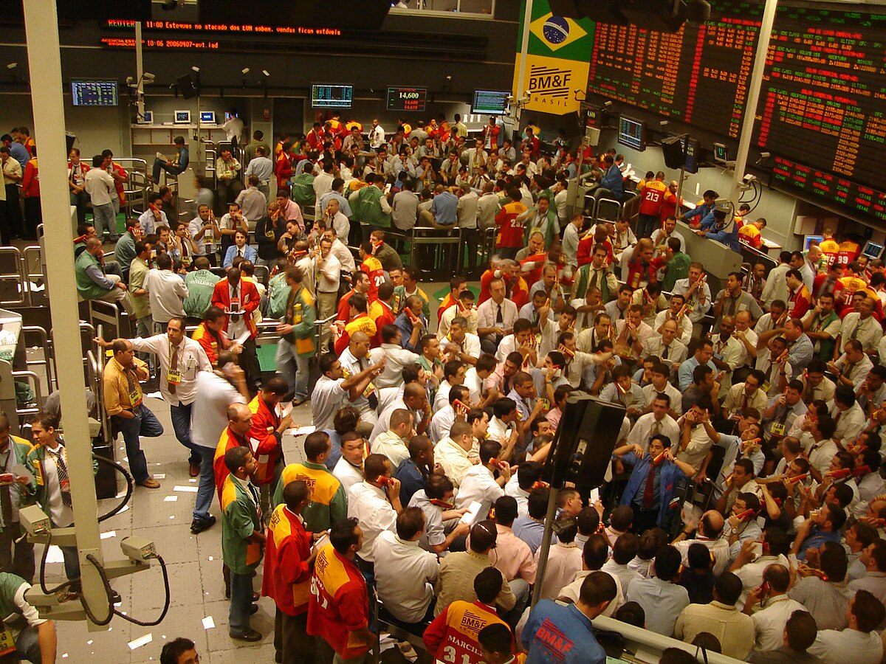

## Table of Contents

## What is the Brazilian Mercantile and Futures Exchange (BM&F)?

The Brazilian Mercantile and Futures Exchange, known as BM&F, is a place where people buy and sell different types of financial products in Brazil. It started in 1985 and became very important for trading things like futures contracts, which are agreements to buy or sell something at a future date. These contracts can be for things like coffee, soybeans, or even financial instruments like interest rates.

BM&F merged with Bovespa in 2008 to form BM&F Bovespa, which later became B3. This merger made it easier for people to trade both stocks and futures in one place. Today, B3 is the main exchange in Brazil, helping the country's economy by providing a safe and organized way for people to trade different financial products.

## When was the BM&F founded and what was its original purpose?

The BM&F was founded on January 31, 1985. Its original purpose was to provide a place where people could trade futures contracts in Brazil. Futures contracts are agreements to buy or sell something at a future date, and they can be for things like agricultural products or financial instruments.

At the time, Brazil needed a more organized way to trade these kinds of contracts. The BM&F helped make trading safer and more efficient. It played a big role in helping Brazil's economy by giving people a reliable place to do their trading.

## How does the BM&F operate within Brazil's financial market?

The BM&F, now part of B3 after merging with Bovespa, operates as a key player in Brazil's financial market. It provides a platform where people can trade futures contracts, which are agreements to buy or sell things at a future date. These contracts can be for agricultural products like coffee and soybeans, or for financial instruments like interest rates. By offering a safe and organized place for these trades, BM&F helps the Brazilian economy by making trading more efficient and reliable.

Before the merger, BM&F focused mainly on futures trading, but now as part of B3, it also supports stock trading. This combination makes it easier for traders to handle different types of financial products in one place. B3, including the operations of the former BM&F, helps in setting prices, managing risks, and providing [liquidity](/wiki/liquidity-risk-premium) to the market. This is important for the overall health and stability of Brazil's financial system.

## What types of financial instruments are traded on the BM&F?

The BM&F, now part of B3, trades many types of financial instruments. You can find futures contracts on things like agricultural products such as coffee, soybeans, and sugar. These contracts help farmers and businesses plan for the future by agreeing on prices today for goods they will buy or sell later. There are also futures for livestock, like cattle, which are important for the meat industry.

Besides agricultural products, the BM&F also deals with financial futures. These include [interest rate](/wiki/interest-rate-trading-strategies) futures, which help people manage risks related to borrowing and lending money. Currency futures are another type, used for trading different currencies and managing risks in international trade. Additionally, there are futures on stock indices, which allow investors to bet on the overall direction of the stock market without buying individual stocks.

Overall, the BM&F helps people in Brazil trade a wide variety of financial instruments. This makes it easier for them to plan for the future, manage risks, and invest in different markets. By providing a safe and organized place for these trades, the BM&F plays a big role in keeping Brazil's financial market stable and efficient.

## How does the BM&F contribute to Brazil's economy?

The BM&F, now part of B3, plays a big role in Brazil's economy by helping people trade futures contracts. These contracts let farmers, businesses, and investors agree on prices for things like coffee, soybeans, and interest rates for future dates. This helps them plan better and manage risks. For example, a farmer can sell a futures contract to lock in a price for their crops, which helps them know how much money they will make even before they harvest.

By providing a safe and organized place for trading, the BM&F makes the financial market more stable and efficient. This is important for the whole economy because it helps set prices fairly and keeps the market running smoothly. When people can trade easily and safely, it encourages more investment and business activity, which helps grow the economy. So, the BM&F, as part of B3, is really important for making sure Brazil's financial system works well and supports the country's economic growth.

## What are the main differences between the BM&F and other global futures exchanges?

The BM&F, now part of B3, is a bit different from other global futures exchanges because it focuses a lot on Brazil's own products and needs. For example, it has a big market for futures contracts on things like coffee, soybeans, and sugar, which are really important in Brazil. Other global exchanges might focus more on different products that are important in their own countries or regions. Also, the BM&F merged with Bovespa to become B3, so it offers trading in both futures and stocks, which not all exchanges do.

Another difference is how the BM&F helps Brazil's economy. It provides a safe place for people to trade, which makes the financial market more stable and helps set fair prices. This is important for Brazil because it encourages more business and investment in the country. Other global exchanges might have different goals or ways of working that fit their own countries' needs better. So, while the BM&F has some things in common with other futures exchanges, it has its own special role in Brazil's economy.

## Can foreign investors participate in trading on the BM&F, and if so, how?

Yes, foreign investors can participate in trading on the BM&F, which is now part of B3. They need to open an account with a broker that is registered with B3 and has the ability to handle trades for foreign clients. This broker will help them buy and sell futures contracts on things like coffee, soybeans, and interest rates. The process involves filling out some paperwork to meet Brazil's rules for foreign investors, but once that's done, they can start trading.

Foreign investors can trade through electronic platforms provided by their brokers, which makes it easy to buy and sell from anywhere in the world. They can also use these platforms to keep track of their investments and see how the market is doing. By participating in the BM&F, foreign investors can take advantage of opportunities in Brazil's market and help contribute to its growth.

## What are the regulatory bodies overseeing the BM&F and their roles?

The main regulatory body that oversees the BM&F, now part of B3, is the Brazilian Securities and Exchange Commission, also known as the CVM. The CVM makes sure that everything on the exchange is fair and that people follow the rules. They check to make sure that companies and brokers are honest and that investors are protected. If someone does something wrong, the CVM can punish them to keep the market safe and trustworthy.

Another important regulator is the Central Bank of Brazil. The Central Bank looks at the bigger picture of the country's economy and makes sure that the financial system, including the BM&F, works well. They set rules about how much money banks can lend and how interest rates work, which can affect the futures contracts traded on the BM&F. By doing this, they help keep the economy stable and make sure that the BM&F can operate smoothly.

## How has the BM&F evolved in response to global financial trends and technology?

The BM&F has changed a lot over the years to keep up with what's happening around the world and with new technology. One big change was merging with Bovespa in 2008 to become B3. This merger helped the BM&F to offer more types of trading, like stocks, which made it easier for people to use the exchange for different needs. Also, the BM&F started using electronic trading platforms, which let people buy and sell things quickly from anywhere in the world. This made trading faster and more convenient, especially for foreign investors who want to trade in Brazil's market.

Another way the BM&F has evolved is by adding new products that match what people want to trade today. For example, they started offering futures on things like renewable energy and environmental products, which are important because more people care about these issues. The BM&F also uses better technology to make sure trading is safe and fair. They use computer systems to watch for any problems and to make sure everyone follows the rules. This helps keep the market stable and trustworthy, which is good for Brazil's economy.

## What are some major events or crises that have impacted the BM&F?

The BM&F, now part of B3, has faced several big events and crises that have affected how it works. One major event was the global financial crisis in 2008. During this time, markets around the world were very unstable, and many people lost money. The BM&F felt this too, but it managed to keep going by merging with Bovespa to form B3. This merger helped the exchange become stronger and more able to handle tough times.

Another important event was the Brazilian economic crisis that started around 2014. Brazil's economy was struggling, and this made the BM&F's trading volumes go down. People were worried about the future, so they traded less. The BM&F worked hard to keep the market stable and to help traders feel safe. They used their technology and rules to make sure trading was fair, even during this difficult time.

## How does the BM&F manage risk and ensure market stability?

The BM&F, now part of B3, manages risk and ensures market stability by using a lot of rules and technology. They have systems that watch the market all the time to make sure everything is fair and safe. If something looks wrong, like if someone is trying to cheat or if prices are moving too fast, the BM&F can step in to fix it. They also make sure that people who trade have enough money to cover their trades, so if prices go the wrong way, they can still pay what they owe. This helps keep the market stable and stops big problems from happening.

Another way the BM&F helps manage risk is by offering different types of futures contracts. These contracts let people plan for the future and protect themselves from big changes in prices. For example, a farmer can use a futures contract to lock in a good price for their crops, even if prices go down later. This makes people feel safer about trading, which helps keep the market stable. By doing all these things, the BM&F makes sure that trading in Brazil is as safe and stable as possible.

## What future developments or expansions are planned for the BM&F?

The BM&F, now part of B3, is always looking for ways to grow and improve. They want to add new types of financial products that people can trade. For example, they might offer more futures on things like renewable energy or other environmental products, which are becoming more important as people care more about these issues. They also want to make their trading platforms even better, so people can trade more easily and quickly from anywhere in the world. This will help attract more traders, both from Brazil and other countries.

Another big focus for the BM&F is using new technology to make trading safer and more efficient. They plan to keep improving their systems that watch the market to make sure everything is fair and that no one is cheating. They also want to use technology to help people manage risks better when they trade. By doing all these things, the BM&F hopes to keep growing and to help Brazil's economy stay strong and stable.

## References & Further Reading

[1]: Eduardo, D., & Valls Pereira, P. (2004). ["Brazilian Derivatives: An Overview"](https://www.semanticscholar.org/paper/Testing-Convergence-Across-Municipalities-in-Brazil-Andrade-Madalozzo/e72efed421d9ec1e6332d9e3213fe11f7bb296b5). SSRN Electronic Journal.

[2]: Mallqui, D. C., & Fernandes, R. A. S. (2019). ["Predicting the direction, maximum, minimum and closing prices of daily Bitcoin exchange rate using machine learning techniques"](https://www.sciencedirect.com/science/article/pii/S1568494618306707). Applied Soft Computing, 75, 596-606.

[3]: BM&F Bovespa. ["B3 - Product Specifications."](https://en.wikipedia.org/wiki/B3_(stock_exchange)) Official Website of BM&F Bovespa.

[4]: Lopez de Prado, M. (2018). ["Advances in Financial Machine Learning"](https://www.amazon.com/Advances-Financial-Machine-Learning-Marcos/dp/1119482089). Wiley.

[5]: Chan, E. (2009). ["Quantitative Trading: How to Build Your Own Algorithmic Trading Business"](https://github.com/ftvision/quant_trading_echan_book). Wiley Trading.

[6]: Chaboud, A., Chiquoine, B., Hjalmarsson, E., & Vega, C. (2014). ["Rise of the Machines: Algorithmic Trading in the Foreign Exchange Market"](https://papers.ssrn.com/sol3/papers.cfm?abstract_id=1501135). Journal of Finance, 69(5), 2045-2084. 

[7]: Securities and Exchange Commission of Brazil (CVM). ["Regulatory Structure and Compliance."](https://www.gov.br/cvm/en/about/brazilian-financial-sector-regulatory-structure) CVM Official Website.