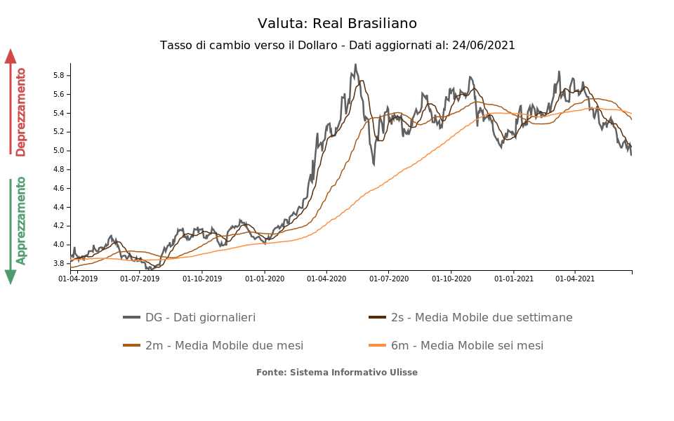

## Table of Contents

## What is the Brazilian Real and when was it introduced?

The Brazilian Real is the official currency of Brazil. It is represented by the symbol R$ and is abbreviated as BRL. The Real replaced the Brazilian Cruzeiro, which was the currency before it. 

The Brazilian Real was introduced on July 1, 1994. The government introduced it to help control inflation and make the economy more stable. Since then, the Real has been used for all transactions in Brazil, from buying food to paying bills.

## How is the Brazilian Real symbolized and abbreviated?

The Brazilian Real is symbolized by R$. This symbol is used in everyday transactions in Brazil, like when people buy things or pay bills.

The abbreviation for the Brazilian Real is BRL. This is often used in financial and international contexts, like when exchanging money or in bank statements.

## What are the different denominations of the Brazilian Real?

The Brazilian Real comes in different sizes of money. For coins, you can find 5 centavos, 10 centavos, 25 centavos, 50 centavos, and 1 Real. These coins help people pay for small things like candy or bus tickets. 

For paper money, there are bills of 2 Reais, 5 Reais, 10 Reais, 20 Reais, 50 Reais, 100 Reais, and 200 Reais. These bills are used for bigger purchases, like buying groceries or paying rent. Each type of money has its own color and pictures to help people tell them apart easily.

## How has the Brazilian Real impacted Brazil's economy since its introduction?

Since the Brazilian Real was introduced in 1994, it has helped make Brazil's economy more stable. Before the Real, Brazil had a big problem with inflation, which means prices were going up very fast. The Real helped to slow down inflation, so people could buy things without worrying that prices would jump up the next day. This made it easier for businesses to plan and for people to save money.

The Real also made it easier for Brazil to trade with other countries. Because the Real was more stable, other countries felt more comfortable doing business with Brazil. This helped Brazil's economy grow because it could sell more things to other countries and buy things it needed more easily. Overall, the Brazilian Real has been a big help in making Brazil's economy stronger and more reliable.

## What are the key factors that influence the value of the Brazilian Real?

The value of the Brazilian Real can go up or down because of many things. One big thing is how much stuff Brazil sells to other countries. If Brazil sells a lot of things like soybeans, iron ore, or oil, the Real can get stronger. But if other countries buy less from Brazil, the Real can get weaker. Another thing that matters is how much money people from other countries want to invest in Brazil. If they think Brazil's economy is doing well, they will put more money into it, which can make the Real stronger.

Another important [factor](/wiki/factor-investing) is what's happening with inflation in Brazil. If prices in Brazil are going up a lot, the Real can lose value because people might not want to keep their money in Reals. The government and the central bank also play a big role. They can change interest rates or do other things to try to make the Real stronger or weaker. Finally, things happening in the world, like big changes in the price of oil or problems in other countries, can also affect the value of the Brazilian Real.

## How does the Brazilian Real's value affect Brazil's trade and international relations?

The value of the Brazilian Real plays a big role in how much Brazil can buy and sell with other countries. When the Real is strong, it means Brazil can buy things from other countries more cheaply, but it also makes Brazilian products more expensive for other countries to buy. This can be tough for Brazil because it might sell fewer things like soybeans or iron ore. On the other hand, when the Real is weak, Brazilian products become cheaper for other countries, which can help Brazil sell more stuff. But then, it costs more for Brazil to buy things from other countries.

The value of the Real also affects how other countries see Brazil. If the Real is stable and strong, other countries might trust Brazil more and want to do business with it. This can lead to better trade deals and more investments in Brazil. But if the Real is weak and unstable, other countries might be worried about doing business with Brazil. They might think it's risky, which can make it harder for Brazil to get good trade deals or attract investors. So, the value of the Real is really important for Brazil's trade and how it gets along with other countries.

## What are the historical trends of the Brazilian Real against major world currencies?

Since it was introduced in 1994, the Brazilian Real has had many ups and downs against major world currencies like the US Dollar, the Euro, and the Japanese Yen. Right after it was introduced, the Real was pretty strong against the US Dollar. This helped Brazil's economy because it made things from other countries cheaper for Brazilians to buy. But over the years, the Real has often weakened against the Dollar. For example, in the early 2000s, the Real lost a lot of value because of economic problems in Brazil and around the world. By 2002, one US Dollar could buy about 4 Reais, which was much more than when the Real first started.

From the mid-2000s to around 2011, the Real got stronger again. This was a good time for Brazil because it was selling a lot of things to other countries, like oil and soybeans. During this time, the Real was worth more against the US Dollar, sometimes getting as low as 1.5 Reais to one Dollar. But after 2011, the Real started to weaken again. By 2015, it was back to around 4 Reais to one Dollar because of economic problems in Brazil, like high inflation and political issues. Since then, the Real has continued to go up and down but has mostly stayed weaker against the US Dollar. Against the Euro and the Yen, the Real has followed similar patterns, getting stronger and weaker at different times based on what's happening in Brazil and around the world.

## How does inflation in Brazil affect the purchasing power of the Brazilian Real?

Inflation in Brazil means that the prices of things like food, clothes, and other stuff go up over time. When inflation is high, the Brazilian Real can buy less than before. For example, if a loaf of bread costs 5 Reais one year and inflation is high, the next year that same loaf might cost 6 Reais. So, even though you have the same amount of Reais, you can buy less with them. This makes it harder for people to afford the things they need because their money doesn't go as far.

The government and the central bank in Brazil try to keep inflation under control so that the Real stays strong. When inflation is low, the value of the Real stays more stable, and people can buy more with their money. But if inflation gets out of control, like it did before the Real was introduced, it can make the Real lose a lot of value quickly. This is why managing inflation is important for keeping the Brazilian Real strong and helping people keep their purchasing power.

## What are the monetary policies implemented by Brazil to manage the Brazilian Real?

Brazil uses different ways to control the value of the Brazilian Real and keep the economy stable. One way is by changing the interest rates. If the central bank of Brazil, called the Banco Central do Brasil, thinks the Real is getting too weak, it might raise the interest rates. This makes it more expensive to borrow money, which can slow down spending and help control inflation. On the other hand, if the Real is too strong, the central bank might lower the interest rates to make borrowing cheaper, which can help the economy grow faster.

Another way Brazil manages the Real is by buying and selling foreign money, like the US Dollar. If the Real is getting too weak, the central bank might sell some of its US Dollars to make the Real stronger. If the Real is getting too strong, the central bank might buy US Dollars to make the Real weaker. This helps keep the value of the Real steady and makes it easier for Brazil to trade with other countries. These methods help Brazil keep the Real stable and control inflation, which is important for the economy.

## How can one convert Brazilian Real to other currencies and vice versa?

To convert Brazilian Real to other currencies, you can go to a bank, a money exchange place, or use an online service. If you're in Brazil, you might go to a bank or a currency exchange office and give them your Reais. They will give you back the other currency, like US Dollars or Euros, based on the exchange rate that day. The exchange rate is how much one currency is worth in terms of another currency, and it changes every day. If you're using an online service, you can do it from your computer or phone. You'll need to enter how much Real you want to convert, choose the currency you want, and then follow the steps to send the money.

To convert other currencies to Brazilian Real, you do the same thing but in reverse. If you're visiting Brazil and have US Dollars or Euros, you can go to a bank or a currency exchange place and give them your money. They will give you back Reais based on the exchange rate at that time. If you're doing it online, you'll choose the currency you have, enter the amount, and then pick Brazilian Real as the currency you want to get. The online service will then tell you how much Real you will receive and help you complete the exchange.

## What are the common exchange rate regimes used by Brazil for the Brazilian Real?

Brazil has used different ways to manage the value of the Brazilian Real over the years. One way is called a floating exchange rate. This means the value of the Real goes up and down based on what people think it's worth. The central bank of Brazil can step in to buy or sell other currencies, like the US Dollar, to help keep the Real stable, but mostly it lets the market decide.

Another way Brazil has managed the Real is through a managed float. This is kind of like a floating exchange rate, but the central bank gets more involved. They might change interest rates or buy and sell more foreign money to make sure the Real doesn't change too much too fast. This helps keep the economy stable and makes it easier for Brazil to trade with other countries.

## What are the future economic forecasts for the Brazilian Real and its impact on global markets?

Economists think the Brazilian Real will keep changing in value because of many things like how much Brazil sells to other countries, what's happening with inflation, and what the government does. If Brazil keeps selling a lot of things like soybeans and oil, the Real might get stronger. But if inflation goes up a lot or if there are problems with the economy, the Real could get weaker. The government and the central bank will keep trying to make the Real stable by changing interest rates and buying or selling other currencies.

The value of the Brazilian Real can affect global markets because Brazil is a big country that trades a lot with other countries. If the Real gets stronger, it might make Brazilian products more expensive for other countries to buy, which could change how much they trade with Brazil. On the other hand, if the Real gets weaker, Brazilian products become cheaper, which might help Brazil sell more stuff but also make it more expensive for Brazil to buy things from other countries. So, what happens with the Real can have a big impact on trade and the global economy.

## What is the Role of Algorithmic Trading?

Algorithmic trading, commonly referred to as algo trading, involves the utilization of computer programs to execute trades based on pre-defined criteria, offering considerable advantages in efficiency and speed. This method is prevalent in [forex](/wiki/forex-system) markets, where rapid trade execution and decision-making are critical. In the context of the Brazilian Real (BRL), algo trading becomes an effective tool for investors seeking to navigate the complexities of currency conversion.

The primary benefit of using algorithms in trading is the automation of trading strategies, significantly reducing human intervention and the likelihood of error. For investors handling BRL transactions, algorithms can mitigate risks by automating complex strategies. These strategies often incorporate a variety of data points and indicators to optimize trading decisions.

Factors such as moving averages, currency pair [volatility](/wiki/volatility-trading-strategies), and economic indicators play crucial roles in the construction of these algorithms. Moving averages, for instance, help in identifying trends by smoothing out price data to create a single flowing line. This can be represented by the formula for a simple moving average (SMA):

$$
\text{SMA} = \frac{\sum{P_i}}{n}
$$

where $P_i$ represents the price at a specific time, and $n$ is the number of time periods considered.

Volatility measurements are also integrated into these programs, enabling traders to evaluate the risk associated with currency fluctuations. Economic indicators such as GDP growth, inflation rates, and trade balances are inputted into algorithms to enhance decision-making processes, particularly when assessing the strength and stability of the BRL.

Algorithmic strategies specific to BRL transactions often involve automated recognition of trading patterns and execution of trades based on real-time market conditions. For example, a Python script might be used to implement an algorithm that trades the USD/BRL currency pair based on certain technical indicators:

```python
import pandas as pd

def moving_average(data, period):
    return data.rolling(window=period).mean()

data = pd.read_csv('usd_brl_data.csv')
data['SMA_50'] = moving_average(data['Close'], 50)
data['SMA_200'] = moving_average(data['Close'], 200)

# Example logic: Buy when 50-day SMA crosses above 200-day SMA
data['Signal'] = 0
data.loc[data['SMA_50'] > data['SMA_200'], 'Signal'] = 1
```

This code snippet is an example of how moving averages might inform trading decisions, with the algorithm set to indicate a buy signal when the shorter moving average crosses above the longer one.

In sum, [algorithmic trading](/wiki/algorithmic-trading) in the context of currency conversion involving the Brazilian Real offers enhanced precision, speed, and the ability to efficiently handle the dynamic market conditions of forex trading. By integrating critical financial data and leveraging technological advancements, algo trading equips investors to make more informed and timely decisions.

## References & Further Reading

[1]: Carrasco, C. A., & Ferreira, M. P. C. (1998). ["The Economics of the Brazilian Currency Crisis of 1998."](https://www.sciencedirect.com/science/article/pii/S0048969724083232) Review of International Economics, 9(1), 39-54. 

[2]: Pettinger, T. (2023). ["Brazilian Real: Overview and Recent Developments."](https://www.worldbank.org/en/country/brazil/overview) EconomicsHelp.org.

[3]: ["Advances in Financial Machine Learning"](https://www.amazon.com/Advances-Financial-Machine-Learning-Marcos/dp/1119482089) by Marcos Lopez de Prado

[4]: Grijpink, F., Lund, S., & Moritomo, K. (2019). ["Emerging-Market Economy Challenges."](https://www.sciencedirect.com/science/article/pii/S0161893822000679) McKinsey & Company. 

[5]: ["Algorithmic and High-Frequency Trading"](https://assets.cambridge.org/97811070/91146/frontmatter/9781107091146_frontmatter.pdf) by Álvaro Cartea, Sebastian Jaimungal, and José Penalva