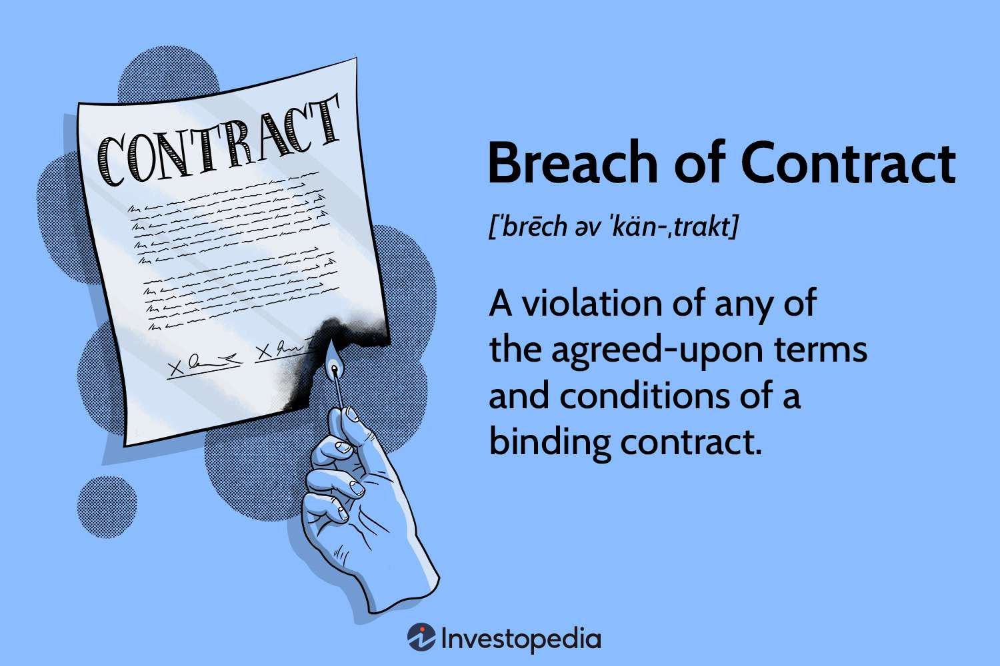

In an increasingly automated world, the intersection of technology and traditional legal frameworks is more relevant than ever. The realm of algorithmic trading, often referred to as algo trading, exemplifies this convergence, where complex contractual agreements give rise to novel legal dynamics. Algorithmic trading involves using computer programs to automate trading strategies, which facilitate rapid decision-making and execution based on predefined parameters. However, this sophistication introduces intricate legal considerations.

Algo trading contracts embody the essence of these legal complexities. They stipulate the terms governing automated trading activities executed on behalf of clients. These agreements encompass various elements, such as the responsibilities of involved parties, performance metrics, and strict adherence to regulatory standards. These contracts often include developers who design and maintain the trading algorithms, traders seeking to leverage algorithmic advantages, and platform providers facilitating the trading environment. The precise functionality and performance expectations enshrined within these contracts are vital for minimizing disputes and ensuring a smooth operational enactment.

Nevertheless, breaches in these contracts are not uncommon and stem from multiple factors. Such breaches occur when trading algorithms underperform, falling short of agreed metrics, or when unauthorized modifications to the algorithm introduce unforeseen discrepancies. Non-compliance with pertinent financial regulations, including the Securities Exchange Act, may also constitute a breach. Furthermore, failure to uphold confidentiality and data security standards, coupled with misrepresentations made during the contract formation stage regarding the algorithm’s capabilities, further complicate matters.

Addressing these breaches can lead to significant legal consequences. The defaulting party may be liable for monetary damages to compensate the non-breaching party. Courts might mandate specific performance, compelling the breaching entity to fulfill its obligations. In severe instances, contracts may be rendered void, effectively terminating the trading arrangement. Reputational damage and trust deficits often accompany these legal implications, extending beyond immediate financial ramifications. Moreover, regulatory breaches may invite sanctions and fines from financial authorities, intensifying the stakes involved.

As algorithmic trading continues to evolve and reshape global financial markets, understanding these contractual dynamics becomes imperative. Traders, developers, and legal professionals engaged in algorithmic trading must be acquainted with these intricacies to navigate the landscape effectively. This article explores how breaches occur, the ensuing legal implications, and preventive mechanisms designed to mitigate such risks. By fostering a comprehensive understanding of these concepts, stakeholders can proactively address potential issues, ensuring sustainable and profitable engagement in the increasingly automated financial world.

## Table of Contents

## Understanding Algo Trading Contracts

Algo trading contracts serve as critical legal documents that govern the conditions under which automated trading strategies are executed using algorithms. These contracts are meticulously crafted to outline the responsibilities and obligations of all parties involved, including but not limited to developers, traders, and platform providers. Each participant in the trading process relies on these contracts to clearly delineate their roles and the expectations for the performance of these trading algorithms.

A primary component of algo trading contracts is the articulation of performance metrics. These are quantitative benchmarks that the algorithm must meet or exceed to fulfill contractual obligations. Performance metrics can include parameters such as return on investment (ROI), risk-adjusted returns, and latency in trade execution. These are critical not only for evaluating the success of the trading strategy but also for ensuring the algorithm operates within the bounds set by the agreement.

Compliance with regulatory standards is another cornerstone of these contracts. Given the highly regulated nature of financial markets, algo trading programs must adhere to a plethora of regulations, including those outlined in the Securities Exchange Act or similar legislation in various jurisdictions. To mitigate the risk of non-compliance, these contracts often incorporate detailed provisions that set out the protocols for data reporting, trade verification, and risk management, ensuring that the [algorithmic trading](/wiki/algorithmic-trading) systems operate legally and ethically.

The complexity of algo trading contracts is further heightened by the specificity required for algorithm functionality. The algorithms themselves are sophisticated, often involving intricate decision-making processes driven by [machine learning](/wiki/machine-learning) models or complex financial models. Consequently, contracts must precisely define the algorithm’s function, including its trading logic, data inputs, and expected behavior under different market conditions. This precision is crucial to minimize misunderstandings or disputes between contractual parties.

Given the intricate nature of these agreements, legal expertise is indispensable. Legal professionals specializing in financial technology and algorithmic trading play a vital role in drafting these contracts. Their expertise ensures that the contracts are not only comprehensive and clear but also enforceable under the applicable legal frameworks. This includes the anticipation of potential issues such as intellectual property rights, liability for trading losses, and amendments to regulatory requirements.

Overall, algo trading contracts are foundational to the safe and effective deployment of algorithmic trading systems. They provide a structured framework for the operation of these technologies, helping to align the interests of all parties involved while simultaneously safeguarding against potential disputes and regulatory infractions.

## Common Causes of Breach in Algo Trading Contracts

Algorithmic trading, commonly referred to as algo trading, involves the use of computer algorithms to execute trading orders based on predetermined criteria. While it offers efficiencies and opportunities for [high frequency](/wiki/high-frequency-trading) trading, breaches in algo trading contracts can arise under several circumstances, compromising the integrity and functionality of these systems.

One common cause of breach is the underperformance of the trading algorithm, specifically when it fails to meet the metrics or benchmarks agreed upon within the contract. These metrics may include specific trading volumes, return on investment targets, or latency requirements. When an algorithm does not perform to the standards outlined, it may lead to claims of breach by the party anticipating specific outcomes.

Unauthorized modifications to an algorithm's coding or functionality can also lead to breaches. Such changes might be made unilaterally by a developer or third-party service provider, without explicit consent from all contractual parties. Any alterations that impact the predetermined criteria or performance expectations must usually be authorized to avoid such disputes.

Non-compliance with established financial regulations, including the Securities Exchange Act, is another notable risk [factor](/wiki/factor-investing) for breaches. Algo trading must adhere to various legal standards, and any deviation can result in significant contractual fallout. For example, if a trading algorithm inadvertently engages in prohibited trading practices, such as insider trading or market manipulation, it would constitute a breach of both the contract and regulatory standards.

Confidentiality and data security are critical facets of algo trading agreements. Contracts often mandate strict adherence to data protection and confidentiality clauses to safeguard sensitive information. Failure to maintain these requirements, whether through data breaches or unauthorized data sharing, can lead to substantial legal and financial repercussions.

Lastly, misrepresentation of an algorithm's capabilities during contract formation can be a significant cause of disputes. If one party provides false or exaggerated claims regarding the algorithm's performance or technical specifications, the discovering party may claim breach once the discrepancies become apparent.

To mitigate these risks, ensuring that all parties fully understand and agree upon the scope and metrics defined in the contract is vital. Regular audits, compliance checks, and transparent communication are crucial components of managing and preventing breaches in algo trading contracts.

## Legal Consequences of Breach

In the context of algorithmic trading, breaches of contract can generate significant legal consequences. When a breach occurs, the non-breaching party may be entitled to monetary damages, designed to compensate for the financial losses incurred due to the breach. These damages are typically measured by the loss of anticipated profits or additional costs arising from the breach.

Specific performance might be mandated by a court, obligating the breaching party to fulfill their contractual obligations as initially agreed. This remedy is often pursued when monetary damages are deemed inadequate, particularly in scenarios where unique performance aspects of the contract are involved.

In more severe circumstances, a contract may be deemed voidable, resulting in the cessation of the trading arrangement. A voidable contract situation occurs when the breach is fundamental to the extent that the contract's primary purpose cannot be accomplished.

Beyond these immediate legal consequences, breaches of contract can significantly damage the reputations of the parties involved. Loss of trust can affect future business relationships and opportunities, extending the impact far beyond the legal sphere. Clients and partners may be hesitant to engage with entities associated with breached contracts, especially in an industry as reliant on trust and proper conduct as financial trading.

Additionally, breaches that involve non-compliance with regulatory rules, such as those set by financial authorities like the Securities and Exchange Commission (SEC), can lead to fines and sanctions. Regulatory breaches are taken seriously, and punitive measures can include substantial financial penalties and other sanctions designed to deter similar conduct in future operations. Companies found in violation may also face increased scrutiny from regulatory bodies, leading to further compliance costs and operational challenges.

## Case Studies of Breach and Resolution

Examining real-world case studies of breaches in algorithmic trading contracts reveals key insights into how these disputes are interpreted and resolved. One of the most notable incidents is the Knight Capital Group mishap of 2012. During a software update, inadvertent errors in the code activated dormant functions, leading to massive unintended trading activity. This incident resulted in a loss of approximately $440 million within 45 minutes. The financial hemorrhage highlighted the critical necessity for rigorous testing and fail-safe mechanisms in algorithm deployment. Legal analysis of the incident emphasized the importance of precise contract terms that outline clear responsibilities and measures in the event of software failures. It underscored the judiciary's focus on contractual clarity and diligence in operational risk management.

In addition to Knight Capital Group, several legal precedents illustrate how breaches are evaluated by courts. For instance, the case of Citigroup's trading loss in 2014, where a trading error, also known as a "fat finger" trade, resulted in a significant loss, showcases how responsibility is determined based on the contractual provisions and the extent of due diligence exercised. The judiciary often considers whether the parties involved adhered to outlined protocols for software maintenance and data accuracy.

These cases offer valuable insights into crafting effective risk management strategies. They underscore the importance of correctly delineating the roles and responsibilities of parties in algo trading contracts, and the necessity of thorough vetting processes for algorithm development and deployment. These strategies include the incorporation of robust error-checking algorithms, regular audit trails, and comprehensive testing environments. 

Moreover, lessons learned from past breaches stress the need for ongoing risk assessment and mitigation strategies in contract drafting. Implementing clear metrics for performance evaluation and establishing concrete compliance checkpoints for regulatory adherence are critical. This ensures not only the fulfillment of contractual obligations but also serves as a safeguard against unforeseen algorithmic errancies.

Future contracts can be significantly improved by integrating legal and technical insights gleaned from previous cases. By doing so, stakeholders can better protect themselves against breaches, align with legal expectations, and ensure the long-term viability of their algo trading endeavors. Moreover, these cases prompt the development of more nuanced legal frameworks that cater specifically to the unique challenges posed by algorithmic trading.

## Preventive Measures and Best Practices

Implementing robust contract management systems is a centerpiece of minimizing the risk of breaches in algorithmic trading contracts. These systems serve as a centralized platform for tracking compliance with contractual obligations, managing amendments, and ensuring all parties adhere to their responsibilities. Effective contract management software should integrate features that facilitate version control, automated alerts for key deadlines, and comprehensive documentation storage.

Regular audits and compliance checks are indispensable for enforcing adherence to both contractual terms and regulatory standards. These audits should be conducted regularly and should evaluate the adherence to performance metrics, the integrity of the algorithm's operations, and compliance with financial regulations. This process often includes scrutinizing transaction logs, configurations, and modifications to ensure that the system operates within the agreed parameters.

The involvement of legal professionals in drafting algo trading contracts is crucial for ensuring clarity and comprehensiveness. Legal experts can help articulate the expectations, performance metrics, and regulatory compliance obligations in unambiguous terms. They are instrumental in addressing complex issues such as liability distribution, the scope of responsibilities, and the procedure for dispute resolution. This legal foresight helps in averting potential ambiguities that may lead to disputes.

Continuous monitoring of algorithm performance is another critical preventive measure. Algorithms should be monitored in real-time to detect deviations from expected performance benchmarks early. Using tools that offer algorithm analytics and diagnostics can identify issues related to latency, error rates in trading decisions, or discrepancies in data inputs. By promptly addressing these factors, stakeholders can mitigate the risk of contractual breaches due to underperformance.

Finally, developing a clear communication protocol among all parties is essential for maintaining transparency and trust. Establishing guidelines for communication ensures that critical information is shared in a timely and accurate manner, reducing misunderstandings that could escalate into disputes. This should involve regular meetings, detailed reporting, and a clear hierarchy for decision-making processes to maintain a cohesive operation.

By leveraging these best practices, parties involved in algorithmic trading can substantially diminish the likelihood of contractual breaches, ensuring smooth operation and compliance with all necessary obligations.

## Concluding Thoughts

Breaches of contract in algorithmic trading present unique legal challenges and opportunities for growth and understanding. Given the complexity of these trading environments and the pace at which technology evolves, staying informed about legal trends and technological advances is essential for all stakeholders involved in algorithmic trading. This includes traders, developers, and legal professionals who must continuously update their knowledge to manage potential risks and capitalize on the opportunities that technological advancements offer.

Knowledgeable legal advisers are crucial in this dynamic landscape, as they play a critical role in preemptively tackling issues before they escalate into legal battles. By having a deep understanding of both the legal ramifications and the technical specifics, these advisers can provide strategic guidance that helps in crafting resilient contracts, optimizing compliance, and fostering a collaborative environment among parties involved.

Adhering to best practices and implementing proactive measures can significantly enhance the sustainability and profitability of trading operations. Companies that invest in robust contract management systems, regular audits, and continuous performance monitoring are better equipped to mitigate risks associated with breaches. A clear communication protocol among all stakeholders ensures transparency and trust, which are vital components in maintaining long-term partnerships and avoiding costly disputes.

The future of algo trading hinges on developing and maintaining robust legal frameworks that seamlessly integrate with innovative trading technologies. These frameworks must be adaptable to accommodate technological advances while ensuring compliance with regulatory standards. By striking this balance, stakeholders can not only protect their interests but also drive the growth and success of algorithmic trading as a whole. This forward-thinking approach will be pivotal in navigating the complexities of modern trading environments and in securing a competitive edge in the financial markets.

## References & Further Reading

[1]: Lopez de Prado, M. (2018). ["Advances in Financial Machine Learning."](https://www.amazon.com/Advances-Financial-Machine-Learning-Marcos/dp/1119482089) Wiley.

[2]: Chan, E. P. (2009). ["Quantitative Trading: How to Build Your Own Algorithmic Trading Business."](https://github.com/ftvision/quant_trading_echan_book) Wiley.

[3]: Aronson, D. R. (2007). ["Evidence-Based Technical Analysis: Applying the Scientific Method and Statistical Inference to Trading Signals."](https://onlinelibrary.wiley.com/doi/book/10.1002/9781118268315) Wiley.

[4]: Jansen, S. (2020). ["Machine Learning for Algorithmic Trading."](https://github.com/stefan-jansen/machine-learning-for-trading) Packt Publishing.

[5]: Van Vliet, B. (2007). ["Financial Risk Management: Models, History, and Institutions."](https://scholar.google.com/citations?user=p68dvE8AAAAJ) McGraw-Hill Education.